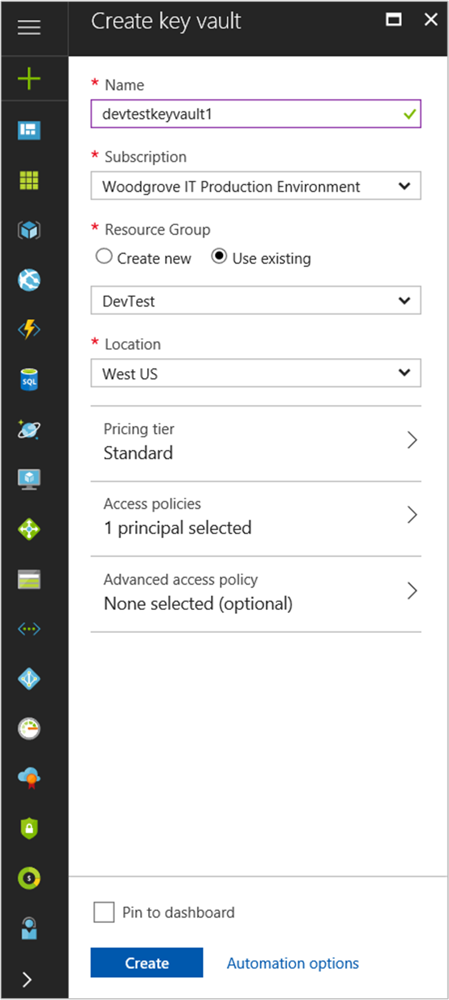

# Tutorial: Use a Linux VM system-assigned managed identity to access Azure Key Vault 

[!INCLUDE [preview-notice](../../../includes/active-directory-msi-preview-notice.md)]

This tutorial shows you how to use a system-assigned managed identity for a Linux virtual machine (VM) to access Azure Key Vault. Serving as a bootstrap, Key Vault makes it possible for your client application to then use the secret to access resources not secured by Azure Active Directory (AD). Managed identities for Azure resources are automatically managed by Azure and enable you to authenticate to services that support Azure AD authentication, without needing to insert credentials into your code. 

You learn how to:

> [!div class="checklist"]
> * Grant your VM access to a secret stored in a Key Vault 
> * Get an access token using the VM's identity and use it to retrieve the secret from the Key Vault 
 
## Prerequisites

[!INCLUDE [msi-tut-prereqs](../../../includes/active-directory-msi-tut-prereqs.md)]

## Grant your VM access to a Secret stored in a Key Vault  

Using managed service identities for Azure resources your code can get access tokens to authenticate to resources that support Azure Active Directory authentication. However, not all Azure services support Azure AD authentication. To use managed identities for Azure resources with those services, store the service credentials in Azure Key Vault, and use managed identities for Azure resources to access Key Vault to retrieve the credentials. 

First, we need to create a Key Vault and grant our VM’s system-assigned managed identity access to the Key Vault.   

1. At the top of the left navigation bar, select **Create a resource** > **Security + Identity** > **Key Vault**.  
2. Provide a **Name** for the new Key Vault. 
3. Locate the Key Vault in the same subscription and resource group as the VM you created earlier. 
4. Select **Access policies** and click **Add new**. 
5. In Configure from template, select **Secret Management**. 
6. Choose **Select Principal**, and in the search field enter the name of the VM you created earlier.  Select the VM in the result list and click **Select**. 
7. Click **OK** to finishing adding the new access policy, and **OK** to finish access policy selection. 
8. Click **Create** to finish creating the Key Vault. 

    

Next, add a secret to the Key Vault, so that later you can retrieve the secret using code running in your VM: 

1. Select **All Resources**, and find and select the Key Vault you created. 
2. Select **Secrets**, and click **Add**. 
3. Select **Manual**, from **Upload options**. 
4. Enter a name and value for the secret.  The value can be anything you want. 
5. Leave the activation date and expiration date clear, and leave **Enabled** as **Yes**. 
6. Click **Create** to create the secret. 
 
## Get an access token using the VM's identity and use it to retrieve the secret from the Key Vault  

To complete these steps, you need an SSH client.  If you are using Windows, you can use the SSH client in the [Windows Subsystem for Linux](https://msdn.microsoft.com/commandline/wsl/about). If you need assistance configuring your SSH client's keys, see [How to Use SSH keys with Windows on Azure](../../virtual-machines/linux/ssh-from-windows.md), or [How to create and use an SSH public and private key pair for Linux VMs in Azure](../../virtual-machines/linux/mac-create-ssh-keys.md).
 
1. In the portal, navigate to your Linux VM and in the **Overview**, click **Connect**. 
2. **Connect** to the VM with the SSH client of your choice. 
3. In the terminal window, using CURL, make a request to the local managed identities for Azure resources endpoint to get an access token for Azure Key Vault.  
 
    The CURL request for the access token is below.  
    
    ```bash
    curl 'http://169.254.169.254/metadata/identity/oauth2/token?api-version=2018-02-01&resource=https%3A%2F%2Fvault.azure.net' -H Metadata:true  
    ```
    The response includes the access token you need to access Resource Manager. 
    
    Response:  
    
    ```bash
    {"access_token":"eyJ0eXAi...",
    "refresh_token":"",
    "expires_in":"3599",
    "expires_on":"1504130527",
    "not_before":"1504126627",
    "resource":"https://vault.azure.net",
    "token_type":"Bearer"} 
    ```
    
    You can use this access token to authenticate to Azure Key Vault.  The next CURL request shows how to read a secret from Key Vault using CURL and the Key Vault REST API.  You’ll need the URL of your Key Vault, which is in the **Essentials** section of the **Overview** page of the Key Vault.  You will also need the access token you obtained on the previous call. 
        
    ```bash
    curl https://<YOUR-KEY-VAULT-URL>/secrets/<secret-name>?api-version=2016-10-01 -H "Authorization: Bearer <ACCESS TOKEN>" 
    ```
    
    The response will look like this: 
    
    ```bash
    {"value":"p@ssw0rd!","id":"https://mytestkeyvault.vault.azure.net/secrets/MyTestSecret/7c2204c6093c4d859bc5b9eff8f29050","attributes":{"enabled":true,"created":1505088747,"updated":1505088747,"recoveryLevel":"Purgeable"}} 
    ```
    
Once you’ve retrieved the secret from the Key Vault, you can use it to authenticate to a service that requires a name and password.

## Next steps

In this tutorial, you learned how to use a Linux VM system-assigned managed identity to access Azure Key Vault.  To learn more about Azure Key Vault see:

> [!div class="nextstepaction"]
>[Azure Key Vault](/azure/key-vault/key-vault-whatis)


