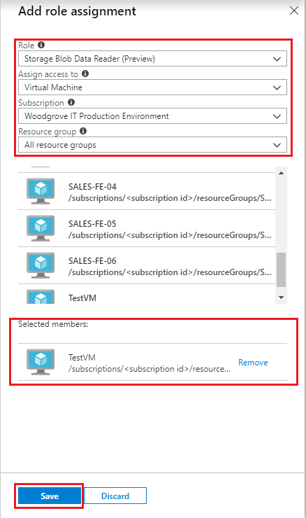

---
title: Use a Windows VM system-assigned managed identity to access Azure Storage
description: A tutorial that walks you through the process of using a Windows VM system-assigned managed identity to access Azure Storage.
services: active-directory
documentationcenter: ''
author: daveba
manager: mtillman
editor: daveba

ms.service: active-directory
ms.component: msi
ms.devlang: na
ms.topic: tutorial
ms.tgt_pltfrm: na
ms.workload: identity
ms.date: 04/12/2018
ms.author: daveba
---

# Tutorial: Use a Windows VM system-assigned managed identity to access Azure Storage

[!INCLUDE [preview-notice](../../../includes/active-directory-msi-preview-notice.md)]

This tutorial shows you how to use a system-assigned managed identity for a Windows virtual machine (VM) to access Azure Storage. You learn how to:

> [!div class="checklist"]
> * Create a blob container in a storage account
> * Grant your Windows VM's system-assigned managed identity access to a storage account 
> * Get an access and use it to call Azure Storage 

> [!NOTE]
> Azure Active Directory authentication for Azure Storage is in public preview.

## Prerequisites

[!INCLUDE [msi-qs-configure-prereqs](../../../includes/active-directory-msi-qs-configure-prereqs.md)]

[!INCLUDE [msi-tut-prereqs](../../../includes/active-directory-msi-tut-prereqs.md)]

- [Sign in to Azure portal](https://portal.azure.com)

- [Create a Windows virtual machine](/azure/virtual-machines/windows/quick-create-portal)

- [Enable system-assigned managed identity on your virtual machine](/azure/active-directory/managed-service-identity/qs-configure-portal-windows-vm#enable-system-assigned-identity-on-an-existing-vm)

## Create a storage account 

In this section, you create a storage account. 

1. Click the **+ Create a resource** button found on the upper left-hand corner of the Azure portal.
2. Click **Storage**, then **Storage account - blob, file, table, queue**.
3. Under **Name**, enter a name for the storage account.  
4. **Deployment model** and **Account kind** should be set to **Resource manager** and **Storage (general purpose v1)**. 
5. Ensure the **Subscription** and **Resource Group** match the ones you specified when you created your VM in the previous step.
6. Click **Create**.

    

## Create a blob container and upload a file to the storage account

Files require blob storage so you need to create a blob container in which to store the file. You then upload a file to the blob container in the new storage account.

1. Navigate back to your newly created storage account.
2. Under **Blob Service**, click **Containers**.
3. Click **+ Container** on the top of the page.
4. Under **New container**, enter a name for the container and under **Public access level** keep the default value .

    

5. Using an editor of your choice, create a file titled *hello world.txt* on your local machine.  Open the file and add the text (without the quotes) "Hello world! :)" and then save it. 
6. Upload the file to the newly created container by clicking on the container name, then **Upload**
7. In the **Upload blob** pane, under **Files**, click the folder icon and browse to the file **hello_world.txt** on your local machine, select the file, then click **Upload**.
    

## Grant your VM access to an Azure Storage container 

You can use the VM's system-assigned managed identity to retrieve the data in the Azure storage blob.   

1. Navigate back to your newly created storage account.  
2. Click the **Access control (IAM)** link in the left panel.  
3. Click **+ Add** on top of the page to add a new role assignment for your VM.
4. Under **Role**, from the dropdown, select **Storage Blob Data Reader (Preview)**. 
5. In the next dropdown, under **Assign access to**, choose **Virtual Machine**.  
6. Next, ensure the proper subscription is listed in **Subscription** dropdown and then set **Resource Group** to **All resource groups**.  
7. Under **Select**, choose your VM and then click **Save**. 

    

## Get an access token and use it to call Azure Storage 

Azure Storage natively supports Azure AD authentication, so it can directly accept access tokens obtained using a managed identity. This is part of Azure Storage's integration with Azure AD, and is different from supplying credentials on the connection string.

Here's a .Net code example of opening a connection to Azure Storage using an access token and then reading the contents of the file you created earlier. This code must run on the VM to be able to access the VM's managed identity endpoint. .Net Framework 4.6 or higher is required to use the access token method. Replace the value of `<URI to blob file>` accordingly. You can obtain this value by navigating to file you created and uploaded to blob storage and copying the **URL** under **Properties** the **Overview** page.

```csharp
using System;
using System.Collections.Generic;
using System.Linq;
using System.Text;
using System.Threading.Tasks;
using System.IO;
using System.Net;
using System.Web.Script.Serialization; 
using Microsoft.WindowsAzure.Storage.Auth;
using Microsoft.WindowsAzure.Storage.Blob;

namespace StorageOAuthToken
{
    class Program
    {
        static void Main(string[] args)
        {
            //get token
            string accessToken = GetMSIToken("https://storage.azure.com/");
           
            //create token credential
            TokenCredential tokenCredential = new TokenCredential(accessToken);

            //create storage credentials
            StorageCredentials storageCredentials = new StorageCredentials(tokenCredential);

            Uri blobAddress = new Uri("<URI to blob file>");

            //create block blob using storage credentials
            CloudBlockBlob blob = new CloudBlockBlob(blobAddress, storageCredentials);
        
            //retrieve blob contents
            Console.WriteLine(blob.DownloadText());
            Console.ReadLine();
        }

        static string GetMSIToken(string resourceID)
        {
            string accessToken = string.Empty;
            // Build request to acquire MSI token
            HttpWebRequest request = (HttpWebRequest)WebRequest.Create("http://169.254.169.254/metadata/identity/oauth2/token?api-version=2018-02-01&resource=" + resourceID);
            request.Headers["Metadata"] = "true";
            request.Method = "GET";

            try
            {
                // Call /token endpoint
                HttpWebResponse response = (HttpWebResponse)request.GetResponse();

                // Pipe response Stream to a StreamReader, and extract access token
                StreamReader streamResponse = new StreamReader(response.GetResponseStream());
                string stringResponse = streamResponse.ReadToEnd();
                JavaScriptSerializer j = new JavaScriptSerializer();
                Dictionary<string, string> list = (Dictionary<string, string>)j.Deserialize(stringResponse, typeof(Dictionary<string, string>));
                accessToken = list["access_token"];
                return accessToken;
            }
            catch (Exception e)
            {
                string errorText = String.Format("{0} \n\n{1}", e.Message, e.InnerException != null ? e.InnerException.Message : "Acquire token failed");
                return accessToken;
            }
        }            
    }
}
```

The response contains the contents of the file:

`Hello world! :)`

## Next steps

In this tutorial, you learned how enable a Windows VM's system-assigned identity to access Azure Storage.  To learn more about Azure Storage see:

> [!div class="nextstepaction"]
> [Azure Storage](/azure/storage/common/storage-introduction)


