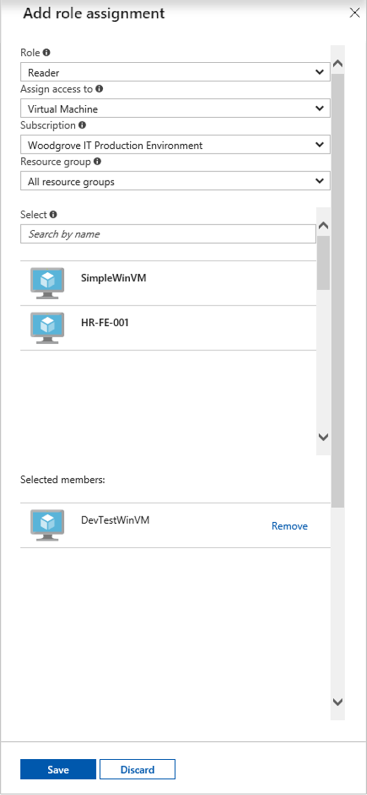

# Use a Windows VM system-assigned managed identity to access Resource Manager

[!INCLUDE [preview-notice](../../../includes/active-directory-msi-preview-notice.md)]

This quickstart shows you how to access the Azure Resource Manager API using a Windows virtual machine with system-assigned managed identity enabled. Managed identities for Azure resources are automatically managed by Azure and enable you to authenticate to services that support Azure AD authentication without needing to insert credentials into your code. You learn how to:

> [!div class="checklist"] 
> * Grant your VM access to a Resource Group in Azure Resource Manager 
> * Get an access token using the VM identity and use it to call Azure Resource Manager

## Prerequisites

[!INCLUDE [msi-tut-prereqs](../../../includes/active-directory-msi-tut-prereqs.md)]

## Grant your VM access to a resource group in Resource Manager
Using managed identities for Azure resources, your code can get access tokens to authenticate to resources that support Azure AD authentication.  The Azure Resource Manager supports Azure AD authentication.  First, we need to grant this VM’s system-assigned managed identity access to a resource in Resource Manager, in this case the Resource Group in which the VM is contained.  

1.	Navigate to the tab for **Resource Groups**. 
2.	Select the specific **Resource Group** you created for your **Windows VM**. 
3.	Go to **Access control (IAM)** in the left panel. 
4.	Then **Add role assignment** a new role assignment for your **Windows VM**.  Choose **Role** as **Reader**. 
5.	In the next drop-down, **Assign access to** the resource **Virtual Machine**. 
6.	Next, ensure the proper subscription is listed in the **Subscription** dropdown. And for **Resource Group**, select **All resource groups**. 
7.	Finally, in **Select** choose your Windows VM in the dropdown and click **Save**.

    

## Get an access token using the VM's system-assigned managed identity and use it to call Azure Resource Manager 

You will need to use **PowerShell** in this portion.  If you don’t have **PowerShell** installed, download it [here](https://docs.microsoft.com/powershell/azure/overview). 

1.	In the portal, navigate to **Virtual Machines** and go to your Windows virtual machine and in the **Overview**, click **Connect**. 
2.	Enter in your **Username** and **Password** for which you added when you created the Windows VM. 
3.	Now that you have created a **Remote Desktop Connection** with the virtual machine, open **PowerShell** in the remote session. 
4.	Using the Invoke-WebRequest cmdlet, make a request to the local managed identity for Azure resources endpoint to get an access token for Azure Resource Manager.

    ```powershell
       $response = Invoke-WebRequest -Uri 'http://169.254.169.254/metadata/identity/oauth2/token?api-version=2018-02-01&resource=https://management.azure.com/' -Method GET -Headers @{Metadata="true"}
    ```
    
    > [!NOTE]
    > The value of the "resource" parameter must be an exact match for what is expected by Azure AD. When using the Azure Resource Manager resource ID, you must include the trailing slash on the URI.
    
    Next, extract the full response, which is stored as a JavaScript Object Notation (JSON) formatted string in the $response object. 
    
    ```powershell
    $content = $response.Content | ConvertFrom-Json
    ```
    Next, extract the access token from the response.
    
    ```powershell
    $ArmToken = $content.access_token
    ```
    
    Finally, call Azure Resource Manager using the access token. In this example, we're also using the Invoke-WebRequest cmdlet to make the call to Azure Resource Manager, and include the access token in the Authorization header.
    
    ```powershell
    (Invoke-WebRequest -Uri https://management.azure.com/subscriptions/<SUBSCRIPTION ID>/resourceGroups/<RESOURCE GROUP>?api-version=2016-06-01 -Method GET -ContentType "application/json" -Headers @{ Authorization ="Bearer $ArmToken"}).content
    ```
    > [!NOTE] 
    > The URL is case-sensitive, so ensure if you are using the exact same case as you used earlier when you named the Resource Group, and the uppercase "G" in "resourceGroups."
        
    The following command returns the details of the Resource Group:

    ```powershell
    {"id":"/subscriptions/98f51385-2edc-4b79-bed9-7718de4cb861/resourceGroups/DevTest","name":"DevTest","location":"westus","properties":{"provisioningState":"Succeeded"}}
    ```

## Next steps

In this quickstart, you learned how to use a system-assigned managed identity to access the Azure Resource Manager API.  To learn more about Azure Resource Manager see:

> [!div class="nextstepaction"]
>[Azure Resource Manager](/azure/azure-resource-manager/resource-group-overview)

