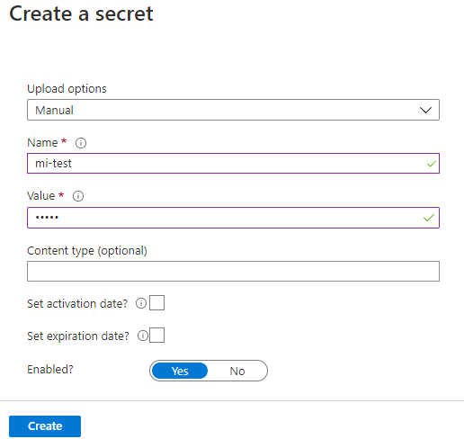
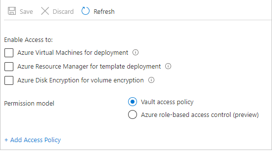

# Tutorial: Use a Windows VM system-assigned managed identity to access Azure Key Vault 

[!INCLUDE [preview-notice](../../../includes/active-directory-msi-preview-notice.md)]

This tutorial shows you how a Windows virtual machine (VM) can use a system-assigned managed identity to access [Azure Key Vault](../../key-vault/general/overview.md). Key Vault makes it possible for your client application to use a secret to access resources not secured by Microsoft Entra ID. Managed identities are automatically managed by Azure. They enable you to authenticate to services that support Microsoft Entra authentication, without including authentication information in your code.

You learn how to:

> [!div class="checklist"]
> * Grant your VM access to a secret stored in a Key Vault
> * Get an access token using the VM identity and use it to retrieve the secret from Key Vault 

## Prerequisites

- An understanding of Managed identities. If you're not familiar with the managed identities for Azure resources feature, see this [overview](overview.md). 
- An Azure account, [sign up for a free account](https://azure.microsoft.com/free/).
- "Owner" permissions at the appropriate scope (your subscription or resource group) to perform required resource creation and role management steps. If you need assistance with role assignment, see [Assign Azure roles to manage access to your Azure subscription resources](../../role-based-access-control/role-assignments-portal.md).
- You also need a Windows Virtual machine that has system assigned managed identities enabled.
  - If you need to create  a virtual machine for this tutorial, you can follow the article titled [Create a virtual machine with system-assigned identity enabled](./qs-configure-portal-windows-vm.md#system-assigned-managed-identity)

## Create a Key Vault  

[!INCLUDE [portal updates](~/articles/active-directory/includes/portal-update.md)]

This section shows how to grant your VM access to a secret stored in a Key Vault. When you use managed identities for Azure resources, your code can get access tokens to authenticate to resources that support Microsoft Entra authentication.  However, not all Azure services support Microsoft Entra authentication. To use managed identities for Azure resources with those services, store the service credentials in Azure Key Vault, and use the VM's managed identity to access Key Vault to retrieve the credentials.

First, we need to create a Key Vault and grant our VM’s system-assigned managed identity access to the Key Vault.

1. Sign in to the [Azure portal]portal](https://portal.azure.com/)
1. At the top of the left navigation bar, select **Create a resource**  
1. In the **Search the Marketplace** box type in **Key Vault** and hit **Enter**.  
1. Select **Key Vault** from the results.
1. Select **Create**
1. Provide a **Name** for the new Key Vault.

    

1. Fill out all required information. Make sure that you choose the subscription and resource group that you're using for this tutorial.
1. Select **Review+ create**
1. Select **Create**

### Create a secret

Next, add a secret to the Key Vault, so you can retrieve it later using code running in your VM. In this tutorial, we're using PowerShell but the same concepts apply to any code executing in this virtual machine.

1. Navigate to your newly created Key Vault.
1. Select **Secrets**, and select **Add**.
1. Select **Generate/Import**
1. In the **Create a secret** screen, from **Upload options** leave **Manual** selected.
1. Enter a name and value for the secret.  The value can be anything you want. 
1. Leave the activation date and expiration date clear, and leave **Enabled** as **Yes**. 
1. Select **Create** to create the secret.

   

## Grant access

The managed identity used by the virtual machine needs to be granted access to read the secret that we'll store in the Key Vault.

1. Navigate to your newly created Key Vault
1. Select **Access Policy** from the menu on the left side.
1. Select **Add Access Policy**

   

1. In the **Add access policy** section, under **Configure from template (optional)**, choose **Secret Management** from the pull-down menu.
1. Choose **Select Principal**, and in the search field enter the name of the VM you created earlier.  Select the VM in the result list and choose **Select**.
1. Select **Add**
1. Select **Save**.


## Access data  

This section shows how to get an access token using the VM identity and use it to retrieve the secret from Key Vault. If you don’t have PowerShell 4.3.1 or greater installed, you'll need to [download and install the latest version](/powershell/azure/).

First, we use the VM’s system-assigned managed identity to get an access token to authenticate to Key Vault:
 
1. In the portal, navigate to **Virtual Machines** and go to your Windows virtual machine and in the **Overview**, select **Connect**.
2. Enter in your **Username** and **Password** for which you added when you created the **Windows VM**.  
3. Now that you've created a **Remote Desktop Connection** with the virtual machine, open PowerShell in the remote session.  
4. In PowerShell, invoke the web request on the tenant to get the token for the local host in the specific port for the VM.  

The PowerShell request:

```powershell
$Response = Invoke-RestMethod -Uri 'http://169.254.169.254/metadata/identity/oauth2/token?api-version=2018-02-01&resource=https%3A%2F%2Fvault.azure.net' -Method GET -Headers @{Metadata="true"} 
```

You can see what the response looks like below:


Next, extract the access token from the response.  

```powershell
   $KeyVaultToken = $Response.access_token
```

Finally, use PowerShell’s Invoke-WebRequest command to retrieve the secret you created earlier in the Key Vault, passing the access token in the Authorization header.  You’ll need the URL of your Key Vault, which is in the **Essentials** section of the **Overview** page of the Key Vault.  

```powershell
Invoke-RestMethod -Uri https://<your-key-vault-URL>/secrets/<secret-name>?api-version=2016-10-01 -Method GET -Headers @{Authorization="Bearer $KeyVaultToken"}
```

The response will look like this: 

```powershell
  value       id                                                                                    attributes
  -----       --                                                                                    ----------
  'My Secret' https://mi-lab-vault.vault.azure.net/secrets/mi-test/50644e90b13249b584c44b9f712f2e51 @{enabled=True; created=16…
```

Once you’ve retrieved the secret from the Key Vault, you can use it to authenticate to a service that requires a name and password.

## Clean up resources

When you want to clean up the resources, sign in to the [Azure portal](https://portal.azure.com), select **Resource groups**, locate, and select the resource group that was created in the process of this tutorial (such as `mi-test`), and then use the **Delete resource group** command.

Alternatively you may also clean up resources via [PowerShell or the CLI](../../azure-resource-manager/management/delete-resource-group.md)

## Next steps

In this tutorial, you learned how to use a Windows VM system-assigned managed identity to access Azure Key Vault.  To learn more about Azure Key Vault, see:

> [!div class="nextstepaction"]
>[Azure Key Vault](../../key-vault/general/overview.md)
