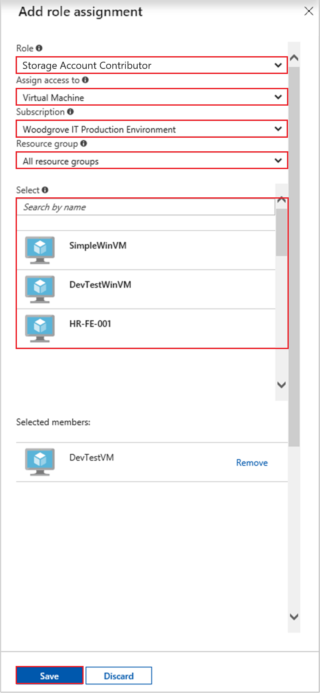

# Tutorial: Use a Windows VM system-assigned managed identity to access Azure Storage via a SAS credential

[!INCLUDE [preview-notice](../../../includes/active-directory-msi-preview-notice.md)]

This tutorial shows you how to use a system-assigned identity for a Windows virtual machine (VM) to obtain a storage Shared Access Signature (SAS) credential. Specifically, a [Service SAS credential](/azure/storage/common/storage-dotnet-shared-access-signature-part-1?toc=%2fazure%2fstorage%2fblobs%2ftoc.json#types-of-shared-access-signatures). 

A Service SAS provides the ability to grant limited access to objects in a storage account, for limited time and a specific service (in our case, the blob service), without exposing an account access key. You can use a SAS credential as usual when doing storage operations, for example when using the Storage SDK. For this tutorial, we demonstrate uploading and downloading a blob using Azure Storage PowerShell. You will learn how to:

> [!div class="checklist"]
> * Create a storage account
> * Grant your VM access to a storage account SAS in Resource Manager 
> * Get an access token using your VM's identity, and use it to retrieve the SAS from Resource Manager 

## Prerequisites

[!INCLUDE [msi-tut-prereqs](../../../includes/active-directory-msi-tut-prereqs.md)]

[!INCLUDE [updated-for-az.md](../../../includes/updated-for-az.md)]

## Create a storage account 

If you don't already have one, you will now create a storage account. You can also skip this step and grant your VM's system-assigned managed identity access to the SAS credential of an existing storage account. 

1. Click the **+/Create new service** button found on the upper left-hand corner of the Azure portal.
2. Click **Storage**, then **Storage Account**, and a new "Create storage account" panel will display.
3. Enter a name for the storage account, which you will use later.  
4. **Deployment model** and **Account kind** should be set to "Resource manager" and "General purpose", respectively. 
5. Ensure the **Subscription** and **Resource Group** match the ones you specified when you created your VM in the previous step.
6. Click **Create**.

    

## Create a blob container in the storage account

Later we will upload and download a file to the new storage account. Because files require blob storage, we need to create a blob container in which to store the file.

1. Navigate back to your newly created storage account.
2. Click the **Containers** link in the left panel, under "Blob service."
3. Click **+ Container** on the top of the page, and a "New container" panel slides out.
4. Give the container a name, select an access level, then click **OK**. The name you specified will be used later in the tutorial. 

    

## Grant your VM's system-assigned managed identity access to use a storage SAS 

Azure Storage does not natively support Azure AD authentication.  However, you can use a managed identity to retrieve a storage SAS from Resource Manager, then use the SAS to access storage.  In this step, you grant your VM's system-assigned managed identity access to your storage account SAS.   

1. Navigate back to your newly created storage account.   
2. Click the **Access control (IAM)** link in the left panel.  
3. Click **+ Add role assignment** on top of the page to add a new role assignment for your VM
4. Set **Role** to "Storage Account Contributor", on the right side of the page.  
5. In the next dropdown, set **Assign access to** the resource "Virtual Machine".  
6. Next, ensure the proper subscription is listed in **Subscription** dropdown, then set **Resource Group** to "All resource groups".  
7. Finally, under **Select** choose your Windows Virtual Machine in the dropdown, then click **Save**. 

    

## Get an access token using the VM's identity and use it to call Azure Resource Manager 

For the remainder of the tutorial, we will work from the VM we created earlier.

You will need to use the Azure Resource Manager PowerShell cmdlets in this portion.  If you don’t have it installed, [download the latest version](https://docs.microsoft.com/powershell/azure/overview) before continuing.

1. In the Azure portal, navigate to **Virtual Machines**, go to your Windows virtual machine, then from the **Overview** page click **Connect** at the top.
2. Enter in your **Username** and **Password** for which you added when you created the Windows VM. 
3. Now that you have created a **Remote Desktop Connection** with the virtual machine, open PowerShell in the remote session. 
4. Using Powershell’s Invoke-WebRequest, make a request to the local managed identity for Azure resources endpoint to get an access token for Azure Resource Manager.

    ```powershell
       $response = Invoke-WebRequest -Uri 'http://169.254.169.254/metadata/identity/oauth2/token?api-version=2018-02-01&resource=https%3A%2F%2Fmanagement.azure.com%2F' -Method GET -Headers @{Metadata="true"}
    ```
    
    > [!NOTE]
    > The value of the "resource" parameter must be an exact match for what is expected by Azure AD. When using the Azure Resource Manager resource ID, you must include the trailing slash on the URI.
    
    Next, extract the "Content" element, which is stored as a JavaScript Object Notation (JSON) formatted string in the $response object. 
    
    ```powershell
    $content = $response.Content | ConvertFrom-Json
    ```
    Next, extract the access token from the response.
    
    ```powershell
    $ArmToken = $content.access_token
    ```

## Get a SAS credential from Azure Resource Manager to make storage calls 

Now use PowerShell to call Resource Manager using the access token we retrieved in the previous section, to create a storage SAS credential. Once we have the SAS credential, we can call storage operations.

For this request we'll use the follow HTTP request parameters to create the SAS credential:

```JSON
{
    "canonicalizedResource":"/blob/<STORAGE ACCOUNT NAME>/<CONTAINER NAME>",
    "signedResource":"c",              // The kind of resource accessible with the SAS, in this case a container (c).
    "signedPermission":"rcw",          // Permissions for this SAS, in this case (r)ead, (c)reate, and (w)rite. Order is important.
    "signedProtocol":"https",          // Require the SAS be used on https protocol.
    "signedExpiry":"<EXPIRATION TIME>" // UTC expiration time for SAS in ISO 8601 format, for example 2017-09-22T00:06:00Z.
}
```

These parameters are included in the POST body of the request for the SAS credential. For more information on the parameters for creating a SAS credential, see the [List Service SAS REST reference](/rest/api/storagerp/storageaccounts/listservicesas).

First, convert the parameters to JSON, then call the storage `listServiceSas` endpoint to create the SAS credential:

```powershell
$params = @{canonicalizedResource="/blob/<STORAGE-ACCOUNT-NAME>/<CONTAINER-NAME>";signedResource="c";signedPermission="rcw";signedProtocol="https";signedExpiry="2017-09-23T00:00:00Z"}
$jsonParams = $params | ConvertTo-Json
```

```powershell
$sasResponse = Invoke-WebRequest -Uri https://management.azure.com/subscriptions/<SUBSCRIPTION-ID>/resourceGroups/<RESOURCE-GROUP>/providers/Microsoft.Storage/storageAccounts/<STORAGE-ACCOUNT-NAME>/listServiceSas/?api-version=2017-06-01 -Method POST -Body $jsonParams -Headers @{Authorization="Bearer $ArmToken"}
```
> [!NOTE] 
> The URL is case-sensitive, so ensure you use the exact same case used earlier, when you named the Resource Group, including the uppercase "G" in "resourceGroups." 

Now we can extract the SAS credential from the response:

```powershell
$sasContent = $sasResponse.Content | ConvertFrom-Json
$sasCred = $sasContent.serviceSasToken
```

If you inspect the SAS cred you'll see something like this:

```powershell
PS C:\> $sasCred
sv=2015-04-05&sr=c&spr=https&se=2017-09-23T00%3A00%3A00Z&sp=rcw&sig=JVhIWG48nmxqhTIuN0uiFBppdzhwHdehdYan1W%2F4O0E%3D
```

Next we create a file called "test.txt". Then use the SAS credential to authenticate with the `New-AzStorageContent` cmdlet, upload the file to our blob container, then download the file.

```bash
echo "This is a test text file." > test.txt
```

Be sure to install the Azure Storage cmdlets first, using `Install-Module Azure.Storage`. Then upload the blob you just created, using the `Set-AzStorageBlobContent` PowerShell cmdlet:

```powershell
$ctx = New-AzStorageContext -StorageAccountName <STORAGE-ACCOUNT-NAME> -SasToken $sasCred
Set-AzStorageBlobContent -File test.txt -Container <CONTAINER-NAME> -Blob testblob -Context $ctx
```

Response:

```powershell
ICloudBlob        : Microsoft.WindowsAzure.Storage.Blob.CloudBlockBlob
BlobType          : BlockBlob
Length            : 56
ContentType       : application/octet-stream
LastModified      : 9/21/2017 6:14:25 PM +00:00
SnapshotTime      :
ContinuationToken :
Context           : Microsoft.WindowsAzure.Commands.Storage.AzureStorageContext
Name              : testblob
```

You can also download the blob you just uploaded, using the `Get-AzStorageBlobContent` PowerShell cmdlet:

```powershell
Get-AzStorageBlobContent -Blob testblob -Container <CONTAINER-NAME> -Destination test2.txt -Context $ctx
```

Response:

```powershell
ICloudBlob        : Microsoft.WindowsAzure.Storage.Blob.CloudBlockBlob
BlobType          : BlockBlob
Length            : 56
ContentType       : application/octet-stream
LastModified      : 9/21/2017 6:14:25 PM +00:00
SnapshotTime      :
ContinuationToken :
Context           : Microsoft.WindowsAzure.Commands.Storage.AzureStorageContext
Name              : testblob
```

## Next steps

In this tutorial, you learned how to use a Windows VM's system-assigned managed identity to access Azure Storage using a SAS credential.  To learn more about Azure Storage SAS see:

> [!div class="nextstepaction"]
>[Using shared access signatures (SAS)](/azure/storage/common/storage-dotnet-shared-access-signature-part-1)


