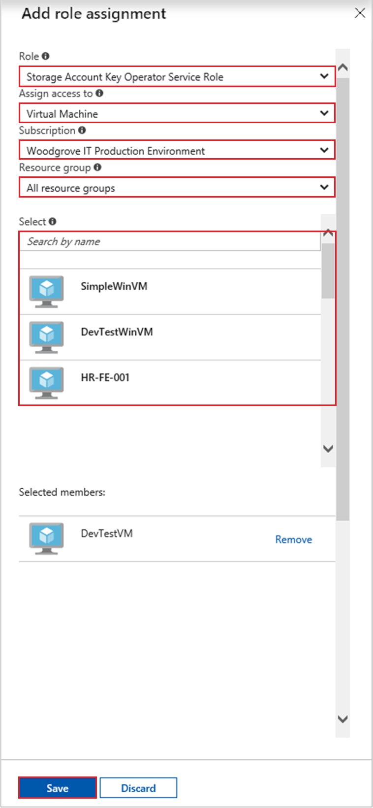

# Tutorial: Use a Windows VM system-assigned managed identity to access Azure Storage via access key

[!INCLUDE [preview-notice](../../../includes/active-directory-msi-preview-notice.md)]


> [!IMPORTANT] 
> Azure Storage now supports Azure AD authentication. As a best practice, use [Azure AD authentication](tutorial-vm-windows-access-storage.md) instead of access keys. 


This tutorial shows you how to use a system-assigned managed identity for Windows virtual machine (VM) to retrieve storage account access keys. You can use storage access keys as usual when doing storage operations, for example when using the Storage SDK. For this tutorial, we upload and download blobs using Azure Storage PowerShell. You will learn how to:


> [!div class="checklist"]
> * Create a storage account
> * Grant your VM access to storage account access keys in Resource Manager 
> * Get an access token using your VM's identity, and use it to retrieve the storage access keys from Resource Manager 

## Prerequisites

[!INCLUDE [msi-tut-prereqs](../../../includes/active-directory-msi-tut-prereqs.md)]

[!INCLUDE [updated-for-az.md](../../../includes/updated-for-az.md)]

## Create a storage account 

If you don't already have one, you will now create a storage account. You can also skip this step and grant your VM's system-assigned managed identity access to the keys of an existing storage account. 

1. Click the **+/Create new service** button found on the upper left-hand corner of the Azure portal.
2. Click **Storage**, then **Storage Account**, and a new "Create storage account" panel will display.
3. Enter a name for the storage account, which you will use later.  
4. **Deployment model** and **Account kind** should be set to "Resource manager" and "General purpose", respectively. 
5. Ensure the **Subscription** and **Resource Group** match the ones you specified when you created your VM in the previous step.
6. Click **Create**.

    

## Create a blob container in the storage account

Later we will upload and download a file to the new storage account. Because files require blob storage, we need to create a blob container in which to store the file.

1. Navigate back to your newly created storage account.
2. Click the **Containers** link in the left, under "Blob service."
3. Click **+ Container** on the top of the page, and a "New container" panel slides out.
4. Give the container a name, select an access level, then click **OK**. The name you specified will be used later in the tutorial. 

    

## Grant your VM's system-assigned managed identity access to use storage account access keys 

Azure Storage does not natively support Azure AD authentication.  However, you can use your VM's system-assigned managed identity to retrieve storage account access keys from the Resource Manager, then use a key to access storage.  In this step, you grant your VM's system-assigned managed identity access to the keys to your storage account.   

1. Navigate back to your newly created storage account.  
2. Click the **Access control (IAM)** link in the left panel.  
3. Click **+ Add role assignment** on top of the page to add a new role assignment for your VM
4. Set **Role** to "Storage Account Key Operator Service Role", on the right side of the page. 
5. In the next dropdown, set **Assign access to** the resource "Virtual Machine".  
6. Next, ensure the proper subscription is listed in **Subscription** dropdown, then set **Resource Group** to "All resource groups".  
7. Finally, under **Select** choose your Windows Virtual Machine in the dropdown, then click **Save**. 

    

## Get an access token using the VM's system-assigned managed identity to call Azure Resource Manager 

For the remainder of the tutorial, we will work from the VM we created earlier. 

You will need to use the Azure Resource Manager PowerShell cmdlets in this portion.  If you don’t have it installed, [download the latest version](https://docs.microsoft.com/powershell/azure/overview) before continuing.

1. In the Azure portal, navigate to **Virtual Machines**, go to your Windows virtual machine, then from the **Overview** page click **Connect** at the top. 
2. Enter in your **Username** and **Password** for which you added when you created the Windows VM. 
3. Now that you have created a **Remote Desktop Connection** with the virtual machine, open PowerShell in the remote session.
4. Using Powershell’s Invoke-WebRequest, make a request to the local managed identity for Azure resources endpoint to get an access token for Azure Resource Manager.

    ```powershell
       $response = Invoke-WebRequest -Uri 'http://169.254.169.254/metadata/identity/oauth2/token?api-version=2018-02-01&resource=https%3A%2F%2Fmanagement.azure.com%2F' -Method GET -Headers @{Metadata="true"}
    ```
    
    > [!NOTE]
    > The value of the "resource" parameter must be an exact match for what is expected by Azure AD. When using the Azure Resource Manager resource ID, you must include the trailing slash on the URI.
    
    Next, extract the "Content" element, which is stored as a JavaScript Object Notation (JSON) formatted string in the $response object. 
    
    ```powershell
    $content = $response.Content | ConvertFrom-Json
    ```
    Next, extract the access token from the response.
    
    ```powershell
    $ArmToken = $content.access_token
    ```
 
## Get storage account access keys from Azure Resource Manager to make storage calls  

Now use PowerShell to call Resource Manager using the access token we retrieved in the previous section, to retrieve the storage access key. Once we have the storage access key, we can call storage upload/download operations.

```powershell
$keysResponse = Invoke-WebRequest -Uri https://management.azure.com/subscriptions/<SUBSCRIPTION-ID>/resourceGroups/<RESOURCE-GROUP>/providers/Microsoft.Storage/storageAccounts/<STORAGE-ACCOUNT>/listKeys/?api-version=2016-12-01 -Method POST -Headers @{Authorization="Bearer $ARMToken"}
```
> [!NOTE] 
> The URL is case-sensitive, so ensure you use the exact same case used earlier, when you named the Resource Group, including the uppercase "G" in "resourceGroups." 

```powershell
$keysContent = $keysResponse.Content | ConvertFrom-Json
$key = $keysContent.keys[0].value
```

Next we create a file called "test.txt". Then use the storage access key to authenticate with the `New-AzStorageContent` cmdlet, upload the file to our blob container, then download the file.

```bash
echo "This is a test text file." > test.txt
```

Be sure to install the Azure Storage cmdlets first, using `Install-Module Az.Storage`. Then upload the blob you just created, using the `Set-AzStorageBlobContent` PowerShell cmdlet:

```powershell
$ctx = New-AzStorageContext -StorageAccountName <STORAGE-ACCOUNT> -StorageAccountKey $key
Set-AzStorageBlobContent -File test.txt -Container <CONTAINER-NAME> -Blob testblob -Context $ctx
```

Response:

```powershell
ICloudBlob        : Microsoft.WindowsAzure.Storage.Blob.CloudBlockBlob
BlobType          : BlockBlob
Length            : 56
ContentType       : application/octet-stream
LastModified      : 9/13/2017 6:14:25 PM +00:00
SnapshotTime      :
ContinuationToken :
Context           : Microsoft.WindowsAzure.Commands.Storage.AzureStorageContext
Name              : testblob
```

You can also download the blob you just uploaded, using the `Get-AzStorageBlobContent` PowerShell cmdlet:

```powershell
Get-AzStorageBlobContent -Blob testblob -Container <CONTAINER-NAME> -Destination test2.txt -Context $ctx
```

Response:

```powershell
ICloudBlob        : Microsoft.WindowsAzure.Storage.Blob.CloudBlockBlob
BlobType          : BlockBlob
Length            : 56
ContentType       : application/octet-stream
LastModified      : 9/13/2017 6:14:25 PM +00:00
SnapshotTime      :
ContinuationToken :
Context           : Microsoft.WindowsAzure.Commands.Storage.AzureStorageContext
Name              : testblob
```

## Next steps

In this tutorial, you learned how to create a system-assigned managed identity to access Azure Storage using an access key.  To learn more about Azure Storage access keys see:

> [!div class="nextstepaction"]
>[Manage your storage access keys](/azure/storage/common/storage-create-storage-account)

