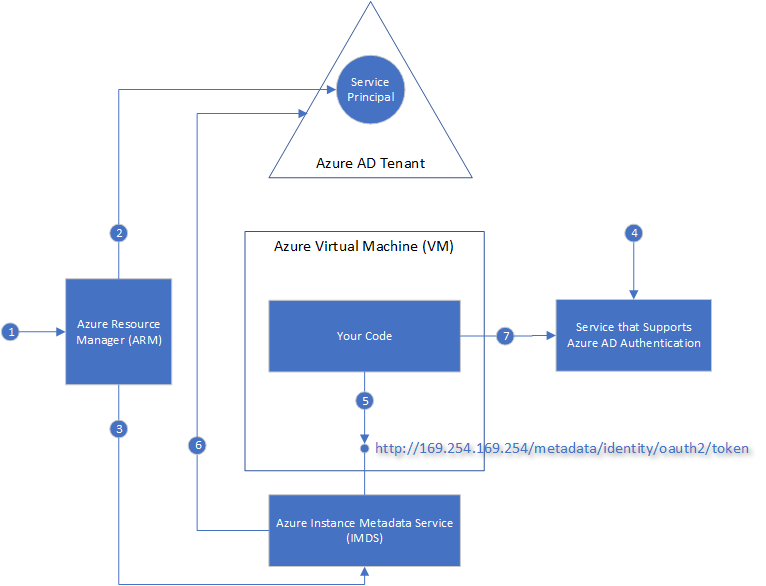

#  Managed Service Identity (MSI) for Azure resources

[!INCLUDE[preview-notice](../../../includes/active-directory-msi-preview-notice.md)]

A common challenge when building cloud applications is how to manage the credentials that need to be in your code for authenticating to cloud services. Keeping these credentials secure is an important task. Ideally, they never appear on developer workstations or get checked into source control. Azure Key Vault provides a way to securely store credentials and other keys and secrets, but your code needs to authenticate to Key Vault to retrieve them. Managed Service Identity (MSI) makes solving this problem simpler by giving Azure services an automatically managed identity in Azure Active Directory (Azure AD). You can use this identity to authenticate to any service that supports Azure AD authentication, including Key Vault, without having any credentials in your code.

## How does it work?

When you enable Managed Service Identity on an Azure service, Azure automatically creates an identity for the service instance in the Azure AD tenant used by your Azure subscription.  Under the covers, Azure provisions the credentials for the identity onto the service instance.  Your code can then make a local request to get access tokens for services that support Azure AD authentication.  Azure takes care of rolling the credentials used by the service instance.  If the service instance is deleted, Azure automatically cleans up the credentials and the identity in Azure AD.

Here's an example of how Managed Service Identity works with Azure Virtual Machines.

1. Azure Resource Manager receives a message to enable the Managed Service Identity (MSI) on a VM.
2. Azure Resource Manager creates a Service Principal in Azure AD to represent the identity of the VM. The Service Principal is created in the Azure AD tenant that is trusted by this subscription.
3. Azure Resource Manager configures the Service Principal details for the VM in the Azure Instance Metadata Service of the VM. This step includes configuring client ID and certificate used to get access tokens from Azure AD.
4. Now that the Service Principal identity of the VM is known, it can be granted access to Azure resources. For example, if your code needs to call Azure Resource Manager, then you would assign the VM’s Service Principal the appropriate role using Role-Based Access Control (RBAC) in Azure AD.  If your code needs to call Key Vault, then you would grant your code access to the specific secret or key in Key Vault.
5. Your code running on the VM requests a token from the Azure Instance Metadata Service (IMDS) MSI endpoint, which is only accessible from within the VM: http://169.254.169.254/metadata/identity/oauth2/token. The resource parameter specifies the service to which the token is sent. For example, if you want your code to authenticate to Azure Resource Manager, you would use resource=https://management.azure.com/.
6. The Azure Instance Metadata requests an an access token from Azure AD, using the client ID and certificate for the VM. Azure AD returns a JSON Web Token (JWT) access token.
7. Your code sends the access token on a call to a service that supports Azure AD authentication.

Each Azure service that supports Managed Service Identity has its own method for your code to obtain an access token. Check out the tutorials for each service to find out the specific method to get a token.

## Try Managed Service Identity

Try a Managed Service Identity tutorial to learn end-to-end scenarios for accessing different Azure resources:
  
| From MSI-enabled resource | Learn how to |
| ------- | -------- |
| Azure VM (Windows) | [Access Azure Data Lake Store with a Windows VM Managed Service Identity](tutorial-windows-vm-access-datalake.md) |
|                    | [Access Azure Resource Manager with a Windows VM Managed Service Identity](tutorial-windows-vm-access-arm.md) |
|                    | [Access Azure SQL with a Windows VM Managed Service Identity](tutorial-windows-vm-access-sql.md) |
|                    | [Access Azure Storage via access key with a Windows VM Managed Service Identity](tutorial-windows-vm-access-storage.md) |
|                    | [Access Azure Storage via SAS with a Windows VM Managed Service Identity](tutorial-windows-vm-access-storage-sas.md) |
|                    | [Access a non-Azure AD resource with a Windows VM Managed Service Identity and Azure Key Vault](tutorial-windows-vm-access-nonaad.md) |
| Azure VM (Linux)   | [Access Azure Data Lake Store with a Linux VM Managed Service Identity](tutorial-linux-vm-access-datalake.md) |
|                    | [Access Azure Resource Manager with a Linux VM Managed Service Identity](tutorial-linux-vm-access-arm.md) |
|                    | [Access Azure Storage via access key with a Linux VM Managed Service Identity](tutorial-linux-vm-access-storage.md) |
|                    | [Access Azure Storage via SAS with a Linux VM Managed Service Identity](tutorial-linux-vm-access-storage-sas.md) |
|                    | [Access a non-Azure AD resource with a Linux VM Managed Service Identity and Azure Key Vault](tutorial-linux-vm-access-nonaad.md) |
| Azure App Service  | [Use Managed Service Identity with Azure App Service or Azure Functions](/azure/app-service/app-service-managed-service-identity) |
| Azure Functions    | [Use Managed Service Identity with Azure App Service or Azure Functions](/azure/app-service/app-service-managed-service-identity) |
| Azure Service Bus  | [Use Managed Service Identity with Azure Service Bus](../../service-bus-messaging/service-bus-managed-service-identity.md) |
| Azure Event Hubs   | [Use Managed Service Identity with Azure Event Hubs](../../event-hubs/event-hubs-managed-service-identity.md) |

## Which Azure services support Managed Service Identity?

Azure services that support Managed Service Identity can use MSI to authenticate to services that support Azure AD authentication.  We are in the process of integrating MSI and Azure AD authentication across Azure.  Check back often for updates.

### Azure services that support Managed Service Identity

The following Azure services support Managed Service Identity.

| Service | Status | Date | Configure | Get a token |
| ------- | ------ | ---- | --------- | ----------- |
| Azure Virtual Machines | Preview | September 2017 | [Azure portal](qs-configure-portal-windows-vm.md) [PowerShell](qs-configure-powershell-windows-vm.md) [Azure CLI](qs-configure-cli-windows-vm.md) [Azure Resource Manager templates](qs-configure-template-windows-vm.md) | [REST](how-to-use-vm-token.md#get-a-token-using-http) [.NET](how-to-use-vm-token.md#get-a-token-using-c) [Bash/Curl](how-to-use-vm-token.md#get-a-token-using-curl) [Go](how-to-use-vm-token.md#get-a-token-using-go) [PowerShell](how-to-use-vm-token.md#get-a-token-using-azure-powershell) |
| Azure App Service | Preview | September 2017 | [Azure portal](/azure/app-service/app-service-managed-service-identity#using-the-azure-portal) [Azure Resource Manager template](/azure/app-service/app-service-managed-service-identity#using-an-azure-resource-manager-template) | [.NET](/azure/app-service/app-service-managed-service-identity#asal) [REST](/azure/app-service/app-service-managed-service-identity#using-the-rest-protocol) |
| Azure Functions1 | Preview | September 2017 | [Azure portal](/azure/app-service/app-service-managed-service-identity#using-the-azure-portal) [Azure Resource Manager template](/azure/app-service/app-service-managed-service-identity#using-an-azure-resource-manager-template) | [.NET](/azure/app-service/app-service-managed-service-identity#asal) [REST](/azure/app-service/app-service-managed-service-identity#using-the-rest-protocol) |
| Azure Data Factory V2 | Preview | November 2017 | [Azure portal](~/articles/data-factory/data-factory-service-identity.md#generate-service-identity) [PowerShell](~/articles/data-factory/data-factory-service-identity.md#generate-service-identity-using-powershell) [REST](~/articles/data-factory/data-factory-service-identity.md#generate-service-identity-using-rest-api) [SDK](~/articles/data-factory/data-factory-service-identity.md#generate-service-identity-using-sdk) |

1 Azure Functions support allows user code to use an identity, but triggers and bindings may still require connection strings.

### Azure services that support Azure AD authentication

The following services support Azure AD authentication, and have been tested with client services that use Managed Service Identity.

| Service | Resource ID | Status | Date | Assign access |
| ------- | ----------- | ------ | ---- | ------------- |
| Azure Resource Manager | https://management.azure.com | Available | September 2017 | [Azure portal](howto-assign-access-portal.md)  [PowerShell](howto-assign-access-powershell.md)  [Azure CLI](howto-assign-access-CLI.md) |
| Azure Key Vault | https://vault.azure.net | Available | September 2017 | |
| Azure Data Lake | https://datalake.azure.net | Available | September 2017 | |
| Azure SQL | https://database.windows.net | Available | October 2017 | |
| Azure Event Hubs | https://eventhubs.azure.net | Available | December 2017 | |
| Azure Service Bus | https://servicebus.azure.net | Available | December 2017 | |

## How much does Managed Service Identity cost?

Managed Service Identity comes with Azure Active Directory Free, which is the default for Azure subscriptions.  There is no additional cost for Managed Service Identity.

## Support and feedback

We would love to hear from you!

* Ask how-to questions on Stack Overflow with the tag [azure-msi](http://stackoverflow.com/questions/tagged/azure-msi).
* Make feature requests or give feedback on the [Azure AD feedback forum for developers](https://feedback.azure.com/forums/169401-azure-active-directory/category/164757-developer-experiences).

