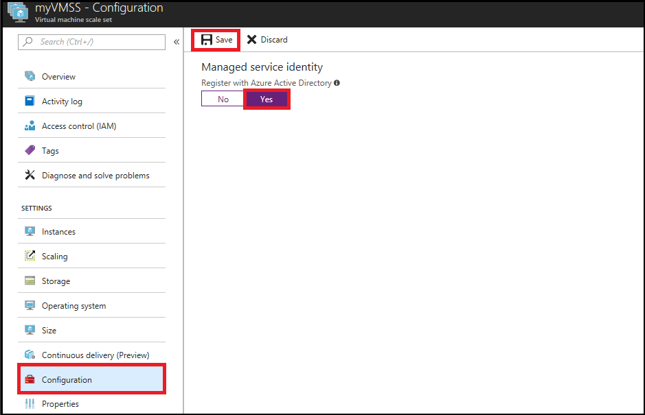
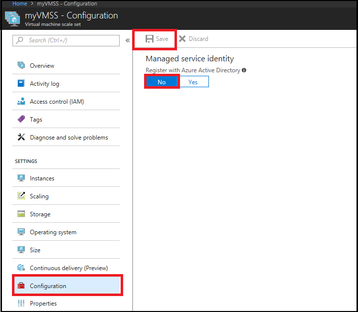

# Configure an Azure Virtual Machine Scale Set Managed Service Identity (MSI) using the Azure portal

[!INCLUDE[preview-notice](../../../includes/active-directory-msi-preview-notice.md)]

Managed Service Identity provides Azure services with an automatically managed identity in Azure Active Directory. You can use this identity to authenticate to any service that supports Azure AD authentication, without having credentials in your code. 

In this article, you learn how to enable and remove MSI for an Azure virtual machine scale set, using the Azure portal.

## Prerequisites

[!INCLUDE [msi-qs-configure-prereqs](../../../includes/active-directory-msi-qs-configure-prereqs.md)]

## Enable MSI during creation of Azure virtual machine scale set

As of the time of this writing, enabling MSI during creation of a virtual machine scale set in the Azure portal is not supported. Instead, please refer to the following Azure virtual machine scale set creation Quickstart article to first create an Azure virtual machine scale set:

- [Create a Virtual Machine Scale Set in the Azure portal](../../virtual-machine-scale-sets/quick-create-portal.md)  

Then proceed to the next section for details on enabling MSI on the virtual machine scale set.

## Enable MSI on an existing Azure VMMS

If you have a virtual machine scale set that was originally provisioned without an MSI:

1. Sign in to the [Azure portal](https://portal.azure.com) using an account associated with the Azure subscription that contains the virtual machine scale set.

2. Navigate to the desired virtual machine scale set.

3. Click the **Configuration** page, enable MSI on the virtual machine scale set by selecting **Yes** under "Managed service identity", then click **Save**. This operation can take 60 seconds or more to complete:

     

## Remove MSI from an Azure virtual machine scale set

If you have a virtual machine scale set that no longer needs an MSI:

1. Sign in to the [Azure portal](https://portal.azure.com) using an account associated with the Azure subscription that contains the virtual machine scale set. Also make sure your account belongs to a role that gives you write permissions on the virtual machine scale set.

2. Navigate to the desired virtual machine scale set.

3. Click the **Configuration** page, remove MSI from the virtual machine scale set by selecting **No** under **Managed service identity**, then click **Save**. This operation can take 60 seconds or more to complete:

     

## Next steps

- For an overview of MSI, see [Managed Service Identity overview](overview.md).
- Using the Azure portal, give an Azure virtual machine scale set MSI [access to another Azure resource](howto-assign-access-portal.md).

Use the following comments section to provide feedback and help us refine and shape our content.
