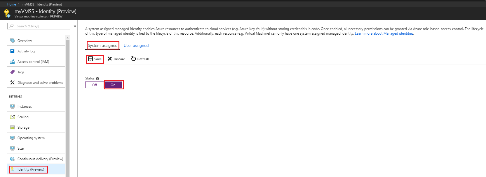

# Configure a virtual machine scale set Managed Service Identity (MSI) using the Azure portal

[!INCLUDE[preview-notice](../../../includes/active-directory-msi-preview-notice.md)]

Managed Service Identity provides Azure services with an automatically managed identity in Azure Active Directory. You can use this identity to authenticate to any service that supports Azure AD authentication, without having credentials in your code. 

In this article, you will learn how to enable and disable the system assigned identity for a virtual machine scale set, using the Azure portal. Assigning and removing user assigned identities from an Azure virtual machine scale set is not currently supported via the Azure portal.

> [!NOTE]
> Currently, user assigned identity operations are not supported via the Azure Portal. Check back for updates.

## Prerequisites

- If you're unfamiliar with Managed Service Identity, check out the [overview section](overview.md).
- If you don't already have an Azure account, [sign up for a free account](https://azure.microsoft.com/free/) before continuing.

## Managed Service Identity during creation of an Azure virtual machine scale set

Currently, VM creation via the Azure portal does not support Managed Service Identity operations. Instead, please refer to the following Azure virtual machine scale set creation Quickstart article to first create an Azure virtual machine scale set:

- [Create a Virtual Machine Scale Set in the Azure portal](../../virtual-machine-scale-sets/quick-create-portal.md)  

Then proceed to the next section for details on enabling MSI on the virtual machine scale set.

## Enable Managed Service Identity on an existing Azure VMMS

To enable the system assigned identity on a VM that was originally provisioned without it:

1. Sign in to the [Azure portal](https://portal.azure.com) using an account associated with the Azure subscription that contains the virtual machine scale set.

2. Navigate to the desired virtual machine scale set.

3. Enable the system assigned identity on the VM by selecting "Yes" under "Managed service identity" and then click **Save**. This operation can take 60 seconds or more to complete:

     

## Remove Managed Service Identity from an Azure virtual machine scale set

If you have a virtual machine scale set that no longer needs an MSI:

1. Sign in to the [Azure portal](https://portal.azure.com) using an account associated with the Azure subscription that contains the virtual machine scale set. Also make sure your account belongs to a role that gives you write permissions on the virtual machine scale set.

2. Navigate to the desired virtual machine scale set.

3. Disable the system assigned identity on the VM by selecting "No" under "Managed service identity", then click Save. This operation can take 60 seconds or more to complete:

     

## Related Content

- For an overview of Managed Service Identity, see [overview](overview.md).

## Next steps

- Using the Azure portal, give an Azure virtual machine scale set MSI [access to another Azure resource](howto-assign-access-portal.md).

Use the following comments section to provide feedback and help us refine and shape our content.
