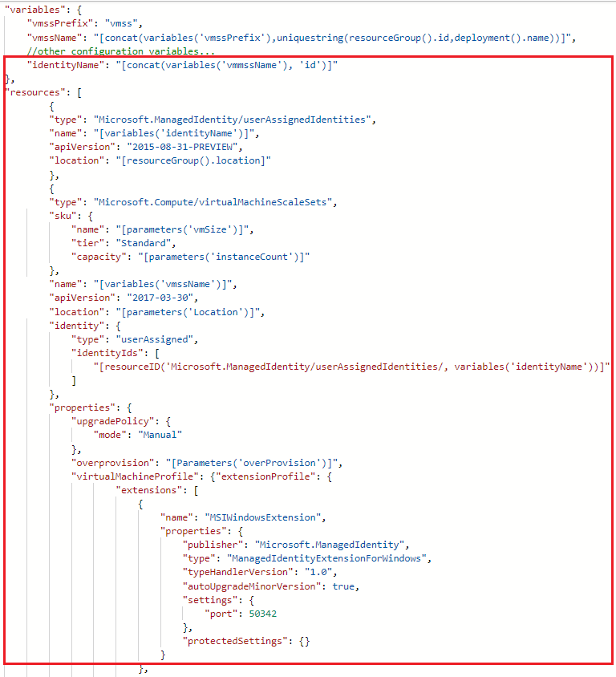

# Configure a VMSS Managed Service Identity by using a template

[!INCLUDE[preview-notice](../../../includes/active-directory-msi-preview-notice.md)]

Managed Service Identity provides Azure services with an automatically managed identity in Azure Active Directory. You can use this identity to authenticate to any service that supports Azure AD authentication, without having credentials in your code. 

In this article, you learn how to perform the following Managed Service Identity operations on an Azure VMSS, using Azure Resource Manager deployment template:
- Enable and disable the system assigned identity on an Azure VMSS
- Add and remove a user assigned identity on an Azure VMSS

## Prerequisites

- If you're unfamiliar with Managed Service Identity, check out the [overview section](overview.md). **Be sure to review the [difference between a system assigned and user assigned identity](overview.md#how-does-it-work)**.
- If you don't already have an Azure account, [sign up for a free account](https://azure.microsoft.com/en-us/free/) before continuing.

## Azure Resource Manager templates

As with the Azure portal and scripting, Azure Resource Manager templates provide the ability to deploy new or modified resources defined by an Azure resource group. Several options are available for template editing and deployment, both local and portal-based, including:

   - Using a [custom template from the Azure Marketplace](../../azure-resource-manager/resource-group-template-deploy-portal.md#deploy-resources-from-custom-template), which allows you to create a template from scratch, or base it on an existing common or [QuickStart template](https://azure.microsoft.com/documentation/templates/).
   - Deriving from an existing resource group, by exporting a template from either [the original deployment](../../azure-resource-manager/resource-manager-export-template.md#view-template-from-deployment-history), or from the [current state of the deployment](../../azure-resource-manager/resource-manager-export-template.md#export-the-template-from-resource-group).
   - Using a local [JSON editor (such as VS Code)](../../azure-resource-manager/resource-manager-create-first-template.md), and then uploading and deploying by using PowerShell or CLI.
   - Using the Visual Studio [Azure Resource Group project](../../azure-resource-manager/vs-azure-tools-resource-groups-deployment-projects-create-deploy.md) to both create and deploy a template.  

Regardless of the option you choose, template syntax is the same during initial deployment and redeployment. Enabling MSI on a new or existing VM is done in the same manner. Also, by default, Azure Resource Manager does an [incremental update](../../azure-resource-manager/resource-group-template-deploy.md#incremental-and-complete-deployments) to deployments.

## System assigned identity

In this section, you will enable and disable the system assigned identity using an Azure Resource Manager template.

### Enable system assigned identity during creation of an Azure VMSS, or an existing Azure VMSS

1. Whether you sign in to Azure locally or via the Azure portal, use an account that is associated with the Azure subscription that contains the virtual machine scale set.

2. After loading the template into an editor, locate the `Microsoft.Compute/virtualMachineScaleSets` resource of interest within the `resources` section. Yours might look slightly different from the following screenshot, depending on the editor you're using and whether you are editing a template for a new deployment or existing one.
   
    

3. To enable the system assigned identity, add the `"identity"` property at the same level as the `"type": "Microsoft.Compute/virtualMachineScaleSets"` property. Use the following syntax:

   ```JSON
   "identity": { 
       "type": "systemAssigned"
   },
   ```

4. (Optional) Add the virtual machine scale set MSI extension as an `extensionsProfile` element. This step is optional as you can use the Azure Instance Metadata Service (IMDS) identity, to retrieve tokens as well.  Use the following syntax:

   >[!NOTE] 
   > The following example assumes a Windows virtual machine scale set extension (`ManagedIdentityExtensionForWindows`) is being deployed. You can also configure for Linux by using `ManagedIdentityExtensionForLinux` instead, for the `"name"` and `"type"` elements.
   >

   ```JSON
   "extensionProfile": {
        "extensions": [
            {
                "name": "MSIWindowsExtension",
                "properties": {
                    "publisher": "Microsoft.ManagedIdentity",
                    "type": "ManagedIdentityExtensionForWindows",
                    "typeHandlerVersion": "1.0",
                    "autoUpgradeMinorVersion": true,
                    "settings": {
                        "port": 50342
                    },
                    "protectedSettings": {}
                }
            }
   ```

5. When you're done, your template should look similar to the following:

    

### Disable a system assigned identity from an Azure virtual machine scale set

> [!NOTE]
> Disabling Managed Service Identity from a Virtual Machine is currently not supported. In the meantime, you can switch between using System Assigned and User Assigned Identities.

If you have a virtual machine scale set that no longer needs a system assigned identity but still needs user assigned identities:

1. Whether you sign in to Azure locally or via the Azure portal, use an account that is associated with the Azure subscription that contains the virtual machine scale set.

2. Change the identity type to `'UserAssigned'`

## User assigned identity

In this section, you create a user assigned identity and an Azure VMSS using an Azure Resource Manager template.

### Create and assign a user assigned identity to an Azure VMSS

1. Perform the first the step in the section [Enable system assigned identity during creation of an Azure VMSS, on an existing VMSS](qs-configure-template-windows-vmss.md#enable-system-assigned-identity-during-creation-of-an-azure-vmss-or-an-existing-azure-vmss).

2. Under the variables section that contains the configuration variables for your Azure VMSS, add an entry for a user assigned identity name similar to the following.  This holds the value of your user assigned identity during the Azure VMSS creation process:
    
    > [!IMPORTANT]
    > Creating user assigned identities with special characters (i.e. underscore) in the name is not currently supported. Please use alphanumeric characters. Check back for updates.  For more information see [FAQs and known issues](known-issues.md)

    ```json
    "variables": {
        "vmssPrefix": "vmss",
        "vmssName": "[concat(variables('vmssPrefix'), uniquestring(resourceGroup().id,deployment().name))]",
        //other vm configuration variables...
        "identityName": "[concat(variables('vmssName'), 'id')]"
    ```
3. Under the `resources` element add the following entry to create a user assigned identity:

    ```json
    {
        "type": "Microsoft.ManagedIdentity/userAssignedIdentities",
        "name": "[variables('identityName')]",
        "apiVersion": "2015-08-31-PREVIEW",
        "location": "[resourceGroup().location]"
    },
    ```
4. Next, under the `resources` element add the following entry to assign the user assigned identity to your VMSS:

    ```json
    {
        "name": "[variables('vmssName')]",
        "apiVersion": "2017-03-30",
        "location": "[parameters(Location')]",
        "identity": {
            "type": "userAssigned",
            "identityIds": [
                "[resourceID('Micrososft.ManagedIdentity/userAssignedIdentities/, variables('identityName'))]"
            ]
        }

    }
    ```
5. (Optional) Add the following entry under the `extensionProfile` element to assign the managed identity extension to your VMSS. This step is optional as you can use the Azure Instance Metadata Service (IMDS) identity endpoint, to retrieve tokens as well. Use the following syntax:
   
    ```JSON
       "extensionProfile": {
            "extensions": [
                {
                    "name": "MSIWindowsExtension",
                    "properties": {
                        "publisher": "Microsoft.ManagedIdentity",
                        "type": "ManagedIdentityExtensionForWindows",
                        "typeHandlerVersion": "1.0",
                        "autoUpgradeMinorVersion": true,
                        "settings": {
                            "port": 50342
                        },
                        "protectedSettings": {}
                    }
                }
   ```
6.  When you are done, your template should look similar to the following:
    > [!NOTE]
    > The template does not list all of the necessary variables to create your VMSS.  `//other configuration variables...` is used in the place of all the necessary configuration variables for the sake of brevity.

      

## Next steps

- For a broader perspective about MSI, read the [Managed Service Identity overview](overview.md).

