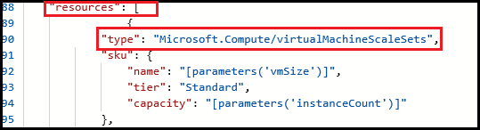

# Configure a VM Managed Service Identity by using a template

[!INCLUDE[preview-notice](../../../includes/active-directory-msi-preview-notice.md)]

Managed Service Identity (MSI) provides Azure services with an automatically managed identity in Azure Active Directory (Azure AD). You can use this identity to authenticate to any service that supports Azure AD authentication, without having credentials in your code. 

In this article, you learn how to enable and remove MSI for an Azure virtual machine scale set, using an Azure Resource Manager deployment template.

## Prerequisites

[!INCLUDE [msi-qs-configure-prereqs](../../../includes/active-directory-msi-qs-configure-prereqs.md)]

## Enable MSI during creation of an Azure virtual machine scale set, or an existing Azure virtual machine scale set

As with the Azure portal and scripting, Azure Resource Manager templates provide the ability to deploy new or modified resources defined by an Azure resource group. Several options are available for template editing and deployment, both local and portal-based, including:

   - Using a [custom template from the Azure Marketplace](../../azure-resource-manager/resource-group-template-deploy-portal.md#deploy-resources-from-custom-template), which allows you to create a template from scratch, or base it on an existing common or [QuickStart template](https://azure.microsoft.com/documentation/templates/).
   - Deriving from an existing resource group, by exporting a template from either [the original deployment](../../azure-resource-manager/resource-manager-export-template.md#view-template-from-deployment-history), or from the [current state of the deployment](../../azure-resource-manager/resource-manager-export-template.md#export-the-template-from-resource-group).
   - Using a local [JSON editor (such as VS Code)](../../azure-resource-manager/resource-manager-create-first-template.md), and then uploading and deploying by using PowerShell or CLI.
   - Using the Visual Studio [Azure Resource Group project](../../azure-resource-manager/vs-azure-tools-resource-groups-deployment-projects-create-deploy.md) to both create and deploy a template.  

Regardless of the option you choose, template syntax is the same during initial deployment and redeployment. Enabling MSI on a new or existing Azure virtual machine scale set is done in the same manner. Also, by default, Azure Resource Manager does an [incremental update](../../azure-resource-manager/resource-group-template-deploy.md#incremental-and-complete-deployments) to deployments:

1. Whether you sign in to Azure locally or via the Azure portal, use an account that is associated with the Azure subscription that contains the virtual machine scale set.

2. After loading the template into an editor, locate the `Microsoft.Compute/virtualMachineScaleSets` resource of interest within the `resources` section. Yours might look slightly different from the following screenshot, depending on the editor you're using and whether you are editing a template for a new deployment or existing one.
   
    

3. Add the `"identity"` property at the same level as the `"type": "Microsoft.Compute/virtualMachineScaleSets"` property. Use the following syntax:

   ```JSON
   "identity": { 
       "type": "systemAssigned"
   },
   ```

4. Then add the virtual machine scale set MSI extension as an `extensionsProfile` element. Use the following syntax:

   >[!NOTE] 
   > The following example assumes a Windows virtual machine scale set extension (`ManagedIdentityExtensionForWindows`) is being deployed. You can also configure for Linux by using `ManagedIdentityExtensionForLinux` instead, for the `"name"` and `"type"` elements.
   >

   ```JSON
   "extensionProfile": {
        "extensions": [
            {
                "name": "MSIWindowsExtension",
                "properties": {
                    "publisher": "Microsoft.ManagedIdentity",
                    "type": "ManagedIdentityExtensionForWindows",
                    "typeHandlerVersion": "1.0",
                    "autoUpgradeMinorVersion": true,
                    "settings": {
                        "port": 50342
                    },
                    "protectedSettings": {}
                }
            }
   ```

5. When you're done, your template should look similar to the following:

    

## Remove MSI from an Azure virtual machine scale set

If you have a virtual machine scale set that no longer needs an MSI:

1. Whether you sign in to Azure locally or via the Azure portal, use an account that is associated with the Azure subscription that contains the virtual machine scale set.

2. Remove the two elements that were added in the previous section: the virtual machine scale set's `"identity"` and `"extensionsProfile"` properties.

## Next steps

- For a broader perspective about MSI, read the [Managed Service Identity overview](overview.md).

