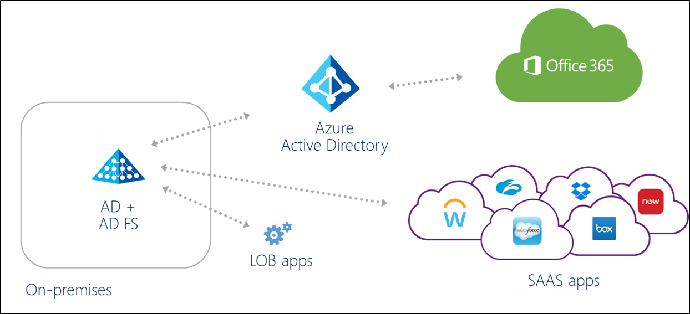
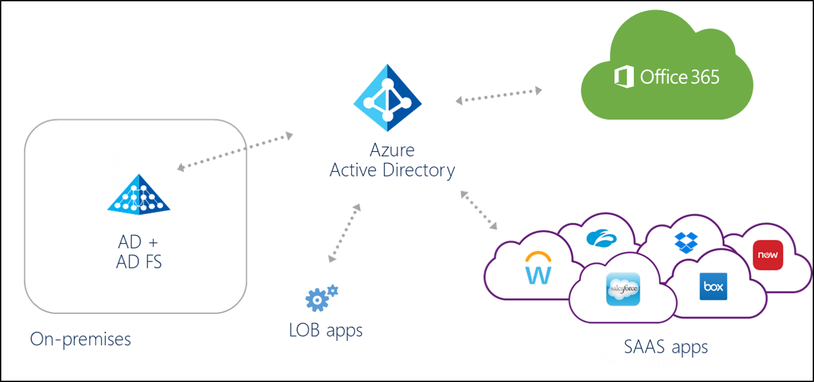
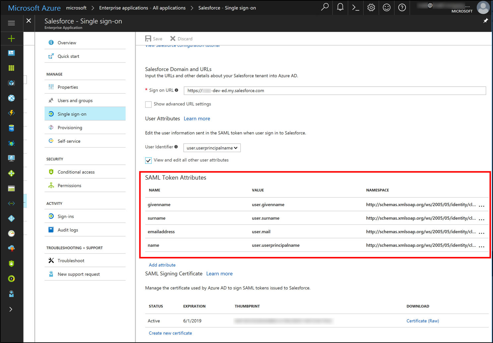
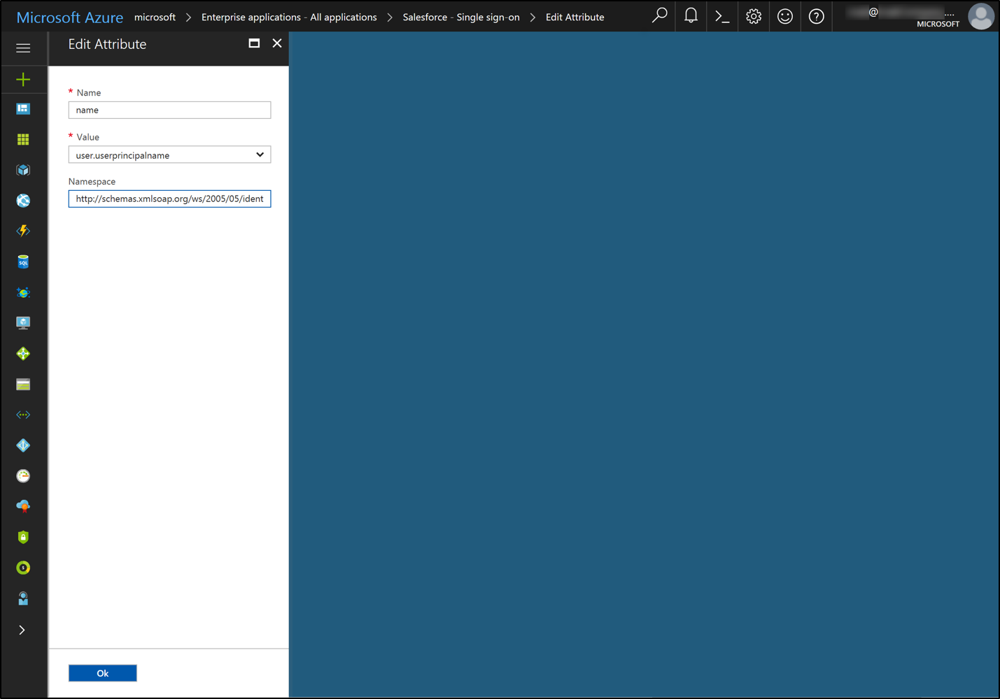
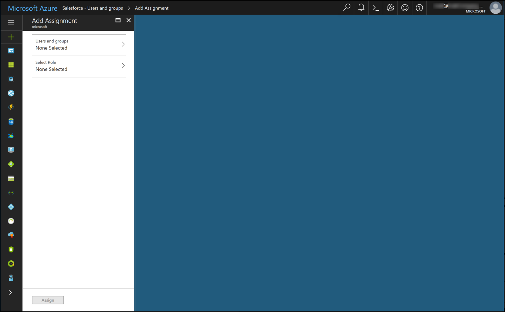
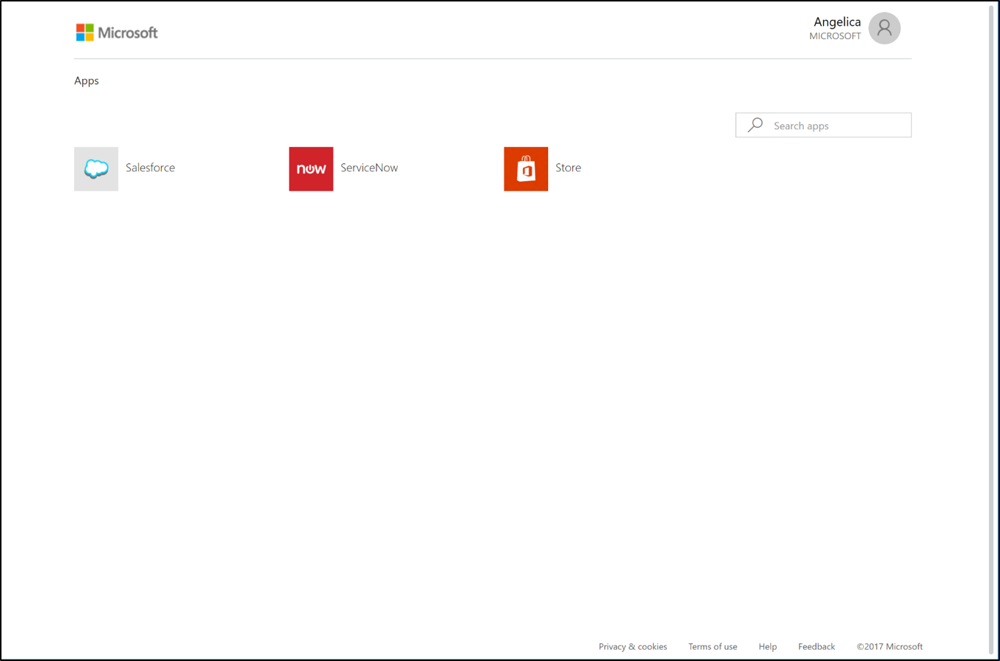
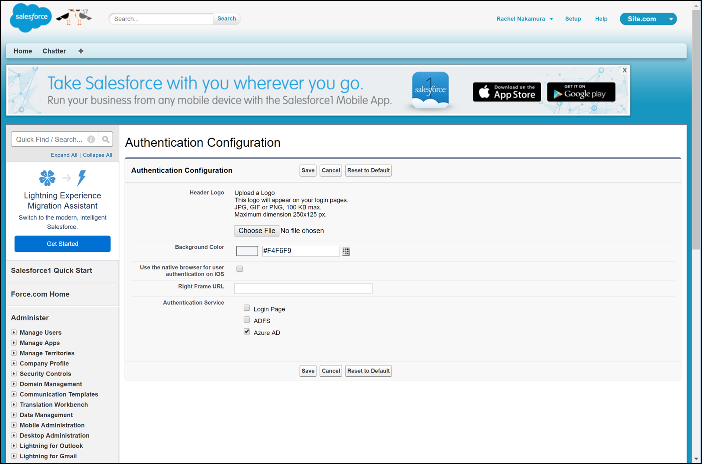

# Migrate AD FS on-premises apps to Azure 

This document is intended to help organizations understand how to migrate on -premises applications to Azure AD.  It has a focus on federated SaaS applications.  This document does not provide step by step guidance.  It provides conceptual guidance to help you achieve the migration by understanding how on-premises configurations translate to Azure AD. Also covering what the most common scenarios require.

## Introduction

If you have an on-premises directory that contains user accounts, chances are you have at least one or two apps.  And these apps are configured for users to access by signing on with those identities.

And if you’re like most organizations, you’re probably somewhere along the road to adopting cloud applications and identities.  Perhaps you’re up and running with Office 365 and Azure AD Connect.  Maybe you’ve setup cloud-based SaaS applications for some key workloads but not all.  

Many organizations have SaaS or custom line-of-business (LoB) apps federated directly to an on-premises sign-on service such as Active Directory Federation Service (AD FS), alongside Office 365 and Azure AD based apps.  This migration guide describes why and how to migrate on-premises applications to Azure AD.

>[!NOTE]
>This guide provides detailed information on SaaS app configuration and migration, with high-level information about custom LoB apps.  More detailed guidance for custom LoB apps is planned for the future.

Figure 1: Apps connected directly on-premises

Figure 2: Apps federated via Azure AD

## Why migrate apps to Azure AD?

For the organization who already uses AD FS, Ping, or another on-premises authentication provider, migrating apps to Azure AD enables the following benefits:

**More secure access**
- Configure granular per-application access controls, including Multi-Factor Authentication (MFA), using [Azure AD Conditional Access](https://docs.microsoft.com/azure/active-directory/active-directory-conditional-access-azure-portal).  The policies can be applied to SaaS and custom apps in the same way you might be doing today for Office 365
- To detect threats and protect sign-on based on machine learning and heuristics that identify risky traffic, take advantage of Azure AD’s built in and continuously evolving capabilities with [Azure AD Identity Protection](https://docs.microsoft.com/azure/active-directory/active-directory-identityprotection)

**Azure AD B2B collaboration**
- Once sign-on to SaaS apps is based on Azure AD, you can give partners access to cloud resources with [Azure AD B2B collaboration](https://docs.microsoft.com/azure/active-directory/active-directory-b2b-what-is-azure-ad-b2b).

**Easier admin experience and additional capabilities of Azure AD**
- Azure AD as an identity provider for SaaS apps supports additional capabilities such as token signing certificates per application, [configurable certificate expiration dates](https://docs.microsoft.com/azure/active-directory/active-directory-sso-certs), and [automated provisioning](https://docs.microsoft.com/azure/active-directory/active-directory-saas-app-provisioning) of user accounts (in key Gallery apps) based on Azure AD identities

**Keep the benefits of an on-premises identity provider**
- While gaining the Azure AD benefits, you can keep using your on-premises solution for authentication, so that benefits like on-premises Multi-Factor Authentication (MFA) solutions, logging, and auditing stay in place 

**Get a jump-start on retiring the on-premises identity provider**
- For organizations looking to retire the on-premises authentication product, migrating apps to Azure AD enables an easier transition by getting some of the work out 

## Mapping types of apps on-premises to types of apps in Azure AD
Most apps fit into one of a few categories based on the type of sign-on they use.  These categories determines how the app is represented in Azure AD.

In short, SAML 2.0 applications can be integrated with Azure AD either via the Azure AD application gallery, or as non-gallery applications.  Apps that use OAuth 2.0 or OpenID Connect can be integrated with Azure AD similarly as “app registrations."  Read on for more details.

### Federated SaaS apps vs custom LoB apps
Federated apps include apps that fall into the categories listed.

- SaaS apps 
    - If your users sign-on to SaaS apps such as Salesforce, ServiceNow, or Workday, and you are integrating to an on-premises identity provider such as AD FS or Ping, you are using federated sign-on for SaaS apps.
    - Apps generally use the SAML 2.0 protocol for federated sign-on.
    - Applications that fall into this category can be integrated with Azure AD as Enterprise Applications, either from the gallery, or as non-gallery applications.
- Custom LoB applications
    - This refers to non-SaaS apps, developed internally by your organization or is available as a standard packaged product that is installed in your data center.  This includes SharePoint apps and apps built on Windows Identity Foundation (WIF).
    - Apps can use SAML 2.0, WS-Federation, OAuth or OpenID Connect for federated sign-on
    - Custom apps that use Oauth 2.0, OpenID Connect, or WS-Federation can be integrated with Azure AD as App registrations, and custom apps that use SAML 2.0 or WS-Federation can be integrated as non-gallery applications within Enterprise applications

### Non-federated apps
Additionally, non-federated apps can be integrated with Azure AD using the Azure AD Application Proxy and related capabilities.  For more information on the capabilities, follow the links:
- Apps that use Windows Integrated Auth (WIA) directly to Active Directory
    - These apps can be integrated to Azure AD via the [Azure AD Application Proxy](https://docs.microsoft.com/azure/active-directory/application-proxy-publish-azure-portal)
- Apps that integrate with your single sign-on provider via an agent and use headers for authorization
    - on-premises apps that use an installed agent for sign-on and header-based authorization can be configured for Azure AD based sign-on using the Azure AD Application Proxy with [Ping Access for AzureAD](https://blogs.technet.microsoft.com/enterprisemobility/2017/06/15/ping-access-for-azure-ad-is-now-generally-available-ga/)

## Translating on-premises federated apps to Azure AD 
Fortunately, AD FS and Azure AD work similarly, so the concepts of configuring trust, sign-on and sign out URLs and identifiers apply in both cases.  However, there are some small differences that need to be understood as you make the transition.

In the table, we’ve mapped several key ideas shared by AD FS, Azure AD, and SaaS apps to help you translate. 

### Representing the app in Azure AD or AD FS
Migration starts with assessing how the application is configured on-premises and mapping that configuration to Azure AD.  The following is a mapping of AD FS relying party configuration elements to the corresponding elements in Azure AD.  
- AD FS term: Relying Party or Relying Party Trust
- Azure AD term: Enterprise application or App registration (depending on the type of app)

|App Configuration Element|Description|Within AD FS configuration|Corresponding location in Azure AD configuration|SAML Token element|
|-----|-----|-----|-----|-----|
|App sign-on URL|URL of the sign in page of this application. This is where the user would go to initiate a sign into the app in an SP initiated SAML flow.|N/A|In Azure AD the sign-on url is configured within the Azure portal in the application’s Single sign-on Properties as the sign-on URL.  (you may have to click Show advanced URL settings to see the sign-on URL)||
|App Reply URL|URL of the app from the IdP’s perspective.  This is where the user and token are sent once the user has signed on at the IDP.    This is sometimes called the SAML assertion consumer endpoint.|Found in the AD FS Relying Party Trust for the app.  Right-click the relying party and choose “Properties” -> “Endpoints” tab.|In Azure AD the reply url is configured within the Azure portal in the application’s Single sign-on Properties as the Reply URL.  (you may have to click Show advanced URL settings to see the Reply URL)|Maps to the Destination element in the SAML token.    Example value:  https://contoso.my.salesforce.com|
|App Sign out URL|URL to which “sign out cleanup” requests are sent when a user signs out from an app, to sign out all other apps to which the IDP has signed on the user.|Found in AD FS Management under: Relying Party Trusts.  Right-click the RP and choose “Properties” -> Click “Endpoints” tab|N/A – Azure AD does not support “single logout” , meaning sign out of all apps.  It simply signs the user out from Azure AD itself.|NA|
|App Identifier|Identifier of the app from IdP’s perspective The sign-on URL value is often used for the Identifier (but not always)    Sometimes the app calls this the “Entity ID."|In AD FS, this is the Relying Party ID:  Right-click the relying party trust and choose “Properties” -> Click “Identifiers” tab|In Azure AD, the identifier is configured within the Azure portal in the application’s Single sign-on Properties as the Identifier under Domain and URLs (you may need to click the “Show advanced URL settings” checkbox)|Corresponds to the Audience element in the SAML token|
|App Federation Metadata|Location of the app’s federation metadata.  Used by the IdP to auto-update specific configuration settings such as Endpoints or encryption certificates.|The App’s Federation Metadata URL is found in the AD FS Relying Party Trust for the app.  Right-click the trust and choose Properties and then click the Monitoring tab.|N/A - Azure AD does not support consuming application federation metadata directly|NA|
|User Identifier / NameID|Attribute that is used to uniquely indicate the user identity from Azure AD or AD FS to your app.    Typically either the UPN or the email address of the user.|In AD FS, this is found as a claim rule on the relying party.  In most cases, it is the claim rule that issues a claim with a type that ends with “nameidentifier”|In Azure AD, User Identifier can be found within the Azure portal in the application’s Single sign-on Properties under the header User Attributes.  By default, the UPN is used.|Communicated from the IDP to the app as the “NameID” element in the SAML token.|
|Other Claims to be sent to the app|In addition to the User Identifier / NameID, other claim information is commonly sent from the IDP to the app, for example first name, last name, email address, and groups the user is a member of|In AD FS, this is found as other claim rules on the relying party.|In Azure AD, found within the Azure portal in the application’s Single sign-on Properties under the header User attributes, click View and edit all other user attributes.||	

### Representing Azure AD as an Identity Provider (IdP) in a SaaS app
As part of migration, the app needs to be configure to point to Azure AD (vs the on-premises identity provider).  This section focuses primarily on SaaS apps that use SAML protocol and not on custom/LOB apps. However, the concepts described would extend to custom/LOB apps. 

At a high level, there are a few key things to point a SaaS app to Azure AD
- Identity Provider Issuer:  https&#58;//sts.windows.net/{tenant-id}/
- Identity Provider Login URL: https&#58;//login.microsoftonline.com/{tenant-id}/saml2
- Identity Provider Logout URL: https&#58;//login.microsoftonline.com/{tenant-id}/saml2 
- Federation metadata location:  https&#58;//login.windows.net/{tenant-id} <tenant-id>/federationmetadata/2007-06/federationmetadata.xml?appid={<application-id} 

where {tenant-id} is replaced with your tenant ID, found in the Azure portal under Azure Active Directory -> Properties as the “Directory ID”, and {application-id} is replaced with your application’s ID found under the application’s Properties as “Application ID”

The table describes in more detail the key IdP configuration elements to configure SSO settings in the app and their values or locations within AD FS and Azure AD.  The table's frame of reference is the SaaS app, which needs to know where to send authentication requests and how to validate the tokens received.

|Configuration element|Description|AD FS|Azure AD|
|---|---|---|---|
|IdP  sign-on  URL|sign-on URL of the IdP from the app’s perspective (where the user is redirected for login).|The AD FS sign-on URL is the AD FS federation service name followed by “/adfs/ls/”, for example: https&#58;//fs.contoso.com/adfs/ls/|The corresponding value for Azure AD follows the pattern, where {tenant-id} is replaced with your tenant ID, found in the Azure portal under Azure Active Directory -> Properties as the “Directory ID."  For apps that use the SAML-P protocol: https&#58;//login.microsoftonline.com /{tenant-id}/saml2   For apps that use the WS-Federation protocol https&#58;//login.microsoftonline.com /{tenant-id}/wsfed|
|IdP  Sign Out  URL|Sign out URL of the IdP from the app’s perspective (where the user is redirected when they choose to “sign out” of the app).|For AD FS, the sign out URL is either the same as the sign-on URL, or the same url with “wa=wsignout1.0” appended, for example https&#58;//fs.contoso.com/adfs/ls /?wa=wsignout1.0|The corresponding value for Azure AD depends upon whether the app is able to support SAML 2.0 sign-out.  If the app supports SAML sign out, the value follows the pattern, where the value for {tenant-id} is replaced with the tenant ID, found in the Azure portal under Azure Active Directory -> Properties as the “Directory ID." https&#58;//login.microsoftonline.com /{tenant-id}/saml2  If the app does not support SAML sign out: https&#58;//login.microsoftonline.com /common /wsfederation?wa=wsignout1.0|
|Token  Signing  Certificate|Certificate whose private key the IDP uses to sign issued tokens.  Verifies that the token came from the same IDP the app is configured to trust.|The AD FS token signing certificate is found in AD FS Management under Certificates.|In Azure AD, the token signing certificate can be found within the Azure portal in the application’s Single sign-on Properties under the header SAML Signing Certificate, where you can download the certificate for upload to the app.    If the application has more than one certificate, then all certificates can be found in the federation metadata xml file.|
|Identifier /  “Issuer”|Identifier of the IdP from the app’s perspective (sometimes called the “Issuer” or “Issuer ID”)  In the SAML token, the value appears as the “Issuer” element|The identifier for AD FS is usually the federation service identifier in AD FS Management under: Service -> Edit Federation Service Properties.  For example: http&#58;//fs.contoso.com/adfs/services/trust|The corresponding value for Azure AD follows the pattern, where the value for {tenant-id} is replaced with the tenant ID, found in the Azure portal under Azure Active Directory -> Properties as the “Directory ID."  https&#58;//sts.windows.net/{tenant-id}/|
|IdP  Federation  Metadata|Location of the IDP’s publicly available federation metadata.  (Federation metadata is used by some apps as an alternative to the administrator configuring URLs, identifier, and token signing certificate individually)|Find the AD FS federation metadata URL in AD FS Management under Service -> Endpoints -> Metadata -> Type: Federation Metadata, for example: https&#58;//fs.contoso.com/ FederationMetadata/2007-06/ FederationMetadata.xml|The corresponding value for Azure AD follows the pattern https&#58;//login.microsoftonline.com /{TenantDomainName}/FederationMetadata/2007-06/ FederationMetadata.xml where the value for {TenantDomainName} is replaced with your tenant’s name in the format “contoso.onmicrosoft.com”   [More information](https://docs.microsoft.com/azure/active-directory/develop/active-directory-federation-metadata) about federation metadata in Azure AD.

## Migrating SaaS apps
Migrating SaaS apps from AD FS or another identity provider into Azure AD is a manual process today. For app-specific guidance, [see the list of tutorials on integrating SaaS apps found in the Gallery](https://docs.microsoft.com/azure/active-directory/active-directory-saas-tutorial-list).

The integration tutorials assume that you are doing a green field integration.  There are a few key concepts specific to migration you should know about as you plan, assess, configure, and cutover your apps.  
- While some apps can be migrated easily, apps with more complex requirements such as custom claims may require additional configuration in Azure AD and/or Azure AD Connect
- In the most common scenarios, only the NameId claim and other common user identifier claims are required for an app; to determine if any additional claims are required, examine what claims you’re issuing from AD FS or your third party identity provider
- Once you have determined that additional claim(s) are required, you need to ensure they are available in Azure AD.  You need to check Azure AD Connect sync configuration to ensure a required attribute, for example samAccountName, is being synched to Azure AD
- Once the attributes are available in Azure AD, to add claim issuance rules in Azure AD to include those attributes as claims in issued tokens.  Done within the Single sign-on properties of the app in Azure AD.

### Assessing what can be migrated
SAML 2.0 applications can be integrated with Azure AD either via the Azure AD application gallery, or as non-gallery applications.  

There are some configurations that require additional steps to configure in Azure AD, and some that are not supported today.  To determine what can be moved, look at the current configuration of each of your apps, specifically the following:
- Claim rules configured (issuance transform rules)
- SAML NameID format and attribute
- SAML token versions issued
- Other configurations such as issuance authorization rules or access control policies and multi factor authentication (additional authentication) rules

#### What can be migrated today
Apps that can be migrated easily today include SAML 2.0 apps that use the standard set of configuration elements and claims.  These apps can consist of
- user principal name
- email address
- Given Name
- Surname
- Alternate attribute as SAML NameID, including the Azure AD mail attribute, mail prefix, employeeid, extension attributes 1 – 15, or on-premises SamAccountName (see [Editing the NameIdentifier claim)](./develop/active-directory-saml-claims-customization.md)
- Custom claims (see the document [here](active-directory-claims-mapping.md) and [here](./develop/active-directory-saml-claims-customization.md) for information about supported claims mappings)

In addition to custom claims and nameID elements, configurations that require additional configuration steps in Azure AD as part of the migration are:
- Custom authorization or MFA rules in AD FS (configured using the [Azure AD conditional access](active-directory-conditional-access-azure-portal.md) feature)
- Apps with multiple SAML endpoints can be configured in Azure AD using PowerShell (This capability is not available in the portal)
- WS-Federation apps such as SharePoint apps that require SAML 1.1 version tokens must be configured manually using PowerShell

#### Apps/configurations not supported in Azure AD today
Apps that require the following capabilities cannot be migrated today.  Provide feedback in the comments section if you have apps that require these features.
- Protocol Capabilities
    - Support for SAML Single Logout (SLO) of all signed in apps
    - Support for WS-Trust ActAs pattern
    - SAML artifact resolution 
    - Signature verification of signed SAML requests (note that signed requests are accepted, but the signature is not verified)
 - Token Capabilities 
     - SAML Token Encryption 
     - SAML version 1.1 tokens within SAML protocol responses 
- Claims in Token Capabilities
    - Issue on-premises group names as a claims
    - Claims from stores other than Azure AD
    - Complex claims issuance transform rules (see this [document](https://docs.microsoft.com/azure/active-directory/active-directory-claims-mapping) and this [document](https://docs.microsoft.com/azure/active-directory/develop/active-directory-saml-claims-customization) for information about supported claims mappings)
    - Issue directory extensions as claims
    - Custom specification of NameID format
    - Issuance of multi value attributes

>[!NOTE]
>Azure AD is constantly evolving to add additional capabilities in this area. We keep this document updated on a regular basis. 

### Configuring Azure AD    
#### Configure single sign-on (SSO) settings for the SaaS app

In Azure AD, configuring SAML sign-on as required by your app is done within the Single sign-on properties of the app under User attributes as shown:

- Click on ‘View and edit all other user attribute’ to see the attributes to send as claims in the security token

- Click on a specific attribute row to edit or click on ‘Add attribute’ to a new attribute. 

#### Assign users to the app
In order for your users within Azure AD to be able to log into a given SaaS app, they need to be given access from within Azure AD.

To assign users in the Azure AD portal, navigate to the SaaS app’s  screen within the portal, and then click “Users and groups” in the sidebar. In order to add either a user or a group, click “Add user” at the top of the screen. 

 

To verify access, the user should see said SaaS app in their [access panel](https://docs.microsoft.com/azure/active-directory/active-directory-saas-access-panel-introduction) when they log in, which can be found at http://myapps.microsoft.com. For example, the user has been successfully assigned access to both Salesforce and ServiceNow.

### Configuring the SaaS app
The cutover process from on-premises federation to Azure AD depends on whether the SaaS app you are working with supports multiple Identity Providers (IdPs).  The following are some common questions regarding multiple IdP support:

   **Q: What does it mean for an app to support multiple IdPs?**
    
   A: SaaS apps that support multiple IdPs enable you to enter all of the information about the new IdP (in our case, Azure AD) before committing to changing the sign-on experience.  Once the configuration is done, you can switch the app’s authentication configuration to point at Azure AD.

   Q: Why does it matter if the SaaS app supports multiple IdPs?

   A: If multiple IdPs are not supported, the admin will have to set aside a short window of time as a service or maintenance outage during which they configure Azure AD as an app’s new IdP. During this outage, users should be notified that they will not be able to sign in to their accounts.

   If an app does support multiple IdPs, configuration of the additional IdP can be done in advance, so the admin can simply switch the IdP at Azure cutover.

   Additionally, if the app supports multiple IdPs and you choose multiple IdPs to simultaneously handle authentication for sign-in, the user is given a choice of IdP to authenticate on their sign-in page.

#### Example: multiple IdP support
For example, in Salesforce, the IDP configuration can be found under Settings -> Company Settings -> My Domain -> Authentication Configuration.

Because of the configuration created earlier under Identity-> Single sign-on settings, you should be able to change your IdP for authentication configuration from, say, AD FS to Azure AD. 

### Optional: configure user provisioning in Azure AD
Optionally, if you’d like Azure AD to directly handle user provisioning for a given SaaS app, see this document on managing user account provisioning for enterprise apps in Azure AD.

## Next steps

- [Managing Applications with Azure Active Directory](active-directory-enable-sso-scenario.md)
- [Manage access to apps](active-directory-managing-access-to-apps.md)
- [Azure AD Connect Federation](active-directory-aadconnectfed-whatis.md)