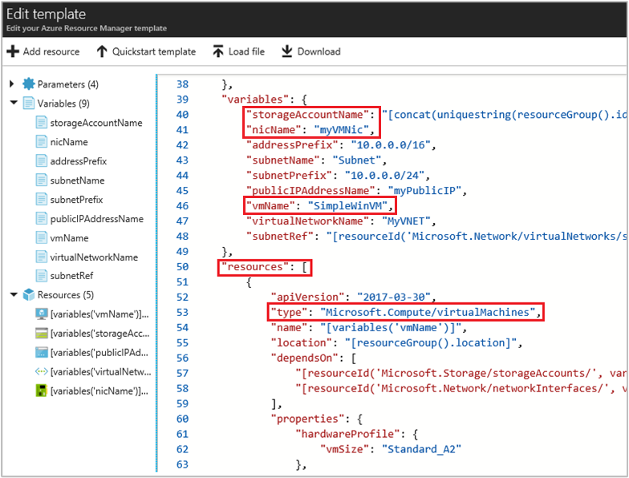

# Assign a Managed Service Identity (MSI) access to a resource using a template

Once you've configured an Azure resource with an MSI, you can give the MSI access to another resource, just like any security principal. This example shows you how to give an Azure virtual machine's MSI access to an Azure storage account, using an Azure Resource Manager deployment template.

## Prerequisites

[!INCLUDE [msi-qs-configure-prereqs](../../includes/msi-qs-configure-prereqs.md)]

## Use RBAC to assign the MSI access to another resource

After you've enabled MSI on an Azure resource, [such as an Azure VM](msi-qs-configure-template-windows-vm.md):

1. Load the template into an editor. Yours may look slightly different from this screen shot, depending on the editor you're using and whether you are editing a template for a new deployment or existing one:

    

2. Add a new `roleAssignments` element under `resources` using the following syntax. This will give the VM "Reader" access to a storage account called "myStorageAcct":

   >[!NOTE] 
   > This step also assumes the variables `vmName` and `storageAccountName` are defined in the template.
   >

   ```JSON
    "variables": {
    "vmName": "SimpleWinVM",
    ...
    "readerRoleDefinitionId": "[concat('/subscriptions/', subscription().subscriptionId, '/providers/Microsoft.Authorization/roleDefinitions/', 'acdd72a7-3385-48ef-bd42-f606fba81ae7')]",,
    "roleAssignmentId": "[guid(resourceId('Microsoft.Compute/virtualMachines/', variables('vmName')))]"
    ...
    },

    "resources": [
    {
        "apiVersion": "2016-07-01",
        "type": "Microsoft.Authorization/roleAssignments",
        "name": "[variables('roleAssignmentId')]",
        "dependsOn": [
                "[concat('Microsoft.Compute/virtualMachines/', variables('vmName'))]"
        ],
        "properties": {
        "roleDefinitionId": "[variables('contributorRoleDefinitionId')]",
        "principalId": "[reference(concat('Microsoft.Compute/virtualMachines/', variables('vmName')), '2017-03-30', 'Full').identity.principalId]"
        }
    },   
    ```

3. When you're done, your template should look similar to the following example:

    

4. You may also wish to sign in to the [Azure portal](https://portal.azure.com) using an account associated with the Azure subscription under which you would like to deploy the VM. Navigate to the resource to which you gave the MSI access, and verify that it shows up under the correct role.

## Troubleshooting

If assignment of the MSI fails, verify that the MSI has been enabled correctly. In our case, we can go back to the Azure VM in the [Azure portal](https://portal.azure.com) and:

- Look at the "Configuration" page and ensure MSI enabled = "Yes."
- Look at the "Extensions" page and ensure the MSI extension deployed successfully.

If either is incorrect, you may need to redeploy the MSI on your resource again, or troubleshoot the deployment failure.

## Related content

- For an overview of MSI, see [Managed Service Identity overview](msi-overview.md).
- To enable MSI on an Azure VM, see [Configure an Azure VM Managed Service Identity (MSI) using Azure CLI](msi-qs-configure-cli-windows-vm.md).

Use the following comments section to provide feedback and help us refine and shape our content.

