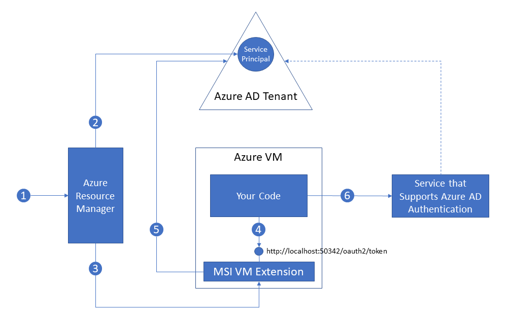

#  Overview of Managed Service Identity (Preview) for Azure resources

A common challenge when building cloud applications is how to manage the credentials that need to be in your code for authenticating to cloud services. Keeping these credentials secure is an important task. Ideally, they never appear on developer workstations or get checked into source control. Azure Key Vault provides a way to securely store credentials and other keys and secrets, but your code needs to authenticate to Key Vault to retrieve them. Managed Service Identity (MSI) makes solving this problem simpler by giving Azure services an automatically managed identity in Azure Active Directory (Azure AD). You can use this identity to authenticate to any service that supports Azure AD authentication, including Key Vault, without having any credentials in your code.

## How does it work?

When you enable Managed Service Identity on an Azure service, Azure automatically creates an identity for the service instance in the Azure AD tenant used by your Azure subscription.  Under the covers, Azure provisions the credentials for the identity onto the service instance.  Your code can then make a local request to get access tokens for services that support Azure AD authentication.  Azure takes care of rolling the credentials used by the service instance.  If the service instance is deleted, Azure automatically cleans up the credentials and the identity in Azure AD.

Here's an example of how Managed Service Identity works with Azure Virtual Machines.

1. Azure Resource Manager receives a message to enable MSI on a VM.
2. Azure Resource Manager creates a Service Principal in Azure AD to represent the identity of the VM. The Service Principal is created in the Azure AD tenant that is trusted by this subscription.
3. Azure Resource Manager configures the Service Principal details in the MSI VM Extension of the VM.  This step includes configuring client ID and certificate used by the extension to get access tokens from Azure AD.
4. Your code running on the VM requests a token from a local endpoint that is hosted by the MSI VM extension:  http://localhost:50342/oauth2/token.  The resource parameter specifies the service to which the token will be sent. For example, if you want your code to authenticate to Azure Resource Manager, you would use resource=https://management.azure.com/.
5. The MSI VM Extension uses its configured client ID and certificate to request an access token from Azure AD.  Azure AD returns a JSON Web Token (JWT) access token.
6. Your code sends the access token on a call to a service that supports Azure AD authentication.

Each Azure service that supports Managed Service Identity will have its own method for your code to obtain an access token.

## Which Azure services support Managed Service Identity?

Azure services that support Managed Service Identity can use MSI to authenticate to services that support Azure AD authentication.  We are in the process of integrating MSI and Azure AD authentication across Azure.  Check back often for updates.

### Azure services that support Managed Service Identity

The following Azure services support Managed Service Identity.

| Service | Tutorial | Status | Date |
| --- | --- | --- | --- |
| Azure Virtual Machines | [Tutorial](msi-tutorial-windows-vm-access-arm.md) | Preview | Sept 2017 |

### Azure services that support Azure AD authentication

The following services support Azure AD authentication and have been tested with client services that use Managed Service Identity.

| Service | Resource ID | Tutorial | Status | Date |
| --- | --- | --- | --- | --- |
| Azure Resource Manager | https://management.azure.com/ | [Tutorial](msi-tutorial-windows-vm-access-arm.md) | Available | Sept 2017 |
| Azure Key Vault | https://vault.azure.net/ | [Tutorial](msi-tutorial-windows-vm-access-nonaad.md) | Available | Sept 2017 |
| Azure SQL | https://database.windows.net/ | Coming soon | Available | Sept 2017 |
| Azure Data Lake | https://management.core.windows.net/ | Coming soon | Available | Sept 2017 |

## How much does Managed Service Identity cost?

Managed Service Identity comes with Azure Active Directory Free, which is the default for Azure subscriptions.  There is no additional cost for Managed Service Identity.

## Support and feedback

We would love to hear from you!

* Ask how-to questions on Stack Overflow with the tag [azure-msi](http://stackoverflow.com/questions/tagged/azure-msi).
* Make feature requests or give feedback on the [Azure AD feedback forum for developers](https://feedback.azure.com/forums/169401-azure-active-directory/category/164757-developer-experiences).

## Next steps
Now that you understand the basics, try a Managed Service Identity tutorial.

* [Set up Windows VM with Managed Service Identity] (msi-tutorial-windows-vm-access-arm.md) - Get started by enabling MSI on a Windows VM and authenticating to the Azure Resource Manager API.
* [Set up Linux VM with Managed Service Identity](msi-tutorial-linux-vm-access-arm.md) - Get started by enabling MSI on a Linux VM and authenticating to the Azure Resource Manager API.

