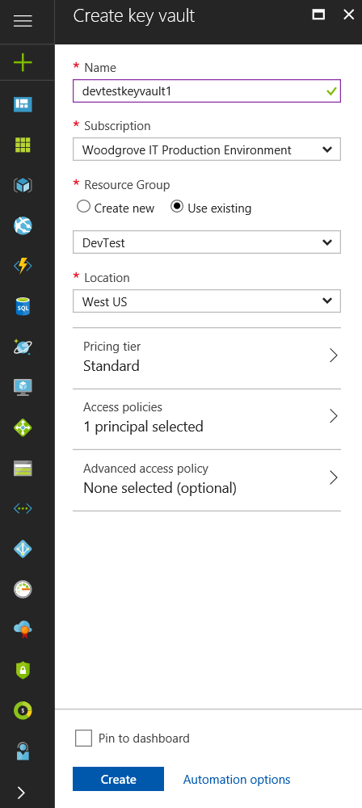

# Use Managed Service Identity (MSI) with a Linux VM to access Azure Key Vault 

[!INCLUDE[preview-notice](../../includes/active-directory-msi-preview-notice.md)]

This tutorial shows you how to enable Managed Service Identity (MSI) for a Windows Virtual Machine, and then use that identity to access the Azure Key Vault. Managed Service Identities are automatically managed by Azure and enable you to authenticate to services that support Azure AD authentication without needing to insert credentials into your code. You learn how to:

> [!div class="checklist"]
> * Enable MSI on a Linux Virtual Machine 
> * Grant your VM access to a secret stored in a Key Vault 
> * Get an access token using the VM identity and use it to retrieve the secret from the Key Vault 
 


If you don't have an Azure subscription, create a [free account](https://azure.microsoft.com/free/?WT.mc_id=A261C142F) before you begin.


## Sign in to Azure
<<<<<<< HEAD
Sign in to the Azure portal at [https://portal.azure.com](https://portal.azure.com). 
=======
>>>>>>> 9556aed7734bda473c8b60bfa42ff4f82a6eedd4

Sign in to the Azure portal at [https://portal.azure.com](https://portal.azure.com).

## Create a Linux Virtual Machine in a new Resource Group

For this tutorial, we create a new Linux VM. You can also enable MSI on an existing VM.

1. Click the **New** button found on the upper left-hand corner of the Azure portal.
2. Select **Compute**, and then select **Ubuntu Server 16.04 LTS**.
3. Enter the virtual machine information. For **Authentication type**, select **SSH public key** or **Password**. The created credentials will allow you to login to the VM.
<<<<<<< HEAD
=======

>>>>>>> 9556aed7734bda473c8b60bfa42ff4f82a6eedd4
    

4. Choose a **Subscription** for the virtual machine in the dropdown.
5. To select a new **Resource Group** you would like the virtual machine to be created in, choose **Create New**. When complete, click **OK**.
6. Select the size for the VM. To see more sizes, select **View all** or change the Supported disk type filter. On the settings page, keep the defaults and click **OK**.

## Enable MSI on your VM

A Virtual Machine MSI enables you to get access tokens from Azure AD without you needing to put credentials into your code. Under the covers, enabling MSI does two things: it installs the MSI VM extension on your VM and it enables MSI for the VM.  

1. Select the **Virtual Machine** that you want to enable MSI on.
2. On the left navigation bar click **Configuration**.
3. You will see **Managed Service Identity**. To register and enable the MSI, select **Yes**, if you wish to disable it, choose No.
4. Ensure you click **Save** to save the configuration.

    

5. If you wish to check which extensions are on this **Linux VM**, click **Extensions**. If MSI is enabled, the **ManagedIdentityExtensionforLinux** will appear on the list.

    


## Grant your VM access to a Secret stored in a Key Vault  

Using MSI your code can get access tokens to authenticate to resources that support Azure Active Directory authentication. However, not all Azure services support Azure AD authentication. To use MSI with services that don’t support it, you can store the credentials you need for those services in Azure Key Vault, and use MSI to authenticate to Key Vault to retrieve the credentials. 

First, we need to create a Key Vault and grant our VM’s identity access to the Key Vault.   

1. At the top of the left navigation bar select **+ New** then **Security + Identity** then **Key Vault**.  
2. Provide a **Name** for the new Key Vault. 
3. Locate the Key Vault in the same subscription and resource group as the VM you created earlier. 
4. Select **Access policies** and click **Add new**. 
5. In Configure from template, select **Secret Management**. 
6. Choose **Select Principal**, and in the search field enter the name of the VM you created earlier.  Select the VM in the result list and click **Select**. 
7. Click **OK** to finishing adding the new access policy, and **OK** to finish access policy selection. 
8. Click **Create** to finish creating the Key Vault. 

    

Next, add a secret to the Key Vault, so that later you can retrieve the secret using code running in your VM: 

1. Select **All Resources**, and find and select the Key Vault you just created. 
2. Select **Secrets**, and click **Add**. 
3. From **Upload options** select **Manual**. 
4. Enter a name and value for the secret.  The value can be anything you want. 
5. Leave the activation date and expiration date clear, and leave **Enabled** as **Yes**. 
6. Click **Create** to create the secret. 
 
## Get an access token using the VM identity and use it retrieve the secret from the Key Vault  

To complete these steps, you will need an SSH client.  If you are using Windows, you can use the SSH client in the [Windows Subsystem for Linux](https://msdn.microsoft.com/commandline/wsl/about).   
 
1. In the portal, navigate to your Linux VM and in the **Overview**, click **Connect**. 
2. **Connect** to the VM with the SSH client of your choice. 
3. In the terminal window, using CURL, make a request to the local MSI endpoint to get an access token for Azure Key Vault.  
 
    The CURL request for the access token is below.  
    
    ```bash
    curl http://localhost:50432/oauth2/token --data "resource=https://vault.azure.net" -H Metadata:true  
    ```
    The response includes the access token you need to access Resource Manager. 
    
    Response:  
    
    ```bash
    {"access_token":"eyJ0eXAiOiJKV1QiLCJhbGciOiJSUzI1NiIsIng1dCI6IkhIQnlLVS0wRHFBcU1aaDZaRlBkMlZXYU90ZyIsImtpZCI6IkhIQnlLVS0wRHFBcU1aaDZaRlBkMlZXYU90ZyJ9.eyJhdWQiOiJodHRwczovL21hbmFnZW1lbnQuYXp1cmUuY29tIiwiaXNzIjoiaHR0cHM6Ly9zdHMud2luZG93cy5uZXQvNzJmOTg4YmYtODZmMS00MWFmLTkxYWItMmQ3Y2QwMTFkYjQ3LyIsImlhdCI6MTUwNDEyNjYyNywibmJmIjoxNTA0MTI2NjI3LCJleHAiOjE1MDQxMzA1MjcsImFpbyI6IlkyRmdZTGg2dENWSzRkSDlGWGtuZzgyQ21ZNVdBZ0E9IiwiYXBwaWQiOiI2ZjJmNmU2OS04MGExLTQ3NmEtOGRjZi1mOTgzZDZkMjUxYjgiLCJhcHBpZGFjciI6IjIiLCJpZHAiOiJodHRwczovL3N0cy53aW5kb3dzLm5ldC83MmY5ODhiZi04NmYxLTQxYWYtOTFhYi0yZDdjZDAxMWRiNDcvIiwib2lkIjoiMTEyODJiZDgtMDNlMi00NGVhLTlmYjctZTQ1YjVmM2JmNzJlIiwic3ViIjoiMTEyODJiZDgtMDNlMi00NGVhLTlmYjctZTQ1YjVmM2JmNzJlIiwidGlkIjoiNzJmOTg4YmYtODZmMS00MWFmLTkxYWItMmQ3Y2QwMTFkYjQ3IiwidXRpIjoib0U5T3JVZFJMMHVKSEw4UFdvOEJBQSIsInZlciI6IjEuMCJ9.J6KS7b9kFgDkegJ-Vfff19LMnu3Cfps4dL2uNGucb5M76rgDM5f73VO-19wZSRhQPxWmZLETzN3SljnIMQMkYWncp79MVdBud_xqXYyLdQpGkNinpKVJhTo1j1dY27U_Cjl4yvvpBTrtH3OX9gG0GtQs7PBFTTLznqcH3JR9f-bTSEN4wUhalaIPHPciVDtJI9I24_vvMfVqxkXOo6gkL0mEPfpXZRLwrBNd607AzX0KVmLFrwA1vYJnCV-sSV8bwTh2t6CVEj240t0iyeVWVc2usJ0NY2rxPzKd_UckQ_zzrECG3kS4vuYePKz6GqNJFVzm2w2c61lX0-O1CwvQ9w","refresh_token":"","expires_in":"3599","expires_on":"1504130527","not_before":"1504126627","resource":"https://vault.azure.net","token_type":"Bearer"} 
    ```
    
    You can use this access token to authenticate to Azure Key Vault.  The next CURL request shows how to read a secret from Key Vault using CURL and the Key Vault REST API.  You’ll need the URL of your Key Vault, which is in the **Essentials** section of the **Overview** page of the Key Vault.  You will also need the access token you obtained on the previous call. 
        
    ```bash
    curl https://<YOUR-KEY-VAULT-URL>/secrets/<secret-name>?api-version=2016-10-01 -H "Authorization: Bearer <ACCESS TOKEN>" 
    ```
    
    The response will look like this: 
    
    ```bash
    {"value":"p@ssw0rd!","id":"https://mytestkeyvault.vault.azure.net/secrets/MyTestSecret/7c2204c6093c4d859bc5b9eff8f29050","attributes":{"enabled":true,"created":1505088747,"updated":1505088747,"recoveryLevel":"Purgeable"}} 
    ```
    
Once you’ve retrieved the secret from the Key Vault, you can use it to authenticate to a service that requires a name and password.


## Related content

- For an overview of MSI, see [Managed Service Identity overview](../active-directory/msi-overview.md).

Use the following comments section to provide feedback and help us refine and shape our content.


