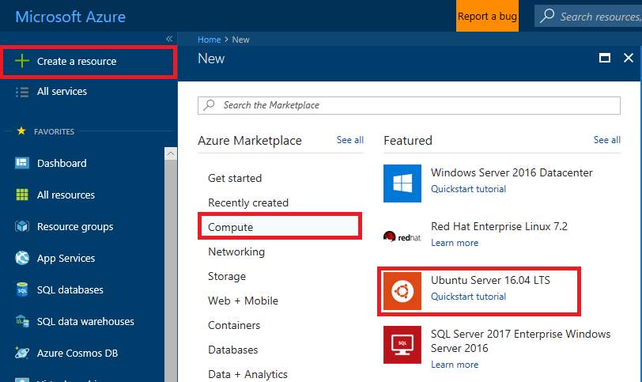
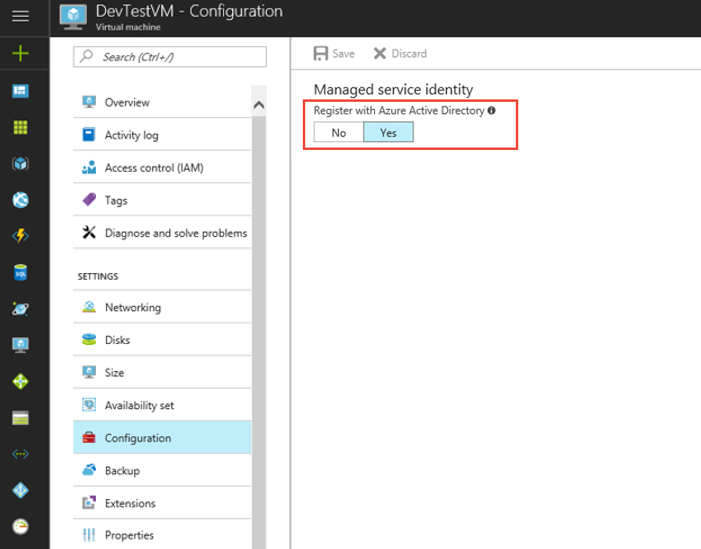
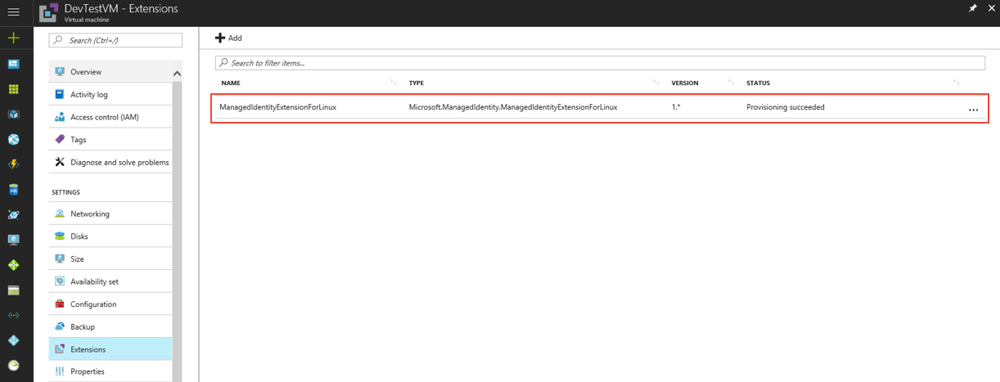
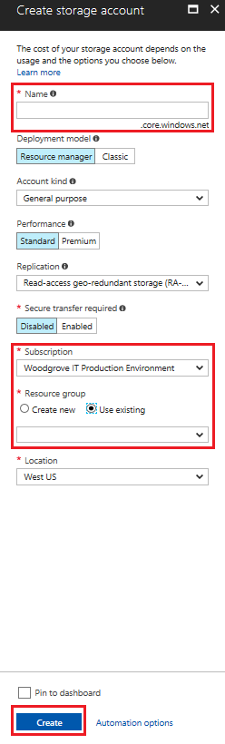
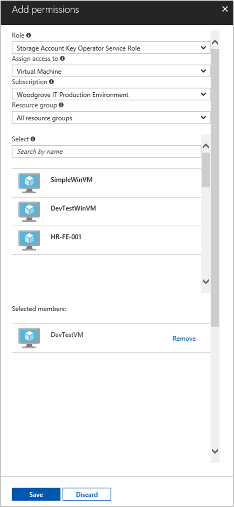

# Use Managed Service Identity (MSI) with a Linux VM to access Storage Credentials
This tutorial shows you how to enable Managed Service Identity (MSI) for a Linux Virtual Machine and then use that identity to access Storage Keys. You can use Storage Keys as usual when doing storage operations, for example when using Storage SDK. For this tutorial we will upload and download blobs using Azure CLI. You will learn how to:


> [!div class="checklist"]
> * Enable MSI on a Linux Virtual Machine 
> * Create a new Storage Account
> * Grant your VM access to use Storage credentials
> * Get an access token for your Storage Account using the VM identity and use it to call ARM


If you don't have an Azure subscription, create a [free account](https://azure.microsoft.com/free/?WT.mc_id=A261C142F) before you begin.

## Login to Azure
Login to the Azure portal at [https://portal.azure.com](https://portal.azure.com)


## Create a Linux Virtual Machine in a new Resource Group
For this tutorial, we will create a new Linux VM. You can also enable MSI on an existing VM.

1. Click the **New** button found on the upper left-hand corner of the Azure portal.
2. Select **Compute**, and then select **Ubuntu Server 16.04 LTS**.
3. Enter the virtual machine information. For **Authentication type**, select **SSH public key** or **Password**. The created credentials will allow you to login to the VM.



4. Choose a **Subscription** for the virtual machine in the dropdown.
5. To select a new **Resource Group** you would like the virtual machine to be creatd in, choose **Create New**. When complete, click **OK**.
6. Select the size for the VM. To see more sizes, select **View all** or change the Supported disk type filter. On the settings blade, keep the defaults and click **OK**.

## Enable MSI on your VM
A Virtual Machine MSI enables you to get access tokens from Azure AD without you needing to put credentials into your code. Under the covers, enabling MSI does two things: it installs the MSI VM extension on your VM and it enables MSI for the VM.  

1. Select the **Virtual Machine** that you wnat to enable MSI on.
2. On the left navigation bar click **Configuration**.
3. You will see **Managed Service Identity**. To register and enable the MSI, select **Yes**, if you wish to disable it, choose No.
4. Ensure you click **Save** to save the configuration.



5. If you wish to check which extensions are on this **Linux VM**, click **Extensions**. If MSI is enabled, the **ManagedIdentityExtensionforLinux** will appear on the list.




## Create a new Storage Account 
You can use Storage keys as usual when doing Storage operations, in this example we will focus on uploading and downloading blobs using the Azure CLI. 

1. Navigate to the side-bar and select **Storage**.  
2. Create a new **Storage Account**.  
3. In **Deployment model**, enter in **Resource Manager** and **Account kind** with **General Purpose**.  
4. Ensure the **Subscription** and **Resource Group** are the one that you used when you created your **Linux Virtual Machine** in the step above.




## Grant your VM identity access to use Storage Keys 

Using MSI your code can get access tokens to authenticate to resources that support Azure AD authentication.   

1. Navigate to tab for **Storage**.  
2. Select the specific **Storage Account** you created earlier.   
3. Go to **Access control (IAM)** in the left panel.  
4. Then **Add** a new role assignment for your VM, pick **Role** as **Storage Account Key Operator Service Role**.  
5. In the next dropdown, **Assign access** to the resource **Virtual Machine**.  
6. Next, ensure the proper subscription is listed in **Subscription** dropdown. And for **Resource Group**, select **All resource groups**.  
7. Finally, in **Select** choose your Linux Virtual Machine in the dropdown and click **Save**. 



 ## Get an access token using the VM Identity and use it to call Azure Resource Manager (ARM)  
You will need to use the Bash terminal, pick and then download your Linux distribution [here](https://msdn.microsoft.com/en-us/commandline/wsl/install_guide).


1. In the portal, navigate to your Linux virtual machine and in the **Overview**, click **Connect**. You will be prompted to use Bash, make note of your SSH and VM IP in the alert. 
2.   Open and connect to Bash.  
3.   In the terminal, enter in your **SSH** and **VM**you wish to connect to for example, “ssh admin@12.61.219.35 ”.  
4.   Next, you will be prompted to enter in your **Password** you added when creating the **Linux VM**. You should then be successfully signed in.  
5.   Then, you can make a request using CURL to get the authorization token for the Linux VM you are logged into. The **Azure Resource Manager** (ARM) endpoint is https://management.azure.com.  


## Access credentials for the Storage Account  


The CURL request for the access token is below.  

```bash
curl --data "authority= https://login.microsoftonline.com/<TENANT ID>&&resource=https://management.azure.com/"  -H Metadata:true http://localhost:50432/oauth2/token   
```

**Note:** Ensure that the URL for the resource you are trying to request access for contains the proper formatting with a slash at the end such as “https:<RESOURCE>/”  

Response:  

```bash
{"access_token":"eyJ0eXAiOiJKV1QiLCJhbGciOiJSUzI1NiIsIng1dCI6IkhIQnlLVS0wRHFBcU1aaDZaRlBkMlZXYU90ZyIsImtpZCI6IkhIQnlLVS0wRHFBcU1aaDZaRlBkMlZXYU90ZyJ9.eyJhdWQiOiJodHRwczovL21hbmFnZW1lbnQuYXp1cmUuY29tIiwiaXNzIjoiaHR0cHM6Ly9zdHMud2luZG93cy5uZXQvNzJmOTg4YmYtODZmMS00MWFmLTkxYWItMmQ3Y2QwMTFkYjQ3LyIsImlhdCI6MTUwNDEyNjYyNywibmJmIjoxNTA0MTI2NjI3LCJleHAiOjE1MDQxMzA1MjcsImFpbyI6IlkyRmdZTGg2dENWSzRkSDlGWGtuZzgyQ21ZNVdBZ0E9IiwiYXBwaWQiOiI2ZjJmNmU2OS04MGExLTQ3NmEtOGRjZi1mOTgzZDZkMjUxYjgiLCJhcHBpZGFjciI6IjIiLCJpZHAiOiJodHRwczovL3N0cy53aW5kb3dzLm5ldC83MmY5ODhiZi04NmYxLTQxYWYtOTFhYi0yZDdjZDAxMWRiNDcvIiwib2lkIjoiMTEyODJiZDgtMDNlMi00NGVhLTlmYjctZTQ1YjVmM2JmNzJlIiwic3ViIjoiMTEyODJiZDgtMDNlMi00NGVhLTlmYjctZTQ1YjVmM2JmNzJlIiwidGlkIjoiNzJmOTg4YmYtODZmMS00MWFmLTkxYWItMmQ3Y2QwMTFkYjQ3IiwidXRpIjoib0U5T3JVZFJMMHVKSEw4UFdvOEJBQSIsInZlciI6IjEuMCJ9.J6KS7b9kFgDkegJ-Vfff19LMnu3Cfps4dL2uNGucb5M76rgDM5f73VO-19wZSRhQPxWmZLETzN3SljnIMQMkYWncp79MVdBud_xqXYyLdQpGkNinpKVJhTo1j1dY27U_Cjl4yvvpBTrtH3OX9gG0GtQs7PBFTTLznqcH3JR9f-bTSEN4wUhalaIPHPciVDtJI9I24_vvMfVqxkXOo6gkL0mEP
```

## The CURL request for Storage to List Keys.  

**Note:** The text in the URL is case sensitive, so ensure if you are using upper-lowercase for your Resource Groups to reflect it accordingly. Additionally, it’s important to know that this is a POST request not a GET request and ensure you pass a value to capture a length limit with -d that can be NULL.  

```bash 
curl https://management.azure.com/subscriptions/<SUBSCRIPTION ID>/resourceGroups/<RESOURCE GROUP>/providers/Microsoft.Storage/storageAccounts/<STORAGE ACCOUNT NAME>/listKeys?api-version=2016-12-01 –request POST -d"" -H "Authorization: Bearer <ACCESS TOKEN>" 
```

The CURL response gives you the list of Keys:  

```bash 
{"keys":[{"keyName":"key1","permissions":"Full","value":"iqDPNtXcluBiFSV2Fs+JTj6c+VK5wWB4RWUVYw2Y5BkRQu21cRpAztt3S19bAowhGPqJrAfMr3gn89Ui9VPbtA=="},{"keyName":"key2","permissions":"Full","value":"U+uI0B1Iygw1bDK6Ic1VWKMMY77ac0VV3kqYaCW7FcUFiuw4UkLfEKbnF2sZpIfFR9zUWniLBhlt+eUn/TeSJg=="}]} 
```


Create a file to be uploaded this will be a sample Blob file that you can upload with your Storage Keys on your storage account within the container you created. 

On a Linux VM you can do this with the following command, ensure that the file is local on the VM.

```bash
echo "This is a test file." > test.txt
```
 Next, you can upload the file using the Azure CLI and authenticate with the Storage Key.
 
```azurecli-interactive
 az storage blob upload --container-name 
                        --file 
                        --name 
                        [--account-name] 
                        [--account-key] 
```

Response-

```JSON
Finished[#############################################################]  100.0000%
{
  "etag": "\"0x8D4F9929765C139\"",
  "lastModified": "2017-09-12T03:58:56+00:00"
}
```

Step 5 (optional):  Download the file using the Azure CLI and authenticating with the storage key

Request-

```azurecli-interactive
az storage blob download --container-name
                         --file 
                         --name 
                         [--account-name]
                         [--account-key]  
```

Response-

```JSON
{
  "content": null,
  "metadata": {},
  "name": "testblob",
  "properties": {
    "appendBlobCommittedBlockCount": null,
    "blobType": "BlockBlob",
    "contentLength": 16,
    "contentRange": "bytes 0-15/16",
    "contentSettings": {
      "cacheControl": null,
      "contentDisposition": null,
      "contentEncoding": null,
      "contentLanguage": null,
      "contentMd5": "Aryr///Rb+D8JQ8IytleDA==",
      "contentType": "text/plain"
    },
    "copy": {
      "completionTime": null,
      "id": null,
      "progress": null,
      "source": null,
      "status": null,
      "statusDescription": null
    },
    "etag": "\"0x8D4F9929765C139\"",
    "lastModified": "2017-09-12T03:58:56+00:00",
    "lease": {
      "duration": null,
      "state": "available",
      "status": "unlocked"
    },
    "pageBlobSequenceNumber": null,
    "serverEncrypted": false
  },
  "snapshot": null
}
```


## Related content

- For an overview of MSI, see [Managed Service Identity overview](../active-directory/msi-overview.md).

Use the following comments section to provide feedback and help us refine and shape our content.

