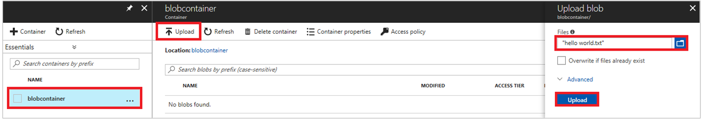

# Use a user-assigned Managed Service Identity (MSI) on a Linux VM to access Azure Storage

[!INCLUDE[preview-notice](~/includes/active-directory-msi-preview-notice-ua.md)]

This tutorial shows you how to create and use a user-assigned Managed Service Identity (MSI) from a Linux Virtual Machine, then use it to access Azure Storage. You learn how to:

> [!div class="checklist"]
> * Create a User Assigned Managed Service Identity (MSI)
> * Assign the user-assigned MSI to a Linux Virtual Machine
> * Grant the MSI access to an Azure Storage instance
> * Get an access token using the user-assigned MSI identity, and use it to access Azure Storage

## Prerequisites

[!INCLUDE [msi-core-prereqs](~/includes/active-directory-msi-core-prereqs-ua.md)]

[!INCLUDE [msi-tut-prereqs](~/includes/active-directory-msi-tut-prereqs.md)]

To run the CLI script examples in this tutorial, you have two options:

- Use [Azure Cloud Shell](~/articles/cloud-shell/overview.md) either from the Azure portal, or via the "Try It" button, located in the top right corner of each code block.
- [Install the latest version of CLI 2.0](https://docs.microsoft.com/cli/azure/install-azure-cli) (2.0.23 or later) if you prefer to use a local CLI console.

## Sign in to Azure

Sign in to the Azure portal at [https://portal.azure.com](https://portal.azure.com).

## Create a Linux virtual machine in a new resource group

First you create a new Linux VM. You can also enable MSI on an existing VM if you prefer.

1. Click the **+/Create new service** button found on the upper left-hand corner of the Azure portal.
2. Select **Compute**, and then select **Ubuntu Server 16.04 LTS**.
3. Enter the virtual machine information. For **Authentication type**, select **SSH public key** or **Password**. The created credentials allow you to log in to the VM.

    

4. Choose a **Subscription** for the virtual machine in the dropdown.
5. To select a new **Resource Group** you would like the virtual machine to be created in, choose **Create New**. When complete, click **OK**.
6. Select the size for the VM. To see more sizes, select **View all** or change the Supported disk type filter. On the settings blade, keep the defaults and click **OK**.

## Create a user-assigned MSI

1. If you are using the CLI console (instead of an Azure Cloud Shell session), start by signing in to Azure. Use an account that is associated with the Azure subscription under which you would like to create the new MSI:

    ```azurecli
    az login
    ```

2. Create a user-assigned MSI using [az identity create](/cli/azure/identity#az_identity_create). The `-g` parameter specifies the resource group where the MSI is created, and the `-n` parameter specifies its name. Be sure to replace the `<RESOURCE GROUP>` and `<MSI NAME>` parameter values with your own values:

    ```azurecli-interactive
    az identity create -g <RESOURCE GROUP> -n <MSI NAME>
    ```

    The response contains details for the user-assigned MSI created, similar to the following example. Note the `id` value for your MSI, as it will be used in the next step:

    ```json
    {
    "clientId": "73444643-8088-4d70-9532-c3a0fdc190fz",
    "clientSecretUrl": "https://control-westcentralus.identity.azure.net/subscriptions/<SUBSCRIPTON ID>/resourcegroups/<RESOURCE GROUP>/providers/Microsoft.ManagedIdentity/userAssignedIdentities/<MSI NAME>/credentials?tid=5678&oid=9012&aid=123444643-8088-4d70-9532-c3a0fdc190fz",
    "id": "/subscriptions/<SUBSCRIPTON ID>/resourcegroups/<RESOURCE GROUP>/providers/Microsoft.ManagedIdentity/userAssignedIdentities/<MSI NAME>",
    "location": "westcentralus",
    "name": "<MSI NAME>",
    "principalId": "9012",
    "resourceGroup": "<RESOURCE GROUP>",
    "tags": {},
    "tenantId": "733a8f0e-ec41-4e69-8ad8-971fc4b533bl",
    "type": "Microsoft.ManagedIdentity/userAssignedIdentities"
    }
    ```

## Assign your user-assigned MSI to your Linux VM

Unlike a system-assigned MSI, a user-assigned MSI can be used by clients on multiple Azure resources. For this tutorial, you assign it to a single VM. You can also assign it to more than one VM.

Assign the user-assigned MSI to your Linux VM using [az vm assign-identity](/cli/azure/vm#az-vm-identity-assign). Be sure to replace the `<RESOURCE GROUP>` and `<VM NAME>` parameter values with your own values. Use the `id` property returned in the previous step for the `--identities` parameter value:

```azurecli-interactive
az vm identity assign -g <RESOURCE GROUP> -n <VM NAME> --identities "/subscriptions/<SUBSCRIPTION ID>/resourcegroups/<RESOURCE GROUP>/providers/Microsoft.ManagedIdentity/userAssignedIdentities/<MSI NAME>"
```

## Create a storage account 

If you don't already have one, now create a storage account. You can also skip this step and use an existing storage account, if you prefer. 

1. Click the **+/Create new service** button found on the upper left-hand corner of the Azure portal.
2. Click **Storage**, then **Storage Account**, and a new "Create storage account" panel  displays.
3. Enter a **Name** for the storage account, which you use later.  
4. **Deployment model** and **Account kind** should be set to "Resource manager" and "General purpose", respectively. 
5. Ensure the **Subscription** and **Resource Group** match the ones you specified when you created your VM in the previous step.
6. Click **Create**.

    

## Create a blob container in the storage account

Because files require blob storage, you need to create a blob container in which to store the file. Then you upload and download a file to the blob container, in the new storage account.

1. Navigate back to your newly created storage account.
2. Click the **Containers** link in the left, under "Blob service."
3. Click **+ Container** on the top of the page, and a "New container" panel slides out.
4. Give the container a name, select an access level, then click **OK**. The name you specified is also used later in the tutorial. 

    

5. Upload a file to the newly created container by clicking on the container name, then **Upload**, then select a file, then click **Upload**.

    

## Grant your User Assigned MSI access to an Azure Storage container

By using an MSI, your code can get access tokens to authenticate to resources that support Azure AD authentication. In this tutorial, you use Azure Storage.

First you grant the MSI identity access to an Azure Storage container. In this case, you use the container created earlier. Update the values for `<SUBSCRIPTION ID>`, `<RESOURCE GROUP>`, `<STORAGE ACCOUNT NAME>`, and `<CONTAINER NAME>` as appropriate for your environment. Additionally, replace `<MSI PRINCIPALID>` with the `principalId` property returned by the `az identity create` command in [Create a user-assigned MSI](#create-a-user-assigned-msi):

```azurecli-interactive
az role assignment create --assignee <MSI PRINCIPALID> --role 'Reader' --scope "/subscriptions/<SUBSCRIPTION ID>/resourcegroups/<RESOURCE GROUP>/providers/Microsoft.Storage/storageAccounts/<STORAGE ACCOUNT NAME>/blobServices/default/containers/<CONTAINER NAME>"
```

The response includes the details for the role assignment created:

```
{
  "id": "/subscriptions/<SUBSCRIPTION ID>/resourceGroups/<RESOURCE GROUP>/providers/Microsoft.Authorization/roleAssignments/b402bd74-157f-425c-bf7d-zed3a3a581ll",
  "name": "b402bd74-157f-425c-bf7d-zed3a3a581ll",
  "properties": {
    "principalId": "f5fdfdc1-ed84-4d48-8551-999fb9dedfbl",
    "roleDefinitionId": "/subscriptions/<SUBSCRIPTION ID>/providers/Microsoft.Authorization/roleDefinitions/acdd72a7-3385-48ef-bd42-f606fba81ae7",
    "scope": "/subscriptions/<SUBSCRIPTION ID>/resourceGroups/<RESOURCE GROUP>/providers/Microsoft.storage/storageAccounts/<STORAGE ACCOUNT NAME>/blogServices/default/<CONTAINER NAME>"
  },
  "resourceGroup": "<RESOURCE GROUP>",
  "type": "Microsoft.Authorization/roleAssignments"
}
```

## Get an access token using the user-assigned MSI's identity and use it to call Azure Storage

For the remainder of the tutorial, you need to work from the VM you created earlier.

To complete these steps, you need an SSH client. If you are using Windows, you can use the SSH client in the [Windows Subsystem for Linux](https://msdn.microsoft.com/commandline/wsl/about). If you need assistance configuring your SSH client's keys, see [How to Use SSH keys with Windows on Azure](~/articles/virtual-machines/linux/ssh-from-windows.md), or [How to create and use an SSH public and private key pair for Linux VMs in Azure](~/articles/virtual-machines/linux/mac-create-ssh-keys.md).

1. In the Azure portal, navigate to **Virtual Machines**, go to your Linux virtual machine, then from the **Overview** page click **Connect** at the top. Copy the string to connect to your VM.
2. **Connect** to the VM with the SSH client of your choice. 
3. In the terminal window, using CURL, make a request to the local MSI endpoint to get an access token for Azure Storage.

   The CURL request to acquire an access token is shown in the following example. Be sure to replace `<CLIENT ID>` with the `clientId` property returned by the `az identity create` command in [Create a user-assigned MSI](#create-a-user-assigned-msi):
   
   ```bash
   curl -H Metadata:true "http://169.254.169.254/metadata/identity/oauth2/token?api-version=2018-02-01&resource=https%3A%2F%2Fstorage.azure.com/&client_id=<MSI CLIENT ID>" 
   ```

   > [!NOTE]
   > In the previous request, the value of the `resource` parameter must be an exact match for what is expected by Azure AD. When using the Azure Storage resource ID, you must include the trailing slash on the URI.
   > In the following response, the access_token element as been shortened for brevity.

   ```bash
   {"access_token":"eyJ0eXAiOiJ...",
   "refresh_token":"",
   "expires_in":"3599",
   "expires_on":"1504130527",
   "not_before":"1504126627",
   "resource":"https://storage.azure.com",
   "token_type":"Bearer"}
   ```

4. Now use the access token to access Azure Storage, for example to read the contents of the sample file which you previously uploaded to the container. Replace the values of `<STORAGE ACCOUNT>`, `<CONTAINER NAME>`, and `<FILE NAME>` with the values you specified earlier, and `<ACCESS TOKEN>` with the token returned in the previous step.

   ```bash
   curl https://<STORAGE ACCOUNT>.blob.core.windows.net/<CONTAINER NAME>/<FILE NAME> -H "x-ms-version: 2017-11-09" -H "Authorization: Bearer <ACCESS TOKEN>"
   ```

   The response contains the contents of the file:

   ```bash
   Hello world! :)
   ```

## Next steps

- For an overview of MSI, see [Managed Service Identity overview](msi-overview.md).
- To learn how to do this same tutorial using a storage SAS credential, see [Use a Linux VM Managed Service Identity to access Azure Storage via a SAS credential](msi-tutorial-linux-vm-access-storage-sas.md)
- For more information about the Azure Storage account SAS feature, see:
  - [Using shared access signatures (SAS)](~/articles/storage/common/storage-dotnet-shared-access-signature-part-1.md)
  - [Constructing a Service SAS](/rest/api/storageservices/Constructing-a-Service-SAS.md)

Use the following comments section to provide feedback and help us refine and shape our content.


