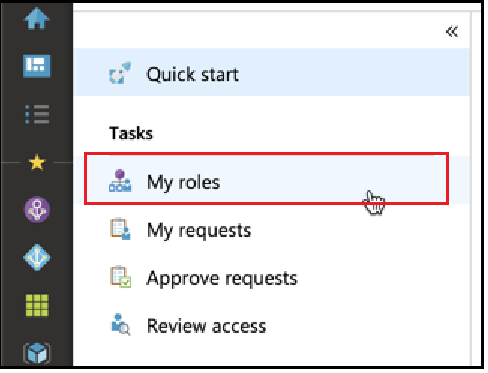
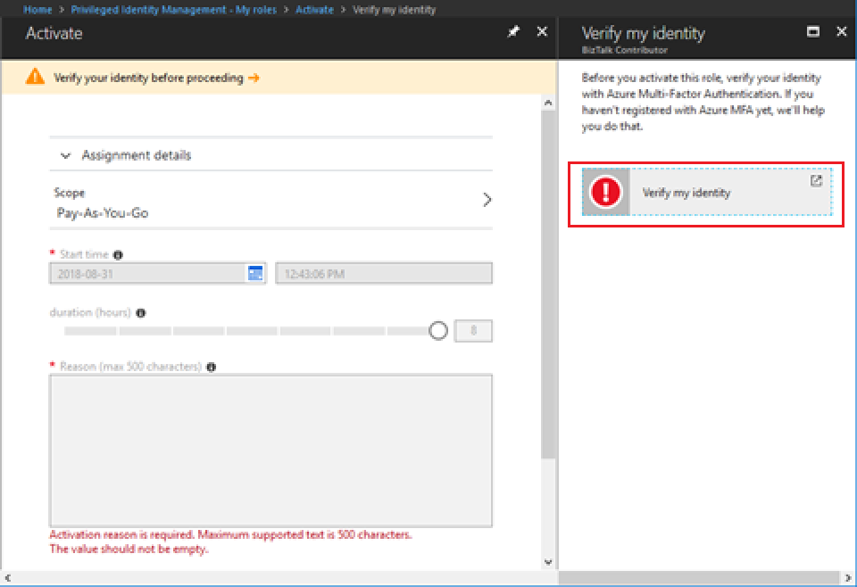
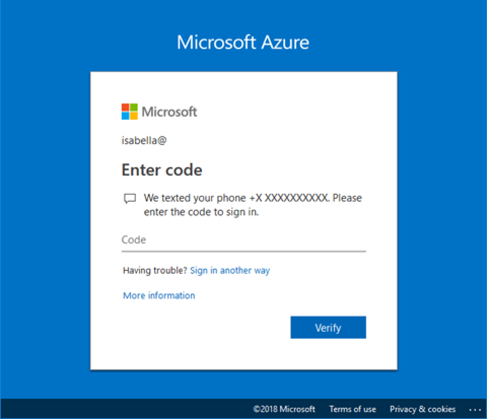

# Activate an Azure AD custom role in Privileged Identity Management

Privileged Identity Management (PIM) in Azure Active Directory (Azure AD) now supports just-in-time and time-bound assignment to custom roles created for Application Management in the Identity and Access Management administrative experience. For more information about creating custom roles to delegate application management in Azure AD, see [Custom administrator roles in Azure Active Directory (preview)](../users-groups-roles/roles-custom-overview.md).

> [!NOTE]
> Azure AD custom roles are not integrated with the built-in directory roles during preview. Once the capability is generally available, role management will take place in the built-in roles experience.

## Activate a role

When you need to activate an Azure AD custom role, request activation by selecting the My roles navigation option in PIM.

1. Sign in to [the Azure portal](https://portal.azure.com).
1. Open Azure AD [Privileged Identity Management](https://portal.azure.com/?Microsoft_AAD_IAM_enableCustomRoleManagement=true&Microsoft_AAD_IAM_enableCustomRoleAssignment=true&feature.rbacv2roles=true&feature.rbacv2=true&Microsoft_AAD_RegisteredApps=demo#blade/Microsoft_Azure_PIMCommon/CommonMenuBlade/quickStart).
1. Select **My roles**.

    

1. Select **Azure AD custom roles** to see a list of your eligible Azure AD custom role assignments.

   

1. On the **Azure AD custom roles (Preview)** page, find the assignment you need.
1. Select **Activate** to open the Activate page.
1. If your role requires multi-factor authentication, select **Verify your identity before proceeding**. You only have to authenticate once per session.

    

1. Select **Verify my identity** and follow the instructions to provide additional security verification.

    

1. To specify a custom application scope, select **Scope** to open the filter pane.
You should request access to a role at the minimum scope needed. If your assignment is at an application scope, you can activate only at that scope.
assign-scope
    

1. If necessary, specify a custom activation start time. When used, the role member is activated at the specified time.
1. In the **Reason** box, enter the reason for the activation request. These can be made required or not in the role setting.
1. Select **Activate**.

If the role does not require approval, it is activated according to your settings and is added to the list of active roles. If you want to use the activated role, begin with the steps in [Assign an Azure AD custom role in Privileged Identity Management](azure-ad-custom-roles-assign.md).

If the role requires approval to activate, a notification will appear in the upper right corner of your browser informing you the request is pending approval.

## Next steps

- [License requirements to use PIM](subscription-requirements.md)
- [Role definitions in Azure AD](../users-groups-roles/directory-assign-admin-roles.md)
- [Deploy PIM](pim-deployment-plan.md)
