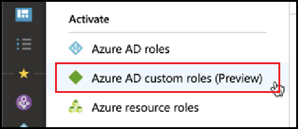
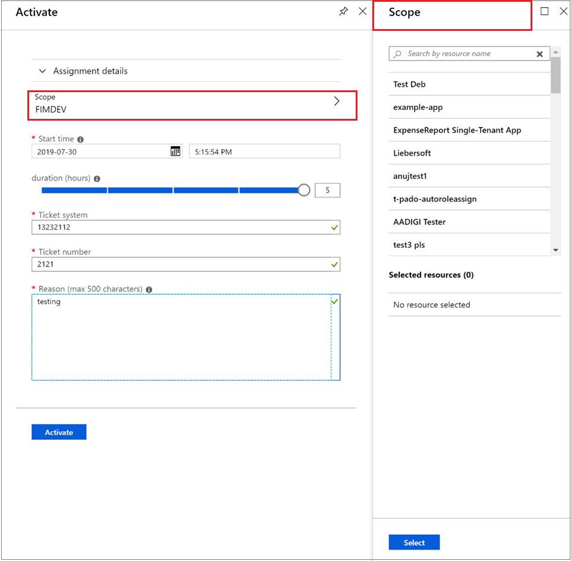

# Activate an Azure AD custom role in Privileged Identity Management

Privileged Identity Management in Azure Active Directory (Azure AD) now supports just-in-time and time-bound assignment to custom roles created for Application Management in the Identity and Access Management administrative experience. For more information about creating custom roles to delegate application management in Azure AD, see [Custom administrator roles in Azure Active Directory (preview)](../users-groups-roles/roles-custom-overview.md).

> [!NOTE]
> Azure AD custom roles are not integrated with the built-in directory roles during preview. Once the capability is generally available, role management will take place in the built-in roles experience. If you see the following banner, these roles should be managed [in the built-in roles experience](pim-how-to-activate-role.md) and this article does not apply:
>
> 

## Activate a role

When you need to activate an Azure AD custom role, request activation by selecting the My roles navigation option in Privileged Identity Management.

1. Sign in to [the Azure portal](https://portal.azure.com).
1. Open Azure AD [Privileged Identity Management](https://portal.azure.com/?Microsoft_AAD_IAM_enableCustomRoleManagement=true&Microsoft_AAD_IAM_enableCustomRoleAssignment=true&feature.rbacv2roles=true&feature.rbacv2=true&Microsoft_AAD_RegisteredApps=demo#blade/Microsoft_Azure_PIMCommon/CommonMenuBlade/quickStart).

1. Select **Azure AD custom roles** to see a list of your eligible Azure AD custom role assignments.

   

> [!Note] 
>  Before assigning a role, you must create/configure a role. For further information regarding configuring AAD Custom Roles see [here] (https://docs.microsoft.com/azure/active-directory/privileged-identity-management/azure-ad-custom-roles-configure)

1. On the **Azure AD custom roles (Preview)** page, find the assignment you need.
1. Select **Activate your role** to open the **Activate** page.
1. If your role requires multi-factor authentication, select **Verify your identity before proceeding**. You are required to authenticate only once per session.
1. Select **Verify my identity** and follow the instructions to provide any additional security verification.
1. To specify a custom application scope, select **Scope** to open the filter pane. You should request access to a role at the minimum scope needed. If your assignment is at an application scope, you can activate only at that scope.

   

1. If needed, specify a custom activation start time. When used, the role member is activated at the specified time.
1. In the **Reason** box, enter the reason for the activation request. These can be made required or not in the role setting.
1. Select **Activate**.

If the role doesn't require approval, it's activated according to your settings and is added to the list of active roles. If you want to use the activated role, start with the steps in [Assign an Azure AD custom role in Privileged Identity Management](azure-ad-custom-roles-assign.md).

If the role requires approval to activate, you will receive an Azure notification informing you that the request is pending approval.

## Next steps

- [Assign an Azure AD custom role](azure-ad-custom-roles-assign.md)
- [Remove or update an Azure AD custom role assignment](azure-ad-custom-roles-update-remove.md)
- [Configure an Azure AD custom role assignment](azure-ad-custom-roles-configure.md)
- [Role definitions in Azure AD](../users-groups-roles/directory-assign-admin-roles.md)
