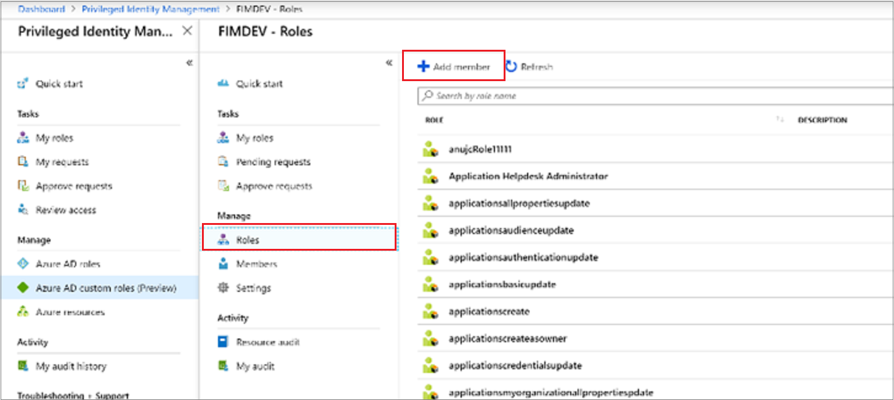
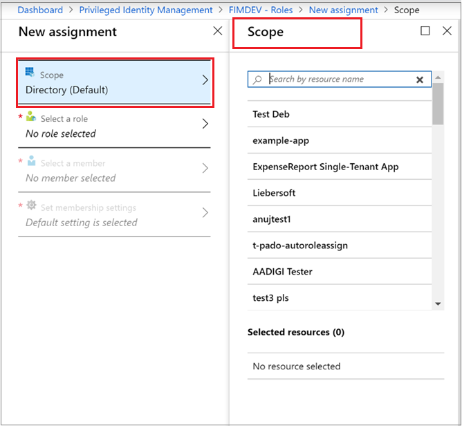
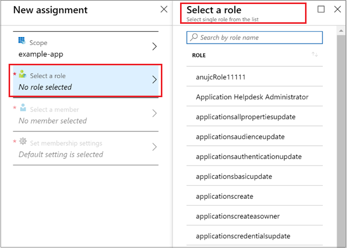
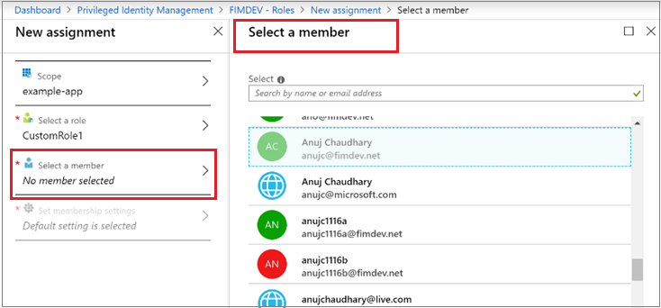
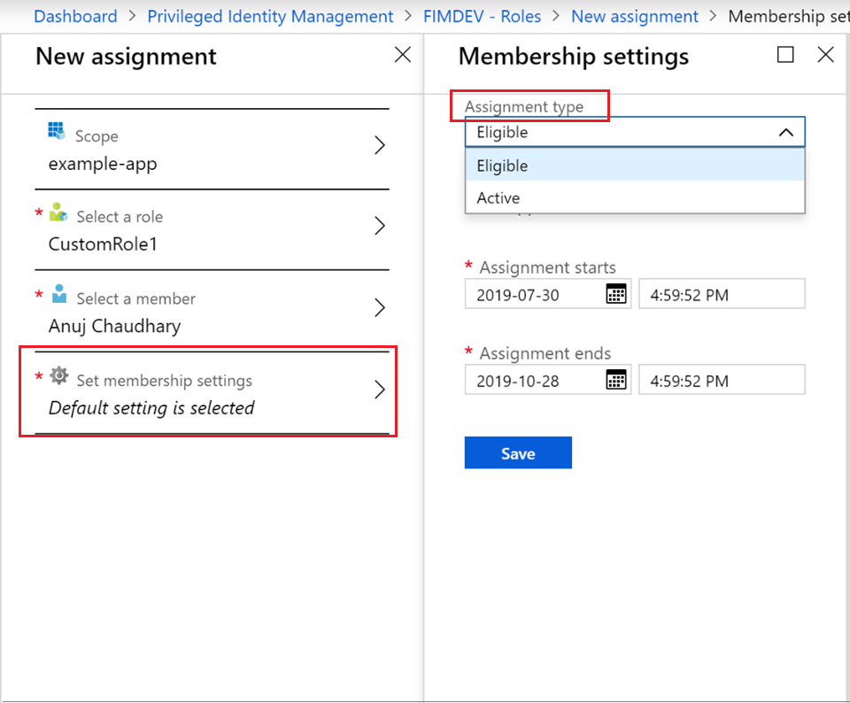
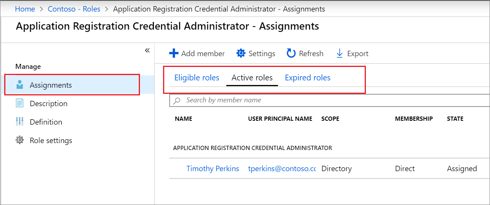

# Assign an Azure AD custom role in Privileged Identity Management

This article tells you how to use Privileged Identity Management (PIM) to create just-in-time and time-bound assignment to custom roles created for managing applications in the Azure Active Directory (Azure AD) administrative experience.

- For more information about creating custom roles to delegate application management in Azure AD, see [Custom administrator roles in Azure Active Directory (preview)](../users-groups-roles/roles-custom-overview.md).
- If you haven't used Privileged Identity Management yet, get more information at [Start using Privileged Identity Management](pim-getting-started.md).
- For information about how to grant another administrator access to manage Privileged Identity Management, see [Grant access to other administrators to manage Privileged Identity Management](pim-how-to-give-access-to-pim.md).

> [!NOTE]
> Azure AD custom roles are not integrated with the built-in directory roles during preview. Once the capability is generally available, role management will take place in the built-in roles experience. If you see the following banner, these roles should be managed [in the built-in roles experience](pim-how-to-activate-role.md) and this article does not apply:
>
> 

## Assign a role

Privileged Identity Management can manage custom roles you can create in Azure Active Directory (Azure AD) application management.  The following steps make an eligible assignment to a custom directory role.

1. Sign in to [Privileged Identity Management](https://portal.azure.com/?Microsoft_AAD_IAM_enableCustomRoleManagement=true&Microsoft_AAD_IAM_enableCustomRoleAssignment=true&feature.rbacv2roles=true&feature.rbacv2=true&Microsoft_AAD_RegisteredApps=demo#blade/Microsoft_Azure_PIMCommon/CommonMenuBlade/quickStart) in the Azure portal with a user account that is assigned to the Privileged role administrator role.
1. Select **Azure AD custom roles (Preview)**.

    

1. Select **Roles** to see a list of custom roles for Azure AD applications.

    

1. Select **Add member** to open the assignment page.
1. To restrict the scope of the role assignment to a single application, select **Scope** to specify an application scope.

    

1. Select **Select a role** to open the **Select a role** list.

    

1. Select a role you want to assign and then click **Select**. The **Select a member** list opens.

    

1. Select a user you want to assign to the role and then click **Select**. The **Membership settings** list opens.

    

1. On the **Membership settings** page, select **Eligible** or **Active**:

    - **Eligible** assignments require the user assigned to the role to perform an action before they can use the role. Actions might include passing a multi-factor authentication check, providing a business justification, or requesting approval from designated approvers.
    - **Active** assignments don't require the assigned user to perform any action to use the role. Active users have the privileges assigned to the role at all times.

1. If the **Permanent** check box is present and available (depending on role settings), you can specify whether the assignment is permanent. Select the check box to to make the assignment permanently eligible or permanently assigned. Clear the check box to specify an assignment duration.
1. To create the new role assignment, click **Save** and then **Add**. A notification of the assignment process status is displayed.

To verify the role assignment, in an open role, select **Assignments** > **Assign** and verify that your role assignment is properly identified as eligible or active.

 

## Next steps

- [Activate an Azure AD custom role](azure-ad-custom-roles-assign.md)
- [Remove or update an Azure AD custom role assignment](azure-ad-custom-roles-update-remove.md)
- [Configure an Azure AD custom role assignment](azure-ad-custom-roles-configure.md)
- [Role definitions in Azure AD](../users-groups-roles/directory-assign-admin-roles.md)
