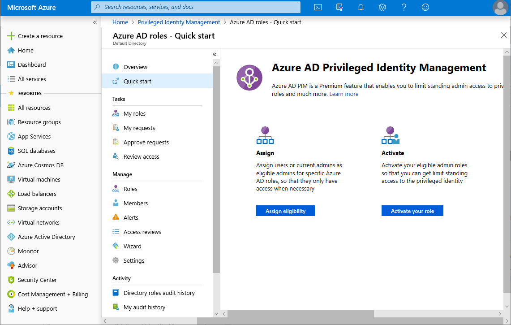
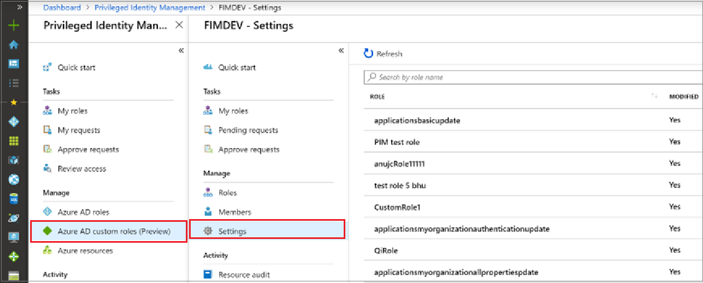
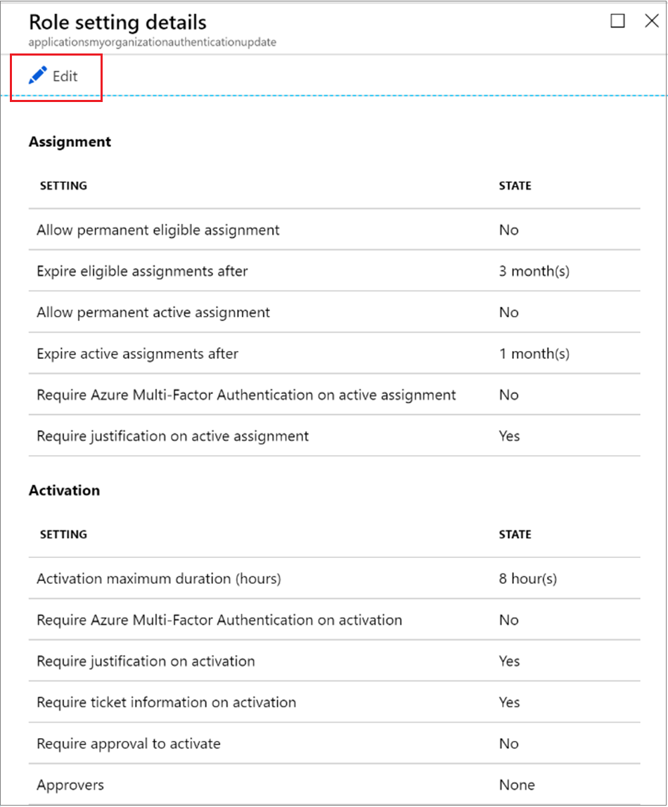
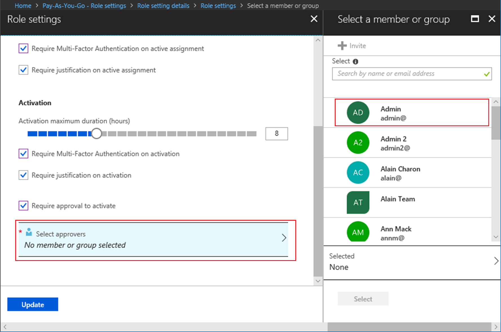

# Configure Azure AD custom roles in Privileged Identity Management

A privileged role administrator can change the role settings that apply to a user when they activate their assignment to a custom role and for other application administrators that are assigning custom roles.

> [!NOTE]
> Azure AD custom roles are not integrated with the built-in directory roles during preview. Once the capability is generally available, role management will take place in the built-in roles experience. If you see the following banner, these roles should be managed [in the built-in roles experience](pim-how-to-activate-role.md) and this article does not apply:
>
> 

## Open role settings

Follow these steps to open the settings for an Azure AD role.

1. Sign in to [Privileged Identity Management](https://portal.azure.com/?Microsoft_AAD_IAM_enableCustomRoleManagement=true&Microsoft_AAD_IAM_enableCustomRoleAssignment=true&feature.rbacv2roles=true&feature.rbacv2=true&Microsoft_AAD_RegisteredApps=demo#blade/Microsoft_Azure_PIMCommon/CommonMenuBlade/quickStart) in the Azure portal with a user account that is assigned to the Privileged role administrator role.
1. Select **Azure AD custom roles (Preview)**.

    

1. Select **Setting** to open the **Settings** page. Select the role for the settings you want to configure.
1. Select **Edit** to open the **Role settings** page.

    

## Role settings

There are several settings you can configure.

### Assignment duration

You can choose from two assignment duration options for each assignment type (eligible or active) when you configure settings for a role. These options become the default maximum duration when a member is assigned to the role in Privileged Identity Management.

You can choose one of these *eligible* assignment duration options.

- **Allow permanent eligible assignment**: Administrators can assign permanent eligible membership.
- **Expire eligible assignment after**: Administrators can require that all eligible assignments have a specified start and end date.

Also, you can choose one of these *active* assignment duration options:

- **Allow permanent active assignment**: Administrators can assign permanent active membership.
- **Expire active assignment after**: Administrators can require that all active assignments have a specified start and end date.

### Require Azure Multi-Factor Authentication

Privileged Identity Management provides optional enforcement of Azure Multi-Factor Authentication for two distinct scenarios.

- **Require Multi-Factor Authentication on active assignment**

  If you only want to assign a member to a role for a short duration (one day, for example), it might be too slow to require the assigned members to request activation. In this scenario, Privileged Identity Management can't enforce multi-factor authentication when the user activates their role assignment, because they are already active in the role from the moment they are assigned. To ensure that the administrator fulfilling the assignment is who they say they are, select the **Require Multi-Factor Authentication on active assignment** box.

- **Require Multi-Factor Authentication on activation**

  You can require eligible users assigned to a role to enroll in Azure Multi-Factor Authentication before they can activate. This process ensures that the user who is requesting activation is who they say they are with reasonable certainty. Enforcing this option protects critical roles in situations when the user account might have been compromised. To require an eligible member to run Azure Multi-Factor Authentication before activation, select the **Require Multi-Factor Authentication on activation** box.

For more information, see [Multi-factor authentication and Privileged Identity Management](pim-how-to-require-mfa.md).

### Activation maximum duration

Use the **Activation maximum duration** slider to set the maximum time, in hours, that a role stays active before it expires. This value can be from, 1 and 24 hours.

### Require justification

You can require that members enter a justification on active assignment or when they activate. To require justification, select the **Require justification on active assignment** check box or the **Require justification on activation** box.

### Require approval to activate

If you want to require approval to activate a role, follow these steps.

1. Select the **Require approval to activate** check box.
1. Select **Select approvers** to open the **Select a member or group** list.

    

1. Select at least one member or group and then click **Select**. You must select at least one approver. There are no default approvers. Your selections will appear in the list of selected approvers.
1. Once you have specified the role settings, select **Update** to save your changes.

## Next steps

- [Activate an Azure AD custom role](azure-ad-custom-roles-activate.md)
- [Assign an Azure AD custom role](azure-ad-custom-roles-assign.md)
- [Remove or update an Azure AD custom role assignment](azure-ad-custom-roles-update-remove.md)
- [Role definitions in Azure AD](../users-groups-roles/directory-assign-admin-roles.md)
