---
title: Azure Privileged Identity Management Approval workflows | Microsoft Docs
description: Learn about approval workflows in Privileged Identity Management (PIM)
services: active-directory
documentationcenter: ''
author: barclayn
manager: mbaldwin
editor: ''

ms.service: active-directory
ms.devlang: na
ms.topic: article
ms.tgt_pltfrm: na
ms.workload: identity
ms.date: 04/28/2017
ms.author: barclayn
ms.custom: pim
---

# Approvals (Preview)

## Overview

With Approvals for Privileged Identity Management, you can configure roles to require approval for activation, and choose one or multiple users or groups as delegated approvers. Keep reading to learn how to configure roles and select approvers.

>[!NOTE]
Please keep in mind this feature is still in development, and you may encounter
bugs. The functionality, including text and naming conventions are subject to
change, and should not be considered final.

## Key Terminology

*Eligible Role User* – An eligible role user is a user within your organization
that’s been assigned to an Azure AD role as eligible (role requires activation).

*Delegated Approver* – A delegated approver is one or multiple individuals or
groups within your Azure AD who are responsible for approving requests for role
activation.

## Scenarios

The private preview supports the following scenarios:

**As a Privileged Role Administrator (PRA) you can:**

-   [enable approval for specific roles](#enable-approval-for-specific-roles)

-   [specify approver users and/or groups to approve requests](#specify-approver-users-and/or-groups-to-approve-requests)

-   [view request and approval history for all privileged roles](#view-request-and-approval-history-for-all-privileged-roles)

**As a designated approver, you can:**

-   [view pending approvals (requests)](#view-pending-approvals-requests)

-   [approve or reject requests for role elevation (single and/or bulk)](#approve-or-reject-requests-for-role-elevation-single-and/or-bulk)

-   [provide justification for my approval/rejection](#provide-justification-for-my-approval/rejection) 

**As an Eligible Role User you can:**

-   [request activation of a role that requires approval](#request-activation-of-a-role-that-requires-approval)

-   [view the status of your request to activate](#view-the-status-of-your-request-to-activate)

-   [complete your task in Azure AD if activation was approved](#complete-your-task-in-azure-ad-if-activation-was-approved)

### Navigation

We've updated the navigation to support approvals

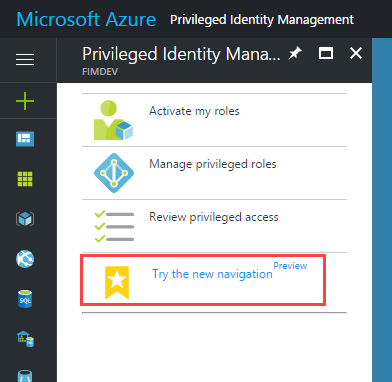

The default landing page provides convenient access to information about PIM and the new approvals documentation.

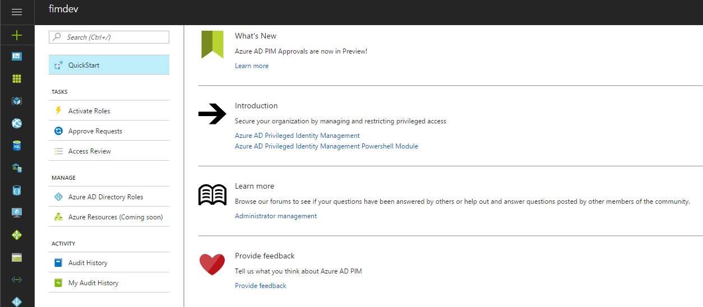

We’ve also added a new section for all users of PIM, ‘My Audit History’. Here you can find all the information relevant to your identity. This includes all your pending and completed requests, any decisions you’ve made about the requests you resolve, and all your past role activations in one convenient location.

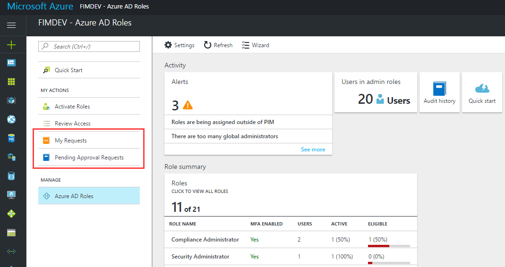

### Enable approval for specific roles

To enable approval for a specific role, first select Directory Roles from the left navigation.

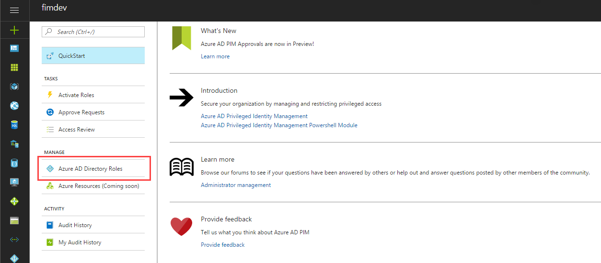

Find and select settings in the Directory Roles left navigation

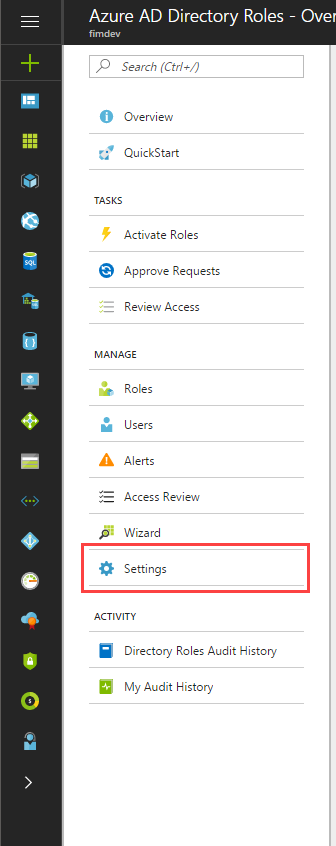

Select privileged Roles:

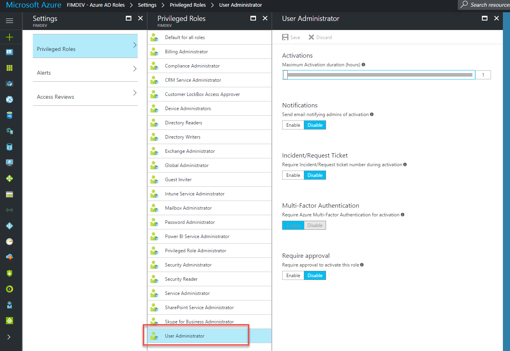

Select “Enable” in the Require approval section:

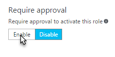

Once enabled, the blade will expand to show the following details:

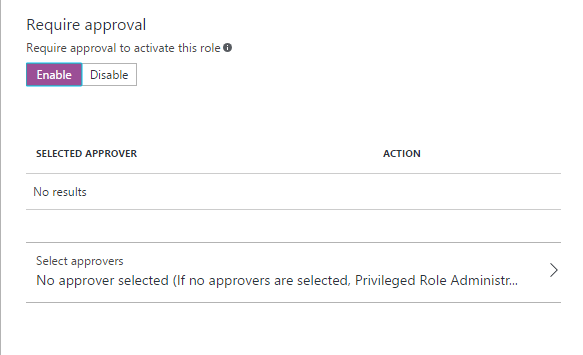

>[!NOTE]
If you DO NOT specify any approvers, the PRA(s) become the default
approver(s). PRA(s) would be required to approve ALL activation requests for
this role.

### Specify approver users and/or groups to approve requests

To delegate approval, click the option to “Select approvers”:

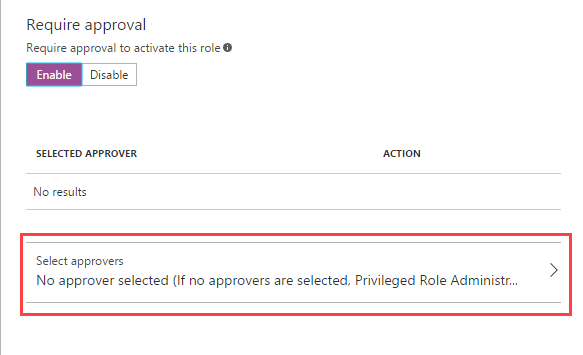

When the Select approvers blade loads, you may search for a specific user or
group using the search bar at the top, or selecting from the pre-populated list,
then click “Select” when finished:

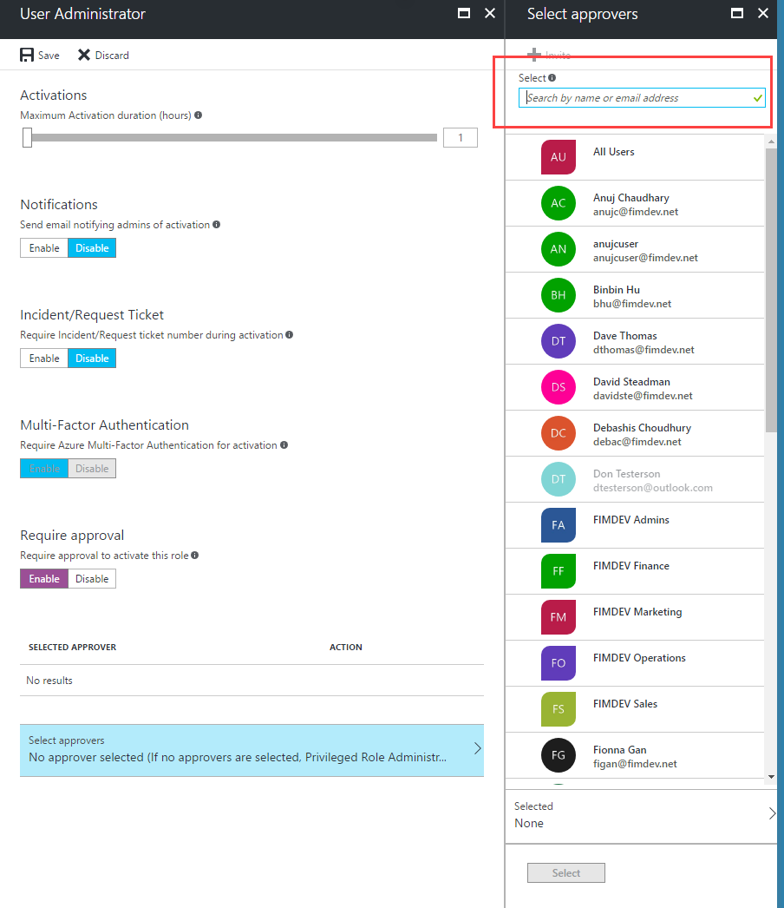

Note: You may select multiple users or groups at a time.

Your selection will appear in the list of selected approvers as seen below:

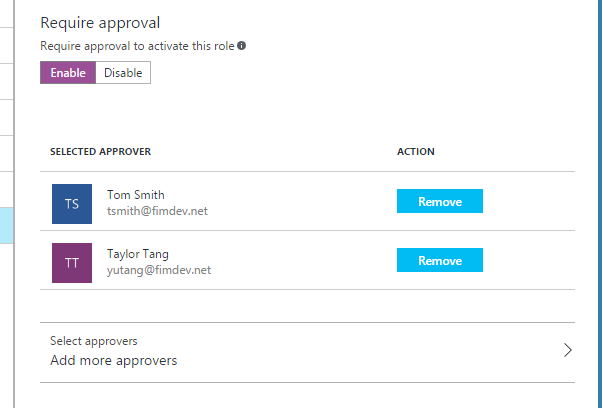

To remove an approver, simply click the Remove button next to their name.

To add additional approvers, repeat the process.

## View request and approval history for all privileged roles

To view request and approval history for all privileged roles, select Audit History from the dashboard:

>[!NOTE]
You can sort the data by Action, and look for “Activation Approved”

### View pending approvals (requests)

As a delegated approver, you’ll receive email notifications when a request is
pending your approval. To view these requests in the PIM portal, from the
dashboard (in the new navigation) select the “Pending Approval Requests” tab in
the left navigation bar.

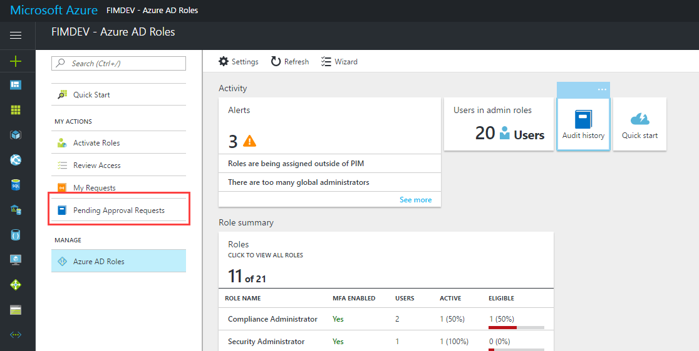

From there, you’ll see a list of requests pending approval:

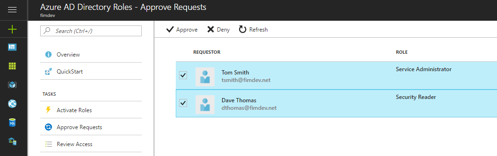

### Approve or reject requests for role elevation (single and/or bulk)

Select the requests you wish to approve or deny, and click the button in the
action bar that corresponds with your decision:

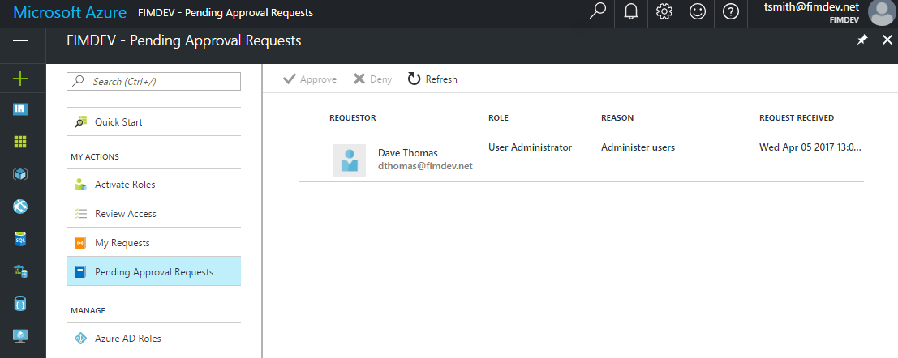

### Provide justification for my approval/rejection

This will open a new blade to approve or deny multiple requests at once. Enter a
justification for your decision, and click approve (or deny) at the bottom or
the blade:

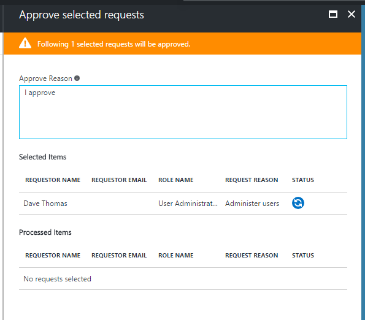

When the request process is complete, the status symbol will reflect the
decision you made (in this example, the decision is approve):

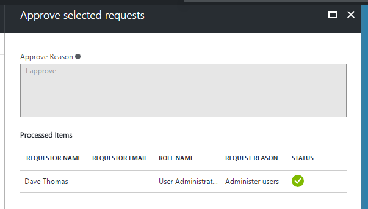

### Request activation of a role that requires approval

Requesting activation of a role that requires approval may be initiated from
either the old PIM navigation, or the new navigation, as the process for role
activation remains the same. Simply select a role from the list of roles to
activate:

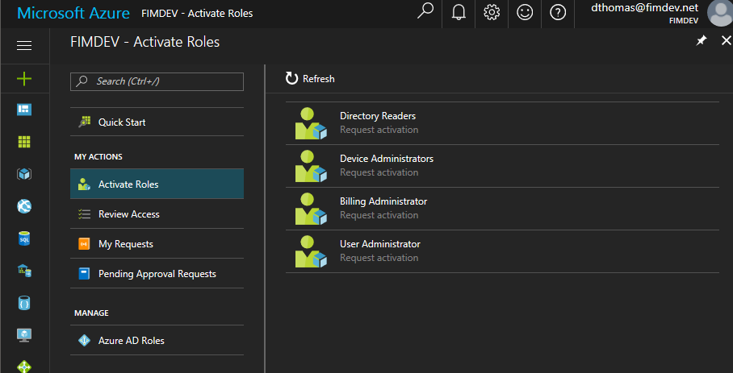

If a privileged role requires Multi-Factor Authentication, you’ll be prompted to
complete that task first:

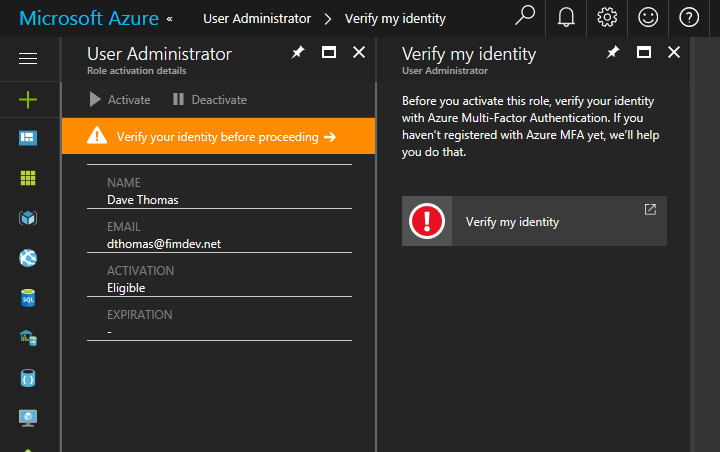

Once complete, click Activate and provide a justification (if required):

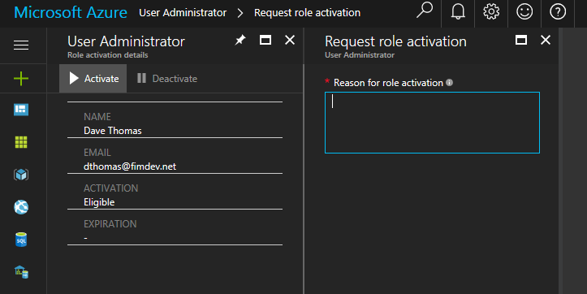

The requestor will see a notification that the request is pending approval:

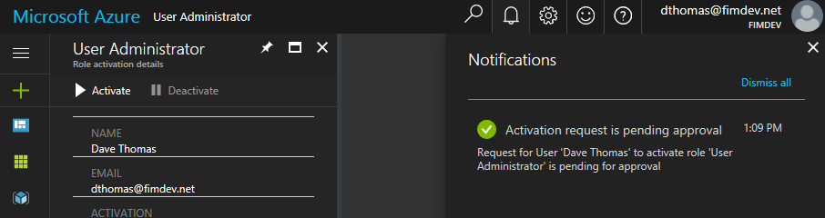

### View the status of your request to activate

Viewing the status of a pending request to activate must be accessed from the
new navigation. From the left navigation bar, select the “My Requests” tab:

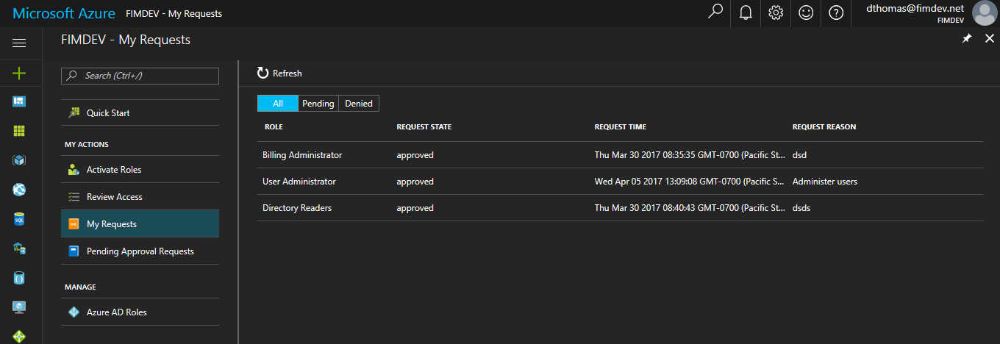

The request state defaults to “Pending”, but you can toggle to see all or denied
requests.

### Complete your task in Azure AD if activation was approved

Once the request is approved, the role is active and you may proceed with any
work that requires this role.

## Next steps

Your feedback is valuable to us. Please feel free to share comments or feedback with us here!
