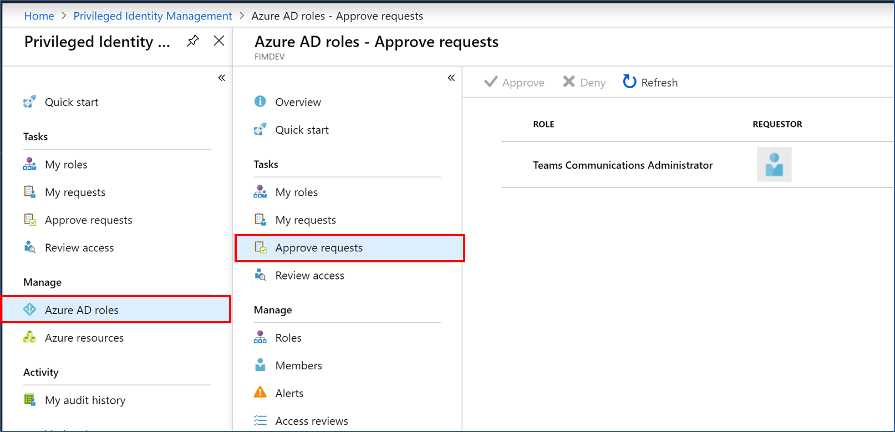
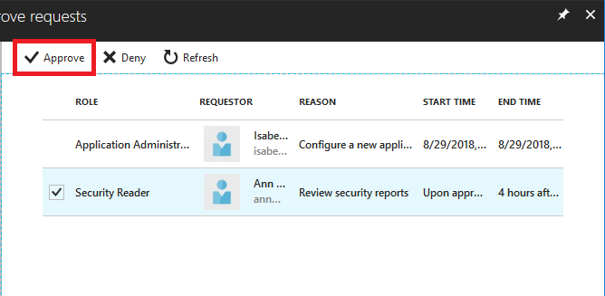
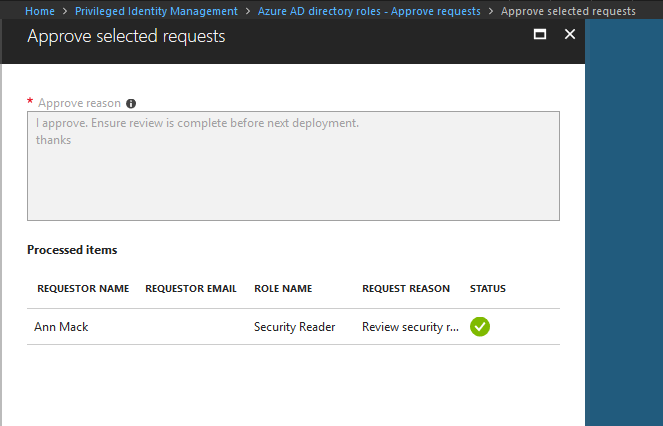
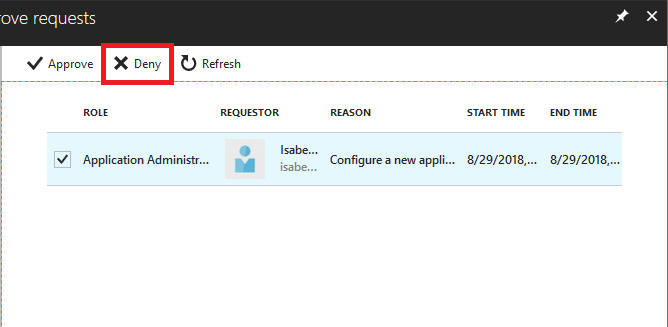
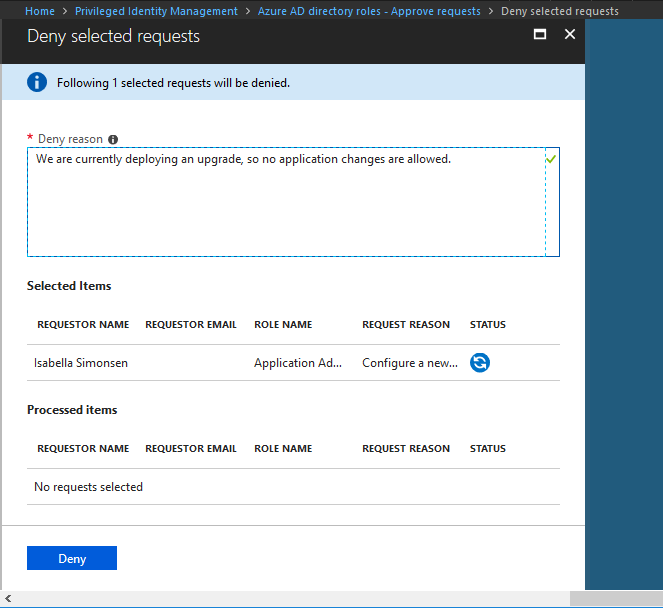

# Approve or deny requests for Azure AD roles in PIM

With Azure Active Directory (Azure AD) Privileged Identity Management (PIM), you can configure roles to require approval for activation, and choose one or multiple users or groups as delegated approvers. Delegated approvers have 24 hours to approve requests. If a request is not approved within 24 hours, then the eligible user must re-submit a new request. The 24 hour approval time window is not configurable.

Follow the steps in this article to approve or deny requests for Azure AD roles.

## View pending requests

As a delegated approver, you'll receive an email notification when an Azure AD role request is pending your approval. You can view these pending requests in PIM.

1. Sign in to the [Azure portal](https://portal.azure.com/).

1. Open **Azure AD Privileged Identity Management**.

1. Click **Azure AD roles**.

1. Click **Approve requests**.

    

    You'll see a list of requests pending your approval.

## Approve requests

1. Select the requests you want to approve and then click **Approve** to open the Approve selected requests pane.

    

1. In the **Approve reason** box, type a reason.

    

1. Click **Approve**.

    The Status symbol will be updated with your approval.

    

## Deny requests

1. Select the requests you want to deny and then click **Deny** to open the Deny selected requests pane.

    

1. In the **Deny reason** box, type a reason.

    

1. Click **Deny**.

    The Status symbol will be updated with your denial.

## Next steps

- [Email notifications in PIM](pim-email-notifications.md)
- [Approve or deny requests for Azure resource roles in PIM](pim-resource-roles-approval-workflow.md)
