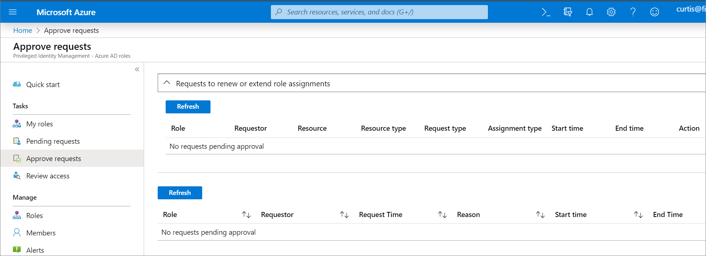

# Approve or deny requests for Azure AD roles in Privileged Identity Management

With Azure Active Directory (Azure AD) Privileged Identity Management (PIM), you can configure roles to require approval for activation, and choose one or multiple users or groups as delegated approvers. Delegated approvers have 24 hours to approve requests. If a request is not approved within 24 hours, then the eligible user must re-submit a new request. The 24 hour approval time window is not configurable.

## Determine your version of PIM

Beginning in November 2019, the Azure AD roles portion of Privileged Identity Management is being updated to a new version that matches the experiences for Azure roles. This creates additional features as well as [changes to the existing API](azure-ad-roles-features.md#api-changes). While the new version is being rolled out, which procedures that you follow in this article depend on version of Privileged Identity Management you currently have. Follow the steps in this section to determine which version of Privileged Identity Management you have. After you know your version of Privileged Identity Management, you can select the procedures in this article that match that version.

1. Sign in to the [Azure portal](https://portal.azure.com/) with a user who is in the [Privileged role administrator](../users-groups-roles/directory-assign-admin-roles.md#privileged-role-administrator) role.
1. Open **Azure AD Privileged Identity Management**. If you have a banner on the top of the overview page, follow the instructions in the **New version** tab of this article. Otherwise, follow the instructions in the **Previous version** tab.

    

Follow the steps in this article to approve or deny requests for Azure AD roles.

# [New version](#tab/new)

## View pending requests

As a delegated approver, you'll receive an email notification when an Azure AD role request is pending your approval. You can view these pending requests in Privileged Identity Management.

1. Sign in to the [Azure portal](https://portal.azure.com/).

1. Open **Azure AD Privileged Identity Management**.

1. Select **Approve requests**.

    

    In the **Requests for role activations** section, you'll see a list of requests pending your approval.

## Approve requests

1. Find and select the request that you want to approve. An approve or deny page appears.

    

1. In the **Justification** box, enter the business justification.

1. Select **Approve**. You will receive an Azure notification of your approval.

    )

## Deny requests

1. Find and select the request that you want to deny. An approve or deny page appears.

    

1. In the **Justification** box, enter the business justification.

1. Select **Deny**. A notification appears with your denial.

## Workflow notifications

Here's some information about workflow notifications:

- Approvers are notified by email when a request for a role is pending their review. Email notifications include a direct link to the request, where the approver can approve or deny.
- Requests are resolved by the first approver who approves or denies.
- When an approver responds to the request, all approvers are notified of the action.
- Global admins and Privileged role admins are notified when an approved user becomes active in their role.

>[!NOTE]
>A Global admin or Privileged role admin who believes that an approved user should not be active can remove the active role assignment in Privileged Identity Management. Although administrators are not notified of pending requests unless they are an approver, they can view and cancel any pending requests for all users by viewing pending requests in Privileged Identity Management.

# [Previous version](#tab/previous)

## View pending requests

As a delegated approver, you'll receive an email notification when an Azure AD role request is pending your approval. You can view these pending requests in Privileged Identity Management.

1. Sign in to the [Azure portal](https://portal.azure.com/).

1. Open **Azure AD Privileged Identity Management**.

1. Click **Azure AD roles**.

1. Click **Approve requests**.

    

    You'll see a list of requests pending your approval.

## Approve requests

1. Select the requests you want to approve and then click **Approve** to open the Approve selected requests pane.

    

1. In the **Approve reason** box, type a reason.

    

1. Click **Approve**.

    The Status symbol will be updated with your approval.

    

## Deny requests

1. Select the requests you want to deny and then click **Deny** to open the Deny selected requests pane.

    

1. In the **Deny reason** box, type a reason.

    

1. Select **Deny**.

    The Status symbol will be updated with your denial.

---

## Next steps

- [Email notifications in Privileged Identity Management](pim-email-notifications.md)
- [Approve or deny requests for Azure resource roles in Privileged Identity Management](pim-resource-roles-approval-workflow.md)
