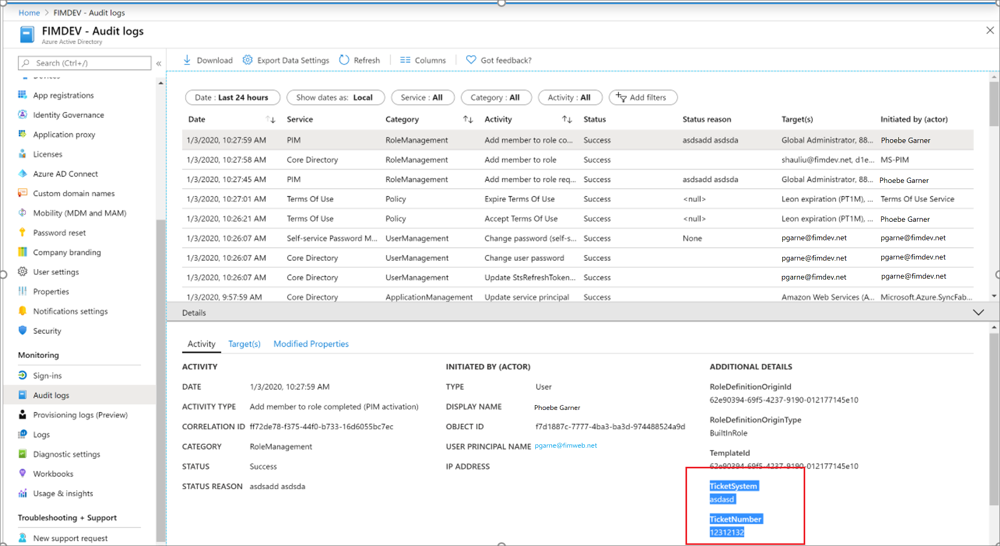
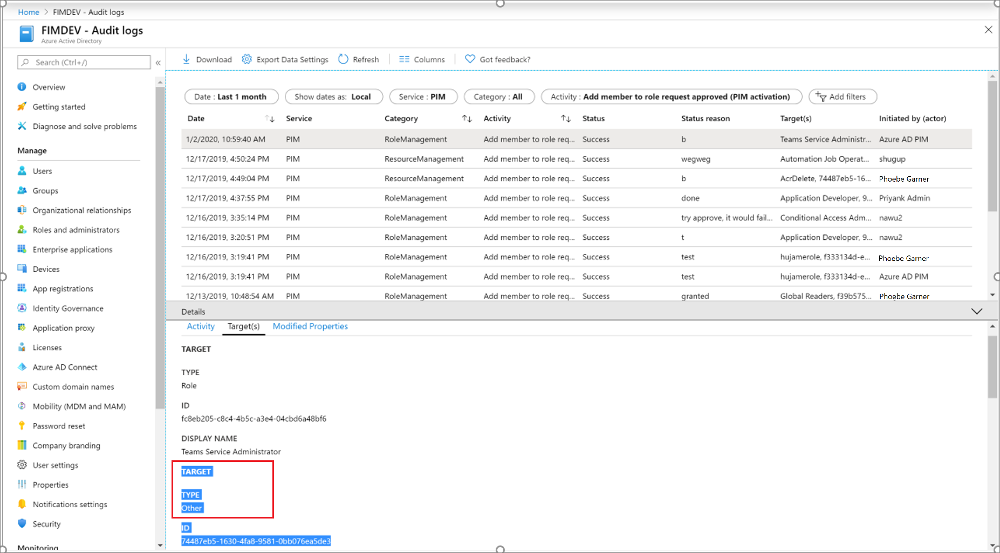

# View activity and audit history for Azure resource roles in Privileged Identity Management

With Azure Active Directory (Azure AD) Privileged Identity Management (PIM), you can view activity, activations, and audit history for Azure resources roles within your organization. This includes subscriptions, resource groups, and even virtual machines. Any resource within the Azure portal that leverages the Azure role-based access control functionality can take advantage of the security and lifecycle management capabilities in Privileged Identity Management.

> [!NOTE]
> If your organization has outsourced management functions to a service provider who uses [Azure delegated resource management](../../lighthouse/concepts/azure-delegated-resource-management.md), role assignments authorized by that service provider won't be shown here.

## View activity and activations

To see what actions a specific user took in various resources, you can view the Azure resource activity that's associated with a given activation period.

1. Open **Azure AD Privileged Identity Management**.

1. Select **Azure resources**.

1. Select the resource you want to view activity and activations for.

1. Select **Roles** or **Members**.

1. Select a user.

    You see an summary of the user's actions in Azure resources by date. It also shows the recent role activations over that same time period.

    

1. Select a specific role activation to see details and corresponding Azure resource activity that occurred while that user was active.

    

## Export role assignments with children

You may have a compliance requirement where you must provide a complete list of role assignments to auditors. Privileged Identity Management enables you to query role assignments at a specific resource, which includes role assignments for all child resources. Previously, it was difficult for administrators to get a complete list of role assignments for a subscription and they had to export role assignments for each specific resource. Using Privileged Identity Management, you can query for all active and eligible role assignments in a subscription including role assignments for all resource groups and resources.

1. Open **Azure AD Privileged Identity Management**.

1. Select **Azure resources**.

1. Select the resource you want to export role assignments for, such as a subscription.

1. Select **Members**.

1. Select **Export** to open the Export membership pane.

    

1. Select **Export all members** to export all role assignments in a CSV file.

    

## View resource audit history

Resource audit gives you a view of all role activity for a resource.

1. Open **Azure AD Privileged Identity Management**.

1. Select **Azure resources**.

1. Select the resource you want to view audit history for.

1. Select **Resource audit**.

1. Filter the history using a predefined date or custom range.

    

1. For **Audit type**, select **Activate (Assigned + Activated)**.

    
    

1. Under **Action**, click **(activity)** for a user to see that user's activity detail in Azure resources.

    

## View my audit

My audit enables you to view your personal role activity.

1. Open **Azure AD Privileged Identity Management**.

1. Select **Azure resources**.

1. Select the resource you want to view audit history for.

1. Select **My audit**.

1. Filter the history using a predefined date or custom range.

    

> [!NOTE]
> Access to audit history requires either a Global Administrator or Privileged Role Administrator role.

## Get reason, approver, and ticket number for approval events

1. Sign in to the [Azure portal](https://aad.portal.azure.com) with Privileged Role administrator role permissions, and open Azure AD.
1. Select **Audit logs**.
1. Use the **Service** filter to display only audit events for the Privileged identity Management service. On the **Audit logs** page, you can:

    - See the reason for an audit event in the **Status reason** column.
    - See the approver in the **Initiated by (actor)** column for the "add member to role request approved" event.

    

1. Select an audit log event to see the ticket number on the **Activity** tab of the **Details** pane.
  
    ]

1. You can view the requester (person activating the role) on the **Targets** tab of the **Details** pane for an audit event. There are three target types for Azure resource roles:

    - The role (**Type** = Role)
    - The requester (**Type** = Other)
    - The approver (**Type** = User)

    

Typically, the log event immediately above the approval event is an event for "Add member to role completed" where the **Initiated by (actor)** is the requester. In most cases, you won't need to find the requester in the approval request from an auditing perspective.

## Next steps

- [Assign Azure resource roles in Privileged Identity Management](pim-resource-roles-assign-roles.md)
- [Approve or deny requests for Azure resource roles in Privileged Identity Management](pim-resource-roles-approval-workflow.md)
- [View audit history for Azure AD roles in Privileged Identity Management](pim-how-to-use-audit-log.md)
