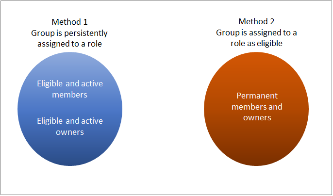

# What's the difference between Privileged Access groups and role-assignable groups?

Privileged Identity Management (PIM) supports the ability to enable privileged access on role-assignable groups. But because an available role-assignable group is a prerequisite for creating a privileged access group, this article explains the differences and how to take advantage of them.

## What are Azure AD role-assignable groups?

Azure AD lets you assign a cloud Azure AD security group to an Azure AD role. Global Administrators and Privileged Role Administrators must create a new security group and make the group role-assignable at creation time. Only users in the Global Administrator, Privileged Role Administrator, or the group's Owner roles can change the membership of the group. Also, no other users can reset the password of the users who are members of the group. This feature helps prevent admins from elevating to a higher privileged role without going through a request and approval procedure.

## What are Privileged Access groups?

Privileged Access groups enable users to elevate to the owner or member role of an Azure AD security group. This feature allows you to set up just-in-time workflows for not only Azure AD and Azure roles in batches, and also enables just-in-time scenarios for other use cases like Azure SQL, Azure Key Vault, Intune, or other application roles. For more information, see [Management capabilities for Privileged Access groups](groups-features.md).

>[!Note]
>!For privileged access groups used for elevating into Azure AD roles, Microsoft recommends that you require an approval process for eligible member assignments. Assignments that can be activated without approval can leave you vulnerable to a security risk from less-privileged administrators. For example, the Helpdesk Administrator has permission to reset an eligible user's passwords.

## When to use each type of group

You can set up just-in-time access to permissions and roles beyond Azure AD and Azure Resource. If you have other resources whose authorization can be connected to an Azure AD security group (for Azure Key Vault, Intune, Azure SQL, or other apps and services), you should enable privileged access on the group and assign users as eligible for membership in the group.

If you want to assign a group to an Azure AD or Azure Resource role and require elevation through a PIM process, there are two ways to do it:

- **Assign the group persistently to a role**. You then grant users eligible member access to the group in PIM. Eligible users must then activate their membership to get into the group that is permanently assigned to the role. This path requires a role-assignable group to be enabled in PIM as a privileged access group for the Azure AD role.
- **Assign the group as eligible for a role** through PIM. Everyone in the group must activate their assignment to get access to the role. This path requires a role-assignable group for the Azure AD role, and a security group for Azure resources.

    

Either of these methods will work for the end-to-end scenario. We recommend that you use the first method in most cases. You should use the second method only if you are trying to:

- Assign a group to multiple Azure AD or Azure resource roles and have users activate once to get access to multiple roles.
- Maintain different activation policies for different sets of users to access an Azure AD or Azure resource role. For example, if you want some users to be approved before becoming a Global Administrator while allowing other users to be auto-approved, you can set up two privileged access groups, assign them both persistently (a "permanent" assignment in Privileged Identity Management) to the Global Administrator role and then use a different activation policy for the member role for each group.

## Next steps

- [Approve or deny requests for Azure AD roles](azure-ad-pim-approval-workflow.md)
- [Approve or deny requests for Azure resource roles](pim-resource-roles-approval-workflow.md)
- [Approve activation requests for privileged access group members and owners (preview)](groups-approval-workflow.md)
