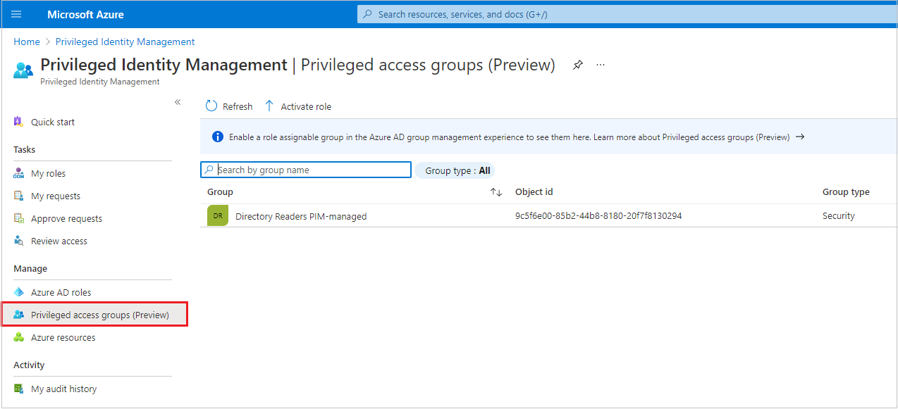
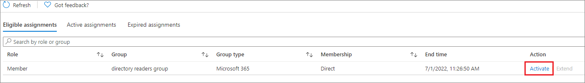
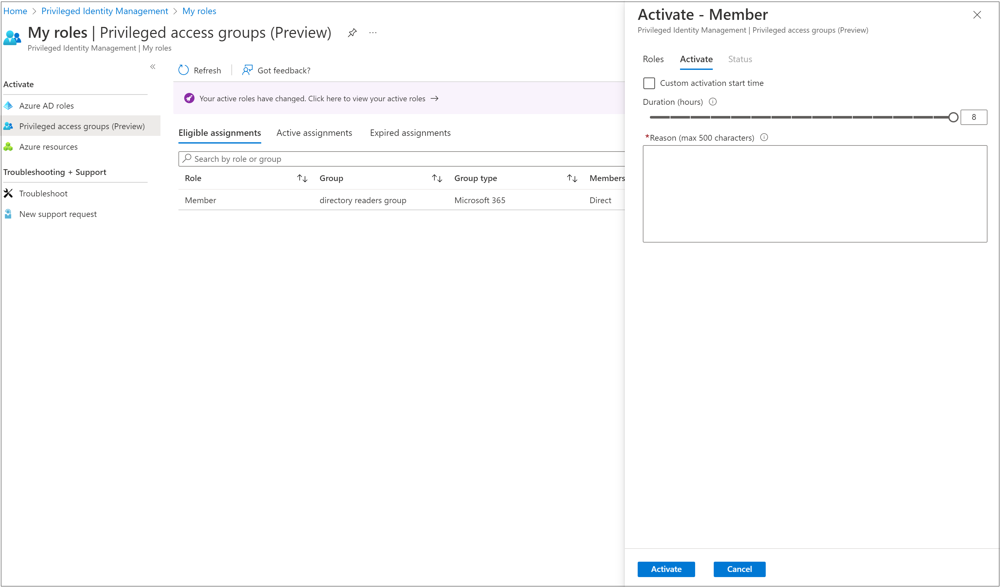
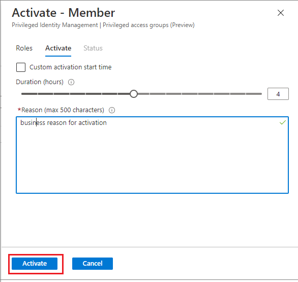

# Activate my privileged access group roles in Privileged Identity Management

Use Privileged Identity Management (PIM) to allow eligible role members for privileged access groups to schedule role activation for a specified date and time. They can also select a activation duration up to the maximum duration configured by administrators.

This article is for eligible members who want to activate their privileged access group role in Privileged Identity Management.

## Activate a role

When you need to take on an privileged access group role, you can request activation by using the **My roles** navigation option in Privileged Identity Management.

1. [Sign in to Azure AD portal](https://aad.portal.azure.com) with Global Administrator or group Owner permissions.

1. Open [Privileged Identity Management](https://portal.azure.com/#blade/Microsoft_Azure_PIMCommon/CommonMenuBlade/quickStart).

1. Select **Privileged access groups (Preview)** and then select **Activate role** to open the **My roles** page for privileged access groups.

    

1. On the **My roles** page, select **Activate** on the row of the eligible assignment you want to activate.

    

1. If your role requires multi-factor authentication, select **Verify your identity before proceeding**. You only have to authenticate once per session.

    

1. Select **Verify my identity** and follow the instructions to provide additional security verification.

    

1. If necessary, specify a custom activation start time. The member or owner is to be activated only after the selected time.

1. In the **Reason** box, enter the reason for the activation request.

    

1. Select **Activate**.

If the [role requires approval](pim-resource-roles-approval-workflow.md) to activate, an Azure notification appears in the upper right corner of your browser informing you the request is pending approval.

## View the status of your requests

You can view the status of your pending requests to activate.

1. Open Azure AD Privileged Identity Management.

1. Select **My requests** to see a list of your Azure AD role and privileged access group role requests.

1. Scroll to the right, if needed, to view the **Request Status** column.

## Cancel a pending request

If you do not require activation of a role that requires approval, you can cancel a pending request at any time.

1. Open Azure AD Privileged Identity Management.

1. Select **My requests**.

1. For the role that you want to cancel, select the **Cancel** link.

    When you select **Cancel**, the request will be canceled. To activate the role again, you will have to submit a new request for activation.

## Troubleshoot

### Permissions are not granted after activating a role

When you activate a role in Privileged Identity Management, the activation may not instantly propagate to all portals that require the privileged role. Sometimes, even if the change is propagated, web caching in a portal may result in the change not taking effect immediately. If your activation is delayed, here is what you should do.

1. Sign out of the Azure portal and then sign back in.
1. In Privileged Identity Management, verify that you are listed as the member of the role.

## Next steps

- [Extend or renew privileged access group roles in Privileged Identity Management](groups-renew-extend.md)
- [Assign my privileged access group roles in Privileged Identity Management](groups-assign-member-owner.md)
