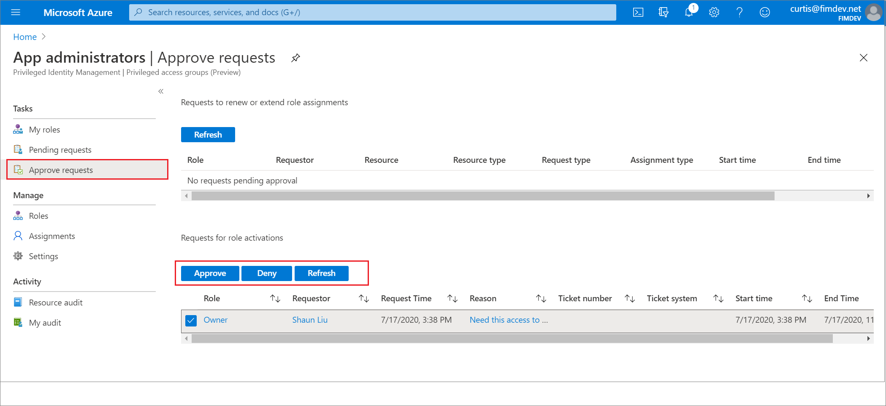
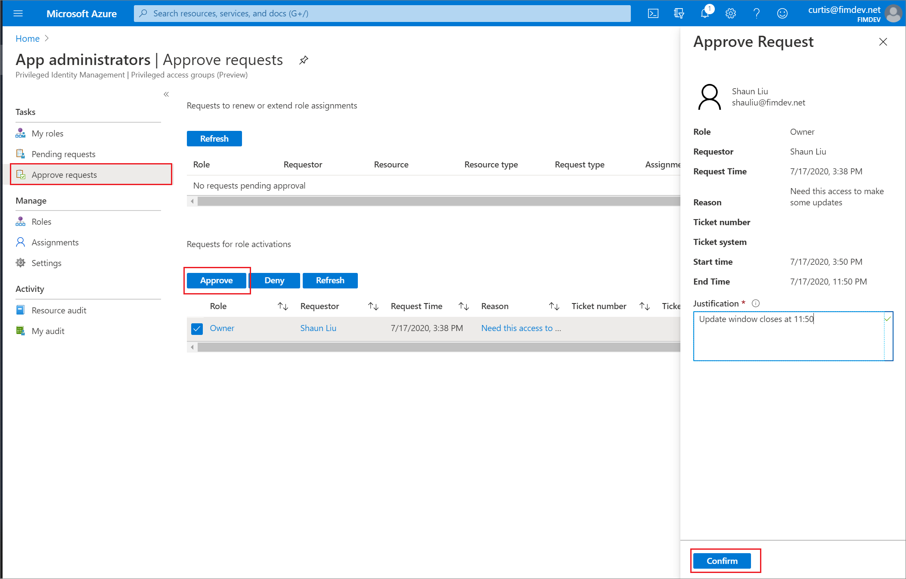
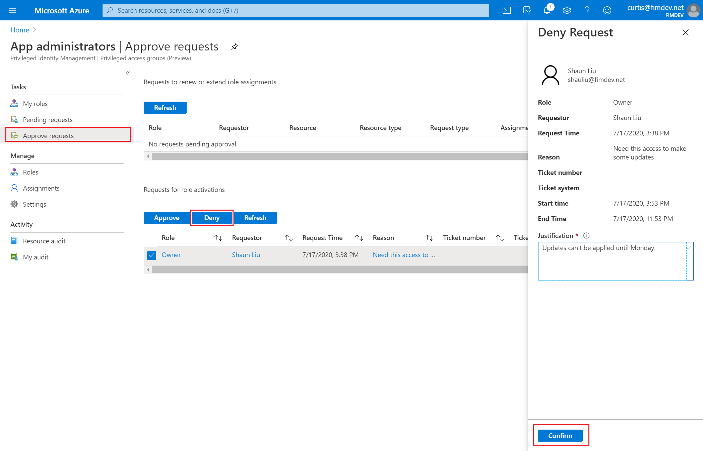

# Approve activation requests for privileged access group members and owners (preview)

With Privileged Identity Management (PIM) in Azure Active Directory (Azure AD), you can configure privileged access group members and owners to require approval for activation, and choose users or groups from your Azure AD organization as delegated approvers. We recommend selecting two or more approvers for each group to reduce workload for the privileged role administrator. Delegated approvers have 24 hours to approve requests. If a request is not approved within 24 hours, then the eligible user must re-submit a new request. The 24 hour approval time window is not configurable.

Follow the steps in this article to approve or deny requests for Azure resource roles.

## View pending requests

As a delegated approver, you'll receive an email notification when an Azure resource role request is pending your approval. You can view pending requests in Privileged Identity Management.

1. Sign in to the [Azure portal](https://portal.azure.com/).

1. Open **Azure AD Privileged Identity Management**.

1. Select **Approve requests**.

    

    In the **Requests for role activations** section, you'll see a list of requests pending your approval.

## Approve requests

1. Find and select the request that you want to approve and select **Approve**.

    

1. In the **Justification** box, enter the business justification.

1. Select **Confirm**. An Azure notification is generated by your approval.

## Deny requests

1. Find and select the request that you want to deny and select **Deny**.

    

1. In the **Justification** box, enter the business justification.

1. Select **Confirm**. An Azure notification is generated by the denial.

## Workflow notifications

Here's some information about workflow notifications:

- Approvers are notified by email when a request for a group assignment is pending their review. Email notifications include a direct link to the request, where the approver can approve or deny.
- Requests are resolved by the first approver who approves or denies.
- When an approver responds to the request, all approvers are notified of the action.

>[!Note]
>An administrator who believes that an approved user should not be active can remove the active group assignment in Privileged Identity Management. Although resource administrators are not notified of pending requests unless they are an approver, they can view and cancel pending requests for all users by viewing pending requests in Privileged Identity Management.

## Next steps

- [Extend or renew group assignments in Privileged Identity Management](pim-resource-roles-renew-extend.md)
- [Email notifications in Privileged Identity Management](pim-email-notifications.md)
- [Approve or deny requests for group assignments in Privileged Identity Management](azure-ad-pim-approval-workflow.md)
