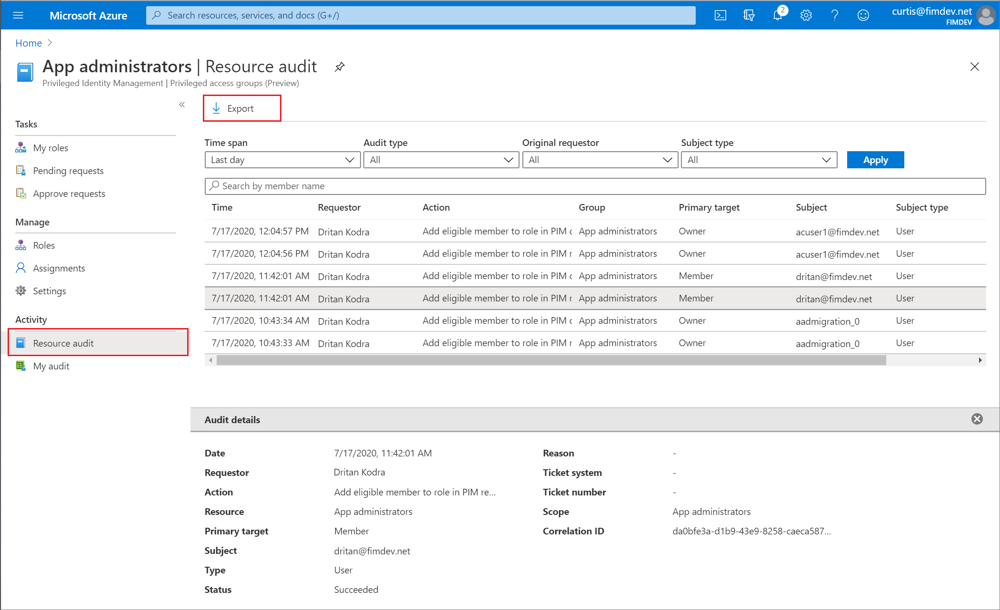

# Audit activity history for privileged access group assignments (preview) in Privileged Identity Management

With Privileged Identity Management (PIM), you can view activity, activations, and audit history for Azure privileged access group members and owners within your Azure Active Directory (Azure AD) organization.

> [!NOTE]
> If your organization has outsourced management functions to a service provider who uses [Azure Lighthouse](../../lighthouse/overview.md), role assignments authorized by that service provider won't be shown here.

Follow these steps to view the audit history for privileged access groups.

## View resource audit history

**Resource audit** gives you a view of all activity associated with your privileged access groups.

1. Open **Azure AD Privileged Identity Management**.

1. Select **Privileged access groups (Preview)**.

1. Select the privileged access group you want to view audit history for.

1. Under **Activity**, select **Resource audit**.

1. Filter the history using a predefined date or custom range.

    

## View my audit

**My audit** enables you to view your personal role activity for a privileged access group.

1. Open **Azure AD Privileged Identity Management**.

1. Select **Privileged access groups (Preview)**.

1. Select the privileged access group you want to view audit history for.

1. Under **Activity**, select **My audit**.

1. Filter the history using a predefined date or custom range.

    

## Next steps

- [Assign group membership and ownership in Privileged Identity Management](groups-assign-member-owner.md)
- [Approve or deny requests for privileged access groups in PIM](groups-approval-workflow.md)
- [View audit history for Azure AD roles in PIM](groups-audit.md)
