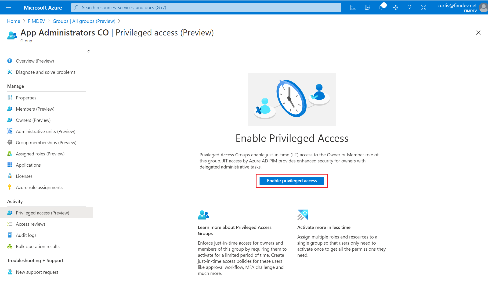

# Manage privileged access groups (preview) in Privileged Identity Management

In Azure Active Directory (Azure AD), you can assign Azure AD built-in roles to cloud groups to simplify how you manage role assignments. To protect Azure AD roles and to secure access, you can now use Privileged Identity Management (PIM) to manage just-in-time access for members or owners of these groups. To manage an Azure AD role-assignable group as a privileged access group in Privileged Identity Management, you must bring it under management in PIM.

## Identify groups to manage

You can create a role-assignable group in Azure AD as described in [Create a role-assignable group in Azure Active Directory](../users-groups-roles/roles-groups-create-eligible.md). You have be an owner of the group to bring it under management in Privileged Identity Management.

1. [Sign in to Azure AD](https://aad.portal.azure.com) with Privileged Role Administrator permissions.
1. Select **Groups** and then select the role-assignable group you want to manage. You can search or filter the list.

    

1. Open the group and select **Privileged access (Preview)**.

    

1. If your groups hasn't yet been brought under management in PIM, select **Enable privileged access** to consent to management. Only the Global Administrator or Owner of a group can give this consent.

    

1. Start managing assignments in PIM.

    

> [!NOTE]
> Once a privileged access group is managed, it can't be taken out of management. This prevents another administrator from removing Privileged Identity Management settings.

## Next steps

- [Configure privileged access group assignments in Privileged Identity Management](pim-resource-roles-configure-role-settings.md)
- [Assign privileged access groups in Privileged Identity Management](pim-resource-roles-assign-roles.md)
