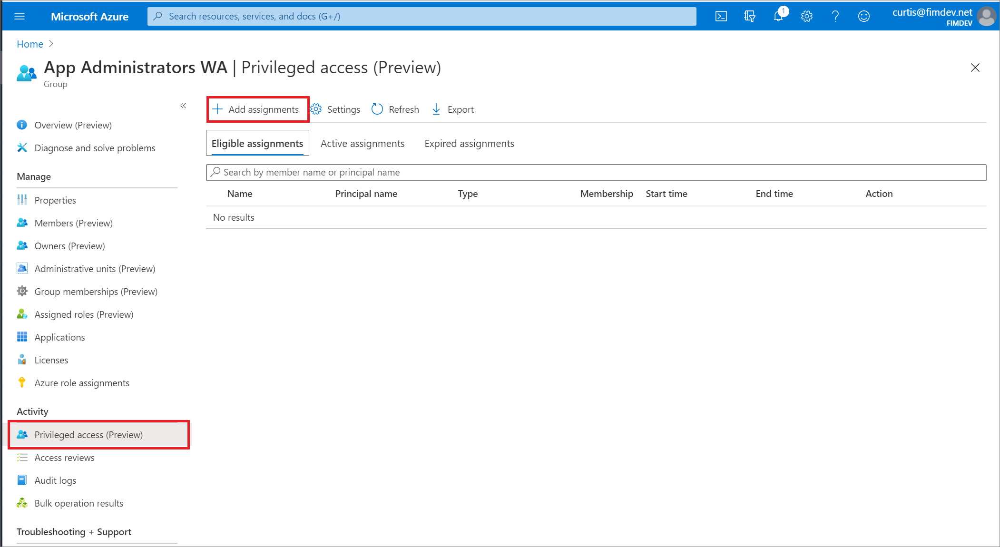

# Discover privileged access groups to manage in Privileged Identity Management

Using Azure Active Directory (Azure AD) Privileged Identity Management (PIM), you can improve the protection of your Azure resources. This helps organizations that already use Privileged Identity Management to protect Azure AD roles and helps management group and subscription owners who are looking to secure access.

Before you can manage an Azure AD role-assignable group as a privileged access group in Privileged Identity Management, you must discover it and bring it under management in PIM.

## Discover resources

1. [Sign in to Azure AD](https://aad.portal.azure.com) with Privileged Role Administrator role permissions.
1. Create a role-assignable group In Azure AD. You must be an owner of the group to discover and manage it with PIM.
1. Open **Privileged Identity Management**.
1. Select **Privileged access (preview)**.

    

1. Select **Discover groups**.
1. Search by group name.
1. Select your group and select **Manage groups** to bring it under PIM management.

    

    > [!NOTE]
    > Once a privileged access group is managed, it can't be taken out of management. This prevents another resource administrator from removing Privileged Identity Management settings.

1. If you see a message to confirm the onboarding of the selected resource for management, select **Yes**.

## Next steps

- [Configure privileged access group assignments in Privileged Identity Management](pim-resource-roles-configure-role-settings.md)
- [Assign privileged access groups in Privileged Identity Management](pim-resource-roles-assign-roles.md)
