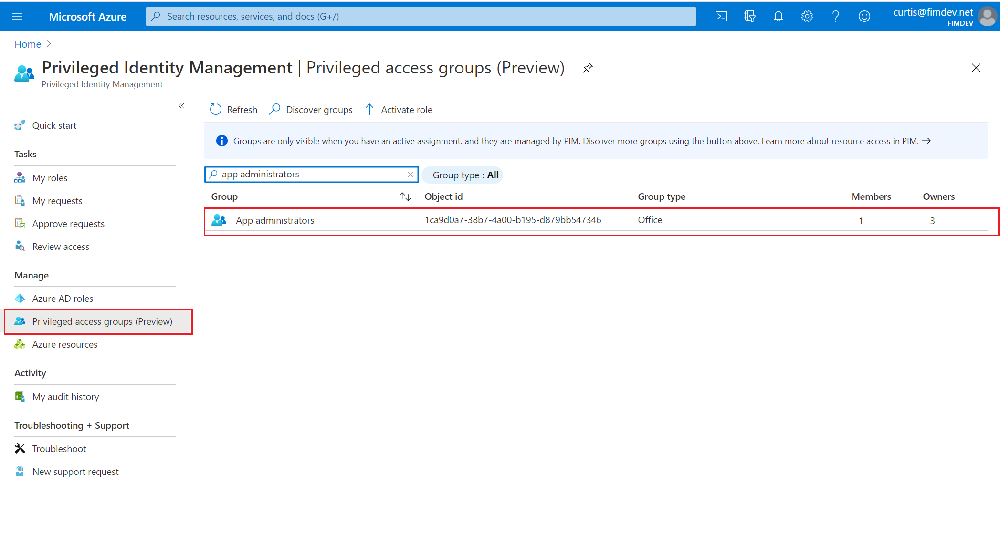
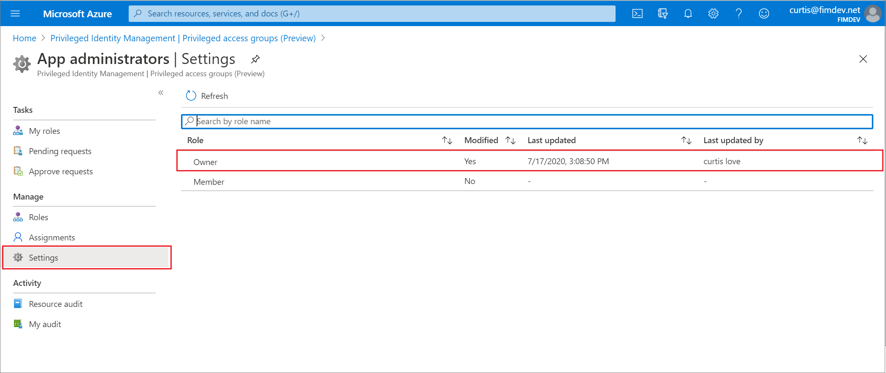
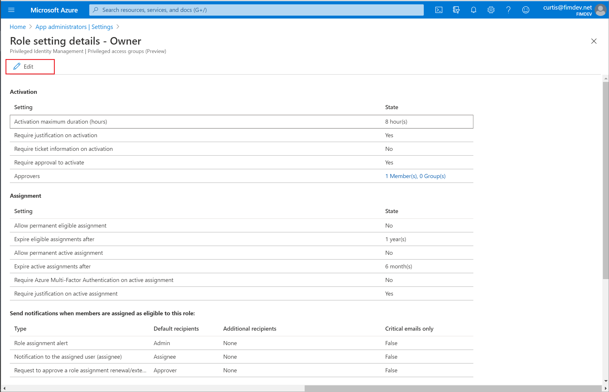
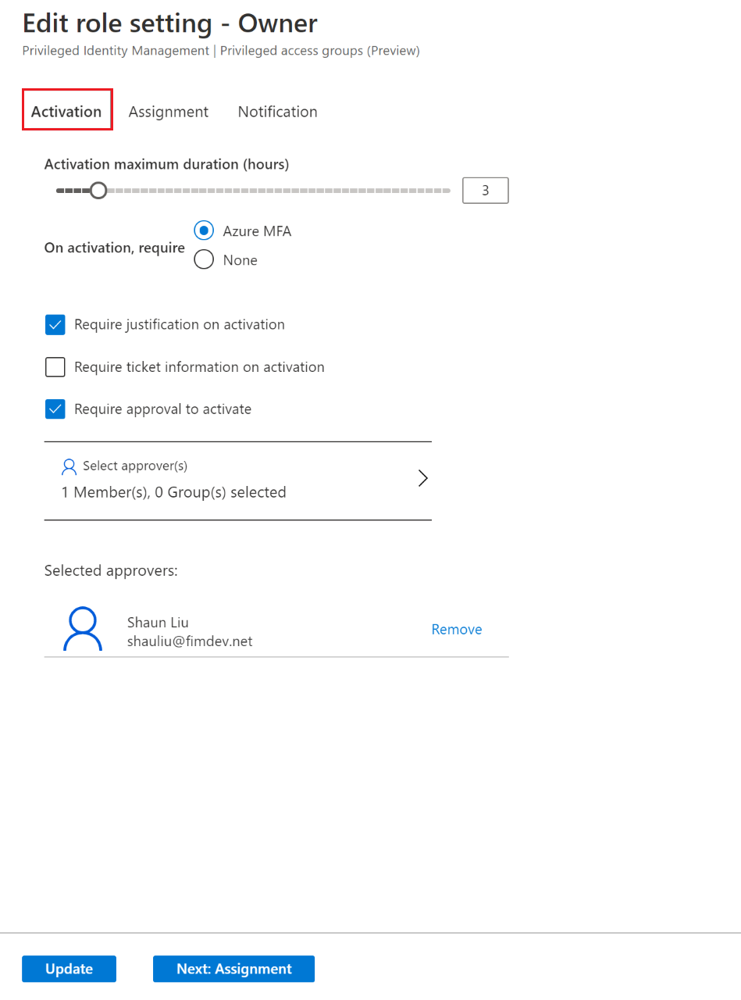
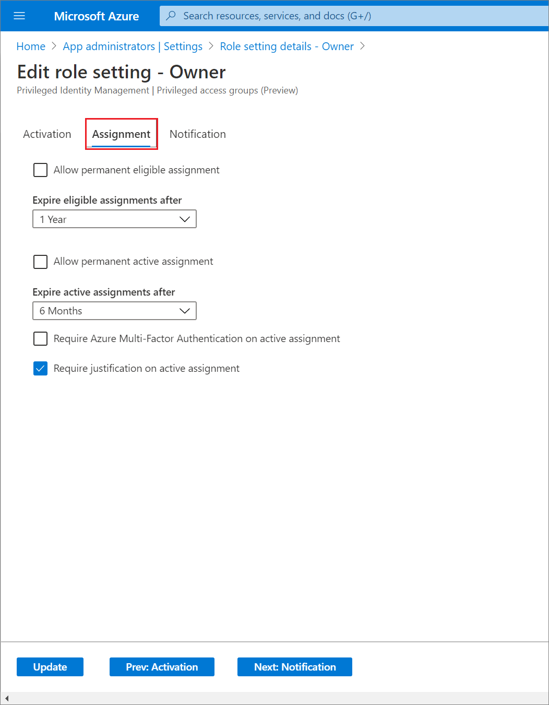
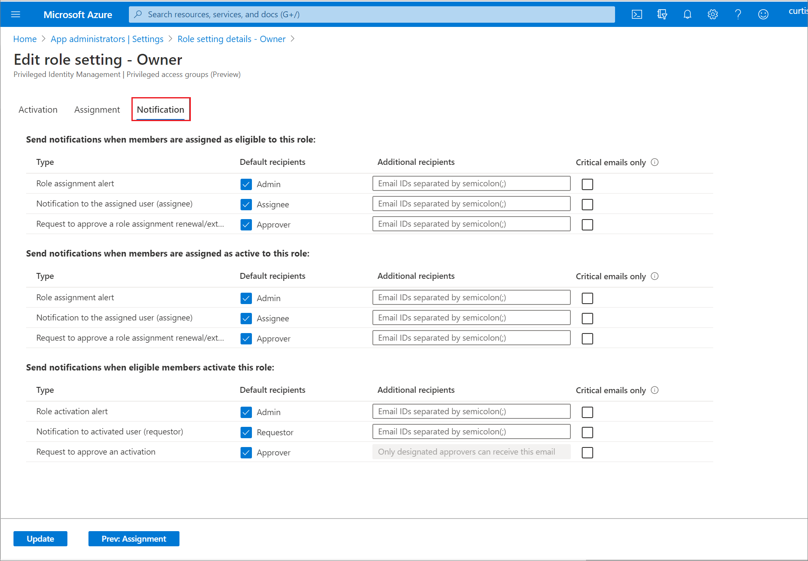
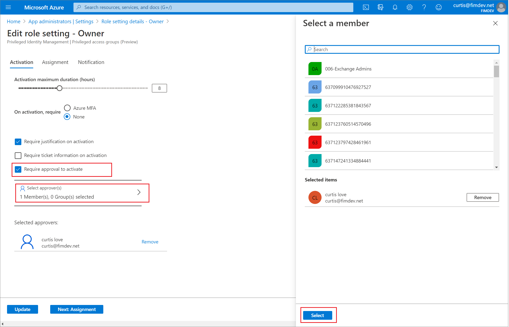

# Configure privileged access group settings (preview) in Privileged Identity Management

Role settings are the default settings that are applied to group owner and group member privileged access assignments in Privileged Identity Management (PIM) in Azure Active Directory (Azure AD), part of Microsoft Entra. Use the following steps to set up the approval workflow to specify who can approve or deny requests to elevate privilege.

## Open role settings

Follow these steps to open the settings for an Azure privileged access group role.

1. Sign in to the [Azure portal](https://portal.azure.com/) with a user in the [Global Administrator](../roles/permissions-reference.md#global-administrator) role, the Privileged Role Administrator role, or the group Owner role.

1. Open **Azure AD Privileged Identity Management**.

1. Select **Privileged access (Preview)**.
    >[!NOTE]
    > Approver doesn't have to be member of the group, owner of the group or have Azure AD role assigned.

1. Select the group that you want to manage.

    

1. Select **Settings**.

    

1. Select the Owner or Member role whose settings you want to view or change. You can view the current settings for the role in the **Role setting details** page.

    

1. Select **Edit** to open the **Edit role setting** page. The **Activation** tab allows you to change the  role activation settings, including whether to allow permanent eligible and active assignments.

    

1. Select the **Assignment** tab  to open the assignment settings tab. These settings control the Privileged Identity Management assignment settings for this role.

    

1. Use the **Notification** tab or the **Next: Activation** button at the bottom of the page to get to the notification setting tab for this role. These settings control all the email notifications related to this role.

    

1. Select the **Update** button at any time to update the role settings.

In the **Notifications** tab on the role settings page, Privileged Identity Management enables granular control over who receives notifications and which notifications they receive.

- **Turning off an email** You can turn off specific emails by clearing the default recipient check box and deleting any other recipients.  
- **Limit emails to specified email addresses** You can turn off emails sent to default recipients by clearing the default recipient check box. You can then add other email addresses as recipients. If you want to add more than one email address, separate them using a semicolon (;).
- **Send emails to both default recipients and more recipients** You can send emails to both default recipient and another recipient by selecting the default recipient checkbox and adding email addresses for other recipients.
- **Critical emails only** For each type of email, you can select the check box to receive critical emails only. What this means is that Privileged Identity Management will continue to send emails to the specified recipients only when the email requires an immediate action. For example, emails asking users to extend their role assignment will not be triggered while an emails requiring admins to approve an extension request will be triggered.

## Assignment duration

You can choose from two assignment duration options for each assignment type (eligible and active) when you configure settings for a role. These options become the default maximum duration when a user is assigned to the role in Privileged Identity Management.

You can choose one of these **eligible** assignment duration options:

| | Description |
| --- | --- |
| **Allow permanent eligible assignment** | Resource administrators can assign permanent eligible assignment. |
| **Expire eligible assignment after** | Resource administrators can require that all eligible assignments have a specified start and end date. |

And, you can choose one of these **active** assignment duration options:

| | Description |
| --- | --- |
| **Allow permanent active assignment** | Resource administrators can assign permanent active assignment. |
| **Expire active assignment after** | Resource administrators can require that all active assignments have a specified start and end date. |

> [!NOTE]
> All assignments that have a specified end date can be renewed by resource administrators. Also, users can initiate self-service requests to [extend or renew role assignments](pim-resource-roles-renew-extend.md).

## Require multifactor authentication

Privileged Identity Management provides optional enforcement of Azure AD Multi-Factor Authentication for two distinct scenarios.

### Require multifactor authentication on active assignment

This option requires admins must complete multifactor authentication before creating an active (as opposed to eligible) role assignment. Privileged Identity Management can't enforce multifactor authentication when the user uses their role assignment because they are already active in the role from the time that it is assigned.

To require multifactor authentication when creating an active role assignment, select the **Require Multi-Factor Authentication on active assignment** check box.

### Require multifactor authentication on activation

You can require users who are eligible for a role to prove who they are using Azure AD Multi-Factor Authentication before they can activate. Multifactor authentication ensures that the user is who they say they are with reasonable certainty. Enforcing this option protects critical resources in situations when the user account might have been compromised.

To require multifactor authentication before activation, check the **Require Multi-Factor Authentication on activation** box.

For more information, see [Multifactor authentication and Privileged Identity Management](pim-how-to-require-mfa.md).

## Activation maximum duration

Use the **Activation maximum duration** slider to set the maximum time, in hours, that an activation request for a role assignment remains active before it expires. This value can be from one to 24 hours.

## Require justification

You can require that users enter a business justification when they activate. To require justification, check the **Require justification on active assignment** box or the **Require justification on activation** box.

## Require approval to activate

If you want to require approval to activate a role, follow these steps.

1. Check the **Require approval to activate** check box.

1. Select **Select approvers** to open the **Select a member or group** page.

    

1. Select at least one user or group and then click **Select**. You can add any combination of users and groups. You must select at least one approver. There are no default approvers.

    Your selections will appear in the list of selected approvers.

1. Once you have specified your all your role settings, select **Update** to save your changes.

## Next steps

- [Assign privileged access group membership or ownership in PIM](groups-assign-member-owner.md)
