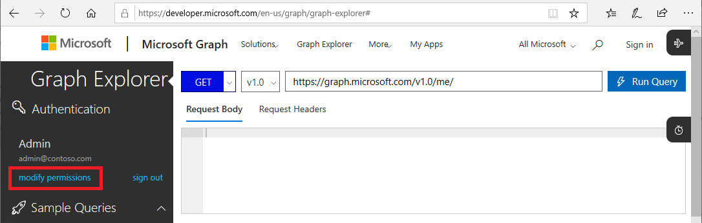
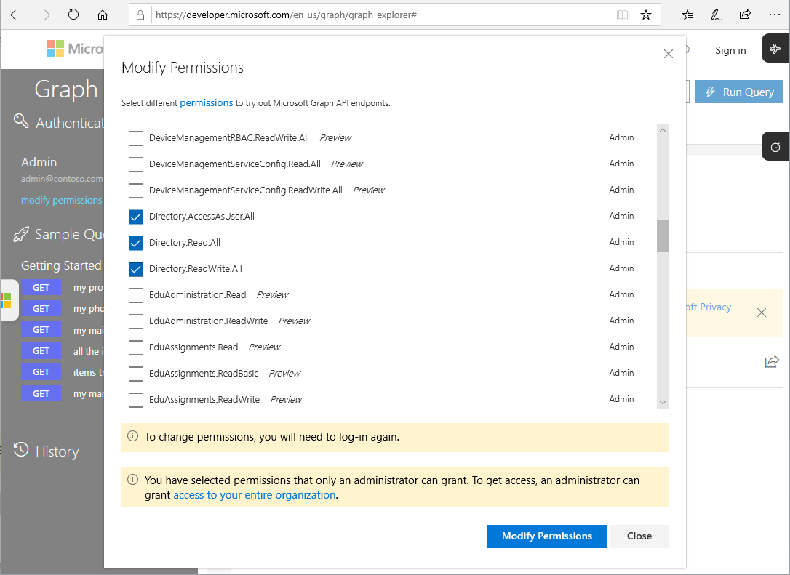

# Microsoft Graph APIs for Privileged Identity Management (Preview)

You can perform Privileged Identity Management tasks using the [Microsoft Graph APIs](https://developer.microsoft.com/graph/docs/concepts/overview) for Azure Active Directory. This article describes important concepts for using the Microsoft Graph APIs for Privileged Identity Management.

For details about the Microsoft Graph APIs, check out the [Azure AD Privileged Identity Management API reference](https://developer.microsoft.com/graph/docs/api-reference/beta/resources/privilegedidentitymanagement_root).

> [!IMPORTANT]
> APIs under the /beta version in Microsoft Graph are in preview and are subject to change. Use of these APIs in production applications is not supported.

## Required permissions

To call the Microsoft Graph APIs for Privileged Identity Management, you must have **one or more** of the following permissions:

- `Directory.AccessAsUser.All`
- `Directory.Read.All`
- `Directory.ReadWrite.All`
- `PrivilegedAccess.ReadWrite.AzureAD`

### Set permissions

For applications to call the Microsoft Graph APIs for Privileged Identity Management, they must have the required permissions. The easiest way to specify the required permissions is to use the [Azure AD consent framework](../develop/consent-framework.md).

### Set permissions in Graph Explorer

If you are using the Graph Explorer to test your calls, you can specify the permissions in the tool.

1. Sign in to [Graph Explorer](https://developer.microsoft.com/graph/graph-explorer) as a Global Administrator.

1. Click **modify permissions**.

    

1. Select the checkboxes next to the permissions you want to include. `PrivilegedAccess.ReadWrite.AzureAD` is not yet available in Graph Explorer.

    

1. Click **Modify Permissions** to apply the permission changes.

## Next steps

- [Azure AD Privileged Identity Management API reference](https://developer.microsoft.com/graph/docs/api-reference/beta/resources/privilegedidentitymanagement_root)
