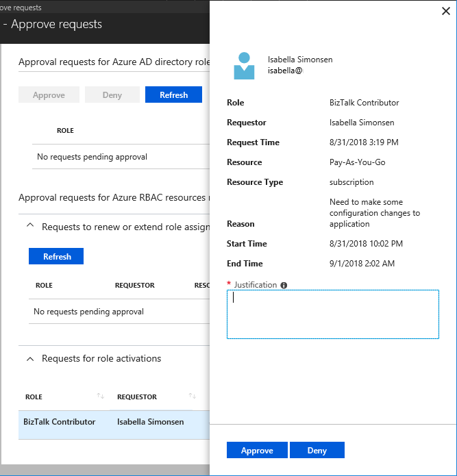

# Approve or deny requests for Azure AD roles in Privileged Identity Management

With Privileged Identity Management (PIM) in Azure Active Directory (Azure AD), part of Microsoft Entra, you can configure roles to require approval for activation, and choose one or multiple users or groups as delegated approvers. Delegated approvers have 24 hours to approve requests. If a request is not approved within 24 hours, then the eligible user must re-submit a new request. The 24 hour approval time window is not configurable.

## View pending requests

[!INCLUDE [portal updates](~/articles/active-directory/includes/portal-update.md)]

As a delegated approver, you'll receive an email notification when an Azure AD role request is pending your approval. You can view these pending requests in Privileged Identity Management.

1. Sign in to the [Azure portal](https://portal.azure.com).

1. Open **Azure AD Privileged Identity Management**.

1. Select **Approve requests**.

    

    In the **Requests for role activations** section, you'll see a list of requests pending your approval.

## View pending requests using Microsoft Graph API

### HTTP request

````HTTP
GET https://graph.microsoft.com/v1.0/roleManagement/directory/roleAssignmentScheduleRequests/filterByCurrentUser(on='approver')?$filter=status eq 'PendingApproval' 
````

### HTTP response

````HTTP
{ 
    "@odata.context": "https://graph.microsoft.com/v1.0/$metadata#Collection(unifiedRoleAssignmentScheduleRequest)", 
    "value": [ 
        { 
            "@odata.type": "#microsoft.graph.unifiedRoleAssignmentScheduleRequest", 
            "id": "9f2b5ddb-a50e-44a1-a6f4-f616322262ea", 
            "status": "PendingApproval", 
            "createdDateTime": "2021-07-15T19:57:17.76Z", 
            "completedDateTime": "2021-07-15T19:57:17.537Z", 
            "approvalId": "9f2b5ddb-a50e-44a1-a6f4-f616322262ea", 
            "customData": null, 
            "action": "SelfActivate", 
            "principalId": "d96ea738-3b95-4ae7-9e19-78a083066d5b", 
            "roleDefinitionId": "88d8e3e3-8f55-4a1e-953a-9b9898b8876b", 
            "directoryScopeId": "/", 
            "appScopeId": null, 
            "isValidationOnly": false, 
            "targetScheduleId": "9f2b5ddb-a50e-44a1-a6f4-f616322262ea", 
            "justification": "test", 
            "createdBy": { 
                "application": null, 
                "device": null, 
                "user": { 
                    "displayName": null, 
                    "id": "d96ea738-3b95-4ae7-9e19-78a083066d5b" 
                } 
            }, 
            "scheduleInfo": { 
                "startDateTime": null, 
                "recurrence": null, 
                "expiration": { 
                    "type": "afterDuration", 
                    "endDateTime": null, 
                    "duration": "PT5H30M" 
                } 
            }, 
            "ticketInfo": { 
                "ticketNumber": null, 
                "ticketSystem": null 
            } 
        } 
    ] 
} 
````

## Approve requests

>[!NOTE]
>Approvers are not able to approve their own role activation requests.

1. Find and select the request that you want to approve. An approve or deny page appears.

    

1. In the **Justification** box, enter the business justification.

1. Select **Approve**. You will receive an Azure notification of your approval.

    

## Approve pending requests using Microsoft Graph API

### Get IDs for the steps that require approval

For a specific activation request, this command gets all the approval steps that need approval. Multi-step approvals are not currently supported.

#### HTTP request

````HTTP
GET https://graph.microsoft.com/beta/roleManagement/directory/roleAssignmentApprovals/<request-ID-GUID> 
````

#### HTTP response

````HTTP
{ 
    "@odata.context": "https://graph.microsoft.com/beta/$metadata#roleManagement/directory/roleAssignmentApprovals/$entity", 
    "id": "<request-ID-GUID>",
    "steps@odata.context": "https://graph.microsoft.com/beta/$metadata#roleManagement/directory/roleAssignmentApprovals('<request-ID-GUID>')/steps", 
    "steps": [ 
        { 
            "id": "<approval-step-ID-GUID>", 
            "displayName": null, 
            "reviewedDateTime": null, 
            "reviewResult": "NotReviewed", 
            "status": "InProgress", 
            "assignedToMe": true, 
            "justification": "", 
            "reviewedBy": null 
        } 
    ] 
} 
````

### Approve the activation request step

#### HTTP request

````HTTP
PATCH 
https://graph.microsoft.com/beta/roleManagement/directory/roleAssignmentApprovals/<request-ID-GUID>/steps/<approval-step-ID-GUID> 
{ 
    "reviewResult": "Approve", 
    "justification": "abcdefg" 
} 
 ````

#### HTTP response

Successful PATCH calls generate an empty response.

## Deny requests

1. Find and select the request that you want to deny. An approve or deny page appears.

    

1. In the **Justification** box, enter the business justification.

1. Select **Deny**. A notification appears with your denial.

## Workflow notifications

Here's some information about workflow notifications:

- Approvers are notified by email when a request for a role is pending their review. Email notifications include a direct link to the request, where the approver can approve or deny.
- Requests are resolved by the first approver who approves or denies.
- When an approver responds to the request, all approvers are notified of the action.
- Global admins and Privileged role admins are notified when an approved user becomes active in their role.

>[!NOTE]
>A Global Administrator or Privileged role admin who believes that an approved user should not be active can remove the active role assignment in Privileged Identity Management. Although administrators are not notified of pending requests unless they are an approver, they can view and cancel any pending requests for all users by viewing pending requests in Privileged Identity Management.

## Next steps

- [Email notifications in Privileged Identity Management](pim-email-notifications.md)
- [Approve or deny requests for Azure resource roles in Privileged Identity Management](pim-resource-roles-approval-workflow.md)
