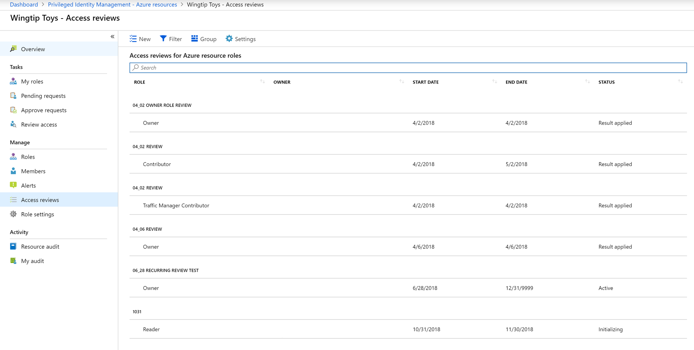
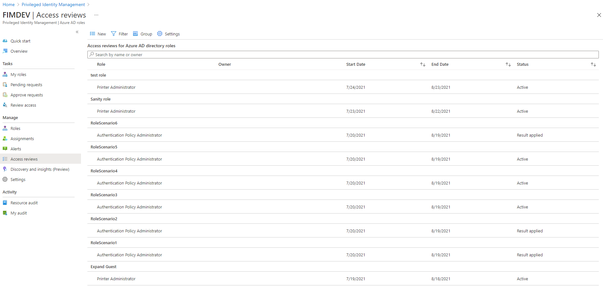
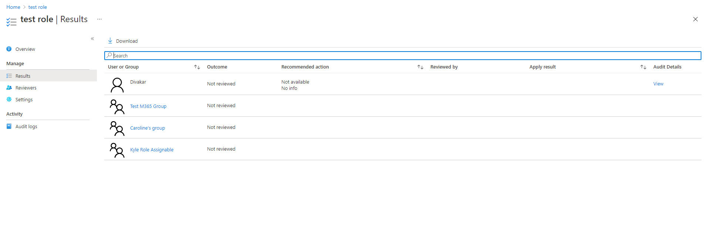
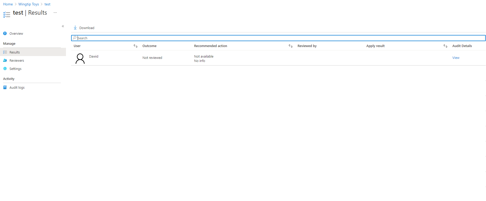
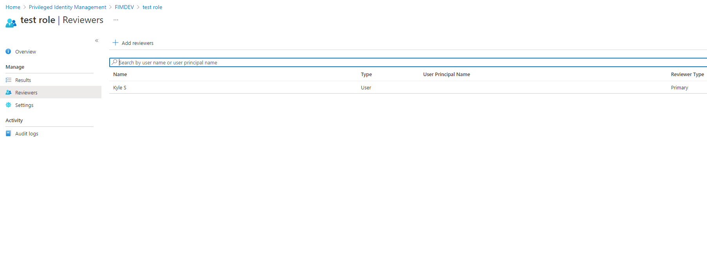
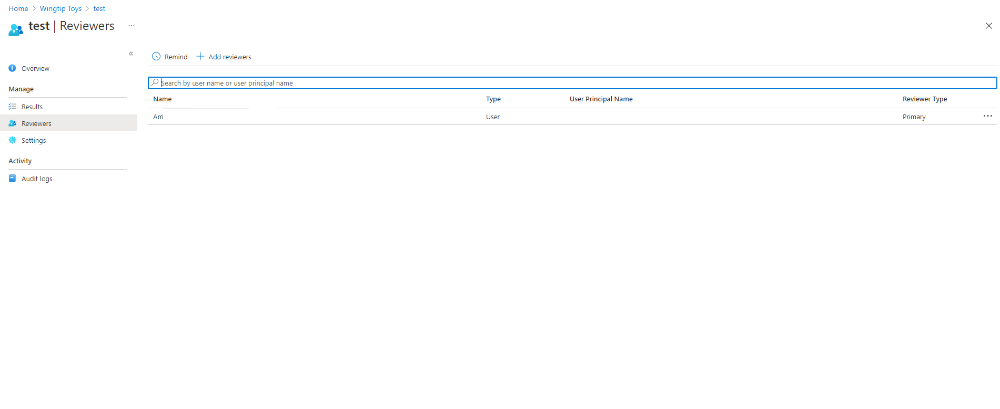

# Complete an access review of Azure resource and Azure AD roles in Privileged Identity Management

Privileged role administrators can review privileged access once an [access review has been started](pim-start-azuread-roles-and-resource-roles-review.md). Privileged Identity Management (PIM) in Azure Active Directory (Azure AD) will automatically send an email that prompts users to review their access. If a user doesn't receive an email, you can send them the instructions for [how to perform an access review](pim-perform-azuread-roles-and-resource-roles-review.md).

After the access review period is over, or after all the users have finished their self-review, follow the steps in this article to manage the review and see the results.

## Manage access reviews

1. Login to the [Azure portal](https://portal.azure.com/). For **Azure resources**, navigate to **Privileged Identity Management** and select **Azure resources** under **Manage** from the dashboard. For **Azure AD roles**, select **Azure AD roles** from the same dashboard.

2. For **Azure resources**, select your resource under **Azure resources** and then select **Access reviews** from the dashboard. For **Azure AD roles**, proceed directly to the **Access reviews** on the dashboard.

3. Select the access review that you want to manage. Below are sample screenshots of the **Access Reviews** overview for both **Azure resources** and **Azure AD roles**.

    <kbd></kbd>

    <kbd></kbd>

On the detail page for the access review, there are a number of options available for managing the review. For both **Azure resources** and **Azure AD roles**, the options are as follows:

### Stop an Access Review

The **Stop** button is selectable only when the review instance is active. All access reviews have an end date, but you can use this button to finish it early. If any users haven't been reviewed by this time, they won't be able to after you stop the review. You cannot restart a review after it's been stopped.

### Reset an Access Review

When the review instance is active and at least one decision has been made by reviewers, you can reset the access review by selecting the **Reset** button to remove all decisions that were made on it. After you've reset an access review, all users are marked as not reviewed again.

### Apply an Access Review

After an access review is completed, either because you've reached the end date or stopped it manually, the **Apply** button implements the outcome of the review. If an user's access was denied during the review, this is the step that will remove their role assignment. If the **Auto apply** setting is configured on review creation, this button will always be disabled because the review will be applied automatically instead of manually.

### Delete an Access Review

If you are not interested in the review any further, delete it. The **Delete** button removes the review from the Privileged Identity Management service.

> [!IMPORTANT]
> You will not be required to confirm this destructive change, so verify that you want to delete that review.

## Results

On the **Results** page, you may view and download a list of your review results.

<kbd></kbd>

> [!Note]
> **Azure AD roles** have a concept of role-assignable groups, where a group can be assigned to the role. When this happens, the group will show up in the review instead of expanding the members of the group, and a reviewer will either approve or deny the entire group.

<kbd></kbd>

> [!Note]
>If a group is assigned to **Azure resource roles**, the reviewer of the Azure resource role will see the expanded list of the users in a nested group. Should a reviewer deny a member of a nested group, that deny result will not be applied successfully because the user will not be removed from the nested group.

## Reviewers

On the **Reviewers** page, you may view and add reviewers to your existing access review. You may also remind reviewers to complete their reviews here.

<kbd></kbd>

<kbd></kbd>

## Next steps

- [Create an access review of Azure resource or Azure AD roles in PIM](pim-start-azuread-roles-and-resource-roles-review.md)
- [Perform an access review of Azure resource or Azure AD roles in PIM](pim-perform-azuread-roles-and-resource-roles-review.md)
