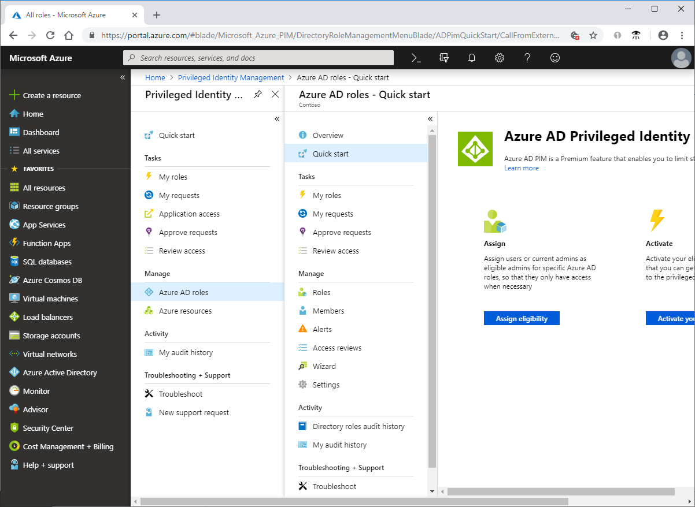

# What is Azure AD Privileged Identity Management?

Azure Active Directory (Azure AD) Privileged Identity Management (PIM) is a service that enables you to manage, control, and monitor access to important resources in your organization. This includes access to resources in Azure AD, Azure resources, and other Microsoft Online Services like Office 365 or Microsoft Intune.

## Why should I use PIM?

Organizations want to minimize the number of people who have access to secure information or resources, because that reduces the chance of a malicious actor getting that access, or an authorized user inadvertently impacting a sensitive resource. However, users still need to carry out privileged operations in Azure AD, Azure, Office 365, or SaaS apps. Organizations can give users just-in-time (JIT) privileged access to Azure resources and Azure AD. There is a need for oversight for what those users are doing with their administrator privileges. PIM helps to mitigate the risk of excessive, unnecessary, or misused access rights.

## What can I do with PIM?

PIM essentially helps you manage the who, what, when, where, and why for resources that you care about. Here are some of the key features of PIM:

- Provide **just-in-time** privileged access to Azure AD and Azure resources
- Assign **time-bound** access to resources using start and end dates
- Require **approval** to activate privileged roles
- Enforce **multi-factor authentication** to activate any role
- Use **justification** to understand why users activate
- Get **notifications** when privileged roles are activated
- Conduct **access reviews** to ensure users still need roles
- Download **audit history** for internal or external audit

## Terminology

To better understand PIM and its documentation, you should review the following terms.

| Term or concept | Role assignment category | Description |
| --- | --- | --- |
| eligible | Type | A role assignment that requires a user to perform one or more actions to use the role. If a user has been made eligible for a role, that means they can activate the role when they need to perform privileged tasks. There's no difference in the access given to someone with a permanent versus an eligible role assignment. The only difference is that some people don't need that access all the time. |
| active | Type | A role assignment that doesn't require a user to perform any action to use the role. Users assigned as active have the privileges assigned to the role. |
| activate |  | The process of performing one or more actions to use a role that a user is eligible for. Actions might include performing a multi-factor authentication (MFA) check, providing a business justification, or requesting approval from designated approvers. |
| assigned | State | A user that has an active role assignment. |
| activated | State | A user that has an eligible role assignment, performed the actions to activate the role, and is now active.  Once activated, the user can use the role for a preconfigured period-of-time before they need to activate again. |
| permanent eligible | Duration | A role assignment where a user is always eligible to activate the role. |
| permanent active | Duration | A role assignment where a user can always use the role without performing any actions. |
| expire  eligible | Duration | A role assignment where a user is eligible to activate the role within a specified start and end date. |
| expire active | Duration | A role assignment where a user can use the role without performing any actions within a specified start and end date. |
| just-in-time (JIT) access |  | A model in which users receive temporary permissions to perform privileged tasks, which prevents malicious or unauthorized users from gaining access after the permissions have expired. Access is granted only when users need it. |
| principle of least privilege access |  | A recommended security practice in which every user is provided with only the minimum privileges needed to accomplish the tasks they are authorized to perform. This practice minimizes the number of Global Administrators and instead uses specific administrator roles for certain scenarios. |

## What does PIM look like?

Once you set up PIM, you'll see **Tasks**, **Manage**, and **Activity** options in the left navigation menu. As an administrator, you'll choose between managing **Azure AD roles** and **Azure resource** roles. When you choose the type of roles to manage, you see a similar set of options for that role type.

## Who can do what in PIM?

If you're the first person to use PIM, you are automatically assigned the [Security Administrator](../users-groups-roles/directory-assign-admin-roles.md#security-administrator) and [Privileged Role Administrator](../users-groups-roles/directory-assign-admin-roles.md#privileged-role-administrator) roles in the directory.

For Azure AD roles, only a user who is in the Privileged Role Administrator role can manage assignments for other administrators in PIM. You can [grant access to other administrators to manage PIM](pim-how-to-give-access-to-pim.md). Global Administrators, Security Administrators, and Security Readers can view assignments to Azure AD roles in PIM.

For Azure resource roles, only a subscription administrator, a resource Owner, or a resource User Access Administrator can manage assignments for other administrators in PIM. Users who are Privileged Role Administrators, Security Administrators, or Security Readers do not by default have access to view assignments to Azure resource roles in PIM.

## Scenarios

PIM supports the following scenarios:

**As a Privileged Role Administrator you can:**

- Enable approval for specific roles
- Specify approver users and/or groups to approve requests
- View request and approval history for all privileged roles

**As an approver, you can:**

- View pending approvals (requests)
- Approve or reject requests for role elevation (single and/or bulk)
- Provide justification for my approval/rejection 

**As an eligible role user, you can:**

- Request activation of a role that requires approval
- View the status of your request to activate
- Complete your task in Azure AD if activation was approved

## License requirements

[!INCLUDE [Azure AD Premium P2 license](../../../includes/active-directory-p2-license.md)]

For information about licenses for users, see [License requirements to use PIM](subscription-requirements.md).

## Next steps

- [License requirements to use PIM](subscription-requirements.md)
- [Securing privileged access for hybrid and cloud deployments in Azure AD](../users-groups-roles/directory-admin-roles-secure.md?toc=%2fazure%2factive-directory%2fprivileged-identity-management%2ftoc.json)
- [Deploy PIM](pim-deployment-plan.md)
