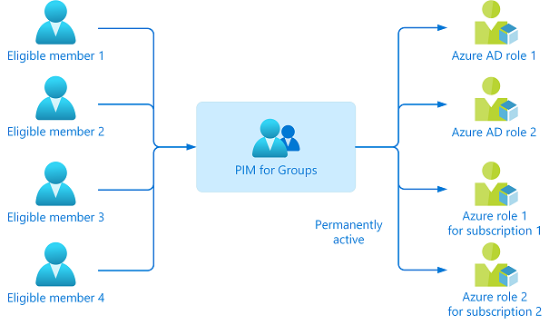

# Plan a Privileged Identity Management deployment

**Privileged Identity Management (PIM)** provides a time-based and approval-based role activation to mitigate the risks of excessive, unnecessary, or misused access permissions to important resources. These resources include resources in Microsoft Entra ID, Azure, and other Microsoft Online Services such as Microsoft 365 or Microsoft Intune.

PIM enables you to allow a specific set of actions at a particular scope. Key features include:

* Provide **just-in-time** privileged access to resources

* Assign **eligibility for membership or ownership** of PIM for Groups

* Assign **time-bound** access to resources using start and end dates

* Require **approval** to activate privileged roles

* Enforce **Multifactor authentication** to activate any role

* Enforce **Conditional Access policies** to activate any role (Public preview)

* Use **justification** to understand why users activate

* Get **notifications** when privileged roles are activated

* Conduct **access reviews** to ensure users still need roles

* Download **audit history** for internal or external audit

To gain the most from this deployment plan, it’s important that you get a complete overview of [What is Privileged Identity Management](pim-configure.md).

## Understand PIM

The PIM concepts in this section will help you understand your organization’s privileged identity requirements.

### What can you manage in PIM

Today, you can use PIM with:

* **Microsoft Entra roles** – Sometimes referred to as directory roles, Microsoft Entra roles include built-in and custom roles to manage Microsoft Entra ID and other Microsoft 365 online services.

* **Azure roles** – The role-based access control (RBAC) roles in Azure that grants access to management groups, subscriptions, resource groups, and resources.

* **PIM for Groups** – To set up just-in-time access to member and owner role of a Microsoft Entra security group. PIM for Groups not only gives you an alternative way to set up PIM for Microsoft Entra roles and Azure roles, but also allows you to set up PIM for other permissions across Microsoft online services like Intune, Azure Key Vaults, and Azure Information Protection. If the group is configured for app provisioning, activation of group membership triggers provisioning of group membership (and the user account, if it wasn’t provisioned) to the application using the System for Cross-Domain Identity Management (SCIM) protocol.

You can assign the following to these roles or groups: 

* **Users**- To get just-in-time access to Microsoft Entra roles, Azure roles, and PIM for Groups. 

* **Groups**- Anyone in a group to get just-in-time access to Microsoft Entra roles and Azure roles. For Microsoft Entra roles, the group must be a newly created cloud group that’s marked as assignable to a role while for Azure roles, the group can be any Microsoft Entra security group. We don't recommend assigning/nesting a group to a PIM for Groups. 

> [!NOTE] 
>You cannot assign service principals as eligible to Microsoft Entra roles, Azure roles, and PIM for Groups but you can grant a time limited active assignment to all three.

### Principle of least privilege

You assign users the role with the [least privileges necessary to perform their tasks](../roles/delegate-by-task.md). This practice minimizes the number of Global Administrators and instead uses specific administrator roles for certain scenarios.

> [!NOTE] 
> Microsoft has very few Global Administrators. Learn more at [how Microsoft uses Privileged Identity Management](https://www.microsoft.com/itshowcase/Article/Content/887/Using-Azure-AD-Privileged-Identity-Management-for-elevated-access).

### Type of assignments 

There are two types of assignment – **eligible** and **active**. If a user has been made eligible for a role, that means they can activate the role when they need to perform privileged tasks. 

You can also set a start and end time for each type of assignment. This addition gives you four possible types of assignments:

* Permanent eligible

* Permanent active

* Time-bound eligible, with specified start and end dates for assignment

* Time-bound active, with specified start and end dates for assignment

In case the role expires, you can **extend** or **renew** these assignments. 

**We recommend** you keep zero permanently active assignments for roles other than the recommended [two break-glass emergency access accounts](../roles/security-emergency-access.md), which should have the permanent Global Administrator role. 

## Plan the project

When technology projects fail, it’s typically because of mismatched expectations on impact, outcomes, and responsibilities. To avoid these pitfalls, [ensure that you’re engaging the right stakeholders](../architecture/deployment-plans.md) and that stakeholder roles in the project are well understood.

### Plan a pilot

At each stage of your deployment ensure that you are evaluating that the results are as expected. See [best practices for a pilot](../architecture/deployment-plans.md#best-practices-for-a-pilot).

* Start with a small set of users (pilot group) and verify that the PIM behaves as expected.

* Verify whether all the configuration you set up for the roles or PIM for Groups are working correctly. 

* Roll it to production only after it’s thoroughly tested. 

### Plan communications

Communication is critical to the success of any new service. Proactively communicate with your users how their experience changes, when it changes, and how to gain support if they experience issues.

Set up time with your internal IT support to walk them through the PIM workflow. Provide them with the appropriate documentations and your contact information.

## Plan testing and rollback

> [!NOTE] 
> For Microsoft Entra roles, organizations often test and roll out Global Administrators first, while for Azure resources, they usually test PIM one Azure subscription at a time. 

### Plan testing

Create test users to verify PIM settings work as expected before you impact real users and potentially disrupt their access to apps and resources. Build a test plan to have a comparison between the expected results and the actual results. 

The following table shows an example test case: 

| Role| Expected behavior during activation| Actual results |
| --- | --- | --- |
|Global Administrator| <li> Require MFA  <li> Require approval  <li> Require Conditional Access context (Public preview)  <li> Approver receives notification and can approve  <li>  Role expires after preset time|

For both Microsoft Entra ID and Azure resource role, make sure that you have users represented who will take those roles. In addition, consider the following roles when you test PIM in your staged environment:

| Roles| Microsoft Entra roles| Azure Resource roles| PIM for Groups |
| --- | --- | --- |--- |
| Member of a group| | | x |
| Members of a role| x| x|  |
| IT service owner| x| | x |
| Subscription or resource owner| | x| x |
| PIM for Groups owner| | | x |

### Plan rollback

If PIM fails to work as desired in the production environment, you can change the role assignment from eligible to active once again. For each role that you’ve configured, select the ellipsis **(…)** for all users with assignment type as **eligible**. You can then select the **Make active** option to go back and make the role assignment **active**.

## Plan and implement PIM for Microsoft Entra roles

Follow these tasks to prepare PIM to manage Microsoft Entra roles. 

### Discover and mitigate privileged roles

List who has privileged roles in your organization. Review the users assigned, identify administrators who no longer need the role, and remove them from their assignments. 

You can use [Microsoft Entra roles access reviews](./pim-create-roles-and-resource-roles-review.md) to automate the discovery, review, and approval or removal of assignments.

### Determine roles to be managed by PIM

Prioritize protecting Microsoft Entra roles that have the most permissions. It’s also important to consider what data and permission are most sensitive for your organization. 

First, ensure that all Global and Security admin roles are managed using PIM because they’re the users who can do the most harm when compromised. Then consider more roles that should be managed that could be vulnerable to attack.

You can use the Privileged label to identify roles with high privileges that you can manage with PIM. Privileged label is present on [**Roles and Administrator**](../../roles/privileged-roles-permissions.md?tabs=admin-center) in Microsoft Entra ID admin center. See the article, [Microsoft Entra built-in roles](../../roles/permissions-reference.md) to learn more.

### Configure PIM settings for Microsoft Entra roles

[Draft and configure your PIM settings](pim-how-to-change-default-settings.md) for every privileged Microsoft Entra role that your organization uses. 

The following table shows example settings:

| Role| Require MFA| Require Conditional Access| Notification| Incident ticket| Require approval| Approver| Activation duration| Perm admin |
| --- | --- | --- |--- |--- |--- |--- |--- |
| Global Administrator| :heavy_check_mark:| :heavy_check_mark:| :heavy_check_mark:|:heavy_check_mark:| :heavy_check_mark:| Other Global Administrator| 1 Hour| Emergency access accounts |
| Exchange Admin| :heavy_check_mark:| :heavy_check_mark:|:heavy_check_mark:| :x:| :x:| None| 2 Hour| None |
| Helpdesk Admin| :x:| :x:| :heavy_check_mark:| :x:| None| 8 Hour| None |

### Assign and activate Microsoft Entra roles 

For Microsoft Entra roles in PIM, only a user who is in the Privileged Role Administrator or Global Administrator role can manage assignments for other administrators. Global Administrators, Security Administrators, Global Readers, and Security Readers can also view assignments to Microsoft Entra roles in PIM. 

Follow the instructions in the links below:

1. [Give eligible assignments](pim-how-to-add-role-to-user.md).

1. [Allow eligible users to activate their Microsoft Entra role just-in-time](pim-how-to-activate-role.md)

When role nears its expiration, use [PIM to extend or renew the roles](pim-resource-roles-renew-extend.md). Both user-initiated actions require an approval from a Global administrator or Privileged role administrator.

When these important events occur in Microsoft Entra roles, PIM [sends email notifications and weekly digest emails](pim-email-notifications.md) to privilege administrators depending on the role, event, and notification settings. These emails might also include links to relevant tasks, such activating or renewing a role. 

> [!NOTE] 
>You can also perform these PIM tasks [using the Microsoft Graph APIs for Microsoft Entra roles](pim-apis.md). 

### Approve or deny PIM activation requests 

A delegated approver receives an email notification when a request is pending for approval. Follow these steps to [approve or deny requests to activate an Azure resource role](pim-resource-roles-approval-workflow.md).

### View audit history for Microsoft Entra roles

[View audit history for all role assignments and activations](pim-how-to-use-audit-log.md) within past 30 days for Microsoft Entra roles. You can access the audit logs if you are a Global Administrator or a privileged role administrator. 

**We recommend** you have at least one administrator read through all audit events on a weekly basis and export your audit events on a monthly basis.

### Security alerts for Microsoft Entra roles

[Configure security alerts for the Microsoft Entra roles](pim-how-to-configure-security-alerts.md) which triggers an alert in case of suspicious and unsafe activity.

## Plan and implement PIM for Azure Resource roles

Follow these tasks to prepare PIM to manage Azure resource roles.

### Discover and mitigate privileged roles

Minimize Owner and User Access Administrator assignments attached to each subscription or resource and remove unnecessary assignments.

As a Global Administrator you can [elevate access to manage all Azure subscriptions](../../role-based-access-control/elevate-access-global-admin.md). You can then find each subscription owner and work with them to remove unnecessary assignments within their subscriptions.

Use [access reviews for Azure resources](./pim-create-roles-and-resource-roles-review.md) to audit and remove unnecessary role assignments. 

### Determine roles to be managed by PIM

When deciding which role assignments should be managed using PIM for Azure resource, you must first identify the [management groups](../../governance/management-groups/overview.md), subscriptions, resource groups, and resources that are most vital for your organization. Consider using management groups to organize all their resources within their organization.

**We recommend** you manage all Subscription Owner and User Access Administrator roles using PIM. 

Work with Subscription owners to document resources managed by each subscription and classify the risk level of each resource if compromised. Prioritize managing resources with PIM based on risk level. This also includes custom resources attached to the subscription.

**We also recommend** you work with Subscription or Resource owners of critical services to set up PIM workflow for all the roles inside sensitive subscriptions or resources.

For subscriptions or resources that aren’t as critical, you won’t need to set up PIM for all roles. However, you should still protect the Owner and User Access Administrator roles with PIM.

### Configure PIM settings for Azure Resource roles

[Draft and configure settings](pim-resource-roles-configure-role-settings.md) for the Azure Resource roles that you’ve planned to protect with PIM. 

The following table shows example settings:

| Role| Require MFA| Notification| Require Conditional Access| Require approval| Approver| Activation duration| Active admin| Active expiration| Eligible expiration|
| --- | --- | --- |--- |--- |--- |--- |---|---|
| Owner of critical subscriptions| :heavy_check_mark:| :heavy_check_mark:| :heavy_check_mark:| :heavy_check_mark:| Other owners of the subscription| 1 Hour| None| n/a| 3 months |
| User Access Administrator of less critical subscriptions| :heavy_check_mark:| :heavy_check_mark:| :x:| None| 1 Hour| None| n/a| 3 months |

### Assign and activate Azure Resource role

For Azure resource roles in PIM, only an owner or User Access administrator can manage assignments for other administrators. Users who are Privileged Role Administrators, Security Administrators, or Security Readers do not by default have access to view assignments to Azure resource roles.

Follow the instructions in the links below:

1.[Give eligible assignments](pim-resource-roles-assign-roles.md)

2.[Allow eligible users to activate their Azure roles just-in-time](pim-resource-roles-activate-your-roles.md)

When privileged role assignment nears its expiration, [use PIM to extend or renew the roles](pim-resource-roles-renew-extend.md). Both user-initiated actions require an approval from the resource owner or User Access administrator. 

When these important events occur in Azure resource roles, PIM sends [email notifications](pim-email-notifications.md) to Owners and Users Access Administrators. These emails might also include links to relevant tasks, such activating or renewing a role.

>[!NOTE]
>You can also perform these PIM tasks [using the Microsoft Azure Resource Manager APIs for Azure resource roles](pim-apis.md). 

### Approve or deny PIM activation requests

[Approve or deny activation requests for Microsoft Entra role](./pim-approval-workflow.md)- A delegated approver receives an email notification when a request is pending for approval.

### View audit history for Azure Resource roles

[View audit history for all assignments and activations](azure-pim-resource-rbac.md) within past 30 days for Azure resource roles.

### Security alerts for Azure Resource roles

[Configure security alerts for the Azure resource roles](pim-resource-roles-configure-alerts.md) which triggers an alert in case of any suspicious and unsafe activity.

## Plan and implement PIM for PIM for Groups

Follow these tasks to prepare PIM to manage PIM for Groups.

### Discover PIM for Groups

It may be the case that an individual has five or six eligible assignments to Microsoft Entra roles through PIM. They have to activate each role individually, which can reduce productivity. Worse still, they can also have tens or hundreds of Azure resources assigned to them, which aggravates the problem.

In this case, you should use PIM for Groups. Create a PIM for Groups and grant it permanent active access to multiple roles. See [Privileged Identity Management (PIM) for Groups (preview)](concept-pim-for-groups.md).

To manage a Microsoft Entra role-assignable group as a PIM for Groups, you must [bring it under management in PIM](groups-discover-groups.md).

### Configure PIM settings for PIM for Groups

[Draft and configure settings](groups-role-settings.md) for the PIM for Groups that you’ve planned to protect with PIM.

The following table shows example settings:

| Role| Require MFA| Notification| Require Conditional Access| Require approval| Approver| Activation duration| Active admin| Active expiration| Eligible expiration |
| --- | --- | --- |--- |--- |--- |--- |---|---|
| Owner| :heavy_check_mark:| :heavy_check_mark:|:heavy_check_mark:| :heavy_check_mark:| Other owners of the resource| One Hour| None| n/a| Three months |
| Member| :heavy_check_mark:| :heavy_check_mark:| :x:| None| Five Hours| None| n/a| 3 months |

### Assign eligibility for PIM for Groups

You can [assign eligibility to members or owners of the PIM for Groups.](groups-assign-member-owner.md) With just one activation, they will have access to all the linked resources. 

>[!NOTE] 
>You can assign the group to one or more Microsoft Entra ID and Azure resource roles in the same way as you assign roles to users. A maximum of 500 role-assignable groups can be created in a single Microsoft Entra organization (tenant).

When group assignment nears its expiration, use [PIM to extend or renew the group assignment](groups-renew-extend.md). This operation requires group owner approval.

### Approve or deny PIM activation request

Configure PIM for Groups members and owners to require approval for activation and choose users or groups from your Microsoft Entra organization as delegated approvers. We recommend selecting two or more approvers for each group to reduce workload for the privileged role administrator. 

[Approve or deny role activation requests for PIM for Groups](groups-approval-workflow.md). As a delegated approver, you'll receive an email notification when a request is pending for your approval.

### View audit history for PIM for Groups

[View audit history for all assignments and activations](groups-audit.md) within past 30 days for PIM for Groups.

## Next steps

* If there is PIM-related issues, see [Troubleshooting a problem with PIM](pim-troubleshoot.md).

* [Deploy other identity features](../architecture/deployment-plans.md)
