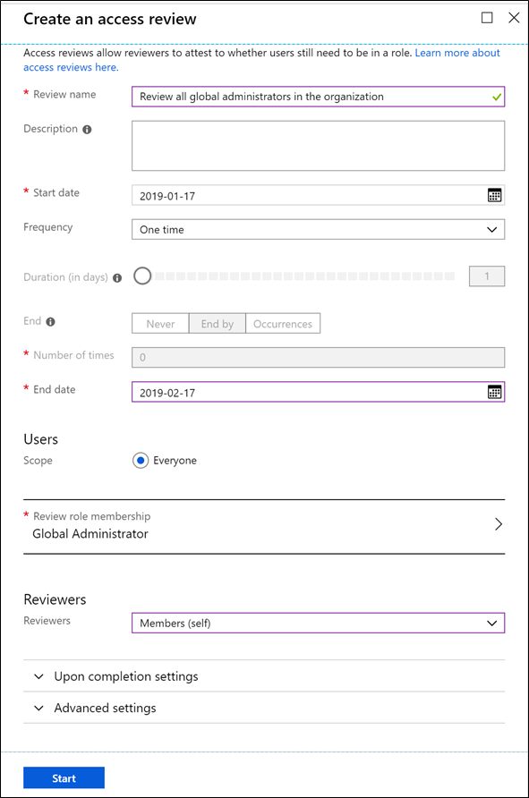

# Deploy Azure AD Privileged Identity Management (PIM)

This step-by-step guide describes how to plan the deployment of Privileged Identity Management (PIM) in your Azure Active Directory (Azure AD) organization.

> [!TIP]
> Throughout this article, you will see items marked as:
> 
> :heavy_check_mark: **Microsoft recommends**
> 
> These are general recommendations, and you should only implement if they apply to your specific enterprise needs.

## Learn about Privileged Identity Management

Azure AD Privileged Identity Management helps you to manage privileged administrative roles across Azure AD, Azure resources, and other Microsoft Online Services. In a world where privileged identities are assigned and forgotten, Privileged Identity Management provides solutions like just-in-time access, request approval workflows, and fully integrated access reviews so you can identify, uncover, and prevent malicious activities of privileged roles in real time. Deploying Privileged Identity Management to manage your privileged roles throughout your organization will greatly reduce risk while surfacing valuable insights about the activities of your privileged roles.

### Business value of Privileged Identity Management

**Manage risk** - Secure your organization by enforcing the principle of [least privilege access](/windows-server/identity/ad-ds/plan/security-best-practices/implementing-least-privilege-administrative-models) and just-in-time access. By minimizing the number of permanent assignments of users to privileged roles and enforcing approvals and MFA for elevation, you can greatly reduce security risks related to privileged access in your organization. Enforcing least privilege and just-in-time access will also allow you to view a history of access to privileged roles and track down security issues as they happen.

**Address compliance and governance** - Deploying Privileged Identity Management creates an environment for on-going identity governance. Just-in-time elevation of privileged identities provides a way for Privileged Identity Management to keep track of privileged access activities in your organization. You will also be able to view and receive notifications for all assignments of permanent and eligible roles inside your organization. Through access review, you can regularly audit and remove unnecessary privileged identities and make sure your organization is compliant with the most rigorous identity, access, and security standards.

**Reduce costs** - Reduce costs by eliminating inefficiencies, human error, and security issues by deploying Privileged Identity Management correctly. The net result is a reduction of cyber crimes associated with privileged identities, which are costly and difficult to recover from. Privileged Identity Management will also help your organization reduce cost associated with auditing access information when it comes to complying with regulations and standards.

For more information, see [What is Azure AD Privileged Identity Management?](pim-configure.md).

### Licensing requirements

To use Privileged Identity Management, your directory must have one of the following paid or trial licenses:

- Azure AD Premium P2
- Enterprise Mobility + Security (EMS) E5
- Microsoft 365 M5

For more information, see [License requirements to use Privileged Identity Management](subscription-requirements.md).

### Key terminology

| Term or concept | Description |
| --- | --- |
| eligible | A role assignment that requires a user to perform one or more actions to use the role. If a user has been made eligible for a role, that means they can activate the role when they need to perform privileged tasks. There's no difference in the access given to someone with a permanent versus an eligible role assignment. The only difference is that some people don't need that access all the time. |
| activate | The process of performing one or more actions to use a role that a user is eligible for. Actions might include performing a multi-factor authentication (MFA) check, providing a business justification, or requesting approval from designated approvers. |
| just-in-time (JIT) access | A model in which users receive temporary permissions to perform privileged tasks, which prevents malicious or unauthorized users from gaining access after the permissions have expired. Access is granted only when users need it. |
| principle of least privilege access | A recommended security practice in which every user is provided with only the minimum privileges needed to accomplish the tasks they are authorized to perform. This practice minimizes the number of Global Administrators and instead uses specific administrator roles for certain scenarios. |

For more information, see [Terminology](pim-configure.md#terminology).

### High-level overview of how Privileged Identity Management works

1. Privileged Identity Management is set up so that users are eligible for privileged roles.
1. When an eligible user needs to use their privileged role, they activate the role in Privileged Identity Management.
1. Depending on the Privileged Identity Management settings configured for the role, the user must complete certain steps (such as performing multi-factor authentication, getting approval, or specifying a reason.)
1. Once the user successfully activates their role, they will get the role for a pre-configured time period.
1. Administrators can view a history of all Privileged Identity Management activities in the audit log. They can also further secure their Azure AD organizations and meet compliance using Privileged Identity Management features like access reviews and alerts.

For more information, see [What is Azure AD Privileged Identity Management?](pim-configure.md).

### Roles that can be managed by Privileged Identity Management

**Azure AD roles** – These roles are all in Azure Active Directory (such as Global Administrator, Exchange Administrator, and Security Administrator). You can read more about the roles and their functionality in [Administrator role permissions in Azure Active Directory](../users-groups-roles/directory-assign-admin-roles.md). For help with determining which roles to assign your administrators, see [least privileged roles by task](../users-groups-roles/roles-delegate-by-task.md).

**Azure resource roles** – These roles are linked to an Azure resource, resource group, subscription, or management group. Privileged Identity Management provides just-in-time access to both built-in roles like Owner, User Access Administrator, and Contributor, as well as [custom roles](../../role-based-access-control/custom-roles.md). For more information about Azure resource roles, see [role-based access control (RBAC)](../../role-based-access-control/overview.md).

For more information, see [Roles you cannot manage in Privileged Identity Management](pim-roles.md).

## Plan your deployment

This section focuses on what you need to do before deploying Privileged Identity Management in your organization. It is essential to follow the instructions and understand the concepts in this section as they will guide you to create the best plan tailored for your organization’s privileged identities.

### Identify your stakeholders

The following section helps you identify all the stakeholders that are involved in the project and need to sign off, review, or stay informed. It includes separate tables for deploying Privileged Identity Management for Azure AD roles and Privileged Identity Management for Azure resource roles. Add stakeholders to the following table as appropriate for your organization.

- SO = Sign off on this project
- R = Review this project and provide input
- I = Informed of this project

#### Stakeholders: Privileged Identity Management For Azure AD roles

| Name | Role | Action |
| --- | --- | --- |
| Name and email | **Identity architect or Azure Global Administrator** A representative from the identity management team in charge of defining how this change is aligned with the core identity management infrastructure in your organization. | SO/R/I |
| Name and email | **Service owner / Line manager** A representative from the IT owners of a service or a group of services. They are key in making decisions and helping to roll out Privileged Identity Management for their team. | SO/R/I |
| Name and email | **Security owner** A representative from the security team that can sign off that the plan meets the security requirements of your organization. | SO/R |
| Name and email | **IT support manager / Helpdesk** A representative from the IT support organization who can provide input on the supportability of this change from a helpdesk perspective. | R/I |
| Name and email for pilot users | **Privileged role users** The group of users for which privileged identity management is implemented. They will need to know how to activate their roles once Privileged Identity Management is implemented. | I |

#### Stakeholders: Privileged Identity Management For Azure resource roles

| Name | Role | Action |
| --- | --- | --- |
| Name and email | **Subscription / Resource owner** A representative from the IT owners of each subscription or resource that you want to deploy Privileged Identity Management for | SO/R/I |
| Name and email | **Security owner** A representative from the security team that can sign off that the plan meets the security requirements of your organization. | SO/R |
| Name and email | **IT support manager / Helpdesk** A representative from the IT support organization who can provide input on the supportability of this change from a helpdesk perspective. | R/I |
| Name and email for pilot users | **RBAC role users** The group of users for which privileged identity management is implemented. They will need to know how to activate their roles once Privileged Identity Management is implemented. | I |

### Enable Privileged Identity Management

As part of the planning process, you must first consent to and enable Privileged Identity Management by following our [start using Privileged Identity Management](pim-getting-started.md) article. Enabling Privileged Identity Management gives you access to some features that are specifically designed to help with your deployment.

If your objective is to deploy Privileged Identity Management for Azure resources, you should follow our [discover Azure resources to manage in Privileged Identity Management](pim-resource-roles-discover-resources.md) article. Only owners of subscriptions and management groups can discover and onboard these resources onto Privileged Identity Management. After it is onboarded, the PIM functionality is available for owners at all levels including management group, subscription, resource group, and resource. If you are a Global Administrator trying to deploy Privileged Identity Management for your Azure resources, you can [elevate access to manage all Azure subscriptions](../../role-based-access-control/elevate-access-global-admin.md?toc=%2fazure%2factive-directory%2fprivileged-identity-management%2ftoc.json) to give yourself access to all Azure resources in the directory for discovery. However, we advise that you get approval from each of your subscription owners before managing their resources with Privileged Identity Management.

### Enforce principle of least privilege

It is important to make sure that you have enforced the principle of least privilege in your organization for both your Azure AD and your Azure resource roles.

#### Azure AD roles

For Azure AD roles, it is common for organizations to assign the Global Administrator role to a significant number of administrators when most administrators only need one or two specific administrator roles. Privileged role assignments also tend to be left unmanaged.

> [!NOTE]
> Common pitfalls in role delegation:
>
> - The administrator in charge of Exchange is given the Global Administrator role even though they only need the Exchange Administrator role to perform their day to day job.
> - The Global Administrator role is assigned to an Office administrator because the administrator needs both Security and SharePoint administrator roles and it is easier to just delegate one role.
> - The administrator was assigned a Security Administrator role to perform a task long ago, but was never removed.

Follow these steps to enforce the principle of least privilege for your Azure AD roles.

1. Understand the granularity of the roles by reading and understanding the [available Azure AD administrator roles](../users-groups-roles/directory-assign-admin-roles.md#available-roles). You and your team should also reference [administrator roles by identity task in Azure AD](../users-groups-roles/roles-delegate-by-task.md), which explains the least privileged role for specific tasks.

1. List who has privileged roles in your organization. You can use the [Privileged Identity Management wizard](pim-security-wizard.md#run-the-wizard) to get to a page like the following.

    

1. For all Global Administrators in your organization, find out why they need the role. Based on reading the previous documentation, if the person’s job can be performed by one or more granular administrator roles, you should remove them from the Global Administrator role and make assignments accordingly inside Azure Active Directory (As a reference: Microsoft currently only has about 10 administrators with the Global Administrator role. Learn more at [how Microsoft uses Privileged Identity Management](https://www.microsoft.com/itshowcase/Article/Content/887/Using-Azure-AD-Privileged-Identity-Management-for-elevated-access)).

1. For all other Azure AD roles, review the list of assignments, identify administrators who no longer need the role, and remove them from their assignments.

To automate the last two steps, you can use access reviews in Privileged Identity Management. Following the steps in [start an access review for Azure AD roles in Privileged Identity Management](pim-how-to-start-security-review.md), you can set up an access review for every Azure AD role that has one or more members.

You should set the reviewers to **Members (self)**. This will send out an email to all members in the role to get them to confirm whether they need the access. You should also turn on **Require reason on approval** in the advanced settings so that users can state why they need the role. Based on this information, you will be able to remove users from unnecessary roles and delegate more granular administrator roles in the case of Global Administrators.

Access reviews rely on emails to notify people to review their access to the roles. If you have privileged accounts that don’t have emails linked, be sure to populate the secondary email field on those accounts. For more information, see [proxyAddresses attribute in Azure AD](https://support.microsoft.com/help/3190357/how-the-proxyaddresses-attribute-is-populated-in-azure-ad).

#### Azure resource roles

For Azure subscriptions and resources, you can set up a similar Access review process to review the roles in each subscription or resource. The goal of this process is to minimize Owner and User Access Administrator assignments attached to each subscription or resource as well as to remove unnecessary assignments. However, organizations often delegate such tasks to the owner of each subscription or resource because they have a better understanding of the specific roles (especially custom roles).

If you are an IT administrator with the Global Administrator role trying to deploy Privileged Identity Management for Azure resources in your organization, you can [elevate access to manage all Azure subscriptions](../../role-based-access-control/elevate-access-global-admin.md?toc=%2fazure%2factive-directory%2fprivileged-identity-management%2ftoc.json) to get access to each subscription. You can then find each subscription owner and work with them to remove unnecessary assignments and minimize owner role assignment.

Users with the Owner role for an Azure subscription can also utilize [access reviews for Azure resources](pim-resource-roles-start-access-review.md) to audit and remove unnecessary role assignments similar to the process described earlier for Azure AD roles.

### Decide which role assignments should be protected by Privileged Identity Management

After cleaning up privileged role assignments in your organization, you will need to decide which roles to protect with Privileged Identity Management.

If a role is protected by Privileged Identity Management, eligible users assigned to it must elevate to use the privileges granted by the role. The elevation process may also include obtaining approval, performing multi-factor authentication, and/or providing a reason why they are activating. Privileged Identity Management can also track elevations through notifications and the Privileged Identity Management and Azure AD audit event logs.

Choosing which roles to protect with Privileged Identity Management can be difficult and will be different for each organization. This section provides our best practice advice for Azure AD and Azure resource roles.

#### Azure AD roles

It is important to prioritize protecting Azure AD roles that have the most number of permissions. Based on usage patterns among all Privileged Identity Management customers, the top 10 Azure AD roles managed by Privileged Identity Management are:

1. Global administrator
1. Security administrator
1. User administrator
1. Exchange administrator
1. SharePoint administrator
1. Intune administrator
1. Security reader
1. Service administrator
1. Billing administrator
1. Skype for Business administrator

> [!TIP]
> :heavy_check_mark: **Microsoft recommends** you manage all your Global Administrators and Security Administrators using Privileged Identity Management as a first step as they are the ones that can do the most harm when compromised.

It is important to consider what data and permission are most sensitive for your organization. As an example, some organizations may want to protect their Power BI Administrator role or their Teams Administrator role using Privileged Identity Management as they have the ability to access data and/or change core workflows.

If there are any roles with guest users assigned, they are particularly vulnerable to attack.

> [!TIP]
> :heavy_check_mark: **Microsoft recommends** you manage all roles with guest users using Privileged Identity Management to reduce risk associated with compromised guest user accounts.

Reader roles like the Directory Reader, Message Center Reader, and Security Reader are sometimes believed to be less important compared to other roles as they don’t have write permission. However, we have seen some customers also protect these roles because attackers who have gained access to these accounts may be able to read sensitive data, such as personal data. You should take this into consideration when deciding whether reader roles in your organization need to be managed using Privileged Identity Management.

#### Azure resource roles

When deciding which role assignments should be managed using Privileged Identity Management for Azure resource, you must first identify the subscriptions/resources that are most vital for your organization. Examples of such subscriptions/resources are:

- Resources that host the most sensitive data
- Resources that core, customer-facing applications depend on

If you are a Global Administrator having trouble deciding which subscriptions/resources are most important, you should reach out to subscription owners in your organization to gather a list of resources managed by each subscription. You should then work with the subscription owners to group the resources based on severity level in the case they are compromised (low, medium, high). You should prioritize managing resources with Privileged Identity Management based on this severity level.

> [!TIP]
> :heavy_check_mark: **Microsoft recommends** you work with subscription/resource owners of critical services to set up Privileged Identity Management workflow for all roles inside sensitive subscriptions/resources.

Privileged Identity Management for Azure resources supports time-bound service accounts. You should treat service accounts exactly the same as how you would treat a regular user account.

For subscriptions/resources that are not as critical, you won’t need to set up Privileged Identity Management for all roles. However, you should still protect the Owner and User Access Administrator roles with Privileged Identity Management.

> [!TIP]
> :heavy_check_mark: **Microsoft recommends** you manage Owner roles and User Access Administrator roles of all subscriptions/resources using Privileged Identity Management.

### Decide which role assignments should be permanent or eligible

Once you have decided the list of roles to be managed by Privileged Identity Management, you must decide which users should get the eligible role versus the permanently active role. Permanently active roles are the normal roles assigned through Azure Active Directory and Azure resources while eligible roles can only be assigned in Privileged Identity Management.

> [!TIP]
> :heavy_check_mark: **Microsoft recommends** you have zero permanently active assignments for both Azure AD roles and Azure resource roles other than the recommended [two break-glass emergency access accounts](../users-groups-roles/directory-emergency-access.md), which should have the permanent Global Administrator role.

Even though we recommend zero standing administrator, it is sometimes difficult for organizations to achieve this right away. Here are things to consider when making this decision:

- Frequency of elevation – If the user only needs the privileged assignment once, they shouldn’t have the permanent assignment. On the other hand, if the user needs the role for their day-to-day job and using Privileged Identity Management would greatly reduce their productivity, they can be considered for the permanent role.
- Cases specific to your organization – If the person being given the eligible role is from a very distant team or a high-ranking executive to the point that communicating and enforcing the elevation process is difficult, they can be considered for the permanent role.

> [!TIP]
> :heavy_check_mark: **Microsoft recommends** you to set up recurring access reviews for users with permanent role assignments (should you have any). Learn more about recurring access review in the final section of this deployment plan

### Draft your Privileged Identity Management settings

Before you implement your Privileged Identity Management solution, it is good practice to draft your Privileged Identity Management settings for every privileged role your organization uses. This section has some examples of Privileged Identity Management settings for particular roles (they are only for reference and might be different for your organization). Each of these settings is explained in detail with Microsoft’s recommendations after the tables.

#### Privileged Identity Management settings for Azure AD roles

| Role | Require MFA | Notification | Incident ticket | Require approval | Approver | Activation Duration | Permanent admin |
| --- | :---: | :---: | :---: | :---: | :---: | :---: | :---: |
| Global Administrator | :heavy_check_mark: | :heavy_check_mark: | :heavy_check_mark: | :heavy_check_mark: | Other Global Administrators | 1 Hour | Emergency access accounts |
| Exchange Administrator | :heavy_check_mark: | :heavy_check_mark: | :x: | :x: | None | 2 Hour | None |
| Helpdesk Administrator | :x: | :x: | :heavy_check_mark: | :x: | None | 8 Hour | None |

#### Privileged Identity Management settings for Azure resource roles

| Role | Require MFA | Notification | Require approval | Approver | Activation duration | Active admin | Active expiration | Eligible expiration |
| --- | :---: | :---: | :---: | :---: | :---: | :---: | :---: | :---: |
| Owner of critical subscriptions | :heavy_check_mark: | :heavy_check_mark: | :heavy_check_mark: | Other owners of the subscription | 1 Hour | None | n/a | 3 month |
| User Access Administrator of less critical subscriptions | :heavy_check_mark: | :heavy_check_mark: | :x: | None | 1 Hour | None | n/a | 3 month |
| Virtual Machine Contributor | :x: | :heavy_check_mark: | :x: | None | 3 Hour | None | n/a | 6 month |

The following table describes each of the settings.

| Setting | Description |
| --- | --- |
| Role | Name of the role you are defining the settings for. |
| Require MFA | Whether the eligible user needs to perform MFA before activating the role.   :heavy_check_mark: **Microsoft recommends** you enforce MFA for all administrator roles, especially if the roles have guest users. |
| Notification | If set to true, Global Administrator, Privileged Role Administrator, and Security Administrator in the organization will receive an email notification when an eligible user activates the role.  **Note:** Some organizations don’t have an email address tied to their administrator accounts, to get these email notifications, you should go set an alternative email address so administrators will receive these emails. |
| Incident ticket | Whether the eligible user needs to record an incident ticket number when activating their role. This setting helps an organization identify each activation with an internal incident number to mitigate unwanted activations.   :heavy_check_mark: **Microsoft recommends** taking advantage of incident ticket numbers to tie Privileged Identity Management into your internal system. This is particularly useful for approvers who need context for the activation. |
| Require approval | Whether the eligible user needs to get approval to activate the role.   :heavy_check_mark: **Microsoft recommends** you to set up approval for roles with the most permission. Based on usage patterns of all Privileged Identity Management customers, Global Administrator, User Administrator, Exchange Administrator, Security Administrator, and Password Administrator are the most common roles with approval setup. |
| Approver | If approval is required to activate the eligible role, list out the people who should approve the request. By default, Privileged Identity Management sets the approver to be all users who are a privileged role administrator whether they are permanent or eligible.  **Note:** If a user is both eligible for an Azure AD role and an approver of the role, they will not be able to approve themselves.   :heavy_check_mark: **Microsoft recommends** that you choose approvers to be those who are most knowledgeable about the specific role and its frequent users rather than a Global Administrator. |
| Activation duration | The length of time a user will be activated in the role before it will expire. |
| Permanent admin | List of users who will be a permanent administrator for the role (never have to activate).   :heavy_check_mark: **Microsoft recommends** you have zero standing administrator for all roles except for Global Administrators. Read more about it in the who should be made eligible and who should be permanently active section of this plan. |
| Active admin | For Azure resources, active administrator is the list of users who will never have to activate to use the role. This is not referred to as permanent administrator like in Azure AD roles because you can set an expiration time for when the user will lose this role. |
| Active expiration | An active role assignment for Azure resource roles expire after this configured time period. You can choose from 15 days, 1 month, 3 month, 6 month, 1 year or permanently active. |
| Eligible expiration | An eligible role assignment for Azure resource roles expire after this configured time period. You can choose from 15 days, 1 month, 3 month, 6 month, 1 year or permanently eligible. |

## Implement your solution

The foundation of proper planning is the basis upon which you can deploy an application successfully with Azure Active Directory.  It provides intelligent security and integration that simplifies onboarding while reducing the time for successful deployments.  This combination ensures that your application is integrated with ease while mitigating down time for your end users.

### Identify test users

Use this section to identify a set of users and or groups of users to validate the implementation. Based on the settings that you selected in the planning section, identify the users that you want to test for each role.

> [!TIP]
> :heavy_check_mark: **Microsoft recommends** you make service owners of each Azure AD role to be the test users so they can become familiar with the process and become an internal advocator for the roll out.

In this table, identify the test users that will verify that the settings for each role is working.

| Role name | Test users |
| --- | --- |
| &lt;Role name&gt; | &lt;Users to test the role&gt; |
| &lt;Role name&gt; | &lt;Users to test the role&gt; |

### Test implementation

Now that you have identified the test users, use this step to configure Privileged Identity Management for your test users. If your organization wants to incorporate Privileged Identity Management workflow into your own internal application instead of using Privileged Identity Management in the Azure portal, all the operations in Privileged Identity Management are also supported through our [graph API](https://docs.microsoft.com/graph/api/resources/privilegedidentitymanagement-root).

#### Configure Privileged Identity Management for Azure AD roles

1. [Configure the Azure AD role settings](pim-how-to-change-default-settings.md) based on what you planned.

1. Navigate to **Azure AD roles**, click **Roles**, and then select the role you just configured.

1. For the group of test users, if they are already a permanent administrator, you can make them eligible by searching for them and converting them from permanent to eligible by clicking the three dots on their row. If they don’t have the role assignments yet, you can [make a new eligible assignment](pim-how-to-add-role-to-user.md#make-a-user-eligible-for-a-role).

1. Repeat steps 1-3 for all the roles you want to test.

1. Once you have set up the test users, you should send them the link for how to [activate their Azure AD role](pim-how-to-activate-role.md).

#### Configure Privileged Identity Management for Azure resource roles

1. [Configure the Azure resource role settings](pim-resource-roles-configure-role-settings.md) for a role inside a subscription or resource that you want to test.

1. Navigate to **Azure resources** for that subscription and click **Roles**, select the role you just configured.

1. For the group of test users, if they are already an active administrator, you can make them eligible by searching for them and [update their role assignment](pim-resource-roles-assign-roles.md#update-or-remove-an-existing-role-assignment). If they don’t have the role yet, you can [assign a new role](pim-resource-roles-assign-roles.md#assign-a-role).

1. Repeat steps 1-3 for all the roles you want to test.

1. Once you have set up the test users, you should send them the link for how to [activate their Azure resource role](pim-resource-roles-activate-your-roles.md).

You should use this stage to verify whether all the configuration you set up for the roles are working correctly. Use the following table to document your tests. You should also use this stage to optimize the communication with affected users.

| Role | Expected behavior during activation | Actual results |
| --- | --- | --- |
| Global Administrator | (1) Require MFA (2) Require Approval (3) Approver receives notification and can approve (4) Role expires after preset time |  |
| Owner of subscription *X* | (1) Require MFA (2) eligible assignment expires after configured time period |  |

### Communicate Privileged Identity Management to affected stakeholders

Deploying Privileged Identity Management will introduce additional steps for users of privileged roles. Although Privileged Identity Management greatly reduces security issues associated with privileged identities, the change needs to be effectively communicated before the organization-wide deployment. Depending on the number of impacted administrators, organizations often elect to create an internal document, a video, or an email about the change. Frequently included in these communications include:

- What is PIM
- What is the benefit for the organization
- Who will be affected
- When will PIM be rolled out
- What additional steps will be required for users to activate their role
    - You should send links to our documentation:
    - [Activate Azure AD roles](pim-how-to-activate-role.md)
    - [Activate Azure resource roles](pim-resource-roles-activate-your-roles.md)
- Contact information or helpdesk link for any issues associated with PIM

> [!TIP]
> :heavy_check_mark: **Microsoft recommends** you to set up time with your helpdesk/support team to walk them through the Privileged Identity Management workflow (if your organization has an internal IT support team). Provide them with the appropriate documentations as well as your contact information.

### Move to production

Once your testing is complete and successful, move Privileged Identity Management to production by repeating all the steps in the testing phases for all the users of each role you defined in your Privileged Identity Management configuration. For Privileged Identity Management for Azure AD roles, organizations often test and roll out Privileged Identity Management for Global Administrators before testing and rolling out Privileged Identity Management for other roles. Meanwhile for Azure resource, organizations normally test and roll out Privileged Identity Management one Azure subscription at a time.

### In the case a rollback is needed

If Privileged Identity Management failed to work as desired in the production environment, the following rollback steps can assist you to revert back to a known good state before setting up Privileged Identity Management:

#### Azure AD roles

1. Sign in to the [Azure portal](https://portal.azure.com/).
1. Open **Azure AD Privileged Identity Management**.
1. Click **Azure AD roles** and then click **Roles**.
1. For each role that you have configured, click the ellipsis (**...**) for all users with an eligible assignment.
1. Click the **Make permanent** option to make the role assignment permanent.

#### Azure resource roles

1. Sign in to the [Azure portal](https://portal.azure.com/).
1. Open **Azure AD Privileged Identity Management**.
1. Click **Azure resources** and then click a subscription or resource you want to roll back.
1. Click **Roles**.
1. For each role that you have configured, click the ellipsis (**...**) for all users with an eligible assignment.
1. Click the **Make permanent** option to make the role assignment permanent.

## Next steps after deploying

Successfully deploying Privileged Identity Management in production is a significant step forward in terms of securing your organization’s privileged identities. With the deployment of Privileged Identity Management comes additional Privileged Identity Management features that you should use for security and compliance.

### Use Privileged Identity Management alerts to safeguard your privileged access

You should utilize Privileged Identity Management’s built-in alerting functionality to better safeguard your organization. For more information, see [security alerts](pim-how-to-configure-security-alerts.md#security-alerts). These alerts include: administrators aren’t using privileged roles, roles are being assigned outside of Privileged Identity Management, roles are being activated too frequently and more. To fully protect your organization, you should regularly go through your list of alerts and fix the issues. You can view and fix your alerts the following way:

1. Sign in to the [Azure portal](https://portal.azure.com/).
1. Open **Azure AD Privileged Identity Management**.
1. Click **Azure AD roles** and then click **Alerts**.

> [!TIP]
> :heavy_check_mark: **Microsoft recommends** you deal with all alerts marked with high severity immediately. For medium and low severity alerts, you should stay informed and make changes if you believe there is a security threat.

If any of the specific alerts aren’t useful or does not apply to your organization, you can always dismiss the alert on the alerts page. You can always revert this dismissal later in the Azure AD settings page.

### Set up recurring access reviews to regularly audit your organization’s privileged identities

Access reviews are the best way for you to ask users assigned with privileged roles or specific reviewers whether each user need the privileged identity. Access reviews are great if you want to reduce attack surface and stay compliant. For more information about starting an access review, see [Azure AD roles access reviews](pim-how-to-start-security-review.md) and [Azure resource roles access reviews](pim-resource-roles-start-access-review.md). For some organizations, performing periodic access review is required to stay compliant with laws and regulations while for others, access review is the best way to enforce the principal of least privilege throughout your organization.

> [!TIP]
> :heavy_check_mark: **Microsoft recommends** you set up quarterly access reviews for all your Azure AD and Azure resource roles.

In most cases, the reviewer for Azure AD roles is the users themselves while the reviewer for Azure resource roles is the owner of the subscription, which the role is in. However, it is often the case where companies have privileged accounts that are not linked with any particular person’s email address. In those cases, no one reads and reviews the access.

> [!TIP]
> :heavy_check_mark: **Microsoft recommends** you add a secondary email address for all accounts with privileged role assignments that are not linked to a regularly checked email address

### Get the most out of your audit log to improve security and compliance

The Audit log is the place where you can stay up-to-date and be compliant with regulations. Privileged Identity Management currently stores a 30-day history of all your organization’s history inside its audit log including:

- Activation/deactivation of eligible roles
- Role assignment activities inside and outside of Privileged Identity Management
- Changes in role settings
- Request/approve/deny activities for role activation with approval setup
- Update to alerts

You can access these audit logs if you are a Global Administrator or a privileged role administrator. For more information, see [audit history for Azure AD roles](pim-how-to-use-audit-log.md) and [audit history for Azure resource roles](azure-pim-resource-rbac.md).

> [!TIP]
> :heavy_check_mark: **Microsoft recommends** you to have at least one administrator read through all audit events on a weekly basis and export your audit events on a monthly basis.

If you want to automatically store your audit events for a longer period of time, Privileged Identity Management’s audit log is automatically synced into the [Azure AD audit logs](../reports-monitoring/concept-audit-logs.md).

> [!TIP]
> :heavy_check_mark: **Microsoft recommends** you to set up [Azure log monitoring](../reports-monitoring/concept-activity-logs-azure-monitor.md) to archive audit events in an Azure storage account for the need of security and compliance.
