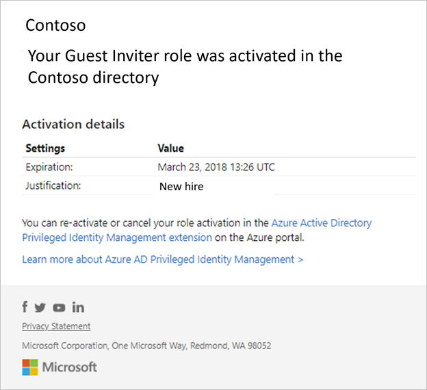
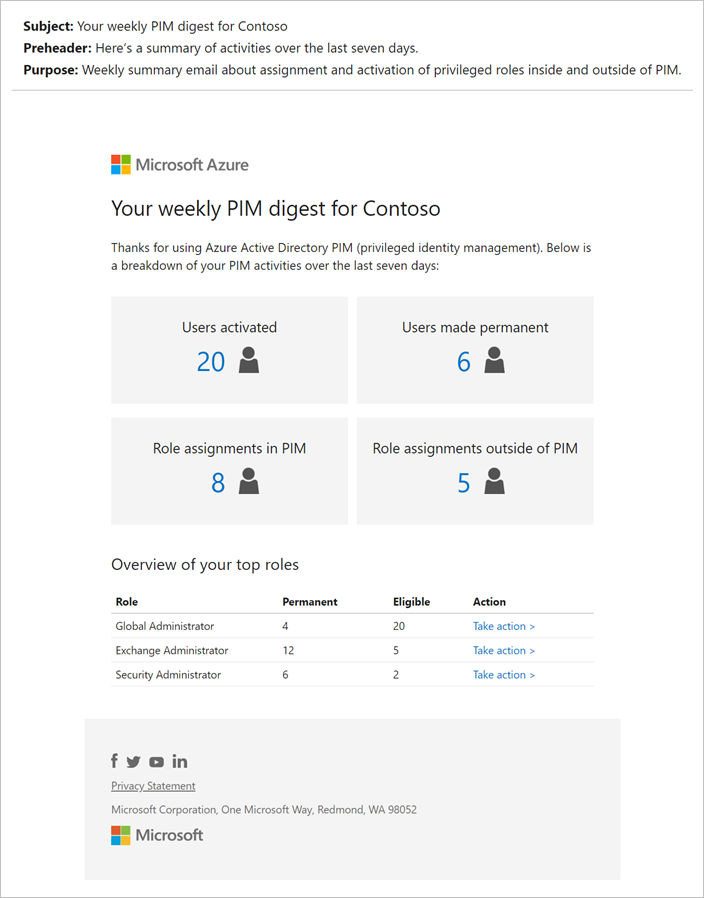
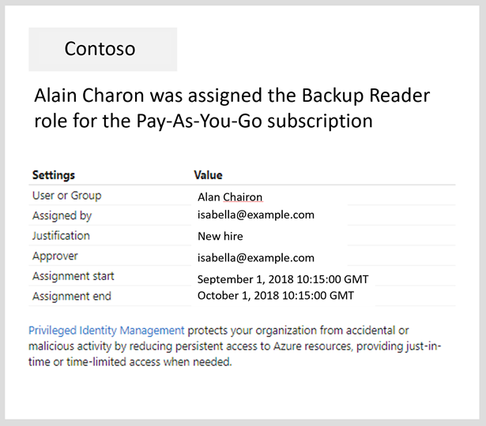

# Email notifications in PIM

Privileged Identity Management (PIM) lets you know when important events occur in your Azure Active Directory (Azure AD) organization, such as when a role is assigned or activated. Privileged Identity Management keeps you informed by sending you and other participants email notifications. These emails might also include links to relevant tasks, such activating or renewing a role. This article describes what these emails look like, when they are sent, and who receives them.

>[!NOTE]
>One event in Privileged Identity Management can generate email notifications to multiple recipients – assignees, approvers, or administrators. The maximum number of notifications sent per one event is 1000. If the number of recipients exceeds 1000 – only the first 1000 recipients will receive an email notification. This does not prevent other assignees, administrators, or approvers from using their permissions in Microsoft Entra and Privileged Identity Management.

## Sender email address and subject line

Emails sent from Privileged Identity Management for both Azure AD and Azure resource roles have the following sender email address:

- Email address:  **azure-noreply\@microsoft.com**
- Display name: Microsoft Azure

These emails include a **PIM** prefix in the subject line. Here's an example:

- PIM: Alain Charon was permanently assigned the Backup Reader role

## Email timing for activation approvals

When users activate their role and the role setting requires approval, approvers will receive two emails for each approval:

- Request to approve or deny the user's activation request (sent by the request approval engine)
- The user's request is approved (sent by the request approval engine)

Also, Global Administrators and Privileged Role Administrators receive an email for each approval:

- The user's role is activated (sent by Privileged Identity Management)

The first two emails sent by the request approval engine can be delayed. Currently, 90% of emails take three to ten minutes, but for 1% customers it can be much longer, up to fifteen minutes.

If an approval request is approved in the Azure portal before the first email is sent, the first email will no longer be triggered and other approvers won't be notified by email of the approval request. It might appear as if the they didn't get an email but it's the expected behavior.

## Notifications for Azure AD roles

Privileged Identity Management sends emails when the following events occur for Azure AD roles:

- When a privileged role activation is pending approval
- When a privileged role activation request is completed
- When Azure AD Privileged Identity Management is enabled

Who receives these emails for Azure AD roles depends on your role, the event, and the notifications setting.

| User | Role activation is pending approval | Role activation request is completed | PIM is enabled |
| --- | --- | --- | --- |
| Privileged Role Administrator (Activated) | Yes (only if no explicit approvers are specified) | Yes* | Yes |
| Security Administrator (Activated) | No | Yes* | Yes |
| Global Administrator (Activated) | No | Yes* | Yes |

\* If the [**Notifications** setting](pim-how-to-change-default-settings.md) is set to **Enable**.

The following shows an example email that is sent when a user activates an Azure AD role for the fictional Contoso organization.

### Weekly Privileged Identity Management digest email for Azure AD roles

A weekly Privileged Identity Management summary email for Azure AD roles is sent to Privileged Role Administrators, Security Administrators, and Global Administrators that have enabled Privileged Identity Management. This weekly email provides a snapshot of Privileged Identity Management activities for the week as well as privileged role assignments. It is only available for Azure AD organizations on the public cloud. Here's an example email:

The email includes:

| Tile | Description |
| --- | --- |
| **Users activated** | Number of times users activated their eligible role inside the organization. |
| **Users made permanent** | Number of times users with an eligible assignment is made permanent. |
| **Role assignments in Privileged Identity Management** | Number of times users are assigned an eligible role inside Privileged Identity Management. |
| **Role assignments outside of PIM** | Number of times users are assigned a permanent role outside of Privileged Identity Management (inside Azure AD). This alert and the accompanying email can be enabled or disabled by opening the alert settings. |

The **Overview of your top roles** section lists the top five roles in your organization based on total number of permanent and eligible administrators for each role. The **Take action** link opens [Discovery & Insights](pim-security-wizard.md) where you can convert permanent administrators to eligible administrators in batches.

## Notifications for Azure resource roles

Privileged Identity Management sends emails to Owners and User Access Administrators when the following events occur for Azure resource roles:

- When a role assignment is pending approval
- When a role is assigned
- When a role is soon to expire
- When a role is eligible to extend
- When a role is being renewed by an end user
- When a role activation request is completed

Privileged Identity Management sends emails to end users when the following events occur for Azure resource roles:

- When a role is assigned to the user
- When a user's role is expired
- When a user's role is extended
- When a user's role activation request is completed

The following shows an example email that is sent when a user is assigned an Azure resource role for the fictional Contoso organization.

## Notifications for PIM for Groups

Privileged Identity Management sends emails to Owners only when the following events occur for PIM for Groups assignments:

- When an Owner or Member role assignment is pending approval
- When an Owner or Member role is assigned
- When an Owner or Member role is soon to expire
- When an Owner or Member role is eligible to extend
- When an Owner or Member role is being renewed by an end user
- When an Owner or Member role activation request is completed

Privileged Identity Management sends emails to end users when the following events occur for PIM for Groups role assignments:

- When an Owner or Member role is assigned to the user
- When a user's an Owner or Member role is expired
- When a user's an Owner or Member role is extended
- When a user's an Owner or Member role activation request is completed

## Next steps

- [Configure Azure AD role settings in Privileged Identity Management](pim-how-to-change-default-settings.md)
- [Approve or deny requests for Azure AD roles in Privileged Identity Management](azure-ad-pim-approval-workflow.md)
