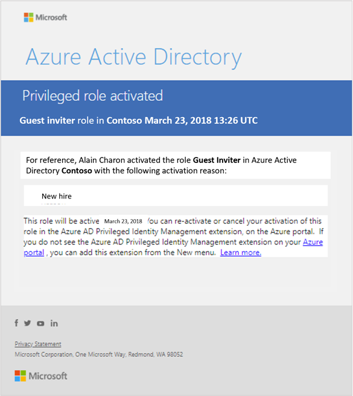
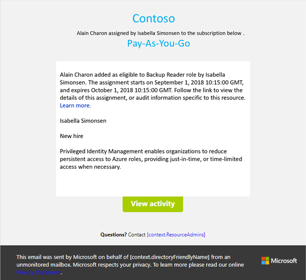

# Email notifications in PIM

Azure AD Privileged Identity Management (PIM) lets you know when important events occur, such as when a role is assigned or activated. PIM keeps you informed by sending you and other participants email notifications. These emails might also include links to relevant tasks, such activating or renewing a role. This article describes what these emails look like, when they are sent, and who receives them.

## Sender email address and subject line

Emails sent from PIM for both Azure AD and Azure resource roles have the following sender email address:

- Email address:  **azure-noreply@microsoft.com**
- Display name: Microsoft Azure

These emails include a **PIM** prefix in the subject line. Here's an example:

- PIM: Alain Charon was permanently assigned the Backup Reader role

## PIM emails for Azure AD roles

PIM sends emails when the following events occur for Azure AD roles:

- When a privileged role activation is pending approval
- When a privileged role activation request is completed
- When a privileged role is assigned as eligible
- When Azure AD PIM is enabled

Who receives these emails for Azure AD roles depends on your role, the event, and the notifications setting:

| User | Role activation is pending approval | Role activation request is completed | Role is assigned as eligible | PIM is enabled |
| --- | --- | --- | --- | --- |
| Privileged Role Administrator (Activated/Eligible) | Yes (only if no explicit approvers are specified) | Yes* | Yes | Yes |
| Security Administrator (Activated/Eligible) | No | Yes* | Yes | Yes |
| Global Administrator (Activated/Eligible) | No | Yes* | Yes | Yes |

\* If the [**Notifications** setting](pim-how-to-change-default-settings.md#notifications) is set to **Enable**.

The following shows an example email that is sent when a user activates an Azure AD role for the fictional Contoso organization.

### Weekly PIM digest email for Azure AD roles

A weekly PIM summary email for Azure AD roles is sent to Privileged Role Administrators, Security Administrators, and Global Administrators that have enabled PIM. This weekly email provides a snapshot of PIM activities for the week as well as privileged role assignments. Here's an example email:

The email includes four tiles:

| Tile | Description |
| --- | --- |
| **Users activated** | Number of times users activated their eligible role inside the tenant. |
| **Users made permanent** | Number of times users with an eligible assignment is made permanent. |
| **Role assignments in PIM** | Number of times users are assigned an eligible role inside PIM. |
| **Role assignments outside of PIM** | Number of times users are assigned a permanent role outside of PIM (inside Azure AD). |

The **Overview of your top roles** section lists your top five roles based on total number of permanent and eligible administrators for each role. The **Take action** link opens the [PIM wizard](pim-security-wizard.md) where you can convert permanent administrators to eligible administrators in batches.

## PIM emails for Azure resource roles

PIM sends emails to Owners and User Access Administrators when the following events occur for Azure resource roles:

- When a role assignment is pending approval
- When a role is assigned
- When a role is soon to expire
- When a role is eligible to extend
- When a role is being renewed by an end user
- When a role activation request is completed

PIM sends emails to end users when the following events occur for Azure resource roles:

- When a role is assigned to the user
- When a user's role is expired
- When a user's role is extended
- When a user's role activation request is completed

The following shows an example email that is sent when a user is assigned an Azure resource role for the fictional Contoso organization.

## Previous email format

Prior to July 2018, the PIM email notifications had several differences. Previously, emails had the following sender address:

- Email address:  **azureadnotifications@microsoft.com**
- Display name: Microsoft Azure AD Notification Service

Prior to July 2018, the emails had a different design with different content. The following shows an example email that was sent when a user activated an Azure AD role.

The following shows an example email that was sent when a user was assigned an Azure resource role.

## Next steps

- [Configure Azure AD directory role settings in PIM](pim-how-to-change-default-settings.md)
- [Approve or deny requests for Azure AD directory roles in PIM](azure-ad-pim-approval-workflow.md)
