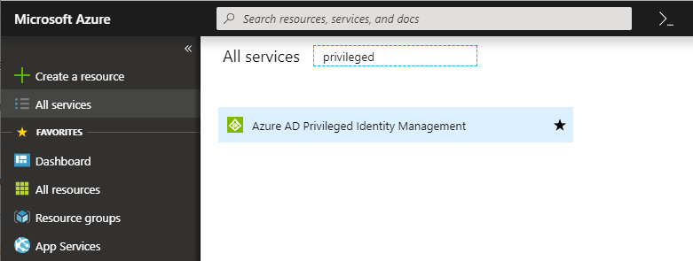
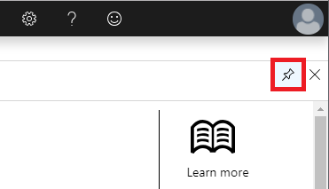
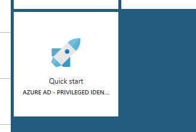
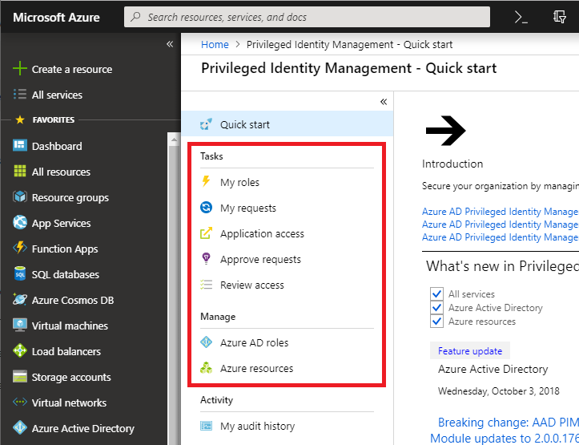

# Start using PIM

With Azure Active Directory (Azure AD) Privileged Identity Management (PIM), you can manage, control, and monitor access within your organization. This scope includes access to Azure resources, Azure AD and other Microsoft online services like Office 365 or Microsoft Intune.

This article tells you how to add the Azure AD PIM app to your Azure portal dashboard.

## First person to use PIM

If you're the first person to use PIM in your directory, you are automatically assigned the [Security administrator](../users-groups-roles/directory-assign-admin-roles.md#security-administrator) and [Privileged role administrator](../users-groups-roles/directory-assign-admin-roles.md#privileged-role-administrator) roles in the directory. Only privileged role administrators can manage Azure AD directory role assignments of users. In addition, you may choose to run the [security wizard.](pim-security-wizard.md) that walks you through the initial discovery and assignment experience.

## Add PIM tile to the dashboard

To make it easier to open PIM, you should add a PIM tile to your Azure portal dashboard.

1. Sign in to the [Azure portal](https://portal.azure.com/) as a Global administrator of your directory.

1. Click **All services** and find the **Azure AD Privileged Identity Management** service.

    

1. Click to open the PIM Quickstart.

1. Check **Pin blade to dashboard** to pin the PIM Quickstart blade to the dashboard.

    

    On the Azure dashboard, you'll see a tile like this:

    

## Navigate to your tasks

Once PIM is set up, you can use this blade to accomplish your identity management tasks.

| Task + Manage | Description |
| --- | --- |
| **My roles**  | Displays a list of eligible and active roles assigned to you. This is where you can activate any assigned eligible roles. |
| **My requests** | Displays your pending requests to activate eligible role assignments. |
| **Application access** | Enables you to reduce potential delays and use a role immediately after activation. |
| **Approve requests** | Displays a list of requests to activate eligible roles by users in your directory that you are designated to approve. |
| **Review access** | Lists active access reviews you are assigned to complete, whether you're reviewing access for yourself or someone else. |
| **Azure AD directory roles** | Displays a dashboard and settings for privileged role administrators to manage Azure AD directory role assignments. This dashboard is disabled for anyone who isn't a privileged role administrator. These users have access to a special dashboard titled My view. The My view dashboard only displays information about the user accessing the dashboard, not the entire tenant. |
| **Azure resources** | Displays a dashboard and settings for privileged role administrators to manage Azure resource role assignments. This dashboard is disabled for anyone who isn't a privileged role administrator. These users have access to a special dashboard titled My view. The My view dashboard only displays information about the user accessing the dashboard, not the entire tenant. |

## Next steps

- [Activate my Azure AD directory roles in PIM](pim-how-to-activate-role.md)
- [Activate my Azure resource roles in PIM](pim-resource-roles-activate-your-roles.md)
