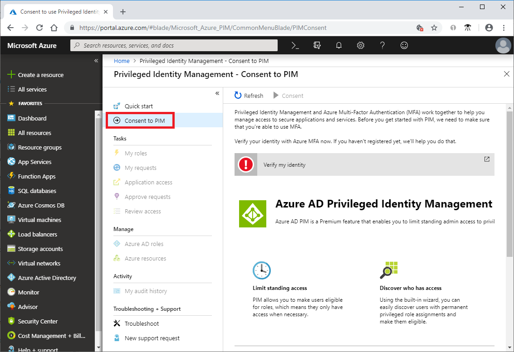
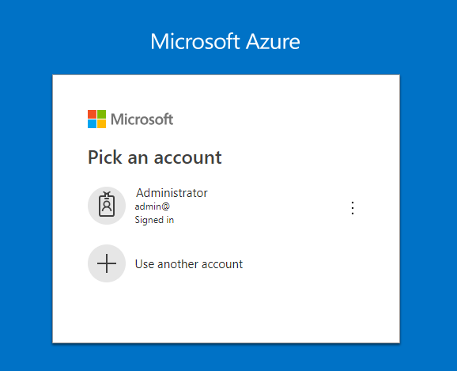
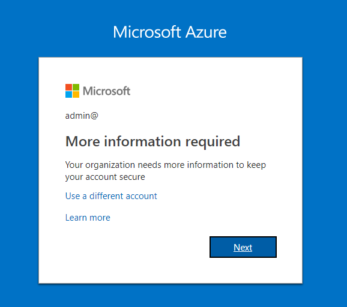
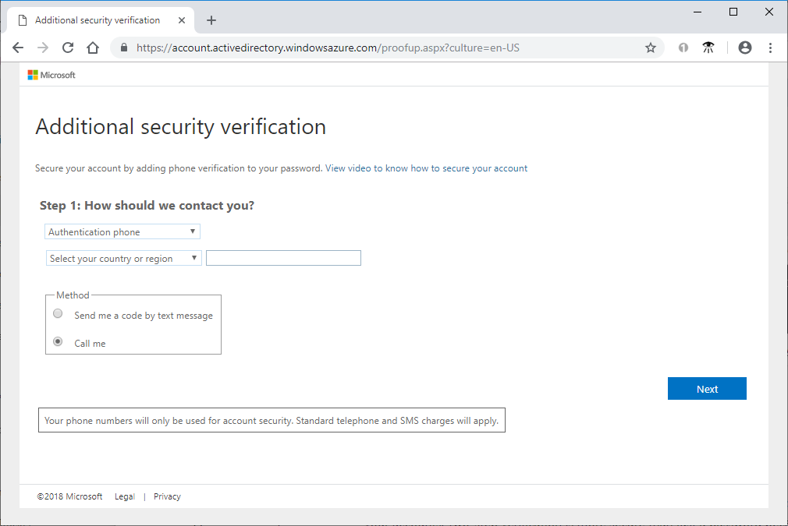
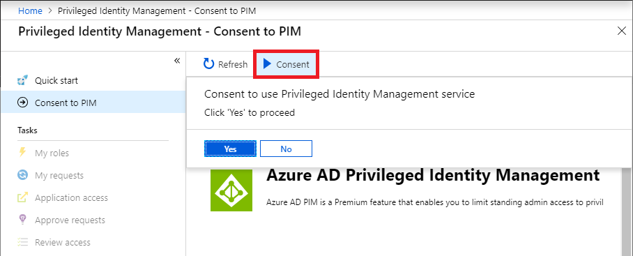
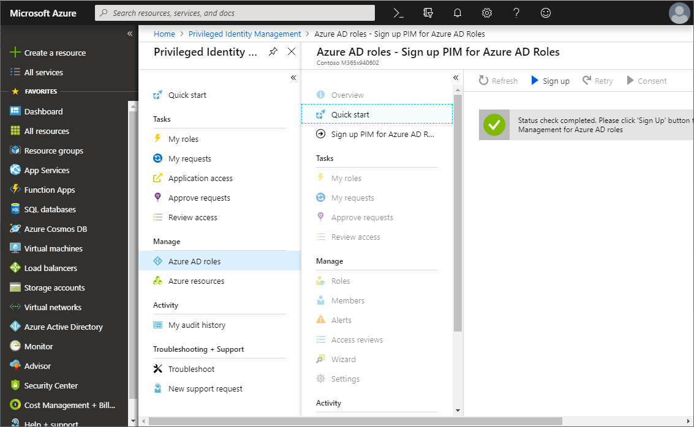
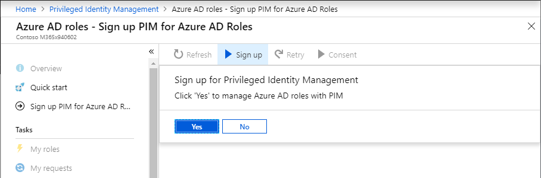

# Start using PIM

With Azure Active Directory (Azure AD) Privileged Identity Management (PIM), you can manage, control, and monitor access within your organization. This scope includes access to Azure resources, Azure AD and other Microsoft online services like Office 365 or Microsoft Intune.

This article describes how to enable and get started using PIM.

## Prerequisites

To use PIM, you must have one of the following licenses:

- Azure AD Premium P2
- Enterprise Mobility + Security (EMS) E5

For more information, see [License requirements to use PIM](subscription-requirements.md).

## First person to use PIM

If you're the first person to use PIM in your directory, you are automatically assigned the [Security Administrator](../users-groups-roles/directory-assign-admin-roles.md#security-administrator) and [Privileged Role Administrator](../users-groups-roles/directory-assign-admin-roles.md#privileged-role-administrator) roles in the directory. Only privileged role administrators can manage Azure AD role assignments of users. In addition, you may choose to run the [security wizard](pim-security-wizard.md) that walks you through the initial discovery and assignment experience.

## Enable PIM

To start using PIM in your directory, you must first enable PIM.

1. Sign in to the [Azure portal](https://portal.azure.com/) as a Global Administrator of your directory.

    You must be a Global Administrator with an organizational account (for example, @yourdomain.com), not a Microsoft account (for example, @outlook.com), to enable PIM for a directory.

1. Click **All services** and find the **Azure AD Privileged Identity Management** service.

    

1. Click to open the PIM Quickstart.

1. In the list, click **Consent to PIM**.

    

1. Click **Verify my identity** to verify your identity with Azure MFA. You'll be asked to pick an account.

    

1. If more information is required for verification, you'll be guided through the process. For more information, see [Get help with two-step verification](https://go.microsoft.com/fwlink/p/?LinkId=708614).

    

    For example, you might be asked to provide phone verification.

    

1. Once you have completed the verification process, click the **Consent** button.

1. In the message that appears, click **Yes** to consent to the PIM service.

    

## Sign up PIM for Azure AD roles

Once you have enabled PIM for your directory, you'll need to sign up PIM to manage Azure AD roles.

1. Open **Azure AD Privileged Identity Management**.

1. Click **Azure AD roles**.

    

1. Click **Sign up**.

1. In the message that appears, click **Yes** to sign up PIM to manage Azure AD roles.

    

    When sign up completes, the Azure AD options will be enabled. You might need to refresh the portal.

    For information about how to discover and select the Azure resources to protect with PIM, see [Discover Azure resources to manage in PIM](pim-resource-roles-discover-resources.md).

## Navigate to your tasks

Once PIM is set up, you can perform your identity management tasks.

| Task + Manage | Description |
| --- | --- |
| **My roles**  | Displays a list of eligible and active roles assigned to you. This is where you can activate any assigned eligible roles. |
| **My requests** | Displays your pending requests to activate eligible role assignments. |
| **Approve requests** | Displays a list of requests to activate eligible roles by users in your directory that you are designated to approve. |
| **Review access** | Lists active access reviews you are assigned to complete, whether you're reviewing access for yourself or someone else. |
| **Azure AD roles** | Displays a dashboard and settings for privileged role administrators to manage Azure AD role assignments. This dashboard is disabled for anyone who isn't a privileged role administrator. These users have access to a special dashboard titled My view. The My view dashboard only displays information about the user accessing the dashboard, not the entire tenant. |
| **Azure resources** | Displays a dashboard and settings for privileged role administrators to manage Azure resource role assignments. This dashboard is disabled for anyone who isn't a privileged role administrator. These users have access to a special dashboard titled My view. The My view dashboard only displays information about the user accessing the dashboard, not the entire tenant. |

## Add a PIM tile to the dashboard

To make it easier to open PIM, you should add a PIM tile to your Azure portal dashboard.

1. Sign in to the [Azure portal](https://portal.azure.com/).

1. Click **All services** and find the **Azure AD Privileged Identity Management** service.

    

1. Click to open the PIM Quickstart.

1. Check **Pin blade to dashboard** to pin the PIM Quickstart blade to the dashboard.

    

    On the Azure dashboard, you'll see a tile like this:

    

## Next steps

- [Assign Azure AD roles in PIM](pim-how-to-add-role-to-user.md)
- [Discover Azure resources to manage in PIM](pim-resource-roles-discover-resources.md)
