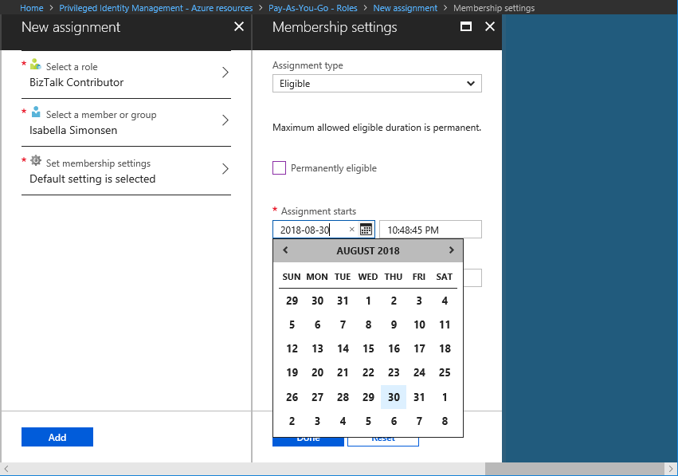
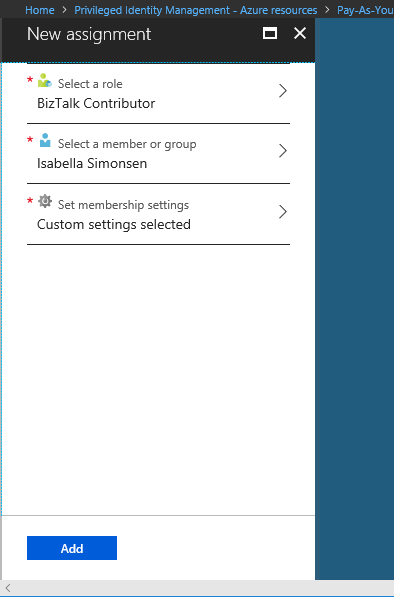

# Assign eligibility for a role-assignable group in Privileged Identity Management

Azure Active Directory (Azure AD) Privileged Identity Management (PIM) can help you manage the eligibility and activation of assignments to role-assignable groups in Azure AD.

>[!NOTE]
>Every user who is eligible for membership in a role-assignable group must have an Azure AD Premium P2 license. For more information, see [License requirements to use Privileged Identity Management](subscription-requirements.md).

## Assign a group

Follow these steps to make a user eligible for membership in a role-assignable group.

1. Sign in to [Privileged Identity Management](https://portal.azure.com/) in the Azure portal with  [Privileged role administrator](../users-groups-roles/directory-assign-admin-roles.md#privileged-role-administrator) role permissions.

    For information about how to grant another administrator access to manage Privileged Identity Management, see [Grant access to other administrators to manage Privileged Identity Management](pim-how-to-give-access-to-pim.md).

1. Open **Azure AD Privileged Identity Management**.

1. Select **Privileged access groups (Preview)**.

1. Use the **Group type** to filter the list of role-assignable groups.

    

1. Select the group you want to manage.

1. Under Manage, select **Roles** to see the list of roles for Azure resources.

    

1. Select **Add member** to open the New assignment pane.

1. Select **Select a role** to open the Select a role pane.

    

1. Select a role you want to assign and then click **Select**.

    The Select a member or group pane opens.

1. Select a member or group you want to assign to the role and then click **Select**.

    

    The Membership settings pane opens.

1. In the **Assignment type** list, select **Eligible** or **Active**.

    

    Privileged Identity Management for Azure resources provides two distinct assignment types:

    - **Eligible** assignments require the member of the role to perform an action to use the role. Actions might include performing a multi-factor authentication (MFA) check, providing a business justification, or requesting approval from designated approvers.

    - **Active** assignments don't require the member to perform any action to use the role. Members assigned as active have the privileges assigned to the role at all times.

1. If the assignment should be permanent (permanently eligible or permanently assigned), select the **Permanently** checkbox.

    Depending on the role settings, the check box might not appear or might be unmodifiable.

1. To specify a specific assignment duration, clear the check box and modify the start and/or end date and time boxes.

    

1. When finished, select **Done**.

    

1. To create the new role assignment, select **Add**. A notification of the status is displayed.

    

## Update or remove an existing role assignment

Follow these steps to update or remove an existing role assignment.

1. Open **Azure AD Privileged Identity Management**.

1. Select **Azure resources**.

1. Select the resource you want to manage, such as a subscription or management group.

1. Under Manage, select **Roles** to see the list of roles for Azure resources.

    

1. Select the role that you want to update or remove.

1. Find the role assignment on the **Eligible roles** or **Active roles** tabs.

    

1. Select **Update** or **Remove** to update or remove the role assignment.

    For information about extending a role assignment, see [Extend or renew Azure resource roles in Privileged Identity Management](pim-resource-roles-renew-extend.md).

## Next steps

- [Extend or renew Azure resource roles in Privileged Identity Management](pim-resource-roles-renew-extend.md)
- [Configure Azure resource role settings in Privileged Identity Management](pim-resource-roles-configure-role-settings.md)
- [Assign Azure AD roles in Privileged Identity Management](pim-how-to-add-role-to-user.md)
