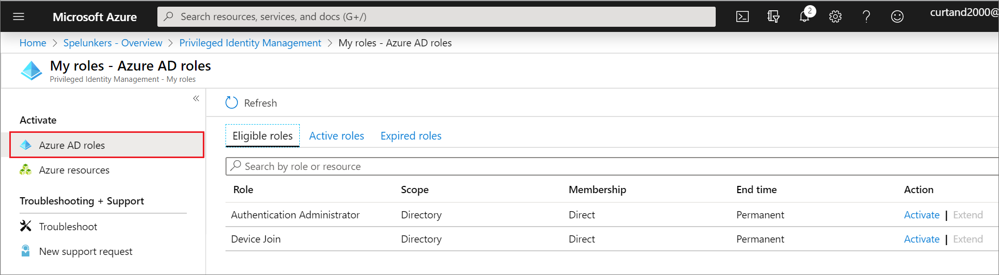
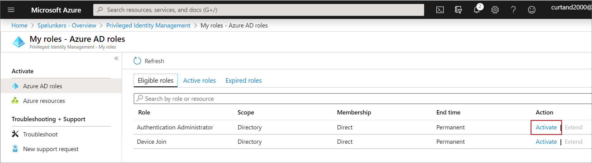
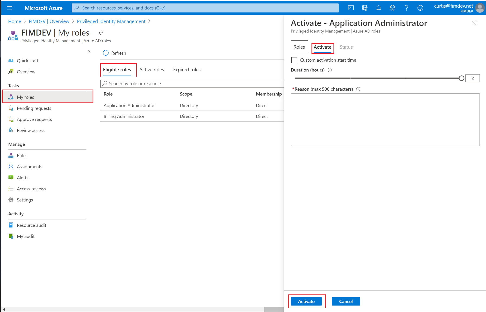
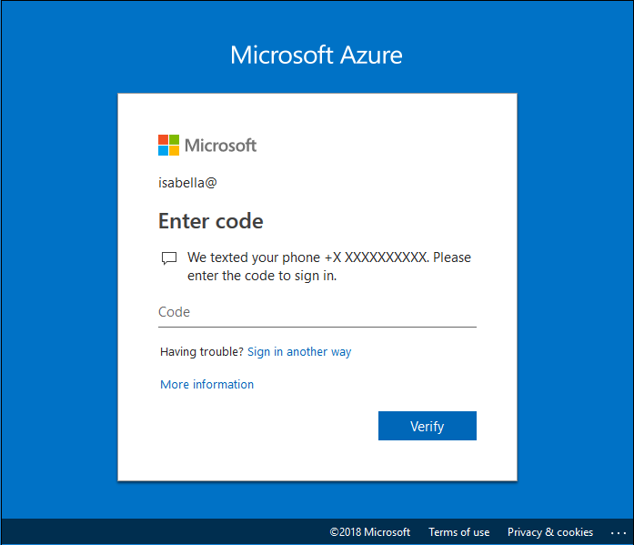
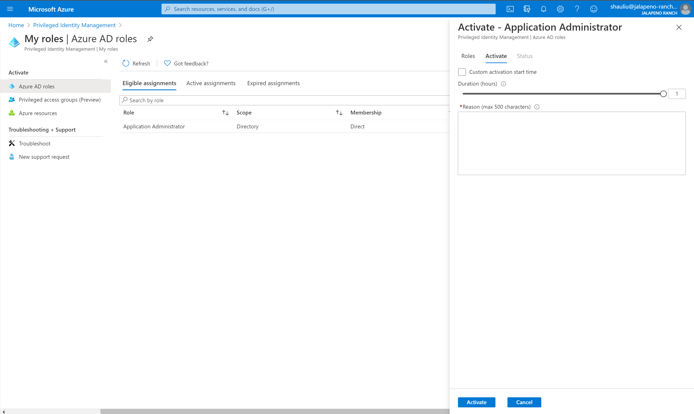
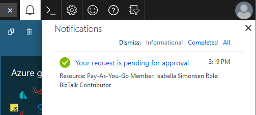
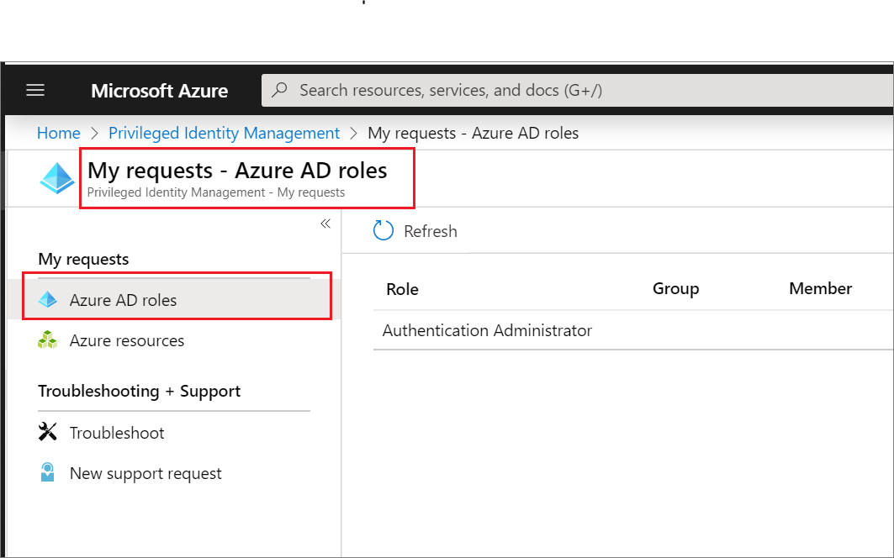
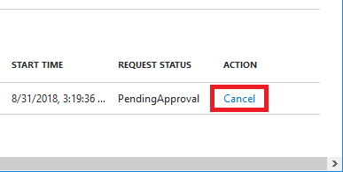

# Activate a Microsoft Entra role in PIM

Microsoft Entra Privileged Identity Management (PIM) simplifies how enterprises manage privileged access to resources in Microsoft Entra ID and other Microsoft online services like Microsoft 365 or Microsoft Intune.  

If you have been made *eligible* for an administrative role, then you must *activate* the role assignment when you need to perform privileged actions. For example, if you occasionally manage Microsoft 365 features, your organization's privileged role administrators might not make you a permanent Global Administrator, since that role impacts other services, too. Instead, they would make you eligible for Microsoft Entra roles such as Exchange Online Administrator. You can request to activate that role when you need its privileges, and then you'll have administrator control for a predetermined time period.

This article is for administrators who need to activate their Microsoft Entra role in Privileged Identity Management.

>[!IMPORTANT]
>When a role is activated, Microsoft Entra PIM temporarily adds active assignment for the role. Microsoft Entra PIM creates active assignment (assigns user to a role) within seconds. When deactivation (manual or through activation time expiration) happens, Microsoft Entra PIM removes the active assignment within seconds as well.
>
>Application may provide access based on the role the user has. In some situations, application access may not immediately reflect the fact that user got role assigned or removed. If application previously cached the fact that user does not have a role – when user tries to access application again, access may not be provided. Similarly, if application previously cached the fact that user has a role – when role is deactivated, user may still get access. Specific situation depends on the application’s architecture. For some applications, signing out and signing back in may help get access added or removed.

## Activate a role

When you need to assume a Microsoft Entra role, you can request activation by opening **My roles** in Privileged Identity Management.

1. Sign in to the [Microsoft Entra admin center](https://entra.microsoft.com) as at least a [Privileged role administrator](../roles/permissions-reference.md#privileged-role-administrator).

1. Browse to **Identity governance** > **Privileged Identity Management** > **My roles**.  For information about how to add the Privileged Identity Management tile to your dashboard, see [Start using Privileged Identity Management](pim-getting-started.md).

1. Select **Microsoft Entra roles** to see a list of your eligible Microsoft Entra roles.

    

1. In the **Microsoft Entra roles** list, find the role you want to activate.

    

1. Select **Activate** to open the Activate pane.

    

1. Select **Additional verification required** and follow the instructions to provide security verification. You are required to authenticate only once per session.

    

1. After multifactor authentication, select **Activate before proceeding**.

    

1. If you want to specify a reduced scope, select **Scope** to open the filter pane. On the filter pane, you can specify the Microsoft Entra resources that you need access to. It's a best practice to request access to the fewest resources that you need.

1. If necessary, specify a custom activation start time. The Microsoft Entra role would be activated after the selected time.

1. In the **Reason** box, enter the reason for the activation request.

1. Select **Activate**.

    If the [role requires approval](pim-resource-roles-approval-workflow.md) to activate, a notification will appear in the upper right corner of your browser informing you the request is pending approval.

    

## Activate a role using Microsoft Graph API

For more information about Microsoft Graph APIs for PIM, see [Overview of role management through the privileged identity management (PIM) API](/graph/api/resources/privilegedidentitymanagementv3-overview).

### Get all eligible roles that you can activate

When a user gets their role eligibility via group membership, this Microsoft Graph request doesn't return their eligibility.

#### HTTP request

````HTTP
GET https://graph.microsoft.com/v1.0/roleManagement/directory/roleEligibilityScheduleRequests/filterByCurrentUser(on='principal')  
````

#### HTTP response

To save space we're showing only the response for one role, but all eligible role assignments that you can activate will be listed.

````HTTP
{
    "@odata.context": "https://graph.microsoft.com/v1.0/$metadata#Collection(unifiedRoleEligibilityScheduleRequest)",
    "value": [
        {
            "@odata.type": "#microsoft.graph.unifiedRoleEligibilityScheduleRequest",
            "id": "50d34326-f243-4540-8bb5-2af6692aafd0",
            "status": "Provisioned",
            "createdDateTime": "2022-04-12T18:26:08.843Z",
            "completedDateTime": "2022-04-12T18:26:08.89Z",
            "approvalId": null,
            "customData": null,
            "action": "adminAssign",
            "principalId": "3fbd929d-8c56-4462-851e-0eb9a7b3a2a5",
            "roleDefinitionId": "8424c6f0-a189-499e-bbd0-26c1753c96d4",
            "directoryScopeId": "/",
            "appScopeId": null,
            "isValidationOnly": false,
            "targetScheduleId": "50d34326-f243-4540-8bb5-2af6692aafd0",
            "justification": "Assign Attribute Assignment Admin eligibility to myself",
            "createdBy": {
                "application": null,
                "device": null,
                "user": {
                    "displayName": null,
                    "id": "3fbd929d-8c56-4462-851e-0eb9a7b3a2a5"
                }
            },
            "scheduleInfo": {
                "startDateTime": "2022-04-12T18:26:08.8911834Z",
                "recurrence": null,
                "expiration": {
                    "type": "afterDateTime",
                    "endDateTime": "2024-04-10T00:00:00Z",
                    "duration": null
                }
            },
            "ticketInfo": {
                "ticketNumber": null,
                "ticketSystem": null
            }
        }
    ]
}
````

### Self-activate a role eligibility with justification

#### HTTP request

````HTTP
POST https://graph.microsoft.com/v1.0/roleManagement/directory/roleAssignmentScheduleRequests 

{
    "action": "selfActivate",
    "principalId": "071cc716-8147-4397-a5ba-b2105951cc0b",
    "roleDefinitionId": "8424c6f0-a189-499e-bbd0-26c1753c96d4",
    "directoryScopeId": "/",
    "justification": "I need access to the Attribute Administrator role to manage attributes to be assigned to restricted AUs",
    "scheduleInfo": {
        "startDateTime": "2022-04-14T00:00:00.000Z",
        "expiration": {
            "type": "AfterDuration",
            "duration": "PT5H"
        }
    },
    "ticketInfo": {
        "ticketNumber": "CONTOSO:Normal-67890",
        "ticketSystem": "MS Project"
    }
}
````

#### HTTP response

````HTTP
HTTP/1.1 201 Created
Content-Type: application/json

{
    "@odata.context": "https://graph.microsoft.com/v1.0/$metadata#roleManagement/directory/roleAssignmentScheduleRequests/$entity",
    "id": "911bab8a-6912-4de2-9dc0-2648ede7dd6d",
    "status": "Granted",
    "createdDateTime": "2022-04-13T08:52:32.6485851Z",
    "completedDateTime": "2022-04-14T00:00:00Z",
    "approvalId": null,
    "customData": null,
    "action": "selfActivate",
    "principalId": "071cc716-8147-4397-a5ba-b2105951cc0b",
    "roleDefinitionId": "8424c6f0-a189-499e-bbd0-26c1753c96d4",
    "directoryScopeId": "/",
    "appScopeId": null,
    "isValidationOnly": false,
    "targetScheduleId": "911bab8a-6912-4de2-9dc0-2648ede7dd6d",
    "justification": "I need access to the Attribute Administrator role to manage attributes to be assigned to restricted AUs",
    "createdBy": {
        "application": null,
        "device": null,
        "user": {
            "displayName": null,
            "id": "071cc716-8147-4397-a5ba-b2105951cc0b"
        }
    },
    "scheduleInfo": {
        "startDateTime": "2022-04-14T00:00:00Z",
        "recurrence": null,
        "expiration": {
            "type": "afterDuration",
            "endDateTime": null,
            "duration": "PT5H"
        }
    },
    "ticketInfo": {
        "ticketNumber": "CONTOSO:Normal-67890",
        "ticketSystem": "MS Project"
    }
}
````

## View the status of activation requests

You can view the status of your pending requests to activate.

1. Sign in to the [Microsoft Entra admin center](https://entra.microsoft.com) as at least a [Privileged role administrator](../roles/permissions-reference.md#privileged-role-administrator).

1. Browse to **Identity governance** > **Privileged Identity Management** > **My requests**.

1. When you select **My requests** you see a list of your Microsoft Entra role and Azure resource role requests.

    

1. Scroll to the right to view the **Request Status** column.

## Cancel a pending request for new version

If you don't require activation of a role that requires approval, you can cancel a pending request at any time.

1. Sign in to the [Microsoft Entra admin center](https://entra.microsoft.com) as at least a [Privileged role administrator](../roles/permissions-reference.md#privileged-role-administrator).

1. Browse to **Identity governance** > **Privileged Identity Management** > **My requests**.

1. For the role that you want to cancel, select the **Cancel** link.

    When you select Cancel, the request will be canceled. To activate the role again, you'll have to submit a new request for activation.

   

## Deactivate a role assignment

When a role assignment is activated, you'll see a **Deactivate** option in the PIM portal for the role assignment. Also, you can't deactivate a role assignment within five minutes after activation.

## Next steps

- [View audit history for Microsoft Entra roles](pim-how-to-use-audit-log.md)
