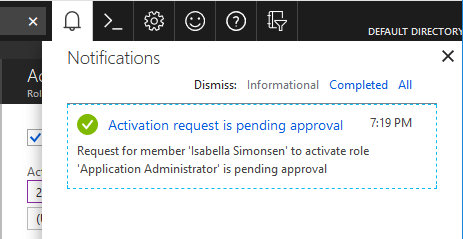

# Activate my Azure AD roles in PIM

Azure Active Directory (Azure AD) Privileged Identity Management (PIM) simplifies how enterprises manage privileged access to resources in Azure AD and other Microsoft online services like Office 365 or Microsoft Intune.  

If you have been made eligible for an administrative role, that means you can activate that role when you need to perform privileged actions. For example, if you occasionally manage Office 365 features, your organization's privileged role administrators may not make you a permanent Global Administrator, since that role impacts other services, too. Instead, they make you eligible for Azure AD roles such as Exchange Online Administrator. You can request to activate that role when you need its privileges, and then you'll have administrator control for a predetermined time period.

This article is for administrators who need to activate their Azure AD role in PIM.

## Activate a role

When you need to take on an Azure AD role, you can request activation by using the **My roles** navigation option in PIM.

1. Sign in to the [Azure portal](https://portal.azure.com/).

1. Open **Azure AD Privileged Identity Management**. For information about how to add the PIM tile to your dashboard, see [Start using PIM](pim-getting-started.md).

1. Click **Azure AD roles**.

1. Click **My roles** to see a list of your eligible Azure AD roles.

    

1. Find a role that you want to activate.

    

1. Click **Activate** to open the Role activation details pane.

1. If your role requires multi-factor authentication (MFA), click **Verify your identity before proceeding**. You only have to authenticate once per session.

    

1. Click **Verify my identity** and follow the instructions to provide additional security verification.

    

1. Click **Activate** to open the Activation pane.

    

1. If necessary, specify a custom activation start time.

1. Specify the activation duration.

1. In the **Activation reason** box, enter the reason for the activation request. Some roles require you to supply a trouble ticket number.

    

1. Click **Activate**.

    If the role does not require approval, an **Activation status** pane appears that displays the status of the activation.

    

    Once all the stages are complete, click the **Sign out** link to sign out of the Azure portal. When you sign back in to the portal, you can now use the role.

    If the [role requires approval](./azure-ad-pim-approval-workflow.md) to activate, a notification will appear in the upper right corner of your browser informing you the request is pending approval.

    

## View the status of your requests

You can view the status of your pending requests to activate.

1. Open Azure AD Privileged Identity Management.

1. Click **Azure AD roles**.

1. Click **My requests** to see a list of your requests.

    

## Deactivate a role

Once a role has been activated, it automatically deactivates when its time limit (eligible duration) is reached.

If you complete your administrator tasks early, you can also deactivate a role manually in Azure AD Privileged Identity Management.

1. Open Azure AD Privileged Identity Management.

1. Click **Azure AD roles**.

1. Click **My roles**.

1. Click **Active roles** to see your list of active roles.

1. Find the role you're done using and then click **Deactivate**.

## Cancel a pending request

If you do not require activation of a role that requires approval, you can cancel a pending request at any time.

1. Open Azure AD Privileged Identity Management.

1. Click **Azure AD roles**.

1. Click **My requests**.

1. For the role that you want to cancel, click the **Cancel** button.

    When you click Cancel, the request will be canceled. To activate the role again, you will have to submit a new request for activation.

   

## Troubleshoot

### Permissions not granted after activating a role

When you activate a role in PIM, it takes at least 10 minutes before you can access the desired administrative portal or perform functions within a specific administrative workload. Once the activation is complete, sign out of the Azure portal and sign back in to start using the newly activated role.

For additional troubleshooting steps, see [Troubleshooting Elevated Permissions](https://social.technet.microsoft.com/wiki/contents/articles/37568.troubleshooting-elevated-permissions-with-azure-ad-privileged-identity-management.aspx).

## Next steps

- [Activate my Azure resource roles in PIM](pim-resource-roles-activate-your-roles.md)
