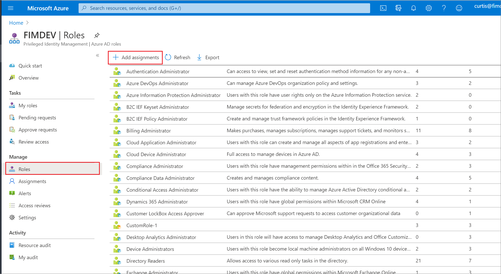
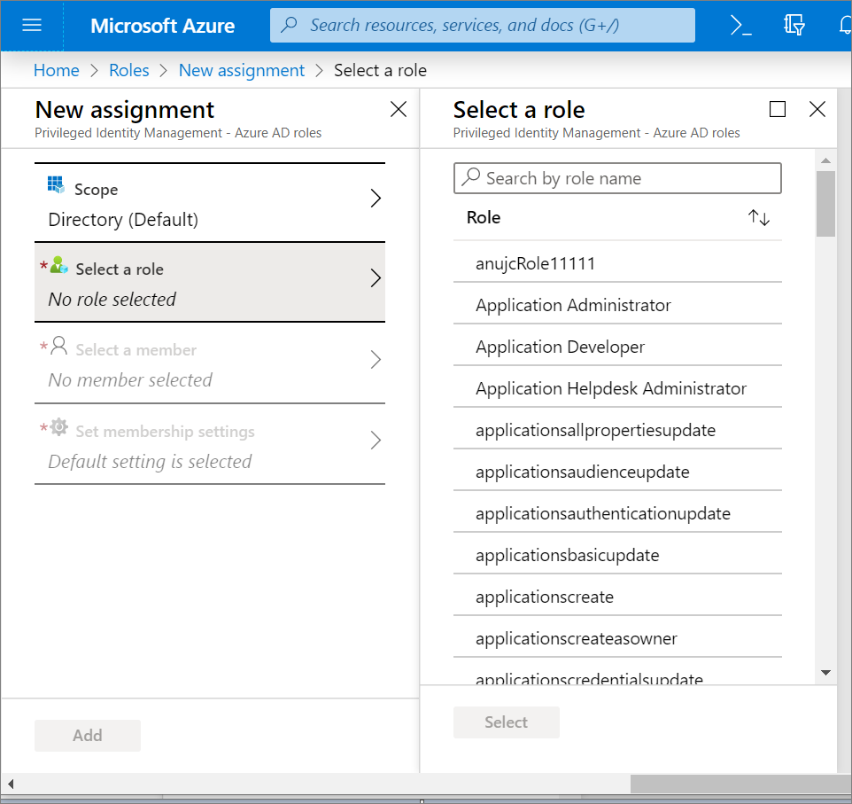
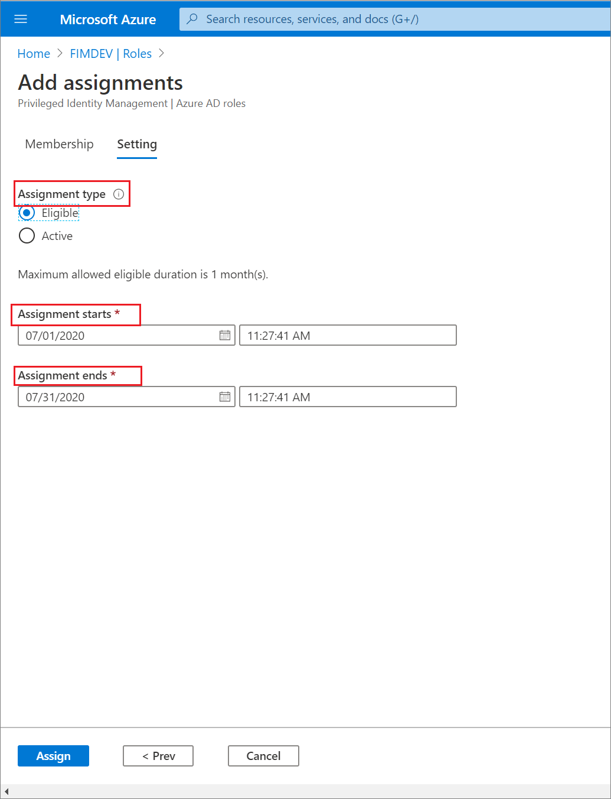
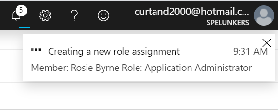
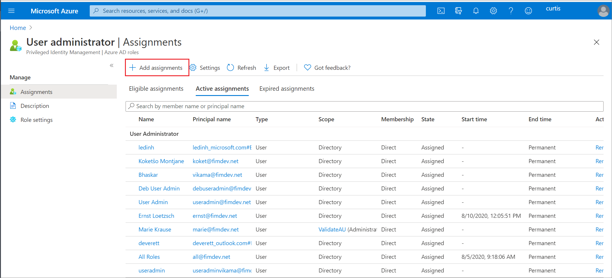
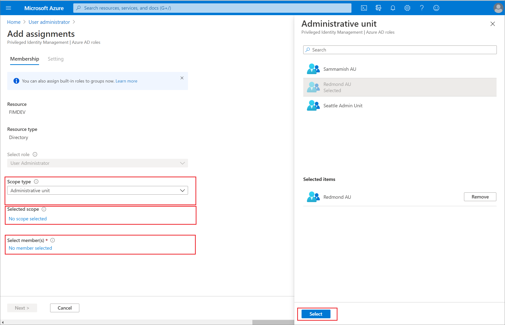
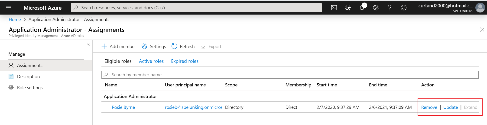

# Assign Azure AD roles in Privileged Identity Management

With Azure Active Directory (Azure AD), a Global administrator can make **permanent** Azure AD admin role assignments. These role assignments can be created using the [Azure portal](../roles/permissions-reference.md) or using [PowerShell commands](/powershell/module/azuread#directory_roles).

The Azure AD Privileged Identity Management (PIM) service also allows Privileged role administrators to make permanent admin role assignments. Additionally, Privileged role administrators can make users **eligible** for Azure AD admin roles. An eligible administrator can activate the role when they need it, and then their permissions expire once they're done.

Privileged Identity Management support both built-in and custom Azure AD roles. For more information on Azure AD custom roles, see [Role-based access control in Azure Active Directory](../roles/custom-overview.md).

>[!Note]
>When a role is assigned, the assignment:
>- Can't be assigned for a duration of less than five minutes
>- Can't be removed within five minutes of it being assigned

## Assign a role

[!INCLUDE [portal updates](~/articles/active-directory/includes/portal-update.md)]

Follow these steps to make a user eligible for an Azure AD admin role.

1. Sign in to the [Azure portal](https://portal.azure.com) with a user that is a member of the [Privileged role administrator](../roles/permissions-reference.md#privileged-role-administrator) role.

1. Open **Azure AD Privileged Identity Management**.

1. Select **Azure AD roles**.

1. Select **Roles** to see the list of roles for Azure AD permissions.

    

1. Select **Add assignments** to open the **Add assignments** page.

1. Select **Select a role** to open the **Select a role** page.

    

1. Select a role you want to assign, select a member to whom you want to assign to the role, and then select **Next**.

1. In the **Assignment type** list on the **Membership settings** pane, select **Eligible** or **Active**.

    - **Eligible** assignments require the member of the role to perform an action to use the role. Actions might include performing a multi-factor authentication (MFA) check, providing a business justification, or requesting approval from designated approvers.

    - **Active** assignments don't require the member to perform any action to use the role. Members assigned as active have the privileges assigned to the role at all times.

1. To specify a specific assignment duration, add a start and end date and time boxes. When finished, select **Assign** to create the new role assignment.

    - **Permanent** assignments have no expiration date. Use this option for permanent workers who frequently need the role permissions.

    - **Time-bound** assignments will expire at the end of a specified period. Use this option with temporary or contract workers, for example, whose project end date and time are known.

    

1. After the role is assigned, an assignment status notification is displayed.

    

## Assign a role with restricted scope

For certain roles, the scope of the granted permissions can be restricted to a single admin unit, service principal, or application. This procedure is an example if assigning a role that has the scope of an administrative unit. For a list of roles that support scope via administrative unit, see [Assign scoped roles to an administrative unit](../roles/admin-units-assign-roles.md). This feature is currently being rolled out to Azure AD organizations.

1. Sign in to the [Azure portal](https://portal.azure.com) with Privileged Role Administrator permissions.

1. Select **Azure Active Directory** > **Roles and administrators**.

1. Select the **User Administrator**.

    

1. ​Select **Add assignments**.

    

1. On the **Add assignments** page, you can:

   - Select a user or group to be assigned to the role
   - Select the role scope (in this case, administrative units)
   - Select an administrative unit for the scope

For more information about creating administrative units, see [Add and remove administrative units](../roles/admin-units-manage.md).

## Assign a role using Microsoft Graph API

For more information about Microsoft Graph APIs for PIM, see [Overview of role management through the privileged identity management (PIM) API](/graph/api/resources/privilegedidentitymanagementv3-overview).

For permissions required to use the PIM API, see [Understand the Privileged Identity Management APIs](pim-apis.md). 

### Eligible with no end date

The following is a sample HTTP request to create an eligible assignment with no end date. For details on the API commands including request samples in languages such as C# and JavaScript, see [Create roleEligibilityScheduleRequests](/graph/api/rbacapplication-post-roleeligibilityschedulerequests).

#### HTTP request

````HTTP
POST https://graph.microsoft.com/v1.0/roleManagement/directory/roleEligibilityScheduleRequests
Content-Type: application/json

{
    "action": "adminAssign",
    "justification": "Permanently assign the Global Reader to the auditor",
    "roleDefinitionId": "f2ef992c-3afb-46b9-b7cf-a126ee74c451",
    "directoryScopeId": "/",
    "principalId": "071cc716-8147-4397-a5ba-b2105951cc0b",
    "scheduleInfo": {
        "startDateTime": "2022-04-10T00:00:00Z",
        "expiration": {
            "type": "noExpiration"
        }
    }
}
````

#### HTTP response

The following is an example of the response. The response object shown here might be shortened for readability.

````HTTP
HTTP/1.1 201 Created
Content-Type: application/json

{
    "@odata.context": "https://graph.microsoft.com/v1.0/$metadata#roleManagement/directory/roleEligibilityScheduleRequests/$entity",
    "id": "42159c11-45a9-4631-97e4-b64abdd42c25",
    "status": "Provisioned",
    "createdDateTime": "2022-05-13T13:40:33.2364309Z",
    "completedDateTime": "2022-05-13T13:40:34.6270851Z",
    "approvalId": null,
    "customData": null,
    "action": "adminAssign",
    "principalId": "071cc716-8147-4397-a5ba-b2105951cc0b",
    "roleDefinitionId": "f2ef992c-3afb-46b9-b7cf-a126ee74c451",
    "directoryScopeId": "/",
    "appScopeId": null,
    "isValidationOnly": false,
    "targetScheduleId": "42159c11-45a9-4631-97e4-b64abdd42c25",
    "justification": "Permanently assign the Global Reader to the auditor",
    "createdBy": {
        "application": null,
        "device": null,
        "user": {
            "displayName": null,
            "id": "3fbd929d-8c56-4462-851e-0eb9a7b3a2a5"
        }
    },
    "scheduleInfo": {
        "startDateTime": "2022-05-13T13:40:34.6270851Z",
        "recurrence": null,
        "expiration": {
            "type": "noExpiration",
            "endDateTime": null,
            "duration": null
        }
    },
    "ticketInfo": {
        "ticketNumber": null,
        "ticketSystem": null
    }
}
````

### Active and time-bound

The following is a sample HTTP request to create an active assignment that's time-bound. For details on the API commands including request samples in languages such as C# and JavaScript, see [Create roleAssignmentScheduleRequests](/graph/api/rbacapplication-post-roleassignmentschedulerequests).

#### HTTP request

````HTTP
POST https://graph.microsoft.com/v1.0/roleManagement/directory/roleAssignmentScheduleRequests 

{
    "action": "adminAssign",
    "justification": "Assign the Exchange Recipient Administrator to the mail admin",
    "roleDefinitionId": "31392ffb-586c-42d1-9346-e59415a2cc4e",
    "directoryScopeId": "/",
    "principalId": "071cc716-8147-4397-a5ba-b2105951cc0b",
    "scheduleInfo": {
        "startDateTime": "2022-04-10T00:00:00Z",
        "expiration": {
            "type": "afterDuration",
            "duration": "PT3H"
        }
    }
}
````

#### HTTP response

The following is an example of the response. The response object shown here might be shortened for readability.

````HTTP
{
    "@odata.context": "https://graph.microsoft.com/v1.0/$metadata#roleManagement/directory/roleAssignmentScheduleRequests/$entity",
    "id": "ac643e37-e75c-4b42-960a-b0fc3fbdf4b3",
    "status": "Provisioned",
    "createdDateTime": "2022-05-13T14:01:48.0145711Z",
    "completedDateTime": "2022-05-13T14:01:49.8589701Z",
    "approvalId": null,
    "customData": null,
    "action": "adminAssign",
    "principalId": "071cc716-8147-4397-a5ba-b2105951cc0b",
    "roleDefinitionId": "31392ffb-586c-42d1-9346-e59415a2cc4e",
    "directoryScopeId": "/",
    "appScopeId": null,
    "isValidationOnly": false,
    "targetScheduleId": "ac643e37-e75c-4b42-960a-b0fc3fbdf4b3",
    "justification": "Assign the Exchange Recipient Administrator to the mail admin",
    "createdBy": {
        "application": null,
        "device": null,
        "user": {
            "displayName": null,
            "id": "3fbd929d-8c56-4462-851e-0eb9a7b3a2a5"
        }
    },
    "scheduleInfo": {
        "startDateTime": "2022-05-13T14:01:49.8589701Z",
        "recurrence": null,
        "expiration": {
            "type": "afterDuration",
            "endDateTime": null,
            "duration": "PT3H"
        }
    },
    "ticketInfo": {
        "ticketNumber": null,
        "ticketSystem": null
    }
}
````

## Update or remove an existing role assignment

Follow these steps to update or remove an existing role assignment. **Microsoft Entra Premium P2 or Microsoft Entra ID Governance licensed customers only**: Don't assign a group as Active to a role through both Azure AD and Privileged Identity Management (PIM). For a detailed explanation, see [Known issues](../roles/groups-concept.md#known-issues).

1. Open **Azure AD Privileged Identity Management**.

1. Select **Azure AD roles**.

1. Select **Roles** to see the list of roles for Azure AD.

1. Select the role that you want to update or remove.

1. Find the role assignment on the **Eligible roles** or **Active roles** tabs.

    

1. Select **Update** or **Remove** to update or remove the role assignment.

## Remove eligible assignment via Microsoft Graph API

The following is a sample HTTP request to revoke an eligible assignment to a role from a principal. For details on the API commands including request samples in languages such as C# and JavaScript, see [Create roleEligibilityScheduleRequests](/graph/api/rbacapplication-post-roleeligibilityschedulerequests).

### Request

````HTTP
POST https://graph.microsoft.com/v1.0/roleManagement/directory/roleEligibilityScheduleRequests 

{ 
    "action": "AdminRemove", 
    "justification": "abcde", 
    "directoryScopeId": "/", 
    "principalId": "d96ea738-3b95-4ae7-9e19-78a083066d5b", 
    "roleDefinitionId": "88d8e3e3-8f55-4a1e-953a-9b9898b8876b" 
} 
````

### Response

````HTTP
{ 
    "@odata.context": "https://graph.microsoft.com/v1.0/$metadata#roleManagement/directory/roleEligibilityScheduleRequests/$entity", 
    "id": "fc7bb2ca-b505-4ca7-ad2a-576d152633de", 
    "status": "Revoked", 
    "createdDateTime": "2021-07-15T20:23:23.85453Z", 
    "completedDateTime": null, 
    "approvalId": null, 
    "customData": null, 
    "action": "AdminRemove", 
    "principalId": "d96ea738-3b95-4ae7-9e19-78a083066d5b", 
    "roleDefinitionId": "88d8e3e3-8f55-4a1e-953a-9b9898b8876b", 
    "directoryScopeId": "/", 
    "appScopeId": null, 
    "isValidationOnly": false, 
    "targetScheduleId": null, 
    "justification": "test", 
    "scheduleInfo": null, 
    "createdBy": { 
        "application": null, 
        "device": null, 
        "user": { 
            "displayName": null, 
            "id": "5d851eeb-b593-4d43-a78d-c8bd2f5144d2" 
        } 
    }, 
    "ticketInfo": { 
        "ticketNumber": null, 
        "ticketSystem": null 
    } 
} 
````

## Next steps

- [Configure Azure AD admin role settings in Privileged Identity Management](pim-how-to-change-default-settings.md)
