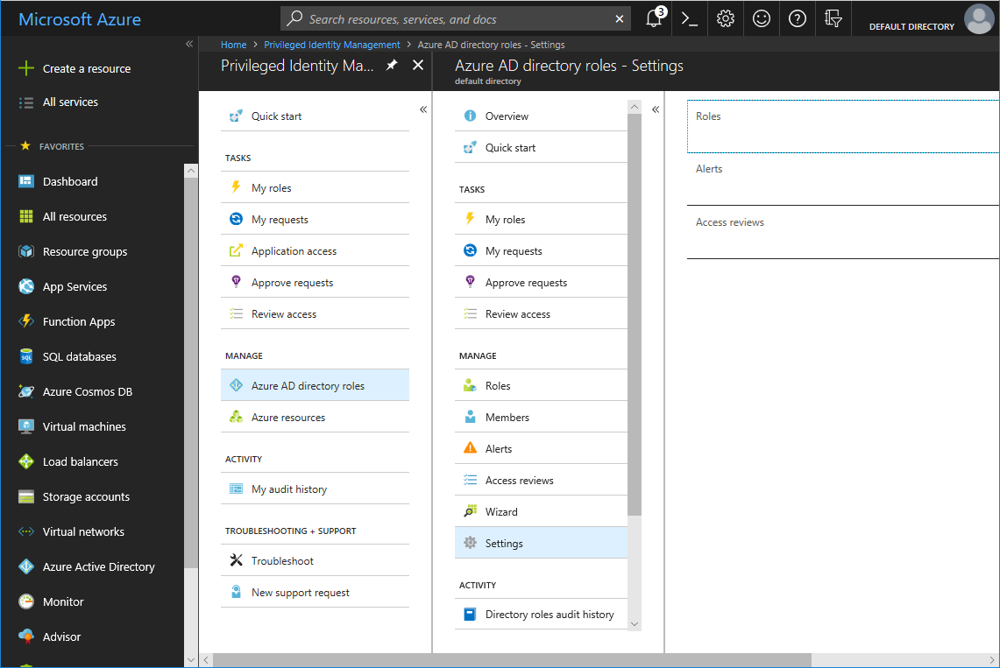
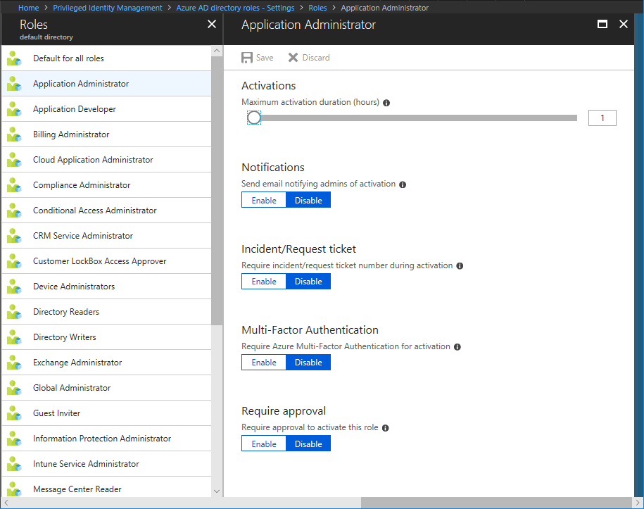
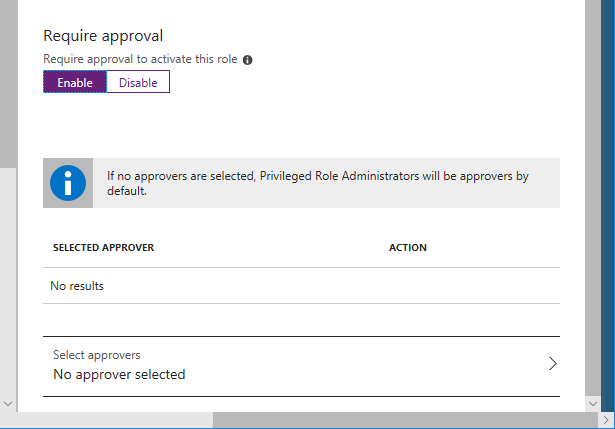
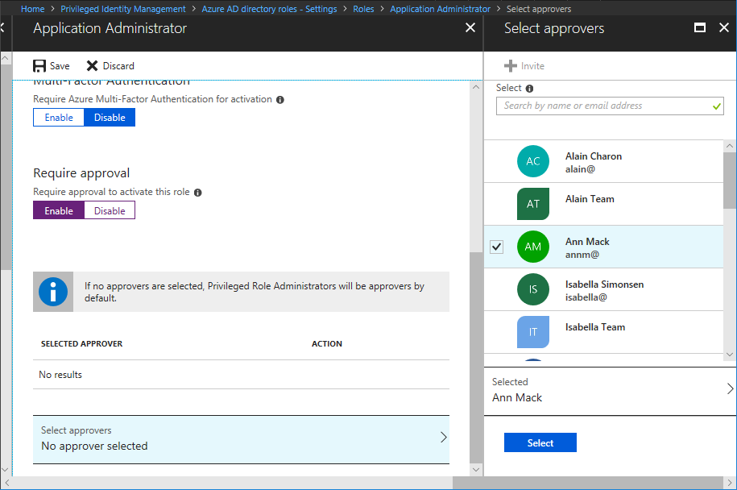

# Configure Azure AD directory role settings in PIM

A privileged role administrator can customize Azure AD Privileged Identity Management (PIM) in their organization, including changing the experience for a user who is activating an eligible role assignment.

## Open role settings

Follow these steps to open the settings for an Azure AD directory role.

1. Open **Azure AD Privileged Identity Management**.

1. Click **Azure AD directory roles**.

1. Click **Settings**.

    

1. Click **Roles**.

1. Click the role whose settings you want to configure.

    

    On the settings page for each role, there are several settings you can configure. These settings only affect users who are **eligible** assignments, not **permanent** assignments.

## Activations

Use the **Activations** slider to set the maximum time, in hours, that a role stays active before it expires. This value can be between 1 and 72 hours.

## Notifications

Use the **Notifications** switch to specify whether the system sends emails to administrators confirming that they have activated a role. This can be useful for detecting unauthorized or illegitimate activations.

## Incident/Request ticket

Use the **Incident/Request ticket** switch to specify whether to require eligible administrators to include a ticket number when they activate their role. This can be useful when you perform role access audits.

## Multi-Factor Authentication

Use the **Multi-Factor Authentication** switch to specify whether to require users to verify their identity with MFA before they can activate their roles. They only have to verify this once per session, not every time they activate a role. There are two tips to keep in mind when you enable MFA:

* Users who have Microsoft accounts for their email addresses (typically @outlook.com, but not always) cannot register for Azure MFA. If you want to assign roles to users with Microsoft accounts, you should either make them permanent admins or disable MFA for that role.
* You cannot disable MFA for highly privileged roles for Azure AD and Office365. This is a safety feature because these roles should be carefully protected:  
  
  * Billing Administrator
  * Cloud Application Administrator
  * Compliance Administrator
  * Conditional Access Administrator
  * CRM Service Administrator
  * Customer LockBox Access Approver
  * Directory Writers
  * Exchange Administrator
  * Global Administrator
  * Information Protection Administrator
  * Intune Service Administrator
  * Power BI Service Administrator
  * Privileged Role Administrator
  * Security Administrator
  * SharePoint Service Administrator
  * Skype for Business Administrator
  * User Administrator

For more information, see [Multi-factor authentication (MFA) and PIM](pim-how-to-require-mfa.md).

## Require approval

If you want to require approval to activate a role, follow these steps.

1. Set the **Require approval** switch to **Enabled**. The pane expands with options to select approvers.

    

    If you **DO NOT** specify any approvers, the Privileged Role Administrators become the default approvers. Privileged Role Administrators would be required to approve **ALL** activation requests for this role.

1. To specify approvers, click **Select approvers**.

    

1. Select one or more approvers and then click **Select**. You can select users or groups. At least 2 approvers is recommended. Self-approval is not allowed.

    Your selections will appear in the list of selected approvers.

1. Once you have specified your all your role settings, click **Save** to save your changes.

<!--PLACEHOLDER: Need an explanation of what the temporary Global Administrator setting is for.-->

## Next steps

- [Assign Azure AD directory roles in PIM](pim-how-to-add-role-to-user.md)
- [Configure security alerts for Azure AD directory roles in PIM](pim-how-to-configure-security-alerts.md)
