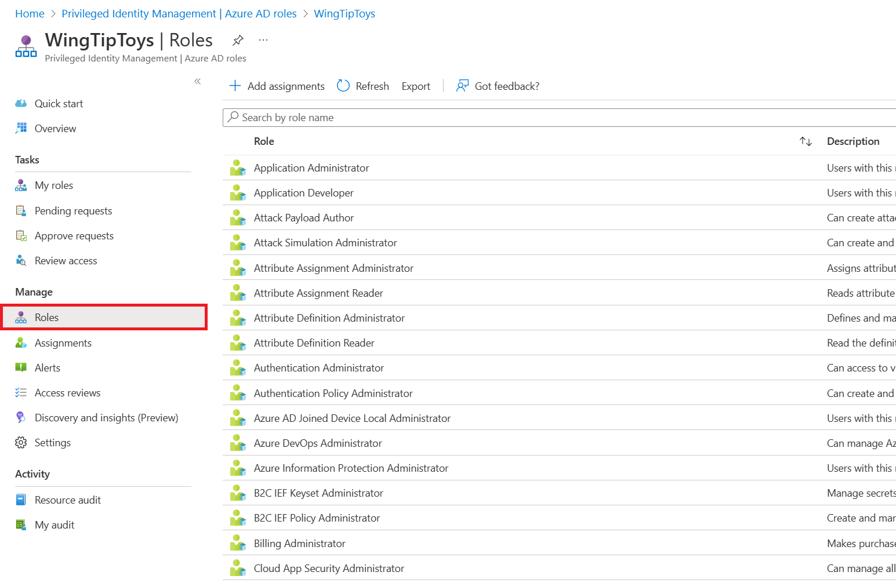
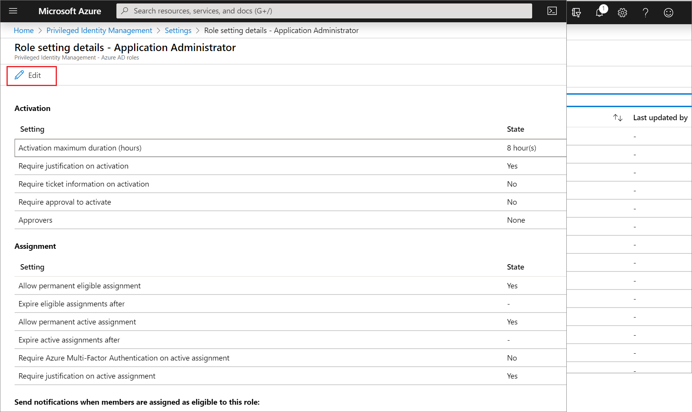
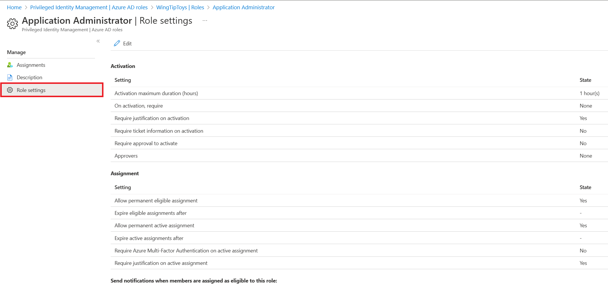
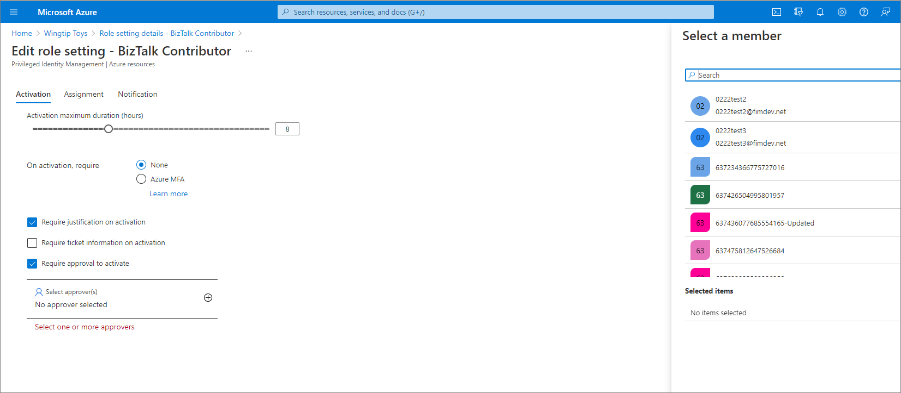

# Configure Azure AD role settings in Privileged Identity Management

A Privileged role administrator can customize Privileged Identity Management (PIM) in their Azure Active Directory (Azure AD) organization, including changing the experience for a user who is activating an eligible role assignment.

## Determine your version of PIM

Beginning in November 2019, the Azure AD roles portion of Privileged Identity Management is being updated to a new version that matches the experiences for Azure resource roles. This creates additional features as well as [changes to the existing API](azure-ad-roles-features.md#api-changes). While the new version is being rolled out, which procedures that you follow in this article depend on version of Privileged Identity Management you currently have. Follow the steps in this section to determine which version of Privileged Identity Management you have. After you know your version of Privileged Identity Management, you can select the procedures in this article that match that version.

1. Sign in to the [Azure portal](https://portal.azure.com/) with a user who is in the [Privileged role administrator](../users-groups-roles/directory-assign-admin-roles.md#privileged-role-administrator) role.
1. Open **Azure AD Privileged Identity Management**. If you have a banner on the top of the overview page, follow the instructions in the **New version** tab of this article. Otherwise, follow the instructions in the **Previous version** tab.

  

Follow the steps in this article to approve or deny requests for Azure AD roles.

# [New version](#tab/new)

## Open role settings

Follow these steps to open the settings for an Azure AD role.

1. Sign in to [Azure portal](https://portal.azure.com/) with a user in the [Privileged Role Administrator](../users-groups-roles/directory-assign-admin-roles.md#privileged-role-administrator) role.
gt
1. Open **Azure AD Privileged Identity Management** &gt; **Azure AD roles** &gt; **Role settings**.

    

1. Select the role whose settings you want to configure.

    

1. Select **Edit** to open the Role settings page.

    

    On the Role setting pane for each role, there are several settings you can configure.

## Assignment duration

You can choose from two assignment duration options for each assignment type (eligible and active) when you configure settings for a role. These options become the default maximum duration when a user is assigned to the role in Privileged Identity Management.

You can choose one of these **eligible** assignment duration options:

| | |
| --- | --- |
| **Allow permanent eligible assignment** | Global admins and Privileged role admins can assign permanent eligible assignment. |
| **Expire eligible assignment after** | Global admins and Privileged role admins can require that all eligible assignments have a specified start and end date. |

And, you can choose one of these **active** assignment duration options:

| | |
| --- | --- |
| **Allow permanent active assignment** | Global admins and Privileged role admins can assign permanent active assignment. |
| **Expire active assignment after** | Global admins and Privileged role admins can require that all active assignments have a specified start and end date. |

> [!NOTE]
> All assignments that have a specified end date can be renewed by Global admins and Privileged role admins. Also, users can initiate self-service requests to [extend or renew role assignments](pim-resource-roles-renew-extend.md).

## Require multi-factor authentication

Privileged Identity Management provides optional enforcement of Azure Multi-Factor Authentication for two distinct scenarios.

### Require Multi-Factor Authentication on active assignment

In some cases, you might want to assign a user to a role for a short duration (one day, for example). In this case, the assigned users don't need to request activation. In this scenario, Privileged Identity Management can't enforce multi-factor authentication when the user uses their role assignment because they are already active in the role from the time that it is assigned.

To ensure that the administrator fulfilling the assignment is who they say they are, you can enforce multi-factor authentication on active assignment by checking the **Require Multi-Factor Authentication on active assignment** box.

### Require Multi-Factor Authentication on activation

You can require users who are eligible for a role to prove who they are using Azure Multi-Factor Authentication before they can activate. Multi-factor authentication ensures that the user is who they say they are with reasonable certainty. Enforcing this option protects critical resources in situations when the user account might have been compromised.

To require multi-factor authentication before activation, check the **Require Multi-Factor Authentication on activation** box in the Assignment tab of **Edit role setting**.

For more information, see [Multi-factor authentication and Privileged Identity Management](pim-how-to-require-mfa.md).

## Activation maximum duration

Use the **Activation maximum duration** slider to set the maximum time, in hours, that a role stays active before it expires. This value can be from one to 24 hours.

## Require justification

You can require that users enter a business justification when they activate. To require justification, check the **Require justification on active assignment** box or the **Require justification on activation** box.

## Require approval to activate

If setting multiple approvers, approval completes as soon as one of them approves or denies. You can't require approval from at least two users. To require approval to activate a role, follow these steps.

1. Check the **Require approval to activate** check box.

1. Select **Select approvers**.

    

1. Select at least one user and then click **Select**. You must select at least one approver. There are no default approvers.

    Your selections will appear in the list of selected approvers.

1. Once you have specified your all your role settings, select **Update** to save your changes.

# [Previous version](#tab/previous)

## Open role settings

Follow these steps to open the settings for an Azure AD role.

1. Open **Azure AD Privileged Identity Management**.

1. Select **Azure AD roles**.

1. Select **Settings**.

    

1. Select **Roles**.

1. Select the role whose settings you want to configure.

    

    On the settings page for each role, there are several settings you can configure. These settings only affect users who are **eligible** assignments, not **permanent** assignments.

## Activations

Use the **Activations** slider to set the maximum time, in hours, that a role stays active before it expires. This value can be between 1 and 72 hours.

## Notifications

Use the **Notifications** switch to specify whether administrators will receive email notifications when roles are activated. This notification can be useful for detecting unauthorized or illegitimate activations.

When set to **Enable**, notifications are sent to:

- Privileged role administrator
- Security administrator
- Global administrator

For more information, see [Email notifications in Privileged Identity Management](pim-email-notifications.md).

## Incident/Request ticket

Use the **Incident/Request ticket** switch to require eligible administrators to include a ticket number when they activate their role. This practice can make role access audits more effective.

## Multi-Factor Authentication

Use the **Multi-Factor Authentication** switch to specify whether to require users to verify their identity with MFA before they can activate their roles. They only have to verify their identity once per session, not every time they activate a role. There are two tips to keep in mind when you enable MFA:

- Users who have Microsoft accounts for their email addresses (typically @outlook.com, but not always) cannot register for Azure Multi-Factor Authentication. If you want to assign roles to users with Microsoft accounts, you should either make them permanent admins or disable multi-factor authentication for that role.
- You cannot disable Azure Multi-Factor Authentication for highly privileged roles for Azure AD and Office 365. This safety feature helps protect the following roles:  
  
  - Azure Information Protection administrator
  - Billing administrator
  - Cloud application administrator
  - Compliance administrator
  - Conditional access administrator
  - Dynamics 365 administrator
  - Customer LockBox access approver
  - Directory writers
  - Exchange administrator
  - Global administrator
  - Intune administrator
  - Power BI administrator
  - Privileged role administrator
  - Security administrator
  - SharePoint administrator
  - Skype for Business administrator
  - User administrator

For more information, see [Multi-factor authentication and Privileged Identity Management](pim-how-to-require-mfa.md).

## Require approval

If you want to delegate the required approval to activate a role, follow these steps.

1. Set the **Require approval** switch to **Enabled**. The pane expands with options to select approvers.

    

    If you don't specify any approvers, the Privileged role administrator becomes the default approver and is then required to approve all activation requests for this role.

1. To add approvers, click **Select approvers**.

    

1. Select one or more approvers in addition to the Privileged role administrator and then click **Select**. We recommend that you add at least two approvers. Even if you add yourself as an approver, you can't self-approve a role activation. Your selections will appear in the list of selected approvers.

1. After you have specified your all your role settings, select **Save** to save your changes.

---

## Next steps

- [Assign Azure AD roles in Privileged Identity Management](pim-how-to-add-role-to-user.md)
- [Configure security alerts for Azure AD roles in Privileged Identity Management](pim-how-to-configure-security-alerts.md)
