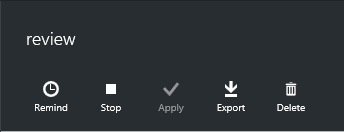

# Complete an access review of Azure AD roles in PIM
Privileged role administrators can review privileged access once an [access review has been started](pim-how-to-start-security-review.md). Azure Active Directory (Azure AD) Privileged Identity Management (PIM) will automatically send an email prompting users to review their access. If a user did not get an email, you can send them the instructions in [how to perform an access review](pim-how-to-perform-security-review.md).

After the access review period is over, or all the users have finished their self-review, follow the steps in this article to manage the review and see the results.

## Manage access reviews
1. Go to the [Azure portal](https://portal.azure.com/) and select the **Azure AD Privileged Identity Management** application on your dashboard.
2. Select the **Access reviews** section of the dashboard.
3. Select the access review that you want to manage.

On the access review's detail blade, there are a number options for managing that review.

### Remind
If an access review is set up so that the users review themselves, the **Remind** button sends out a notification. 

### Stop
All access reviews have an end date, but you can use the **Stop** button to finish it early. If any users haven't been reviewed by this time, they won't be able to after you stop the review. You cannot restart a review after it's been stopped.

### Apply
After an access review is completed, either because you reached the end date or stopped it manually, the **Apply** button implements the outcome of the review. If a user's access was denied in the review, this is the step that will remove their role assignment.  

### Export
If you want to apply the results of the access review manually, you can export the review. The **Export** button will start downloading a CSV file. You can manage the results in Excel or other programs that open CSV files.

### Delete
If you are not interested in the review any further, delete it. The **Delete** button removes the review from the PIM application.

> [!IMPORTANT]
> You will not get a warning before deletion occurs, so be sure that you want to delete that review. 

## Next steps

- [Start an access review for Azure AD roles in PIM](pim-how-to-start-security-review.md)
- [Perform an access review of my Azure AD roles in PIM](pim-how-to-perform-security-review.md)
