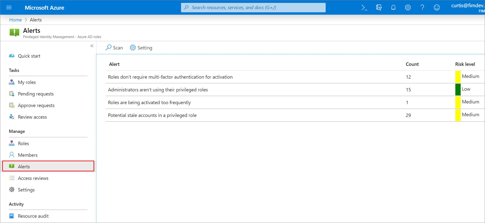
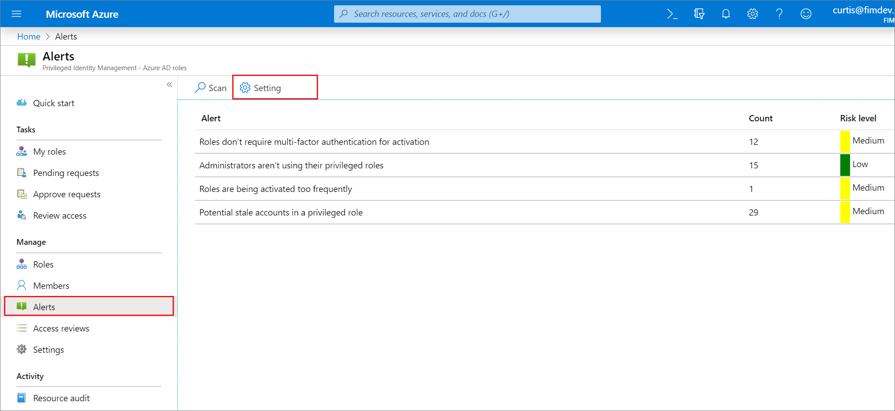
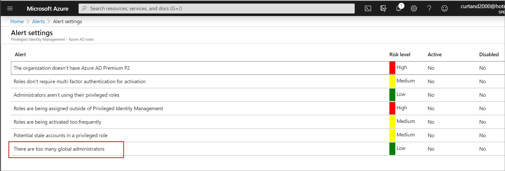
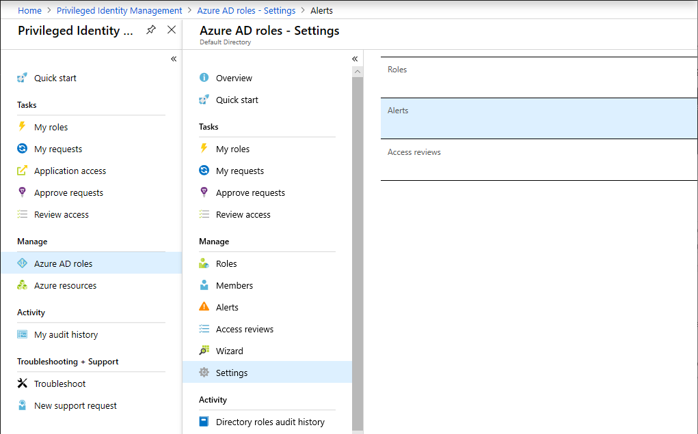
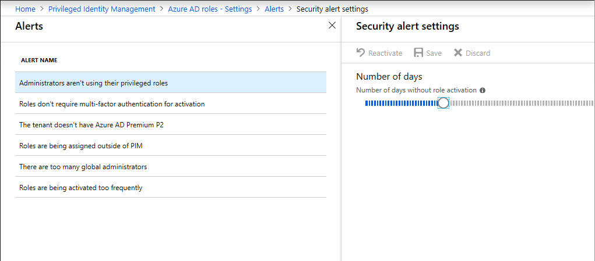

# Configure security alerts for Azure AD roles in Privileged Identity Management

Privileged Identity Management (PIM) generates alerts when there is suspicious or unsafe activity in your Azure Active Directory (Azure AD) organization. When an alert is triggered, it shows up on the Privileged Identity Management dashboard. Select the alert to see a report that lists the users or roles that triggered the alert.

## Determine your version of PIM

Beginning in November 2019, the Azure AD roles portion of Privileged Identity Management is being updated to a new version that matches the experiences for Azure resource roles. This creates additional features as well as [changes to the existing API](azure-ad-roles-features.md#api-changes). While the new version is being rolled out, which procedures that you follow in this article depend on the version of Privileged Identity Management you currently have. Follow the steps in this section to determine which version of Privileged Identity Management you have. After you know your version of Privileged Identity Management, you can select the procedures in this article that match that version.

1. Sign in to the [Azure portal](https://portal.azure.com/) with a user who is in the [Privileged role administrator](../users-groups-roles/directory-assign-admin-roles.md#privileged-role-administrator) role.
1. Open **Azure AD Privileged Identity Management**. If you have a banner on the top of the overview page, follow the instructions in the **New version** tab of this article. Otherwise, follow the instructions in the **Previous version** tab.

  

Follow the steps in this article to investigate security alerts for Azure AD roles.

# [New version](#tab/new)

## Security alerts

This section lists all the security alerts for Azure AD roles, along with how to fix and how to prevent. Severity has the following meaning:

- **High**: Requires immediate action because of a policy violation.
- **Medium**: Does not require immediate action but signals a potential policy violation.
- **Low**: Does not require immediate action but suggests a preferable policy change.

### Administrators aren't using their privileged roles

| | |
| --- | --- |
| **Severity** | Low |
| **Why do I get this alert?** | Users that have been assigned privileged roles they don't need increases the chance of an attack. It is also easier for attackers to remain unnoticed in accounts that are not actively being used. |
| **How to fix?** | Review the users in the list and remove them from privileged roles that they do not need. |
| **Prevention** | Assign privileged roles only to users who have a business justification.  Schedule regular [access reviews](pim-how-to-start-security-review.md) to verify that users still need their access. |
| **In-portal mitigation action** | Removes the account from their privileged role. |
| **Trigger** | Triggered if a user goes over a specified number of days without activating a role. |
| **Number of days** | This setting specifies the maximum number of days, from 0 to 100, that a user can go without activating a role.|

### Roles don't require multi-factor authentication for activation

| | |
| --- | --- |
| **Severity** | Low |
| **Why do I get this alert?** | Without multi-factor authentication, compromised users can activate privileged roles. |
| **How to fix?** | Review the list of roles and [require multi-factor authentication](pim-how-to-change-default-settings.md) for every role. |
| **Prevention** | [Require MFA](pim-how-to-change-default-settings.md) for every role.  |
| **In-portal mitigation action** | Makes multi-factor authentication required for activation of the privileged role. |

### The organization doesn't have Azure AD Premium P2

| | |
| --- | --- |
| **Severity** | Low |
| **Why do I get this alert?** | The current Azure AD organization does not have Azure AD Premium P2. |
| **How to fix?** | Review information about [Azure AD editions](../fundamentals/active-directory-whatis.md). Upgrade to Azure AD Premium P2. |

### Potential stale accounts in a privileged role

| | |
| --- | --- |
| **Severity** | Medium |
| **Why do I get this alert?** | Accounts in a privileged role have not changed their password in the past 90 days. These accounts might be service or shared accounts that aren't being maintained and are vulnerable to attackers. |
| **How to fix?** | Review the accounts in the list. If they no longer need access, remove them from their privileged roles. |
| **Prevention** | Ensure that accounts that are shared are rotating strong passwords when there is a change in the users that know the password.  Regularly review accounts with privileged roles using [access reviews](pim-how-to-start-security-review.md) and remove role assignments that are no longer needed. |
| **In-portal mitigation action** | Removes the account from their privileged role. |
| **Best practices** | Shared, service, and emergency access accounts that authenticate using a password and are assigned to highly privileged administrative roles such as Global administrator or Security administrator should have their passwords rotated for the following cases:<ul><li>After a security incident involving misuse or compromise of administrative access rights</li><li>After any user's privileges are changed so that they are no longer an administrator (for example, after an employee who was an administrator leaves IT or leaves the organization)</li><li>At regular intervals (for example, quarterly or yearly), even if there was no known breach or change to IT staffing</li></ul>Since multiple people have access to these accounts' credentials, the credentials should be rotated to ensure that people that have left their roles can no longer access the accounts. [Learn more about securing accounts](../users-groups-roles/directory-admin-roles-secure.md) |

### Roles are being assigned outside of Privileged Identity Management

| | |
| --- | --- |
| **Severity** | High |
| **Why do I get this alert?** | Privileged role assignments made outside of Privileged Identity Management are not properly monitored and may indicate an active attack. |
| **How to fix?** | Review the users in the list and remove them from privileged roles assigned outside of Privileged Identity Management. |
| **Prevention** | Investigate where users are being assigned privileged roles outside of Privileged Identity Management and prohibit future assignments from there. |
| **In-portal mitigation action** | Removes the user from their privileged role. |

### There are too many global administrators

| | |
| --- | --- |
| **Severity** | Low |
| **Why do I get this alert?** | Global administrator is the highest privileged role. If a Global Administrator is compromised, the attacker gains access to all of their permissions, which puts your whole system at risk. |
| **How to fix?** | Review the users in the list and remove any that do not absolutely need the Global administrator role.  Assign lower privileged roles to these users instead. |
| **Prevention** | Assign users the least privileged role they need. |
| **In-portal mitigation action** | Removes the account from their privileged role. |
| **Trigger** | Triggered if two different criteria are met, and you can configure both of them. First, you need to reach a certain threshold of Global administrators. Second, a certain percentage of your total role assignments must be Global administrators. If you only meet one of these measurements, the alert does not appear. |
| **Minimum number of Global Administrators** | This setting specifies the number of Global administrators, from 2 to 100, that you consider to be too few for your Azure AD organization. |
| **Percentage of Global Administrators** | This setting specifies the minimum percentage of administrators who are Global administrators, from 0% to 100%, below which you do not want your Azure AD organization to dip. |

### Roles are being activated too frequently

| | |
| --- | --- |
| **Severity** | Low |
| **Why do I get this alert?** | Multiple activations to the same privileged role by the same user is a sign of an attack. |
| **How to fix?** | Review the users in the list and ensure that the [activation duration](pim-how-to-change-default-settings.md) for their privileged role is set long enough for them to perform their tasks. |
| **Prevention** | Ensure that the [activation duration](pim-how-to-change-default-settings.md) for privileged roles is set long enough for users to perform their tasks. [Require multi-factor authentication](pim-how-to-change-default-settings.md) for privileged roles that have accounts shared by multiple administrators. |
| **In-portal mitigation action** | N/A |
| **Trigger** | Triggered if a user activates the same privileged role multiple times within a specified period. You can configure both the time period and the number of activations. |
| **Activation renewal timeframe** | This setting specifies in days, hours, minutes, and second the time period you want to use to track suspicious renewals. |
| **Number of activation renewals** | This setting specifies the number of activations, from 2 to 100, at which you would like to be notified, within the timeframe you chose. You can change this setting by moving the slider, or typing a number in the text box. |

## Configure security alert settings

From the Alerts page, go to **Settings**.

Customize settings on the different alerts to work with your environment and security goals.

# [Previous version](#tab/previous)

## Security alerts

This section lists all the security alerts for Azure AD roles, along with how to fix and how to prevent. Severity has the following meaning:

- **High**: Requires immediate action because of a policy violation.
- **Medium**: Does not require immediate action but signals a potential policy violation.
- **Low**: Does not require immediate action but suggests a preferable policy change.

### Administrators aren't using their privileged roles

| | |
| --- | --- |
| **Severity** | Low |
| **Why do I get this alert?** | Users that have been assigned privileged roles they don't need increases the chance of an attack. It is also easier for attackers to remain unnoticed in accounts that are not actively being used. |
| **How to fix?** | Review the users in the list and remove them from privileged roles that they do not need. |
| **Prevention** | Assign privileged roles only to users who have a business justification.  Schedule regular [access reviews](pim-how-to-start-security-review.md) to verify that users still need their access. |
| **In-portal mitigation action** | Removes the account from their privileged role. |
| **Trigger** | Triggered if a user goes over a specified number of days without activating a role. |
| **Number of days** | This setting specifies the maximum number of days, from 0 to 100, that a user can go without activating a role.|

### Roles don't require multi-factor authentication for activation

| | |
| --- | --- |
| **Severity** | Low |
| **Why do I get this alert?** | Without multi-factor authentication, compromised users can activate privileged roles. |
| **How to fix?** | Review the list of roles and [require multi-factor authentication](pim-how-to-change-default-settings.md) for every role. |
| **Prevention** | [Require MFA](pim-how-to-change-default-settings.md) for every role.  |
| **In-portal mitigation action** | Makes multi-factor authentication required for activation of the privileged role. |

### The organization doesn't have Azure AD Premium P2

| | |
| --- | --- |
| **Severity** | Low |
| **Why do I get this alert?** | The current Azure AD organization does not have Azure AD Premium P2. |
| **How to fix?** | Review information about [Azure AD editions](../fundamentals/active-directory-whatis.md). Upgrade to Azure AD Premium P2. |

### Potential stale accounts in a privileged role

| | |
| --- | --- |
| **Severity** | Medium |
| **Why do I get this alert?** | Accounts in a privileged role have not changed their password in the past 90 days. These accounts might be service or shared accounts that aren't being maintained and are vulnerable to attackers. |
| **How to fix?** | Review the accounts in the list. If they no longer need access, remove them from their privileged roles. |
| **Prevention** | Ensure that accounts that are shared are rotating strong passwords when there is a change in the users that know the password.  Regularly review accounts with privileged roles using [access reviews](pim-how-to-start-security-review.md) and remove role assignments that are no longer needed. |
| **In-portal mitigation action** | Removes the account from their privileged role. |
| **Best practices** | Shared, service, and emergency access accounts that authenticate using a password and are assigned to highly privileged administrative roles such as Global administrator or Security administrator should have their passwords rotated for the following cases:<ul><li>After a security incident involving misuse or compromise of administrative access rights</li><li>After any user's privileges are changed so that they are no longer an administrator (for example, after an employee who was an administrator leaves IT or leaves the organization)</li><li>At regular intervals (for example, quarterly or yearly), even if there was no known breach or change to IT staffing</li></ul>Since multiple people have access to these accounts' credentials, the credentials should be rotated to ensure that people that have left their roles can no longer access the accounts. [Learn more](https://aka.ms/breakglass) |

### Roles are being assigned outside of Privileged Identity Management

| | |
| --- | --- |
| **Severity** | High |
| **Why do I get this alert?** | Privileged role assignments made outside of Privileged Identity Management are not properly monitored and may indicate an active attack. |
| **How to fix?** | Review the users in the list and remove them from privileged roles assigned outside of Privileged Identity Management. |
| **Prevention** | Investigate where users are being assigned privileged roles outside of Privileged Identity Management and prohibit future assignments from there. |
| **In-portal mitigation action** | Removes the user from their privileged role. |

### There are too many global administrators

| | |
| --- | --- |
| **Severity** | Low |
| **Why do I get this alert?** | Global administrator is the highest privileged role. If a Global Administrator is compromised, the attacker gains access to all of their permissions, which puts your whole system at risk. |
| **How to fix?** | Review the users in the list and remove any that do not absolutely need the Global administrator role.  Assign lower privileged roles to these users instead. |
| **Prevention** | Assign users the least privileged role they need. |
| **In-portal mitigation action** | Removes the account from their privileged role. |
| **Trigger** | Triggered if two different criteria are met, and you can configure both of them. First, you need to reach a certain threshold of Global administrators. Second, a certain percentage of your total role assignments must be Global administrators. If you only meet one of these measurements, the alert does not appear. |
| **Minimum number of Global Administrators** | This setting specifies the number of Global administrators, from 2 to 100, that you consider to be too few for your Azure AD organization. |
| **Percentage of Global Administrators** | This setting specifies the minimum percentage of administrators who are Global administrators, from 0% to 100%, below which you do not want your Azure AD organization to dip. |

### Roles are being activated too frequently

| | |
| --- | --- |
| **Severity** | Low |
| **Why do I get this alert?** | Multiple activations to the same privileged role by the same user is a sign of an attack. |
| **How to fix?** | Review the users in the list and ensure that the [activation duration](pim-how-to-change-default-settings.md) for their privileged role is set long enough for them to perform their tasks. |
| **Prevention** | Ensure that the [activation duration](pim-how-to-change-default-settings.md) for privileged roles is set long enough for users to perform their tasks. [Require multi-factor authentication](pim-how-to-change-default-settings.md) for privileged roles that have accounts shared by multiple administrators. |
| **In-portal mitigation action** | N/A |
| **Trigger** | Triggered if a user activates the same privileged role multiple times within a specified period. You can configure both the time period and the number of activations. |
| **Activation renewal timeframe** | This setting specifies in days, hours, minutes, and second the time period you want to use to track suspicious renewals. |
| **Number of activation renewals** | This setting specifies the number of activations, from 2 to 100, at which you would like to be notified, within the timeframe you chose. You can change this setting by moving the slider, or typing a number in the text box. |

## Configure security alert settings

You can customize some of the security alerts in Privileged Identity Management to work with your organization's needs and security goals. Follow these steps to open the security alert settings:

1. Open **Privileged Identity Management** in Azure AD.

1. Select **Azure AD roles**.

1. Select **Settings** and then **Alerts**.

    

1. Select an alert name to configure the setting for that alert.

    

---

## Next steps

- [Configure Azure AD role settings in Privileged Identity Management](pim-how-to-change-default-settings.md)
